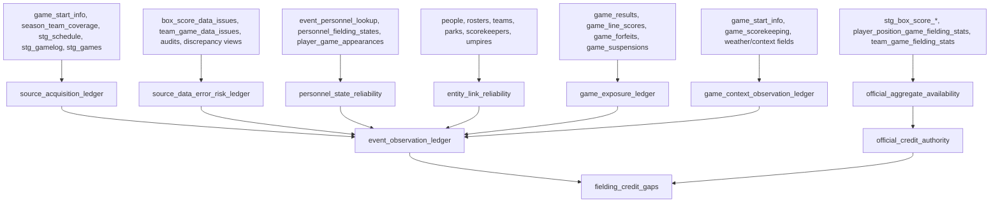

# Data Coverage Prep Ledgers

## TL;DR

Build deterministic SQLMesh ledgers before fitting any imputation model. These ledgers define the target population, source family and availability, source data-error risk, official aggregate-total availability, personnel eligibility confidence, entity-link confidence, context reliability, exposure status, and field-level observed status for every 1910-2025 target row.

This phase replaces implicit assumptions with joinable tables. A model can then treat a value as truth, constraint, weak measurement, covariate with measurement error, mask, training weight, holdout-only diagnostic, or withheld input without rediscovering that policy inside each fitted model.

## Scope

This doc specifies deterministic SQLMesh prep work. It does not fit probabilistic models, train deep models, or publish imputed values. Its outputs are prerequisites for:

- `02-eda-and-modeling-datasets.md`
- `03-hierarchical-models.md`
- `04-deep-learning-supplements.md`

Invariant: a missing value is not eligible for imputation until the relevant ledger distinguishes source-family block absence, structural absence, field-level unknown, not-applicable, aggregate-only coverage, contradicted evidence, and source/parser data-error risk.

## Ledger Dependency DAG



The same sequence in prose:

1. Classify which source families exist at each game/team/dimension grain.
2. Mark confirmed and suspected source/parser data errors before those rows can train models.
3. Build official aggregate-total availability by stat and grain.
4. Build reliability ledgers for identities, personnel, context, and exposure.
5. Build an event observation ledger that preserves field-specific sentinel meanings.
6. Build gap tables that translate raw observation status into model-specific target populations.

## Ledger Table Contracts

### `source_acquisition_ledger`

| Field | Type | Meaning |
| --- | --- | --- |
| `game_id` | `VARCHAR` | Game key. |
| `team_id` | `TEAM_ID` | Team key when source status differs by side. |
| `dimension` | `VARCHAR` | `event`, `box_batting`, `box_pitching`, `box_fielding`, `line_score`, `pitch_sequence`, `batted_ball`, `gamelog`, etc. |
| `source_family` | `VARCHAR` | `play_by_play`, `box_score`, `gamelog`, `schedule`, `databank`, `derived`, `absent`. |
| `source_type` | `VARCHAR` | Existing `game_start_info.source_type` where applicable. |
| `target_population_status` | `VARCHAR` | `event_level`, `aggregate_only`, `gamelog_only`, `structural_absence`, `out_of_scope`. |
| `source_availability_status` | `VARCHAR` | `observed`, `not_acquired`, `not_applicable`, `contradicted`, `data_error_prone`. |
| `usable_for_event_imputation` | `BOOLEAN` | True only for event-level rows and dimensions. |
| `usable_as_aggregate_constraint` | `BOOLEAN` | True when the source can constrain aggregate outputs. |
| `authority_rank` | `UTINYINT` | Lower rank wins for target grain and dimension. |

SQL sketch:

```sql
MODEL (
  name main_models.source_acquisition_ledger,
  kind FULL,
  grain (game_id, team_id, dimension),
  columns (
    game_id VARCHAR,
    team_id TEAM_ID,
    dimension VARCHAR,
    source_family VARCHAR,
    source_type VARCHAR,
    target_population_status VARCHAR,
    source_availability_status VARCHAR,
    usable_for_event_imputation BOOLEAN,
    usable_as_aggregate_constraint BOOLEAN,
    authority_rank UTINYINT
  ),
  audits (
    not_null(columns := (game_id, team_id, dimension)),
    unique_values(columns := (game_id, team_id, dimension)),
    accepted_values(column := target_population_status, is_in := (
      'event_level',
      'aggregate_only',
      'gamelog_only',
      'structural_absence',
      'out_of_scope'
    ))
  )
);

WITH dimensions AS (
    SELECT *
    FROM (VALUES
        ('event'),
        ('box_batting'),
        ('box_pitching'),
        ('box_fielding'),
        ('line_score'),
        ('pitch_sequence'),
        ('batted_ball'),
        ('gamelog')
    ) AS t(dimension)
),

team_games AS (
    SELECT
        game_id,
        season,
        team_id,
        source_type
    FROM main_models.team_game_start_info
    WHERE season BETWEEN 1910 AND 2025
),

classified AS (
    SELECT
        tg.game_id,
        tg.team_id,
        d.dimension,
        CASE
            WHEN tg.source_type = 'PlayByPlay' THEN 'play_by_play'
            WHEN tg.source_type = 'BoxScore' THEN 'box_score'
            WHEN tg.source_type = 'GameLog' THEN 'gamelog'
            ELSE 'absent'
        END AS source_family,
        tg.source_type,
        CASE
            WHEN tg.source_type = 'PlayByPlay' THEN 'event_level'
            WHEN tg.source_type = 'BoxScore' THEN 'aggregate_only'
            WHEN tg.source_type = 'GameLog' THEN 'gamelog_only'
            ELSE 'structural_absence'
        END AS target_population_status,
        CASE
            WHEN tg.source_type IS NULL THEN 'not_acquired'
            WHEN tg.source_type IN ('PlayByPlay', 'BoxScore', 'GameLog') THEN 'observed'
            ELSE 'contradicted'
        END AS source_availability_status
    FROM team_games AS tg
    CROSS JOIN dimensions AS d
)

SELECT
    *,
    target_population_status = 'event_level' AS usable_for_event_imputation,
    target_population_status IN ('event_level', 'aggregate_only') AS usable_as_aggregate_constraint,
    CASE source_family
        WHEN 'play_by_play' THEN 1
        WHEN 'box_score' THEN 2
        WHEN 'gamelog' THEN 3
        ELSE 9
    END AS authority_rank
FROM classified;
```

Validation checks:

- Reconcile the ledger against `season_team_coverage`, `game_start_info.source_type`, `stg_schedule`, `stg_gamelog`, and `stg_games`.
- Verify that 1910 and 1911 are not accidentally filtered out by stale "complete from 1912" metadata.
- Separate source availability by dimension instead of assuming `PlayByPlay` means pitch, batted-ball, and official aggregate totals are all available.

### `source_data_error_risk_ledger`

| Field | Type | Meaning |
| --- | --- | --- |
| `data_error_key` | `VARCHAR` | Stable hash or composite key for row/field data-error risk. |
| `source_table` | `VARCHAR` | Table where the value originates. |
| `game_id` | `VARCHAR` | Game key when applicable. |
| `team_id` | `TEAM_ID` | Team key when applicable. |
| `player_id` | `VARCHAR` | Player key when applicable. |
| `field_name` | `VARCHAR` | Affected field or stat. |
| `data_error_class` | `VARCHAR` | `confirmed_issue`, `suspected_source_issue`, `suspected_parser_issue`, `contradiction`, `audit_exception`. |
| `training_action` | `VARCHAR` | `allow`, `downweight`, `exclude`, `constraint_only`, `diagnostic_only`. |
| `training_weight` | `DOUBLE` | Numeric multiplier for fitted models. |
| `issue_source` | `VARCHAR` | Originating audit, issue table, or discrepancy view. |

First implementation sources:

- `main_models.box_score_data_issues`
- `main_models.team_game_data_issues`
- `main_models.box_event_fielding_discrepancies`
- `main_models.unknown_play_no_box`
- `main_models.assists_as_putouts_finder` if materialized or promoted from analysis
- SQLMesh audits that enumerate explicit exceptions

Invariant: data-error risk is not missingness. Non-null wrong values should be masked or down-weighted before they become training truth.

### `official_aggregate_availability`

| Field | Type | Meaning |
| --- | --- | --- |
| `game_id` | `VARCHAR` | Game key. |
| `team_id` | `TEAM_ID` | Team key. |
| `player_id` | `VARCHAR` | Player key when player-grain aggregate total exists. |
| `fielding_position` | `UTINYINT` | Position when stat is position-specific. |
| `stat_name` | `VARCHAR` | `putouts`, `assists`, `errors`, `double_plays`, `plate_appearances`, `earned_runs`, etc. |
| `aggregate_grain` | `VARCHAR` | `team_game`, `player_game`, `player_position_game`. |
| `aggregate_status` | `VARCHAR` | `present_clean`, `present_issue_flagged`, `missing`, `not_applicable`, `negative_residual`, `contradicted`. |
| `aggregate_value` | `DOUBLE` | Official aggregate value when present and numeric. |
| `event_value` | `DOUBLE` | Event-derived comparison value when applicable. |
| `residual_value` | `DOUBLE` | `aggregate_value - event_value` when both exist. |
| `authority_rank` | `UTINYINT` | Rank for target grain/stat. |
| `data_error_risk` | `VARCHAR` | Joined from the data-error risk ledger. |

This ledger fixes a critical ambiguity: `game_data_completeness.has_box_score` identifies primary `BoxScore` source games in the current DB, not whether each `PlayByPlay` game has a usable official aggregate total for each player-game stat.

SQL sketch for fielding aggregate totals:

```sql
MODEL (
  name main_models.official_aggregate_availability,
  kind FULL,
  grain (game_id, team_id, player_id, fielding_position, stat_name),
  columns (
    game_id VARCHAR,
    team_id TEAM_ID,
    player_id VARCHAR,
    fielding_position UTINYINT,
    stat_name VARCHAR,
    aggregate_grain VARCHAR,
    aggregate_status VARCHAR,
    aggregate_value DOUBLE,
    event_value DOUBLE,
    residual_value DOUBLE,
    authority_rank UTINYINT,
    data_error_risk VARCHAR
  )
);

WITH box_agg AS (
    SELECT
        b.game_id,
        b.fielder_id AS player_id,
        b.fielding_position,
        MIN(CASE WHEN b.side = 'Home' THEN g.home_team_id ELSE g.away_team_id END) AS team_id,
        SUM(b.putouts)::DOUBLE AS putouts,
        SUM(b.assists)::DOUBLE AS assists,
        SUM(b.errors)::DOUBLE AS errors
    FROM main_models.stg_box_score_fielding_lines AS b
    INNER JOIN main_models.stg_games AS g USING (game_id)
    GROUP BY 1, 2, 3
),

event_agg AS (
    SELECT
        game_id,
        player_id,
        fielding_position,
        MIN(team_id) AS team_id,
        SUM(putouts)::DOUBLE AS putouts,
        SUM(assists)::DOUBLE AS assists,
        SUM(errors)::DOUBLE AS errors
    FROM main_models.event_player_fielding_stats
    GROUP BY 1, 2, 3
),

wide AS (
    SELECT
        COALESCE(b.game_id, e.game_id) AS game_id,
        COALESCE(b.team_id, e.team_id) AS team_id,
        COALESCE(b.player_id, e.player_id) AS player_id,
        COALESCE(b.fielding_position, e.fielding_position) AS fielding_position,
        b.putouts AS box_putouts,
        e.putouts AS event_putouts,
        b.assists AS box_assists,
        e.assists AS event_assists,
        b.errors AS box_errors,
        e.errors AS event_errors
    FROM box_agg AS b
    FULL OUTER JOIN event_agg AS e USING (game_id, player_id, fielding_position)
),

fielding_long AS (
    SELECT
        game_id,
        team_id,
        player_id,
        fielding_position,
        'putouts' AS stat_name,
        box_putouts AS box_value,
        event_putouts AS event_value
    FROM wide
    UNION ALL BY NAME
    SELECT
        game_id,
        team_id,
        player_id,
        fielding_position,
        'assists' AS stat_name,
        box_assists AS box_value,
        event_assists AS event_value
    FROM wide
    UNION ALL BY NAME
    SELECT
        game_id,
        team_id,
        player_id,
        fielding_position,
        'errors' AS stat_name,
        box_errors AS box_value,
        event_errors AS event_value
    FROM wide
)

SELECT
    game_id,
    team_id,
    player_id,
    fielding_position,
    stat_name,
    'player_position_game' AS aggregate_grain,
    CASE
        WHEN box_value IS NULL THEN 'missing'
        WHEN box_value - event_value < 0 THEN 'negative_residual'
        WHEN box_value = event_value THEN 'present_clean'
        ELSE 'contradicted'
    END AS aggregate_status,
    box_value::DOUBLE AS aggregate_value,
    event_value::DOUBLE AS event_value,
    (box_value - event_value)::DOUBLE AS residual_value,
    1 AS authority_rank,
    'none' AS data_error_risk
FROM fielding_long;
```

### `official_credit_authority`

This table resolves which source owns each official stat at the output grain after aggregate-total availability and data-error risk are known.

| Field | Meaning |
| --- | --- |
| `game_id`, `team_id`, `player_id`, `fielding_position`, `credit_type` | Target key. |
| `authority_source` | `event`, `box`, `event_box_reconciled`, `estimated_with_aggregate_constraint`, `estimated_no_aggregate_constraint`, `withheld`. |
| `authority_reason` | Short enum explaining the choice. |
| `can_publish_official` | True only when source authority is official at target grain. |
| `can_publish_estimated` | True when the statistical namespace can publish an estimate. |

Decision policy:

- Clean event rows can publish event-derived official counters.
- Clean box-score totals can publish official aggregate counters at aggregate grain.
- Unknown event credit with clean residual constraints can publish estimated counters only in an estimated namespace.
- No-box unknowns can publish only low-confidence estimates unless the project accepts an explicit confidence threshold.
- Contradicted or issue-flagged aggregate totals can be withheld or marked diagnostic-only.

### `personnel_state_reliability`

| Field | Meaning |
| --- | --- |
| `event_key`, `fielding_side`, `fielding_position`, `player_id` | Event-position eligibility key. |
| `eligibility_status` | `direct_event`, `lineup_derived`, `box_derived`, `synthetic`, `missing`, `duplicate_position`, `ambiguous_substitution`. |
| `hard_zero_allowed` | True when the model can assign zero probability to players outside this state. |
| `personnel_confidence` | Numeric or enum confidence. |
| `issue_reason` | Ambiguity class. |

Validation checks:

- Count missing fielding positions by season, source type, game type, and team.
- Count duplicate positions inside an event fielding state.
- Compare `event_personnel_lookup`, `personnel_fielding_states`, `game_starting_lineups`, and `player_game_appearances`.
- Flag Ohtani-rule, DH, substitutions, defensive replacements, and multi-position player-games as explicit classes.

Invariant: fielding allocation can use personnel as a hard constraint only when `hard_zero_allowed = true`.

### `entity_link_reliability`

| Field | Meaning |
| --- | --- |
| `entity_type` | `player`, `team`, `park`, `scorer`, `umpire`, `league`. |
| `source_id` | Raw/source ID. |
| `canonical_id` | Project ID. |
| `valid_from`, `valid_to` | Episode bounds when identity can change over time. |
| `link_status` | `direct`, `crosswalk`, `alias`, `inferred`, `conflict`, `unresolved`. |
| `link_confidence` | Numeric or enum confidence. |
| `conflict_reason` | Why the link is weak. |

Use this ledger before fitting random effects by player, team, park, scorer, or umpire. Park factors need park episode reliability because a single park key can hide renovations, aliases, dimensions, surfaces, or multi-park seasons.

### `game_context_observation_ledger`

| Field | Meaning |
| --- | --- |
| `game_id`, `context_dimension` | Context field key. |
| `raw_value` | Source value as stored or serialized. |
| `normalized_value` | Canonical value if deterministically derived. |
| `observed_status` | `observed`, `derived`, `missing`, `not_applicable`, `contradicted`, `data_error_prone`. |
| `source_family` | Source of the context value. |
| `context_confidence` | Confidence enum or numeric weight. |

Dimensions:

- `park_id`
- `weather`
- `temperature`
- `wind`
- `time_of_day`
- `attendance`
- `dh_rule`
- `extra_inning_runner_rule`
- `game_type`
- `scorer`
- `inputter`
- `translator`
- `umpires`
- `batter_hand`
- `pitcher_hand`

Validation checks:

- Missingness rates by source type, season, league, park, and game type.
- Contradictions between event, box, gamelog, and schedule context.
- Handedness missingness and source confidence before it is used for park or geometry effects.

### `game_exposure_ledger`

| Field | Meaning |
| --- | --- |
| `game_id`, `team_id` | Team-game key. |
| `scheduled_innings` | Scheduled game length where known. |
| `actual_outs_batting`, `actual_outs_fielding` | Observed outs by side. |
| `completion_status` | `complete`, `walk_off`, `shortened`, `suspended`, `forfeit`, `unknown`. |
| `denominator_policy` | `full_game`, `observed_outs`, `official_result_only`, `exclude`, `synthetic_required`. |
| `exposure_confidence` | Confidence enum or numeric weight. |

This table is deterministic after source reconciliation. Bayesian modeling belongs in missing context values or sensitivity analysis, not in overriding official suspension, forfeit, or walk-off facts.

### `event_observation_ledger`

This is the central deterministic contract for fitted models.

| Field | Type | Meaning |
| --- | --- | --- |
| `event_key` | `UINTEGER` | Event key. |
| `dimension` | `VARCHAR` | `trajectory`, `location_side`, `location_depth`, `batted_to_fielder`, `pitch_sequence`, `count`, `putout_credit`, `assist_credit`, etc. |
| `raw_value` | `VARCHAR` | Source value serialized as text. |
| `deduced_value` | `VARCHAR` | Deterministic derived value when present. |
| `sentinel_type` | `VARCHAR` | `null`, `unknown`, `default`, `zero`, `empty_sequence`, `valid_value`, `not_applicable`. |
| `observed_status` | `VARCHAR` | `observed`, `deduced`, `unknown_code`, `source_family_block_missing`, `structural_absence`, `not_applicable`, `contradicted`, `data_error_prone`. |
| `source_family` | `VARCHAR` | Joined source family. |
| `data_error_risk` | `VARCHAR` | Joined data-error class. |
| `deterministic_confidence` | `DOUBLE` | Confidence for deterministic derived measurements. |
| `can_train_as_truth` | `BOOLEAN` | True only when source authority and data-error checks pass. |
| `can_use_as_measurement` | `BOOLEAN` | True when value is noisy but useful evidence. |

SQL sketch for batted-ball dimensions:

```sql
MODEL (
  name main_models.event_observation_ledger,
  kind FULL,
  grain (event_key, dimension),
  columns (
    event_key UINTEGER,
    dimension VARCHAR,
    raw_value VARCHAR,
    deduced_value VARCHAR,
    sentinel_type VARCHAR,
    observed_status VARCHAR,
    source_family VARCHAR,
    data_error_risk VARCHAR,
    deterministic_confidence DOUBLE,
    can_train_as_truth BOOLEAN,
    can_use_as_measurement BOOLEAN
  )
);

WITH batted_ball AS (
    SELECT
        c.event_key,
        'trajectory' AS dimension,
        c.recorded_trajectory::VARCHAR AS raw_value,
        c.trajectory::VARCHAR AS deduced_value,
        CASE
            WHEN c.recorded_trajectory IS NULL THEN 'null'
            WHEN c.recorded_trajectory = 'Unknown' THEN 'unknown'
            ELSE 'valid_value'
        END AS sentinel_type,
        CASE
            WHEN c.recorded_trajectory IS NOT NULL AND c.recorded_trajectory != 'Unknown' THEN 'observed'
            WHEN c.trajectory IS NOT NULL AND c.trajectory != 'Unknown' THEN 'deduced'
            ELSE 'unknown_code'
        END AS observed_status,
        CASE
            WHEN c.is_trajectory_deduced THEN 0.85
            WHEN c.recorded_trajectory != 'Unknown' THEN 1.0
            ELSE 0.0
        END AS deterministic_confidence
    FROM main_models.calc_batted_ball_type AS c
)

SELECT
    b.event_key,
    b.dimension,
    b.raw_value,
    b.deduced_value,
    b.sentinel_type,
    b.observed_status,
    s.source_family,
    COALESCE(a.data_error_class, 'none') AS data_error_risk,
    b.deterministic_confidence,
    b.observed_status = 'observed' AND COALESCE(a.training_action, 'allow') = 'allow' AS can_train_as_truth,
    b.observed_status IN ('observed', 'deduced') AS can_use_as_measurement
FROM batted_ball AS b
INNER JOIN main_models.event_states_full AS e USING (event_key)
INNER JOIN main_models.source_acquisition_ledger AS s
    ON e.game_id = s.game_id
    AND e.batting_team_id = s.team_id
    AND s.dimension = 'batted_ball'
LEFT JOIN main_models.source_data_error_risk_ledger AS a
    ON e.game_id = a.game_id
    AND a.field_name = b.dimension;
```

This sketch should be expanded with `UNION ALL BY NAME` branches for all event dimensions instead of using one wide table. The long shape makes it possible to add dimensions without altering all downstream models.

### `event_observation_context`

This view provides one event row with shared covariates for modeling datasets:

- `season`, `league`, `game_type`, `source_type`, `source_family`
- `park_id`, `park_episode_status`
- `scorer`, `inputter`, `translator`, `affiliated_team`
- `inning_start`, `frame_start`, `base_state_start`, `outs_start`
- `score_margin`, `leverage_index`, `runs_on_play`, `hit_or_out`
- `batter_id`, `pitcher_id`, `batter_hand`, `pitcher_hand`
- `fielding_team_id`, `batting_team_id`
- `personnel_confidence`, `context_confidence`, `exposure_status`

Invariant: modeling datasets should select from `event_observation_context` rather than repeatedly reimplementing these joins.

### `fielding_credit_gaps`

| Field | Meaning |
| --- | --- |
| `event_key`, `fielding_team_id` | Event/team key. |
| `gap_class` | `complete`, `unknown_putout`, `unknown_assist_risk`, `box_residual_positive`, `box_residual_negative`, `no_box_unknown`, `data_error_flagged`, `not_applicable`. |
| `unknown_putouts` | Event unknown putouts from `calc_fielding_play_agg`. |
| `known_putouts`, `known_assists`, `known_errors` | Event-known team values. |
| `has_clean_aggregate_total` | Whether a usable official aggregate total exists. |
| `aggregate_residual_putouts`, `aggregate_residual_assists`, `aggregate_residual_errors` | Aggregate residuals when applicable. |
| `personnel_hard_mask_available` | Whether personnel can constrain allocations. |
| `eligible_for_allocation` | True for statistical allocation target rows. |

SQL sketch:

```sql
MODEL (
  name main_models.fielding_credit_gaps,
  kind FULL,
  grain (event_key, fielding_team_id),
  columns (
    event_key UINTEGER,
    fielding_team_id TEAM_ID,
    gap_class VARCHAR,
    unknown_putouts DOUBLE,
    known_putouts DOUBLE,
    known_assists DOUBLE,
    known_errors DOUBLE,
    has_clean_aggregate_total BOOLEAN,
    aggregate_residual_putouts DOUBLE,
    aggregate_residual_assists DOUBLE,
    aggregate_residual_errors DOUBLE,
    personnel_hard_mask_available BOOLEAN,
    eligible_for_allocation BOOLEAN
  )
);

WITH event_credit AS (
    SELECT
        e.event_key,
        e.fielding_team_id,
        SUM(f.unknown_putouts)::DOUBLE AS unknown_putouts,
        SUM(f.putouts)::DOUBLE AS known_putouts,
        SUM(f.assists)::DOUBLE AS known_assists,
        SUM(f.errors)::DOUBLE AS known_errors
    FROM main_models.event_states_full AS e
    LEFT JOIN main_models.calc_fielding_play_agg AS f USING (event_key)
    WHERE e.season BETWEEN 1910 AND 2025
    GROUP BY 1, 2
),

aggregate_totals AS (
    SELECT
        game_id,
        team_id,
        SUM(CASE WHEN stat_name = 'putouts' THEN residual_value ELSE 0 END)::DOUBLE AS aggregate_residual_putouts,
        SUM(CASE WHEN stat_name = 'assists' THEN residual_value ELSE 0 END)::DOUBLE AS aggregate_residual_assists,
        SUM(CASE WHEN stat_name = 'errors' THEN residual_value ELSE 0 END)::DOUBLE AS aggregate_residual_errors,
        BOOL_OR(aggregate_status = 'present_clean') AS has_clean_aggregate_total
    FROM main_models.official_aggregate_availability
    GROUP BY 1, 2
),

personnel AS (
    SELECT
        event_key,
        BOOL_AND(hard_zero_allowed) AS personnel_hard_mask_available
    FROM main_models.personnel_state_reliability
    GROUP BY 1
)

SELECT
    ec.event_key,
    ec.fielding_team_id,
    CASE
        WHEN ec.unknown_putouts > 0 AND COALESCE(a.has_clean_aggregate_total, false) THEN 'unknown_putout'
        WHEN ec.unknown_putouts > 0 THEN 'no_box_unknown'
        WHEN COALESCE(a.aggregate_residual_putouts, 0) > 0 THEN 'box_residual_positive'
        WHEN COALESCE(a.aggregate_residual_putouts, 0) < 0 THEN 'box_residual_negative'
        ELSE 'complete'
    END AS gap_class,
    ec.unknown_putouts,
    ec.known_putouts,
    ec.known_assists,
    ec.known_errors,
    COALESCE(a.has_clean_aggregate_total, false) AS has_clean_aggregate_total,
    COALESCE(a.aggregate_residual_putouts, 0) AS aggregate_residual_putouts,
    COALESCE(a.aggregate_residual_assists, 0) AS aggregate_residual_assists,
    COALESCE(a.aggregate_residual_errors, 0) AS aggregate_residual_errors,
    COALESCE(p.personnel_hard_mask_available, false) AS personnel_hard_mask_available,
    gap_class IN ('unknown_putout', 'no_box_unknown', 'box_residual_positive')
        AND COALESCE(p.personnel_hard_mask_available, false) AS eligible_for_allocation
FROM event_credit AS ec
INNER JOIN main_models.event_states_full AS e USING (event_key)
LEFT JOIN aggregate_totals AS a
    ON e.game_id = a.game_id
    AND ec.fielding_team_id = a.team_id
LEFT JOIN personnel AS p USING (event_key);
```

## Prep EDA To Run Before Modeling

| Check | Query target | Model decision it informs |
| --- | --- | --- |
| Source-family block matrix by `season, league, team, dimension` | `source_acquisition_ledger` | Whether missingness is source-family block, game-block, or event-level. |
| Data-error concentration by field/source/season | `source_data_error_risk_ledger` | Exclusion/downweight policy. |
| Box residual sign and size by stat/position | `official_aggregate_availability` | Whether residuals are constraints, soft evidence, or source/parser errors. |
| Personnel hard-mask coverage by season/source | `personnel_state_reliability` | Whether fielding allocation can assign hard zero masks. |
| Context missingness by season/park/source | `game_context_observation_ledger` | Park-factor covariates and context imputation. |
| Exposure classes by game type/source | `game_exposure_ledger` | Denominator policy for rates and run values. |
| Observation statuses by dimension/scorer/result | `event_observation_ledger` | Candidate observation model interactions. |
| Fielding gap classes by era/position/scorer | `fielding_credit_gaps` | First allocation target and holdout design. |

Example EDA query:

```sql
SELECT
    e.season,
    e.league,
    e.source_type,
    o.dimension,
    o.observed_status,
    COUNT(*) AS events
FROM main_models.event_observation_ledger AS o
INNER JOIN main_models.event_observation_context AS e USING (event_key)
GROUP BY 1, 2, 3, 4, 5
ORDER BY 1, 2, 3, 4, 5;
```

## Audits

Attach SQLMesh audits where possible and add custom audits where built-ins are insufficient:

| Table | Audit |
| --- | --- |
| `source_acquisition_ledger` | Unique `game_id, team_id, dimension`; accepted statuses; no target `PlayByPlay` event dimension marked aggregate-only. |
| `source_data_error_risk_ledger` | Accepted `training_action`; `training_weight` between 0 and 1; no confirmed issue with `training_action = allow`. |
| `official_aggregate_availability` | Unique key; residual equals aggregate total minus event value; no clean aggregate total with null aggregate value. |
| `personnel_state_reliability` | At most one hard-mask player per event/side/position; accepted `eligibility_status`. |
| `event_observation_ledger` | Unique `event_key, dimension`; accepted `observed_status`; deterministic confidence between 0 and 1. |
| `fielding_credit_gaps` | Unknown putouts nonnegative; allocation-eligible rows require personnel hard masks. |

## Acceptance Criteria

This prep phase is done when:

- All ledgers materialize for 1910-2025.
- Existing completeness models can be reproduced from ledger rollups.
- Source counts match the verified DB snapshot unless upstream sources changed and the docs are updated.
- Sentinel meanings are field-specific and not collapsed into a generic null.
- Artifact-risk outputs can be joined to every planned modeling dataset.
- Fielding allocation datasets can select `eligible_for_allocation` rows without ad hoc joins to issue tables.
- No fitted model consumes raw event rows directly when a ledgered equivalent exists.
