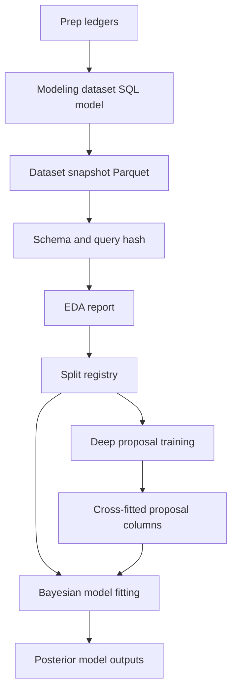

# Data Coverage EDA And Modeling Datasets

## TL;DR

Run EDA and freeze modeling datasets before fitting models. EDA decides which interaction terms, strata, holdouts, and weak-identification flags belong in each model; modeling datasets enforce leakage boundaries and preserve source availability, observation status, reliability inputs, official aggregate constraint state, deterministic evidence, deep-proposal columns, and split metadata.

The central implementation rule is simple: fitted models read only versioned dataset snapshots. They do not query arbitrary `main_models.*` joins during sampling or neural training.

## Objectives

- Convert the prep ledgers into model-ready rows with stable schema and category maps.
- Determine which interactions are required before building Bayesian formulas.
- Identify weakly connected or confounded slices before estimating park, scorer, team, player, or era effects.
- Build leakage-safe training, validation, and stress-test splits.
- Produce lightweight EDA reports that can block a model from fitting when assumptions fail.

Invariant: a modeling dataset without source-availability columns, `observed_status`, reliability columns, official aggregate constraint state, and split metadata is a scratchpad, not a production input.

Invariant: season bounds in SQL sketches are placeholders for SQLMesh vars. Production models should use `@VAR('start_season', 1910)` and `@VAR('end_season', 2025)`, not hardcoded literals.

## Dataset Lifecycle



Dataset build steps:

1. SQLMesh builds a `main_models.model_input_*` model.
2. The dataset exporter writes a Parquet snapshot and metadata JSON.
3. EDA reads the snapshot, not the live database.
4. Split assignment is stored in the dataset and in an external split registry.
5. Deep proposal models train only on training folds and write out-of-fold predictions for Bayesian consumption.
6. Bayesian models fit from the frozen modeling dataset plus versioned proposal outputs.

## Universal Dataset Columns

Every modeling dataset should include these column families even if a model uses only a subset:

| Family | Required columns |
| --- | --- |
| Entity keys | `game_id`, `event_key` when event-level, `team_id`, `player_id`, `park_id`, `season`, `league`, `game_type`. |
| Source availability | `source_type`, `source_family`, `target_population_status`, `source_availability_status`. |
| Observation | `dimension`, `observed_status`, `sentinel_type`, `raw_value`, `deduced_value`, `can_train_as_truth`, `can_use_as_measurement`. |
| Reliability | `data_error_risk`, `training_weight`, `personnel_confidence`, `entity_link_confidence`, `context_confidence`, `exposure_status`. |
| Official aggregate constraints | `official_aggregate_status`, `aggregate_grain`, `residual_value`, `authority_rank`. |
| Context | `scorer`, `inputter`, `translator`, `affiliated_team`, `base_state_start`, `outs_start`, `inning_start`, `frame_start`, `score_margin`, `leverage_index`. |
| Baseball actors | `batter_id`, `pitcher_id`, `runner_*_id`, `fielder_id`, `fielding_position`, `batter_hand`, `pitcher_hand`. |
| Deep proposal linkage | `dl_artifact_id` (nullable VARCHAR). |
| Split metadata | `primary_fold`, `stress_holdouts`, `source_snapshot_id`, `query_hash`, `dataset_version`, `ablation_status`. |

`dl_artifact_id` is a universal column even when NULL. Datasets that do not consume DL proposals leave it NULL. Datasets that do (observation, geometry, advancement) populate it during the dataset-prep step from the calibrated DL proposal manifest, and cross-fitted proposal columns join in by `dl_artifact_id` plus the dataset's key columns.

Optional but preferred:

- `dl_proposal_*` columns for calibrated out-of-fold deep probabilities (joined via `dl_artifact_id`).
- `dl_embedding_*` vector references when embeddings are used.
- `alignment_regime` for fielder-to-location and responsibility models.
- `park_episode_id` when park identity is not stable enough for a bare `park_id`.

## Split Policy

Random event splits are useful only for smoke tests. Production validation uses one primary grouped split for fit/select, plus a collection of stress-test holdouts evaluated post-fit via posterior predictive.

### Primary split

Every modeling dataset assigns one `primary_fold` value per row using `HASH(game_id) % 100`: 70 TRAIN / 15 VALIDATE / 15 TEST. This is the only split the fitter conditions on; all hyperparameter selection and stopping criteria read from VALIDATE, and TEST is reserved for end-of-pipeline reporting.

```sql
CASE
    WHEN HASH(game_id)::HUGEINT % 100 BETWEEN 0 AND 69 THEN 'TRAIN'
    WHEN HASH(game_id)::HUGEINT % 100 BETWEEN 70 AND 84 THEN 'VALIDATE'
    ELSE 'TEST'
END AS primary_fold
```

### Stress-test holdouts

Stress dimensions are NOT intersected with the primary split. Each is recorded as a boolean flag on every row, and generalization is measured after the primary fit by sampling the posterior predictive on rows where that dimension's entity was held out entirely from the fit. Because hierarchical Bayes partial-pools across scorer/park/regime random effects, generalization to unseen entities can be measured on held-out IDs without refitting. Sequential refits (one per stress dimension) are reserved for the publication-tier observation and fielding-credit models, run only after the primary fit stabilizes.

Each model's validation report includes a per-stress-test calibration plot and coverage table.

| Stress dimension | Unit | `stress_holdouts` flag |
| --- | --- | --- |
| Scorer | scorer/inputter/translator id | `IS_HELDOUT_SCORER` |
| Park | park-season or park episode | `IS_HELDOUT_PARK` |
| Alignment regime | pre-shift, shift-growth, full shift, post-2023 | `IS_HELDOUT_ALIGNMENT_REGIME` |
| Source acquisition block | source family/file family block | `IS_HELDOUT_SOURCE_ACQUISITION_BLOCK` |
| Season block | era block | `IS_HELDOUT_SEASON_BLOCK` |
| Aggregate total | game/team/player-position aggregate | `IS_HELDOUT_AGGREGATE_TOTAL` |
| Player group | player career or player-season | `IS_HELDOUT_PLAYER_GROUP` |

The split registry stores the explicit held-out IDs for each stress dimension so future reruns evaluate the same slices, and each row carries a `stress_holdouts` struct with one bool per flag above. A row may be flagged on multiple dimensions; the posterior-predictive evaluator filters by one dimension at a time.

### Contract additions

The split-registry contract requires per-row:

- `primary_fold` VARCHAR in `{TRAIN, VALIDATE, TEST}`.
- `stress_holdouts` STRUCT with one BOOLEAN field per stress dimension (`IS_HELDOUT_SCORER`, `IS_HELDOUT_PARK`, `IS_HELDOUT_ALIGNMENT_REGIME`, `IS_HELDOUT_SOURCE_ACQUISITION_BLOCK`, `IS_HELDOUT_SEASON_BLOCK`, `IS_HELDOUT_AGGREGATE_TOTAL`, `IS_HELDOUT_PLAYER_GROUP`).

## EDA Report Schema

Each modeling dataset gets a report with machine-readable tables and a short markdown summary:

```text
statistical_outputs/<run_id>/eda/
  dataset_summary.json
  missingness_by_slice.parquet
  target_distribution.parquet
  connectivity_edges.parquet
  collinearity_report.parquet
  candidate_interactions.parquet
  weak_identification_flags.parquet
  eda.md
```

Required report fields:

| Field | Meaning |
| --- | --- |
| `dataset_name` | SQLMesh model name. |
| `dataset_version` | Semantic dataset version. |
| `source_snapshot_id` | Snapshot or query hash. |
| `row_count` | Number of rows. |
| `target_population_count` | Rows eligible for the target estimand. |
| `observed_truth_count` | Rows eligible as training truth. |
| `source_family_block_missing_count` | Rows not event-missing but source-family block absent. |
| `data_error_excluded_count` | Rows excluded because of source/parser data-error risk. |
| `weak_identification_flags` | Confounding or connectivity warnings. |
| `recommended_formula_terms` | Candidate fixed and varying effects. |

## EDA Modules

### Missingness Profile

Purpose: decide whether a dimension is missing at the cell, event, game, source-family block, era block, or not applicable level.

The profile breaks down by `sentinel_type` rather than a single collapsed `observed_status`. Downstream models need to distinguish `null`, `unknown`, `default`, `zero`, `empty_sequence`, `valid_value`, and `not_applicable`: a `default` code (e.g., a parser-emitted fallback) is informative in a different way from a structural `zero`, which is different again from a `null` cell or a `not_applicable` dimension. Aggregating across sentinel types loses that signal.

Query sketch:

```sql
SELECT
    season,
    league,
    source_family,
    dimension,
    sentinel_type,
    COUNT(*) AS rows,
    SUM(CASE WHEN data_error_risk != 'none' THEN 1 ELSE 0 END) AS data_error_rows
FROM main_models.model_input_observation_batted_ball
GROUP BY 1, 2, 3, 4, 5;
```

`sentinel_type` values:

| Value | Meaning |
| --- | --- |
| `valid_value` | Sourced observation present. |
| `null` | Cell is missing, no sentinel emitted. |
| `unknown` | Source emitted an explicit unknown marker. |
| `default` | Parser or upstream system filled a default code. |
| `zero` | Structural zero (e.g., no pitches, no advancement). |
| `empty_sequence` | Sequence-valued dimension is present but empty. |
| `not_applicable` | Dimension does not apply to this row (e.g., trajectory on a walk). |

Block a model when:

- Source-family block missingness is being treated as event-level missingness.
- The observed sample for the target is dominated by one era, scorer, source family, park, or team.
- `unknown`, `default`, `null`, `zero`, and `not_applicable` are collapsed into one value.

### Interaction Discovery

Purpose: choose interactions before writing formulas.

Use candidate interaction scans, then keep only interactions with subject-matter support and validation value.

| Candidate interaction | Target modules | Why to test |
| --- | --- | --- |
| `season x league x source_family` | all observation models | Coverage can be missing by source-family block and league. |
| `scorer x result_type` | batted-ball observation, contact labels | Scorers may record extra-base hits and outs differently. |
| `scorer x affiliated_team` | batted-ball observation | Home or affiliated-team detail can be biased. |
| `park x scorer` | observation, park factors | Park and scorer can be nearly collinear. |
| `batter_hand x alignment_regime x fielder_position` | geometry, responsibility | Fielder-to-location mapping changes under shifts. |
| `base_state x outs x fielding_position` | fielding allocation, advancement | Force plays and double-play depth affect credit and advancement. |
| `park x handedness` | park factors | Dimensions and wind can affect left/right batters differently. |
| `game_completion x denominator` | run values, rates | Shortened, suspended, and walk-off games change exposure. |
| `geometry_uncertainty x fielder_effect` | responsibility, advancement | Missing geometry can inflate player effects. |

Implementation sketch:

```python
from dataclasses import dataclass

import polars as pl


@dataclass(frozen=True)
class InteractionScan:
    left: str
    right: str
    target: str
    min_rows: int
    min_lift: float


def scan_binary_interaction(df: pl.DataFrame, scan: InteractionScan) -> pl.DataFrame:
    grouped = (
        df.group_by([scan.left, scan.right])
        .agg(
            pl.len().alias("rows"),
            pl.col(scan.target).mean().alias("target_rate"),
        )
        .filter(pl.col("rows") >= scan.min_rows)
    )
    baseline = df.select(pl.col(scan.target).mean().alias("baseline")).item()
    return grouped.with_columns((pl.col("target_rate") - baseline).abs().alias("abs_lift")).filter(
        pl.col("abs_lift") >= scan.min_lift
    )
```

Keep the interaction only if it improves grouped holdouts or explains a known baseball/source mechanism. Do not add high-cardinality interactions solely because they improve random-split fit.

### Connectivity Checks

Purpose: determine whether a model can separate era, league, scorer, source, park, team, player, and roster effects.

Examples:

- Park factors need batter/pitcher/team links across parks within league-season.
- Scorer effects need scorers who cover enough parks/teams or enough repeated games to separate scorer from park/team.
- Fielding allocation needs known-credit examples across positions and contexts where unknowns occur.
- Advancement player effects need repeated runners and fielders across contexts after geometry uncertainty is represented.

Graph query sketch for park connectivity:

```sql
SELECT
    this.park_id AS from_park_id,
    other.park_id AS to_park_id,
    this.season,
    this.league,
    COUNT(*) AS shared_batter_pitcher_pairs
FROM main_models.event_states_full AS this
INNER JOIN main_models.event_states_full AS other
    ON this.batter_id = other.batter_id
    AND this.pitcher_id = other.pitcher_id
    AND this.season = other.season
    AND this.league = other.league
    AND this.park_id != other.park_id
WHERE this.season BETWEEN @VAR('start_season', 1910) AND @VAR('end_season', 2025)
    AND this.game_type = 'RegularSeason'
    AND other.game_type = 'RegularSeason'
GROUP BY 1, 2, 3, 4;
```

Block or tag weakly identified when:

- A connected component has one park, one scorer, one team, or one source family.
- Sparse leagues have too few cross-park comparisons to estimate park effects beyond strong shrinkage.
- A player random effect is supported only by one source/scorer/park slice.

### Confounding Screens

Purpose: decide what to control, what to stratify, and what to withhold.

| Confounding risk | Screen |
| --- | --- |
| scorer effects collapse with park effects | Cross-tab scorer by park-season and compute dominant park share. |
| source family collapse with era | Source-family entropy by season/league. |
| team quality collapse with park | Home/away event mix and roster composition by park. |
| player skill collapse with era coverage | Player career overlap with source-family availability. |
| observed geometry collapse with result | Known-location rates by hit/out and hit type. |
| fielder responsibility collapse with official credit | Compare handler, credit, and location on complete rows. |

Example:

```sql
SELECT
    scorer,
    park_id,
    season,
    COUNT(*) AS events,
    COUNT(*) / SUM(COUNT(*)) OVER (PARTITION BY scorer, season) AS scorer_season_share
FROM main_models.event_observation_context
WHERE scorer IS NOT NULL
GROUP BY 1, 2, 3
QUALIFY scorer_season_share >= 0.8;
```

Rows from highly collinear slices should remain usable for prediction, but the corresponding effects need partial pooling, stronger priors, or weak-identification flags.

### Target Distribution Checks

Purpose: protect model formulas from impossible support and class imbalance.

Checks:

- Class counts by split and holdout regime.
- Rare category counts after source and data-error filtering.
- Zero and structural-zero rates by context.
- Outcome support under each denominator policy.
- Probability that a target is undefined rather than missing.

For categorical models, any category with no training observations in a validation regime needs an explicit unseen-category policy or a hierarchy that pools to broader classes.

### MNAR Pattern-Mixture Sensitivity

Purpose: bound how much downstream conclusions depend on the MAR assumption when the missingness mechanism on the unobserved subset is plausibly not random.

The sensitivity scan uses a fixed delta grid `{-2, -1, -0.5, 0, +0.5, +1, +2}` SD shifts in the latent-class probability for the unobserved subset. This grid is canonical across all models and stress tests so that sensitivity reports are comparable run-to-run. Each model's validation report tabulates which downstream conclusions flip at which delta level, and the publication tier records the minimum-magnitude delta at which each headline result loses sign or significance.

`delta = 0` recovers the MAR fit; the extremes act as tipping-point probes rather than calibrated likelihoods.

## Per-Model Ablation Indexing

Each Bayes model's primary fit dataset has two ablation flavors, distinguished by an `ablation_status` column in the manifest rather than by separate dataset files:

| `ablation_status` | Meaning |
| --- | --- |
| `gamma_dl_zero` | Fit ignores the DL proposal mean (sets the coefficient to zero), used to bound how much of the posterior is carried by the DL signal. |
| `gamma_dl_shrunk` | Fit applies the production shrinkage prior to the DL coefficient, used as the headline run. |

The dataset itself is shared across both flavors. The model fit consumes the same Parquet snapshot twice with different priors, and the manifest records `ablation_status` per fit so posterior artifacts stay distinguishable downstream. Datasets without DL proposals omit the column from per-fit manifests entirely.

## Dataset Specifications

### `model_input_observation_batted_ball`

Grain: `event_key, dimension`.

Target rows:

- `dimension IN ('trajectory', 'location_side', 'location_depth', 'location_edge', 'batted_to_fielder')`
- `target_population_status = 'event_level'`
- Batted-ball events only.

Required targets:

- `is_observed`
- `observed_class`
- `deduced_class`
- `hit_or_out`
- `result_family`

Required interactions to evaluate:

- `scorer x result_family`
- `scorer x affiliated_team`
- `season x source_family`
- `hit_or_out x leverage_bucket`
- `batter_hand x batted_to_fielder x alignment_regime`

SQL sketch:

```sql
MODEL (
  name main_models.model_input_observation_batted_ball,
  kind FULL,
  grain (event_key, dimension),
  columns (
    event_key UINTEGER,
    dimension VARCHAR,
    observed_status VARCHAR,
    raw_value VARCHAR,
    deduced_value VARCHAR,
    is_observed BOOLEAN,
    season USMALLINT,
    league VARCHAR,
    game_type GAME_TYPE,
    source_family VARCHAR,
    scorer VARCHAR,
    inputter VARCHAR,
    translator VARCHAR,
    park_id PARK_ID,
    batter_id VARCHAR,
    pitcher_id VARCHAR,
    batter_hand VARCHAR,
    pitcher_hand VARCHAR,
    base_state_start VARCHAR,
    outs_start UTINYINT,
    result_family VARCHAR,
    hit_or_out VARCHAR,
    leverage_bucket VARCHAR,
    alignment_regime VARCHAR,
    sentinel_type VARCHAR,
    data_error_risk VARCHAR,
    training_weight DOUBLE,
    dl_artifact_id VARCHAR,
    primary_fold VARCHAR,
    stress_holdouts STRUCT(
        IS_HELDOUT_SCORER BOOLEAN,
        IS_HELDOUT_PARK BOOLEAN,
        IS_HELDOUT_ALIGNMENT_REGIME BOOLEAN,
        IS_HELDOUT_SOURCE_ACQUISITION_BLOCK BOOLEAN,
        IS_HELDOUT_SEASON_BLOCK BOOLEAN,
        IS_HELDOUT_AGGREGATE_TOTAL BOOLEAN,
        IS_HELDOUT_PLAYER_GROUP BOOLEAN
    ),
    source_snapshot_id VARCHAR
  )
);

SELECT
    o.event_key,
    o.dimension,
    o.observed_status,
    o.raw_value,
    o.deduced_value,
    o.observed_status = 'observed' AS is_observed,
    c.season,
    c.league,
    c.game_type,
    c.source_family,
    c.scorer,
    c.inputter,
    c.translator,
    c.park_id,
    c.batter_id,
    c.pitcher_id,
    c.batter_hand,
    c.pitcher_hand,
    c.base_state_start::VARCHAR AS base_state_start,
    c.outs_start,
    c.result_family,
    c.hit_or_out,
    c.leverage_bucket,
    c.alignment_regime,
    o.sentinel_type,
    o.data_error_risk,
    CASE WHEN o.data_error_risk = 'none' THEN 1.0 ELSE 0.0 END AS training_weight,
    p.dl_artifact_id,
    CASE
        WHEN HASH(c.game_id)::HUGEINT % 100 BETWEEN 0 AND 69 THEN 'TRAIN'
        WHEN HASH(c.game_id)::HUGEINT % 100 BETWEEN 70 AND 84 THEN 'VALIDATE'
        ELSE 'TEST'
    END AS primary_fold,
    STRUCT_PACK(
        IS_HELDOUT_SCORER := s.is_heldout_scorer,
        IS_HELDOUT_PARK := s.is_heldout_park,
        IS_HELDOUT_ALIGNMENT_REGIME := s.is_heldout_alignment_regime,
        IS_HELDOUT_SOURCE_ACQUISITION_BLOCK := s.is_heldout_source_acquisition_block,
        IS_HELDOUT_SEASON_BLOCK := s.is_heldout_season_block,
        IS_HELDOUT_AGGREGATE_TOTAL := s.is_heldout_aggregate_total,
        IS_HELDOUT_PLAYER_GROUP := s.is_heldout_player_group
    ) AS stress_holdouts,
    @VAR('source_snapshot_id', 'dev') AS source_snapshot_id
FROM main_models.event_observation_geometry AS o
INNER JOIN main_models.event_observation_context AS c USING (event_key)
LEFT JOIN main_models.dl_proposal_manifest AS p
    ON p.event_key = o.event_key AND p.dimension = o.dimension
LEFT JOIN main_models.stress_holdout_registry AS s
    ON s.event_key = c.event_key
WHERE o.dimension IN ('trajectory', 'location_side', 'location_depth', 'location_edge', 'ball_handler_position')
    AND c.target_population_status = 'event_level';
```

### `model_input_fielding_credit`

Grain: `event_key, player_id, fielding_position, credit_type`.

Target rows:

- Events with known credit for training.
- Events in `fielding_credit_gaps` eligible for allocation for prediction.

Required targets:

- `known_credit_value`
- `unknown_credit_need`
- `box_residual_value`
- `eligible_player`

Required interactions to evaluate:

- `credit_type x play_type`
- `fielding_position x base_state x outs`
- `fielding_position x broad_contact`
- `battery_position x event_family`
- `source_family x scorer x era`

The dataset should include one row per eligible player-position for each event-credit target, including zero-credit rows for known complete plays so the model can learn opportunity and non-credit.

### `model_input_geometry`

Grain: `event_key, geometry_dimension, class`.

Target rows:

- Batted-ball events in event-level sources.
- Recorded, deduced, and estimated evidence represented separately.

Required deep proposal inputs:

- `dl_p_class` out-of-fold calibrated proposal probability for each class.
- Optional `batter_embedding_id`, `pitcher_embedding_id`, `park_embedding_id`, `scorer_embedding_id`.

Required interactions:

- `batter_hand x alignment_regime x fielder_position`
- `base_state x outs x fielder_position`
- `park_episode x location_depth`
- `scorer x location_precision`
- `result_family x hit_or_out`

### `model_input_park_factors`

Grain options:

- Event-outcome dataset for plate appearance and batted-ball outcomes.
- Team-game dataset for runs.
- Park-season summary dataset for fast hierarchical shrinkage prototypes.

Required fields:

- `park_id`, `park_episode_id`, `season`, `league`
- `batter_id`, `pitcher_id`, `batter_hand`, `pitcher_hand`
- `batting_team_id`, `fielding_team_id`
- `home_away`, `is_interleague`, `game_type`
- `outcome_*` counters or binary outcomes
- observation-adjusted expected counters for batted-ball outcomes

Connectivity report is mandatory before fitting a park effect. Weakly connected park-seasons should be withheld or strongly shrunk.

### `model_input_run_values`

Grain: event state transition.

Required fields:

- `start_state_key`, `end_state_key`
- `runs_on_play`
- `runs_to_end`
- `win_flag` for win models only after game-end reliability checks
- `season`, `league`, `park_id`, `game_type`
- `exposure_status`, `denominator_policy`

Do not include rows where state transitions fail conservation audits unless the model explicitly handles them as data-error-prone observations.

### `model_input_advancement`

Grain: event-runner opportunity or event-fielder opportunity.

Required fields:

- Runner starting base and ending outcome.
- Pre-advancement base/out/score state.
- Geometry probability columns or geometry posterior draw references.
- Handler and responsibility probability inputs.
- Runner, fielder, team, park, and era context.

Do not condition the first model on post-advancement labels such as sacrifice fly if the estimand is advancement ability. Use broad pre-advancement context and batted-ball evidence.

### `model_input_pitch_summary`

Grain: event.

Targets:

- `has_count`
- `has_pitch_sequence`
- pitch summary counts when sequence exists
- optional ordered sequence target for later sequence models

Required checks:

- Whether missingness is game-level or source-family-block rather than event-level.
- Whether pitch summaries preserve plate appearance result and count constraints.

## Dataset Exporter Code Sketch

The dataset exporter should be shared by all model families:

```python
from __future__ import annotations

import hashlib
import json
import logging
from dataclasses import dataclass
from pathlib import Path

import duckdb
import pyarrow.parquet as pq

log = logging.getLogger(__name__)


@dataclass(frozen=True)
class DatasetExport:
    dataset_name: str
    sql: str
    output_path: Path
    metadata_path: Path
    source_snapshot_id: str
    categorical_columns: tuple[str, ...] = ()


def query_hash(sql: str) -> str:
    return hashlib.sha256(sql.encode("utf-8")).hexdigest()


def quote_identifier(identifier: str) -> str:
    return '"' + identifier.replace('"', '""') + '"'


def build_category_maps(con: duckdb.DuckDBPyConnection, spec: DatasetExport) -> dict[str, dict[str, int]]:
    source_sql = spec.sql.rstrip().rstrip(";")
    maps: dict[str, dict[str, int]] = {}
    for column in spec.categorical_columns:
        quoted = quote_identifier(column)
        values = con.sql(
            f"""
            SELECT DISTINCT {quoted}::VARCHAR AS value
            FROM ({source_sql}) AS dataset
            WHERE {quoted} IS NOT NULL
            ORDER BY 1
            """
        ).fetchall()
        maps[column] = {value: idx for idx, (value,) in enumerate(values)}
    return maps


def export_dataset(con: duckdb.DuckDBPyConnection, spec: DatasetExport) -> dict[str, object]:
    log.info("exporting dataset", extra={"dataset_name": spec.dataset_name, "output_path": str(spec.output_path)})
    relation = con.sql(spec.sql)
    category_maps = build_category_maps(con, spec)
    relation.write_parquet(str(spec.output_path))
    metadata = {
        "dataset_name": spec.dataset_name,
        "query_hash": query_hash(spec.sql),
        "source_snapshot_id": spec.source_snapshot_id,
        "output_path": str(spec.output_path),
        "schema": [(field.name, str(field.type)) for field in pq.read_schema(spec.output_path)],
        "category_maps": category_maps,
    }
    spec.metadata_path.write_text(json.dumps(metadata, indent=2) + "\n")
    return metadata
```

Production code should use Pydantic schemas, richer logging, and atomic writes as specified in `05-runtime-artifacts-and-library.md`. The sketch shows the boundary: query, snapshot, metadata, then model code.

## EDA Runner Code Sketch

```python
from __future__ import annotations

from dataclasses import dataclass
from pathlib import Path

import polars as pl


@dataclass(frozen=True)
class EdaConfig:
    dataset_path: Path
    output_dir: Path
    target_columns: tuple[str, ...]
    slice_columns: tuple[str, ...]


def missingness_by_slice(df: pl.DataFrame, target: str, slices: tuple[str, ...]) -> pl.DataFrame:
    return (
        df.group_by(list(slices))
        .agg(
            pl.len().alias("rows"),
            pl.col(target).is_not_null().mean().alias("observed_rate"),
            pl.col("training_weight").mean().alias("mean_training_weight"),
        )
        .sort(list(slices))
    )


def run_eda(config: EdaConfig) -> None:
    df = pl.read_parquet(config.dataset_path)
    config.output_dir.mkdir(parents=True, exist_ok=True)
    for target in config.target_columns:
        report = missingness_by_slice(df, target, config.slice_columns)
        report.write_parquet(config.output_dir / f"{target}_missingness_by_slice.parquet")
```

## Blocking Findings

EDA should be able to block a model run. Use these findings as hard gates:

| Finding | Required action |
| --- | --- |
| `source_family_block_as_event_missing` | Fix source ledger or change model target. |
| `dominant_single_scorer_park_team` | Pool more strongly, withhold effect, or merge effect levels. |
| `no_connected_component_for_effect` | Remove effect or mark estimates weakly identified. |
| `data_error_rows_train_as_truth` | Fix training weights or data-error joins. |
| `split_leakage_detected` | Rebuild dataset with grouped split. |
| `category_absent_in_train_present_in_test` | Add hierarchy, unseen policy, or different split. |
| `constraint_violation_in_dataset` | Fix deterministic upstream model before fitting. |

## Acceptance Criteria

This phase is done when:

- Each planned model has a named modeling dataset SQL model and exported Parquet snapshot.
- Each modeling dataset has metadata with source snapshot, query hash, schema, split policy, and category maps where needed.
- EDA reports identify candidate interactions and weak-identification flags.
- Deep and Bayesian models can consume the same split registry without leaking validation/test rows.
- Model code can be run from dataset snapshots and model-output files without opening `bc.db` except for explicit publish/export steps.
