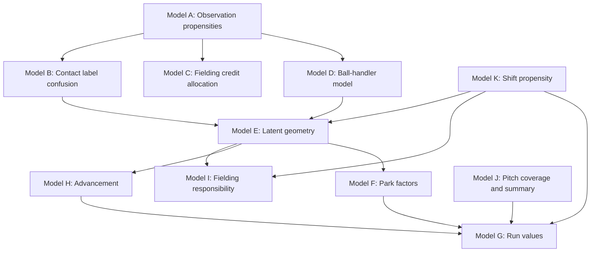

# Hierarchical Models For Data Coverage

## TL;DR

Fit separate hierarchical models whose estimands match the baseball problem: observation propensities, official fielding credit, ball-handler probabilities, latent batted-ball geometry, park effects, run values, advancement, responsibility, and pitch summaries. Each model consumes frozen modeling datasets, prep ledgers, deterministic evidence, and calibrated deep proposals where useful; each model exports probability tables, expected counters, posterior draws, diagnostics, and validation reports.

Do not build one giant joint model first. Use modular models with draw propagation, strong interface contracts, and explicit cut-feedback decisions. Join modules only where downstream data legitimately updates upstream latent quantities.

## Shared Statistical Contract

Every model must specify:

- Estimand and unit.
- Target population.
- Observed data and missingness indicators.
- Latent variables.
- Likelihood and constraints.
- Pooling structure and exchangeability assumptions.
- Priors on interpretable baseball scales.
- Deep-proposal inputs, if any. Per-entity priors (batter / pitcher / park / scorer effects) consumed downstream from Phase-3 are sourced from the shared `event_universe` pretrain artifact rather than per-target re-trains, so the same entity embedding propagates across all consumers and the entity-level signal is borrowed across all 18M events instead of the per-target row subset alone.
- Validation and sensitivity checks.
- Artifact outputs and SQL consumers.

Invariant: posterior means are not raw facts. Probability vectors, posterior draws, and expected counters must carry `model_version`, `source_snapshot_id`, `draw_id` when applicable, `method`, and uncertainty summaries.

## Model Composition



Model D and Model C are siblings under Model A. Phase one does not feed Model D's posterior back into Model C; both consume Model A's outputs and direct handler evidence independently. A joint refit of (C, D) is a later option, gated on the standalone Model C and Model D both passing validation.

Pass uncertainty forward in one of three ways:

| Interface | Use |
| --- | --- |
| Long probability table | Event categorical quantities such as geometry class, handler, contact label. |
| Posterior draw table | Nonlinear downstream estimates such as park factors, run values, rankings, and interval summaries. |
| Expected counter table | Additive metric inputs when SQL consumers need a compact stable table. |

Use a cut-feedback boundary when a downstream metric should not update upstream measurement parameters. For example, park-factor outcomes should not update scorer label-confusion parameters if the purpose of the scorer model is measurement correction.

### Deep-Proposal Ablation Policy

Each Bayesian model in {A, B, C, E, F, G, H, I, J, K} is fit twice — once with `gamma_dl = 0` (DL covariates excluded) and once with `gamma_dl ~ Normal(0, 0.5)` shrinkage prior. Publication tier selection is per-model based on posterior change magnitude: if including DL shifts the publication-tier random-effect posteriors by more than 0.25 SD on most scorer/park/era cells, the `gamma_dl = 0` flavor is published; otherwise the shrunk flavor is published. Both fits are stored as separate artifacts; ablation diagnostics are part of each model's validation report. The manifest's `ablation_status` column (see `05-runtime-artifacts-and-library.md`) records which flavor is the published tier and which is the shadow.

## Model A: Scorer And Source Observation

**Implementation as of 2026-05-21 (v1, six dims).** Event-grain Bernoulli on nutpie/numpyro NUTS, one fit per `event_observation_geometry` dimension that has both observed and unobserved rows: `trajectory`, `location_side`, `location_depth`, `location_edge`, `general_location`, `ball_handler_position`. The seventh dim `pulled_opposite` is purely derived (0% observed) and is excluded. The aggregated `Binomial(n_cell, p_cell)` formulation shipped in PR3 was discarded — once we broadened the covariate set beyond `(season, scorer, source)` the cell product no longer captured the variation we needed, and stock PyMC posterior diagnostics blew up (rhat=3.26, ess=4.47, 1411 divergences) on the resulting 12M-row fit. The redesign drops aggregation, picks up numpyro vectorized chains, and consumes the full pre+post-PA covariate surface directly (post-PA columns are not leakage here — the target is `is_observed`, a separate scoring channel). The sample-size sweep (trajectory, 10K → 1M) fixed the operating budget at 10K rows per dim: OOS AUC plateau hit by 10K, calibration plateau by 100K, mixing collapses past 500K. Each dim fits in ~2.5 min on nutpie.

### Estimand

For event `i` and dimension `d`:

```latex
\Pr(R_{i,d} = 1 \mid x_i, s_i, q_i)
```

where `R` is whether the field is observed as source truth, `x_i` is baseball context, `s_i` is scorer/source context, and `q_i` is provenance reliability.

### Likelihood (v1, event-grain)

```latex
R_{i,d} \sim \operatorname{Bernoulli}(p_{i,d})
```

```latex
\operatorname{logit}(p_{i,d}) =
\alpha
+ \beta^{season}_{t_i}
+ \beta^{scorer}_{c_i}
+ \beta^{park}_{p_i}
+ \mathbb{1}[|U|>1]\,\beta^{source}_{u_i}
+ \sum_k X^{(k)}_i \delta^{(k)}
+ \sum_j \gamma_j \tilde x^{(j)}_i + \sum_j \delta^{miss}_j m^{(j)}_i
```

where `\beta^{season}` is centered with sum-to-zero identification (`\beta^{season} \sim \mathrm{ZeroSumNormal}(0, \sigma_{season})`, `\sigma_{season} \sim \mathrm{HalfNormal}(s_{season})`); `\beta^{scorer}`, `\beta^{park}`, and (when active) `\beta^{source}` are non-centered random intercepts (`\beta = \sigma_* z_*`, `z_* \sim N(0,1)`, `\sigma_* \sim \mathrm{HalfNormal}(s_*)`). Each `X^{(k)}` is the one-hot design matrix for a low-card categorical covariate; coefficients `\delta^{(k)} \sim \mathrm{ZeroSumNormal}(0, s_{fe})` over the full level coord (sum-to-zero identification — no level is dropped). Each `\tilde x^{(j)}` is a standardized continuous covariate, and `m^{(j)}` is its missing indicator. The source-family random effect is conditionally declared only when more than one `source_family` level is present in the training data — the production population (`target_population_status='event_level'`) is single-source by construction and the term would be unidentified. The DL covariate has been dropped from v1; revisit only if posterior-predictive calibration shows residual gaps.

`\tilde p^{dl}` is optional and must be out-of-fold calibrated before use. The symbol `\tilde p^{dl}` is used globally across all models for DL proposal probabilities; older drafts used `\tilde \pi^{dl}` in some places and have been normalized.

### Pooling (v1)

- Season, scorer, and park effects use non-centered partial pooling on the logit scale.
- Source family is conditional: declared as a non-centered random effect only when the dataset contains multiple `source_family` levels. The v1 training population is single-source.
- Batter and pitcher random effects are deferred. Only add if residual analysis on v1 shows player-level signal not subsumed by scorer × era effects.
- Low-card categoricals (game_type, frame_start, exposure_status, league, result_family, pa_result, leverage_bucket, batter_hand, pitcher_hand, personnel_confidence, context_confidence) enter as design-matrix fixed effects with sum-to-zero identification via `pm.ZeroSumNormal` over the full level coord — no reference level dropped. `pa_result` is the 13-level plate-appearance outcome category — load-bearing for `ball_handler_position` (+0.186 OOS PR-AUC vs without) and neutral on the other 5 dims.

### Priors (v1)

- Intercept `\alpha \sim N(0, 1.5)`.
- Group scales `\sigma_{season}, \sigma_{scorer} \sim \mathrm{HalfNormal}(1.5)`; `\sigma_{park} \sim \mathrm{HalfNormal}(1.0)`; `\sigma_{source} \sim \mathrm{HalfNormal}(0.7)` when active.
- Fixed-effect coefficients `\delta^{(k)} \sim \mathrm{ZeroSumNormal}(0, 1)` (`fixed_effect_scale = 1.0`).
- Continuous slopes `\gamma_j \sim N(0, 0.5)` on standardized inputs; paired missing-indicator slopes `\delta^{miss}_j \sim N(0, 1)`.
- NUTS settings on `DEFAULT_CONFIG`: numpyro backend, `target_accept=0.95`, `max_treedepth=12`, 4 chains × 1000 draws × 1000 tune.

### Outputs (v1)

| Table | Grain | Contents |
| --- | --- | --- |
| `exports/event_propensity.parquet` | `event_key, dimension` | Per-event posterior mean `p_observed_mean`. Computed by chunked sigmoid average over posterior draws. |
| `main_models.scorer_observation_propensities` | `event_key, dimension` | SQLMesh `@model` thin-gather over published `event_propensity.parquet` artifacts, stamped with `bayes_artifact_id`. |
| `exports/{posterior_summary,calibration_curve}.parquet` | per-variable / per-bin | Hyperparameter posterior summary + reliability curve. |
| `validation/diagnostics.json` | per-fit | rhat / ess / divergences / calibration_ece + backend + source_effect_active flag. |

### Validation (v1)

- Prior predictive knownness rates.
- Scorer holdouts.
- Park holdouts.
- Source-family holdouts (once data contains multiple sources — currently a no-op).
- Hit/out-specific holdouts.
- Calibration by `(season_decade, source_family, result_family)` slice.

Block publication when scorer, park, team, and source cannot be separated in the target slice. The DL covariate ablation / per-flavor publication policy from earlier drafts has been retired — there is one flavor.

## Model B: Contact Label Confusion

### Estimand

Estimate latent broad or detailed contact class `Z_i` and scorer/source label process `L_i`.

```latex
\Pr(Z_i = z \mid x_i)
```

```latex
\Pr(L_i = l \mid Z_i = z, scorer_i, decade_i, source_i)
```

### Likelihood

```latex
Z_i \sim \operatorname{Categorical}(\pi_i)
```

```latex
L_i \mid Z_i \sim \operatorname{Categorical}(\Omega_{z,c_i,t_i})
```

where `Omega` is a scorer/decade confusion matrix.

### Subject-Matter Boundary

Broad `GroundBall` versus `AirBall` is the first publishable target. Detailed fly/line/pop labels are scorer-adjusted label distributions, not claims about measured launch angle.

### Publication Shape

Broad classes (`GroundBall` vs `AirBall`) are publication-tier with point estimates and posterior credible intervals. Detailed labels (FB, LD, PU) are published as a posterior probability distribution per event — **never** collapsed to argmax. The detailed-label artifact `event_contact_detailed_posterior` has columns:

| Column | Description |
| --- | --- |
| `event_key` | Event identifier. |
| `class` | Detailed contact class (FB, LD, PU, ...). |
| `prob_mean` | Posterior mean probability for this class. |
| `prob_lower` | Lower bound of posterior credible interval. |
| `prob_upper` | Upper bound of posterior credible interval. |
| `prob_draws` | Long-form draws (`draw_id`, probability) for downstream propagation. |

An argmax convenience column may be emitted for inspection but is never the canonical representation for any downstream consumer.

### Constraints

- Recorded labels are direct measurements of scorer/source vocabulary.
- Deduced labels from `calc_batted_ball_type` are high-confidence measurements with failure modes, not absolute truth.
- Home run labels and high-salience hits need separate sensitivity checks.

### Outputs

- `normalized_contact_probabilities(event_key, contact_class)` — broad classes, with point estimate + credible interval.
- `event_contact_detailed_posterior(event_key, class, prob_mean, prob_lower, prob_upper, prob_draws)` — detailed labels as a full posterior distribution.
- `contact_confusion_summaries(scorer, decade, source_family, recorded_label, latent_class)`.
- `contact_expected_counters` for aggregate metrics.

## Model C: Fielding Credit Allocation

**Implementation as of 2026-05-23 (v1.5, putouts only).** Dual-arm hierarchical multinomial on numpyro NUTS, one fit per credit-type scope (currently `putout` only). v1.5 superseded v1's aggregate-only formulation. v1.6 added `direct_handler_position` as a fixed effect and was retracted (see "v1.6 retraction" below):

- **Training pool** is well-attributed events (`credit_type='putout' AND known_credit > 0 AND personnel_hard_mask_available=TRUE`, ~9.9M candidates) where Y is observed per event. v1's aggregate-only pool was naturally-unknown events where Y is latent — that pool gave the model the marginal distribution but no per-event discriminative signal.
- **Synthetic-mask layer.** Per-event Bernoulli mask probability `P_e = clip(α_c · w[true_pos(e)], 0, 1)`. Per-position weights `w` come from the empirical natural-unknown distribution in the v1 authority cache (1B 42%, OF 8–13%, etc.; `REAL_UNKNOWN_RATES_BY_POSITION` in `_credit_data.py`). Per-(season, source_family) intensity `α_c` calibrates the cell-mean mask rate to the empirical natural-unknown rate per cell (1944 PBP ~20%, 1972+ PBP ~0%) so synthetic unknowns share the joint distribution real unknowns have at inference time. Per-game floor: at least one event stays unmasked.
- **Dual likelihood, shared softmax.** Same `π_e = softmax(η_e)` over the personnel-eligible position set with `α_position` + per-FE × position `δ_<fe>` interactions.
  - Supervised arm on unmasked events: `Y_{e,1:K} ~ Multinomial(U_e, π_e)` with Y the observed `known_credit` count vector. This is the load-bearing per-event signal — without it the per-event REs cancel under softmax.
  - Aggregate arm on masked events: `T_target[m] ~ Normal(Σ U_e · π_{e,k}, σ_box)` at grain `(game_id, fielding_team_id, player_id, fielding_position)`, with `T_target[m] = Σ known_credit` over the masked subset (deterministic, since we control the mask). Single `sigma_box_aggregate` (no `authority_source` split — we make the unknowns ourselves).
- **Per-event REs** (season / scorer / park / source) and per-event global FEs are kept. In v1 they cancelled under softmax and NUTS sampled them from the prior; in v1.5 the supervised arm makes them data-informed (one full draw of Y per supervised event identifies how scorers / parks / eras shift the per-position distribution).
- **Identification.** `alpha_position` and each per-FE `delta_<fe>` are `ZeroSumNormal` over the position axis. Continuous slopes are skipped in v1.5; add only if calibration shows residual signal.
- **Held-out OOS.** 10% of games via `game_hash_fold(game_id, fold_count=10) == 0`. Held-out events are excluded from both arms and scored after sampling: top-1 / top-3 / log-loss / per-position PR-AUC / macro PR-AUC, written to `validation/held_out_metrics.json`. Real OOS metrics (not aggregate-residual proxies) gate the operating point alongside rhat / ess / divergences.
- `MIN_EVENTS_PER_SEASON=50` row floor replaces the Model A saturated-season filter.
- Deferred: v2 player REs (still); v3.1 multi-assist count submodel (Dirichlet-multinomial over `M ∈ {1..4}` event classes); v4 errors + double plays; v5 team-residual fallback for `withheld` rows.

### v3 — assists allocation (single-assist cut)

**Cut 1, K=10 softmax with NONE sentinel.** Lands as a second registered target `assist_credit_allocation` that shares the v1.5 dual-arm builder + prep function. The inference slice is the same events v1.5 scores (events whose putout chain is unrecorded — sources that drop putout attribution drop assist attribution at the same time). One model fits both `P(any assist on this event)` and `P(position | A_count=1)` by adding a NONE class to the per-position softmax: `coords["position"] = ["1".."9", "NONE"]`, `K=10`.

- **Training pool.** Well-attributed events with `personnel_hard_mask_available=TRUE` and `putout_position` resolved (single putout), restricted to events with assist count `A_count ∈ {0, 1}`. Multi-assist events (force-DPs, rundowns, ~few percent) are filtered upstream — they don't fit the single-assist sentinel formulation. Their count submodel is v3.1.
- **K=10 truth.** Per-event Y is one-hot at the assist position for A_count=1, one-hot at NONE for A_count=0. `Y_observed ~ Multinomial(n=1, π_e)`, equivalent to `Categorical(π_e)`. The aggregate arm naturally sums over positions 1..9 only — the NONE class doesn't appear in box totals, so `Σ_{k=1..9} π_{e,k} = 1 - π_{e,NONE}` is enforced as the per-(game, position) prediction.
- **PO conditioning via fixed effect.** New per-event covariate `putout_position` (1..9) joined from the same dataset's putout `known_credit` rows. Encoded as a standard FE alongside `result_family`, `base_state_start`, etc. — `delta_putout_position` of shape `(9, 10)` is fit like every other interaction matrix. No hard-zero on the diagonal — the data learns how flexible the PO==A configuration is.
- **Inference-time marginalization (wired).** `_posterior_event_softmax_putout_marginalized(idata, inputs, putout_posterior)` evaluates the K=10 softmax 9 times per event (one per PO candidate) and weights by the published v1.5 putout posterior `expected_share` (artifact `full-10k-v15-tuned`). It is wired into both the production-slice export and the held-out eval. `putout_position` is observed on held-out events but unknown on the production target — the same source-coupling that forced the v1.6 `direct_handler_position` retraction — so both paths must marginalize to stay production-faithful. The held-out eval records a `putout_marginalized: true` flag and excludes `putout_position` from slice calibration when marginalizing. The artifact also records `observed_putout_upper_bound` (top-1 0.714, any_assist PR-AUC 0.828), which conditions on the true putout — an upper bound only, not the production metric.
- **Synthetic-mask weights are uniform across the K=10 positions (cut 1).** The v1.5 per-(season, source_family) intensity table is reused verbatim (the "no PBP putout" cell rate is also the "no PBP assist" cell rate at the source-family level). Empirical assist-unknown per-position rates need one v3 cycle's posterior to derive — tightening to v3.1.
- **Coverage guard.** For `dimension='assist'` the production-target slice is `credit_type='putout' AND unknown_credit_need > 0` (the dataset always emits `unknown_credit_need = 0` on assist rows). Standard FE list checked at the 1% floor on that slice. `putout_position` is excluded from the per-event check (structurally NULL on the production target) and instead checked at the training level — each j ∈ {1..9} must appear on at least 1% of training events so `delta_putout_position[j]` is identifiable at marginalization time.
- **Export schema.** `exports/event_credit.parquet` now carries an optional `none_share: float64` column. K=10 fits emit 9 rows per event with `expected_share = π_{e,k}^v3` for k=1..9 and `none_share = π_{e,NONE}^v3` replicated across the 9 rows. K=9 fits leave `none_share` NULL. `imputed_fielding_credit` surfaces both columns.
- **Held-out metrics.** Two new acceptance numbers alongside the K=10 top-1 / log-loss / per-position PR-AUC table: the per-event `any_assist` block with `pr_auc` (binary NONE vs ¬NONE) and `baseline_pr_auc = empirical(¬NONE)`. Both must clear baseline by a meaningful margin; otherwise the model isn't predicting count at all. The held-out set has `putout_position` observed; the production target does not. So the eval composes the held-out fit with the published v1.5 putout posterior and marginalizes, matching what production scoring does — the recorded numbers are the marginalized ones.
- **Shipped result (operating point `full-10k-v3-cut1-prod`, nutpie, `BC_CREDIT_NONCENTER_SEASON=1`, 10K game-subsample).** Geometry clean: rhat_max 1.036, ess_bulk_min 185, ess_tail_min 430, 0 divergences (non-centered season fixed the funnel centered season hit — sigma_season rhat 1.57 / ess 7 under centered). Marginalized held-out (n_eval=100000): top-1 over 10 classes 0.6635 vs most-frequent baseline 0.6523 (≈ baseline); any_assist PR-AUC 0.5155 vs 0.3477 base rate (a real lift); top-3 0.865; log_loss 1.06; marginal calibration TV 0.052 (per-slice weighted 0.052–0.061), NONE under-predicted ~5 pt (0.604 vs 0.652, expected from marginalizing v1.5's diffuse putout posterior whose own top-1 is ~0.53). Key finding: per-fielder identification on the production slice is ≈ baseline — pinpointing the assister needs a sharp putout production lacks. The model's real value is P(any assist) and calibrated expected shares, not naming the specific fielder. This is the inverse of v1.6: the lift that survives marginalization is the part that does not depend on the missing clue.
- **Production export (wired).** Scores all 463,093 production-target events (`credit_type='putout' AND unknown_credit_need > 0 AND personnel_hard_mask_available AND eligible_for_allocation`) — the production slice, not the training subsample — for 4,167,837 rows (463,093 × 9 positions). Each event's 9 position shares + `none_share` sum to exactly 1; on production `none_share` ranges 0.058–0.58 (mean 0.49), so P(any assist) varies meaningfully by event. Validated against prod personnel tables: the `imputed_fielding_credit` join yields 4,167,837 rows, unique grain, zero nulls (not_null + unique_grain audits pass). The full SQLMesh branch-env plan-model was not run (a fresh branch env requires a full-corpus rebuild — env-setup cost, unrelated to the model); the join logic + audits are validated directly against prod, and SQLMesh materialization happens at promotion.

Out-of-scope for v3 cut 1: multi-assist count submodel (v3.1), errors / DPs (v4), player REs (still deferred), DL covariate. v3.1 is gated on a clean v3 cut-1 fit so the architecture is validated before adding the count head.

### v1.6 retraction (`direct_handler_position` FE)

v1.6 added `direct_handler_position` (`NULLIF(stg_events.batted_to_fielder, 0)`) as a per-event FE. The held-out lift looked dramatic — top-1 0.529 → 0.786 (+25.7pp), per-position max abs dev 0.036 → 0.005, OF PR-AUC ≈0.10 → ≈0.997 — but the held-out gain was a sample-composition artifact, not a generalizable signal.

Coverage breakdown on the held-out set vs the production inference target (events with `unknown_credit_need > 0 AND personnel_hard_mask_available AND eligible_for_allocation`):

| slice | events | `direct_handler_position` recorded | NULL |
|---|---:|---:|---:|
| held-out eval | 10,554,569 | 8,131,306 (77.0%) | 2,423,263 (23.0%) |
| production unknowns | 4,167,837 | 3,663 (**0.09%**) | 4,164,174 (99.91%) |

The two columns are coverage-correlated upstream: sources that record the putout chain (i.e. our training/held-out population) also record `batted_to_fielder`; sources that don't record the putout (i.e. our inference target) typically don't record `batted_to_fielder` either. So the +25.7pp held-out lift came from events that share the handler signal with the model, and the production benefit is `0.0009 × big + 0.9991 × 0 ≈ 0`. The v1.6 deployed model behaved essentially identically to v1.5 on the dominant unknown-handler slice.

We retracted v1.6 by:

1. Removing `direct_handler_position` from `model_input_fielding_credit` and from `FIXED_EFFECT_COLUMNS`.
2. Adding a 1% production-coverage floor (`PRODUCTION_FE_COVERAGE_FLOOR`) — `_assert_fixed_effects_cover_production_slice` raises if any FE is populated on less than 1% of the production unknown slice. Tested at the unit-test layer (`test_fielding_credit_prep.py`).
3. Re-promoting `full-10k-v15-tuned` as the published `putout_credit_allocation` pointer.

The retraction does not block a future return to handler evidence — but any reintroduction needs (a) an upstream pipeline that surfaces `batted_to_fielder` on the unknown-putout slice at >1% coverage, or (b) a separate model specifically scoped to the small handler-known production subset (with the rest falling through to the FE-only model), and any held-out metric must be reported restricted to the `direct_handler_position IS NULL` slice as the production-equivalent number.

Artifact paths: per-fit exports under `artifacts/statistical/bayes/<model_name>/<artifact_id>/exports/event_credit.parquet` (grain `(event_key, fielding_position, credit_type)`, value `expected_share`); SQLMesh consumer `main_models.imputed_fielding_credit` at grain `(event_key, player_id, fielding_position, credit_type)`.

### v1 archive (aggregate-only, superseded)

v1 trained only on naturally-occurring unknown putouts and consumed `official_aggregate_availability.residual_value` joined to `official_credit_authority.authority_source` (excluding `withheld`) as targets, with a per-authority-source `sigma_box` map. It survives in git history (`30bb5fe`); v1.5 retains the aggregate-arm scatter structure but rebuilds the target from masked Y rather than from the box residual.

### Estimand

For event `e`, eligible player-position `k`, and credit type `c`:

```latex
E[Y_{e,k,c} \mid evidence]
```

where `Y` is official credit such as putout, assist, error, double play, or related fielding stat.

### Likelihood

Putouts and assists use different likelihoods because the missing count is known for putouts but not for assists.

For putouts, `U_{e,PO}` is the known event-level unknown-putout count:

```latex
Y_{e,1:K,PO} \sim \operatorname{Multinomial}(U_{e,PO}, \pi_{e,1:K,PO})
```

For assists, first estimate the missing assist count, then allocate that count. The assist-count likelihood is a **state-conditioned discrete distribution**: each event-class × base/out-state combination has its own categorical distribution over plausible assist counts, fit as a Dirichlet-multinomial across event classes with hierarchical pooling toward a global mean.

```latex
N_{e,A} \sim \operatorname{Categorical}(\theta_{event\_class_e, base\_out_e})
```

```latex
\theta_{event\_class, base\_out} \sim \operatorname{Dirichlet}(\alpha_{event\_class})
```

```latex
\alpha_{event\_class} \sim \operatorname{HalfCauchy}(\alpha_{global}, \tau)
```

The simplex `theta_{event_class, base_out}` ranges over `0..M_{event_class}`, where `M_{event_class}` is the per-event-class upper bound on plausible assists:

| Event class | `M_{event_class}` | Rationale |
| --- | --- | --- |
| Normal force-out | 1 | Single throw, single relay-free assist. |
| Normal infield assist with throw | 2 | Common 6-4-3 / 4-6-3 style; allows for cutoff. |
| Bunt double play | 3 | Charge-throw-relay-cover sequences observed in the corpus. |
| Rundown | 4 | Multi-handler chains capped at four documented assists. |

Allocation across players follows once the count is drawn:

```latex
Y_{e,1:K,A} \mid N_{e,A} \sim \operatorname{Multinomial}(N_{e,A}, \pi_{e,1:K,A})
```

```latex
\operatorname{softmax}(\eta^A_{e,k}) = \pi_{e,k,A}
```

### Credit-Type Submodels

Each credit type `c ∈ {putout, assist, error, double_play}` has its own predictor `η_c`, with shared random effects on player/position/era and credit-specific structure. The math here aligns with the prose constraint that credit types are separate submodels:

Putout submodel:

```latex
\eta^{PO}_{e,k} =
\alpha_{PO,pos_k}
+ \beta^{result}_{PO,pos_k,r_e}
+ \beta^{state}_{PO,pos_k,b_e,o_e}
+ \beta^{contact}_{PO,pos_k,z_e}
+ \beta^{direct\_handler}_{PO} D_{e,k}
+ a^{teamseason}_{PO,pos_k,t_e}
+ a^{scorer}_{PO,pos_k,s_e}
+ a^{player\_era}_{PO,k,era_e}
+ \gamma^{dl}_{PO} \log(\tilde p^{dl}_{e,k,PO})
```

Assist submodel: same structural form as putouts but with assist-specific intercepts and coefficients, conditioned on the drawn `N_{e,A}`.

```latex
\eta^{A}_{e,k} =
\alpha_{A,pos_k}
+ \beta^{result}_{A,pos_k,r_e}
+ \beta^{state}_{A,pos_k,b_e,o_e}
+ \beta^{contact}_{A,pos_k,z_e}
+ \beta^{direct\_handler}_{A} D_{e,k}
+ a^{teamseason}_{A,pos_k,t_e}
+ a^{scorer}_{A,pos_k,s_e}
+ a^{player\_era}_{A,k,era_e}
+ \gamma^{dl}_{A} \log(\tilde p^{dl}_{e,k,A})
```

Error submodel: errors are scorer-discretion outcomes; the predictor weights scorer / scorer-team / park / era heavily and downweights state structure relative to putouts.

```latex
\eta^{E}_{e,k} =
\alpha_{E,pos_k}
+ \beta^{result}_{E,pos_k,r_e}
+ a^{scorer}_{E,pos_k,s_e}
+ a^{scorer\_team}_{E,pos_k,st_e}
+ a^{park}_{E,pos_k,p_e}
+ a^{era}_{E,pos_k,era_e}
+ a^{player\_era}_{E,k,era_e}
+ \gamma^{dl}_{E} \log(\tilde p^{dl}_{e,k,E})
```

Double-play submodel: DPs are state-locked (they can only occur from specific base/out states) and are conditioned on the post-event state being consistent with two outs recorded on the play.

```latex
\eta^{DP}_{e,k} =
\alpha_{DP,pos_k}
+ \beta^{state}_{DP,pos_k,b_e,o_e}
\cdot \mathbb{1}[\text{state admits DP}]
+ \beta^{contact}_{DP,pos_k,z_e}
+ a^{teamseason}_{DP,pos_k,t_e}
+ a^{player\_era}_{DP,k,era_e}
+ \gamma^{dl}_{DP} \log(\tilde p^{dl}_{e,k,DP})
```

`D_{e,k}` is direct handler evidence available before the handler model, such as explicit fielding-play evidence, `batted_to_fielder`, or deterministic handler clues. Phase-one fielding credit allocation must not consume posterior `ball_handler_probabilities`; those are later geometry inputs or optional refit inputs after the first allocation model validates. `\tilde p^{dl}` is an optional calibrated deep proposal.

### Aggregate Constraint Likelihood

When box residuals exist:

```latex
B_{g,k,c} \sim \operatorname{Normal}
\left(
\sum_{e \in g} Y_{e,k,c},
\sigma_{aggregate,c}
\right)
```

Use a tighter `sigma_aggregate` only for clean official aggregate totals. Issue-flagged totals become weak measurements or are excluded.

### Constraints

- Probability mass only goes to personnel-eligible players.
- Expected event putouts reconcile to event outs and unknown putout counts.
- Expected player-game credits reconcile to clean box-score residuals where official aggregate constraints are used.
- Putouts and assists are modeled separately; assists require a missing-count model before player allocation.
- Battery plays, steals, pickoffs, bunts, strikeouts, passed balls, and unusual plays use separate strata or submodels.

### First Implementation

1. Train a known-putout multinomial model on complete events with hard personnel masks.
2. Train an assist-count model and an assist-allocation model on complete events.
3. Condition event probabilities on box residual constraints with deterministic constrained optimization or posterior importance weighting.
4. Add direct aggregate constraint likelihood after the first version validates.

### Outputs

| Table | Grain | Contents |
| --- | --- | --- |
| `imputed_fielding_credit` | `event_key, player_id, fielding_position, credit_type` | Expected credit, intervals, source/method/confidence, aggregate-constraint status. |
| `fielding_credit_draws` | `draw_id, event_key, player_id, fielding_position, credit_type` | Draw-level credit when needed. |
| `fielding_credit_expected_counters` | player-game and player-season | Additive expected counters. |

## Model D: Ball Handler

### Estimand

```latex
\Pr(H_i = k \mid event_i, personnel_i, fielding_evidence_i)
```

where `H` is the player or fielding position that handled or completed the play. This is not official credit and not defensive responsibility.

Invariant: Model D and Model C are siblings under Model A. Neither feeds the other in phase one. Both consume Model A's observation propensities and direct handler evidence independently. The handler posterior feeds Model E (geometry) and later optional refits; the credit posterior feeds aggregate metrics. A joint (C, D) refit is gated on both passing standalone validation.

### Likelihood

```latex
H_i \sim \operatorname{Categorical}(\pi_i)
```

```latex
\eta_{i,k} =
\alpha_{pos_k}
+ \beta^{result}_{r_i,pos_k}
+ \beta^{contact}_{z_i,pos_k}
+ \beta^{baseouts}_{b_i,o_i,pos_k}
+ a^{seasonleague}_{t_i,l_i,pos_k}
+ a^{scorer}_{s_i,pos_k}
+ \gamma^{credit} \hat Y_{i,k}
+ \gamma^{dl} \log(\tilde p^{dl}_{i,k})
```

`\gamma^{credit}` couples handler posterior to credit evidence as a covariate read-only — it does not refit Model C. In phase one, set `\gamma^{credit} = 0` (no read-across from credit allocation) and treat `\hat Y_{i,k}` as a diagnostic-only feature.

### Outputs

- `ball_handler_probabilities(event_key, player_id, fielding_position)`.
- `handler_expected_counters` for geometry and responsibility inputs.

### Validation

- Known handler holdouts by hit/out.
- Era and alignment-regime holdouts.
- Calibration by batter hand, base state, result, and position.

## Model E: Latent Geometry

### Estimand

For event `i` and geometry dimension `d`:

```latex
\Pr(G_{i,d} = g \mid recorded_i, deduced_i, handler_i, scorer_i, era_i, context_i)
```

Dimensions:

- `trajectory_broad`
- `trajectory_detail`
- `location_side`
- `location_depth`
- `location_edge`
- `region`

### Measurement Model

```latex
G_{i,d} \sim \operatorname{Categorical}(\pi_{i,d})
```

```latex
Recorded_{i,d} \mid G_{i,d}, scorer_i, era_i \sim
\operatorname{Categorical}(\Omega_{d,G_{i,d},scorer_i,era_i})
```

```latex
Deduced_{i,d} \mid G_{i,d}, rule_i \sim
\operatorname{Categorical}(\Delta_{d,G_{i,d},rule_i})
```

`Delta` should be strongly concentrated for high-confidence deterministic rules and weaker for known failure modes such as shifted fielder-to-location mappings or 2000-2002 shallow outfield cases.

### Predictor Structure

```latex
\eta_{i,g,d} =
\alpha_{d,g}
+ a^{seasonleague}_{d,g,t_i,l_i}
+ a^{park}_{d,g,p_i}
+ a^{scorer}_{d,g,s_i}
+ \beta^{hand}_{d,g,bh_i}
+ \beta^{state}_{d,g,b_i,o_i}
+ \beta^{handler}_{d,g} P(H_i)
+ \beta^{alignment}_{d,g,A_i}
+ \beta^{shift}_{d,g} P(\text{shift}_i)
+ \gamma^{dl}_{d,g} \log(\tilde p^{dl}_{i,g,d})
```

`P(shift_i)` is the posterior shift probability from Model K. Where Model K's posterior is sparse or unreliable (pre-2009, or post-2009 cells with wide credible intervals), this term falls back to the era-normal alignment prior already captured in `β^{alignment}`.

### Outputs

| Table | Grain | Contents |
| --- | --- | --- |
| `imputed_batted_ball_geometry` | `event_key, geometry_dimension, class` | Recorded, deduced, estimated probability, intervals, method. |
| `geometry_draws` | `draw_id, event_key, geometry_dimension, class` | Draw-level class probabilities. |
| `geometry_expected_counters` | metric grain | Additive expected counters. |

### Validation

- Hold out known locations for hits and outs separately.
- Hold out scorers and scorer-team affiliations.
- Train/test within alignment regimes before cross-regime transfer.
- Compare raw, deduced, deep proposal, and posterior probabilities.
- Stress-test source-pattern slices called out in existing docs.

## Model F: Park Factors

### Estimand

For park `p`, season `t`, league `l`, and outcome `o`:

```latex
\theta_{p,t,l,o}
```

is the counterfactual log rate ratio or log odds ratio for the same batter/pitcher/context mix in that park versus neutral or league-average context.

### Event Outcome Model

For binary outcomes:

```latex
y_{i,o} \sim \operatorname{Bernoulli}(\operatorname{logit}^{-1}(\mu_{i,o}))
```

```latex
\mu_{i,o} =
\alpha_{t_i,l_i,o}
+ b_{batter_i,o}
+ p_{pitcher_i,o}
+ \beta^{hand}_{o,bh_i,ph_i}
+ \beta^{state}_{o,state_i}
+ \beta^{team}_{o,team_i}
+ \theta_{park_i,t_i,l_i,o}
+ u^{umpire}_{o,ump_i}
+ \beta^{weather}_{o} W_i
+ \beta^{surface}_{o,surf_i,era_i}
+ \beta^{day\_night}_{o,dn_i}
+ h^{home\_adv}_{o,park_i,t_i}
+ \gamma^{obs}_{o} \hat R_{i,o}
```

### Park F Covariates

Model F's linear predictor extends beyond park × season × league to include the following observable covariates. Each has a backoff policy keyed by `context_observation_ledger`:

| Covariate | Type | Symbol | Backoff when `not_applicable` | Backoff when `missing` |
| --- | --- | --- | --- | --- |
| `umpire` | Per-umpire random effect (partial pooling toward league-season mean). | `u^{umpire}_{o,ump_i}` | Drop term (rare). | League-season prior. |
| `weather` | Continuous: temperature (°F), wind speed × direction (decomposed into out-to-CF and cross components). `W_i` is the vector. | `\beta^{weather}_{o} W_i` | Drop term (indoor / dome). | Impute to park-season mean weather. |
| `surface` | Categorical: turf/grass × era. | `\beta^{surface}_{o,surf_i,era_i}` | Drop term. | League-season prior for surface mix. |
| `day_night` | Fixed effect, observable post-1935. Pre-1935 events get `not_applicable` and `day_night = NA`. | `\beta^{day\_night}_{o,dn_i}` | **Drop term** (pre-1935: no night baseball). | League-season day/night base rate. |
| `home_advantage` | Per-park per-season random effect (or pooled to global fixed effect when park-season support is thin). | `h^{home\_adv}_{o,park_i,t_i}` | Not applicable in neutral-site games — drop term. | Global home-advantage fixed effect. |

The backoff is implemented as a per-event mask: when `context_observation_ledger` marks a field `not_applicable`, the corresponding term is omitted from `μ_{i,o}` for that event — it is **not** imputed to a base rate, because the absence is structural, not stochastic. When the ledger marks a field `missing`, the term enters with an imputed value (league-season prior or imputation-model posterior, depending on availability) plus an extra variance inflation to reflect imputation uncertainty.

For runs:

```latex
r_g \sim \operatorname{NegativeBinomial}(\lambda_g, \phi)
```

```latex
\log(\lambda_g) =
\log(exposure_g)
+ \alpha_{season_g,league_g}
+ team\_offense_{team_g}
+ opponent\_pitching_{opp_g}
+ \theta_{park_g,season_g,league_g}
```

### Dynamic Park Prior

The AR(1) persistence parameter uses a mildly informative prior favoring persistence:

```latex
\rho_o \sim \operatorname{Beta}(2, 1)
```

This prior puts more mass near 1 than near 0, consistent with the expectation that park effects are sticky year to year absent a structural change.

```latex
\theta_{p,t_0,l,o} \sim \operatorname{Normal}(0, \sigma_{park\_initial,o})
```

```latex
\theta_{p,t,l,o} \sim \operatorname{Normal}
(\rho_o \theta_{p,t-1,l,o}, \sigma_{park,o})
\quad \text{for } t > t_0 \text{ and } t \text{ within the same } park\_episode\_id
```

Park episodes can add another level:

```latex
\theta_{p,t,l,o} =
\theta^{identity}_{park\_episode(p,t),o}
+ \theta^{season}_{p,t,l,o}
```

### Episode Boundary Policy

`park_episode_id` segments a park's history into chains of comparable physical configurations. At episode boundaries the AR(1) chain **resets**:

```latex
\theta_{p, t_{episode\_start}, l, o} \sim
\operatorname{Normal}(0, \sigma_{episode\_init,o})
```

rather than the in-chain transition `Normal(rho * theta_{p,t-1}, sigma)`. Triggers for a new `park_episode_id`:

- Major renovation (e.g., outfield wall moved, seating altered enough to change carry/foul territory).
- Surface change (turf ↔ grass).
- Roof installation or removal.
- Documented dimension change beyond a calibration threshold.

`park_episode_id` is derived elsewhere (the park-history dimension; see `01-prep-ledgers.md`) and joined into Model F's predictor. When a renovation creates a new episode at the same site, the new-episode initial draw shrinks toward a weakly regularized park-identity effect rather than the league-average park effect.

`t_0` is the first season for a `park_episode_id` in a league. New park episodes do not borrow from a non-existent previous season; they shrink toward the league-average park effect or, when a renovation creates a new episode at the same site, toward a weakly regularized park-identity effect.

### Deep Inputs

Use deep embeddings or residual proposals only after cross-fitting:

- `park_embedding`
- `batter_embedding`
- `pitcher_embedding`
- `scorer_embedding` for batted-ball outcomes

Regularize embedding coefficients strongly. If embeddings predict source/scorer identity better than baseball outcomes, use them only for diagnostics.

### Outputs

- `park_factor_posterior(park_id, park_episode_id, season, league, outcome, draw_id, log_factor)`.
- `park_factor_summary` with mean, median, interval columns, weak-identification flags, and compatibility rounded factors.
- `park_factor_validation` by park-season/outcome.

## Model G: Run Expectancy And Linear Weights

### Estimand

```latex
V_{state,t,l} = E[runs\_to\_end \mid state, season=t, league=l]
```

Play values are generated quantities, but **published linear weights are context-neutral in the strict sense**: averaged over the *modeled* transition distribution `P_LW(end | start)`, not over realized transitions in the sample. This is the key change from a marginal-LW computation: marginal LW conflates the run-value of a play type with the empirical end-state distribution observed for that play type in a particular season-league sample. A context-neutral LW separates them.

### Run-Expectancy Likelihood

The fitted run-expectancy likelihood can include park and era-regime effects as nuisance adjustments, but the published standard linear weights are context-neutral generated quantities.

```latex
runs\_to\_end_i \sim \operatorname{NegativeBinomial}
(\lambda_i, \phi)
```

```latex
\log(\lambda_i) =
\alpha_{state_i}
+ a^{seasonleague}_{state_i,t_i,l_i}
+ a^{park}_{state_i,park_i}
+ a^{era\_regime}_{state_i, regime_i}
```

The `era_regime` covariate partitions baseball history into rule-driven scoring regimes:

| Regime | Span |
| --- | --- |
| `pre_DH` | Pre-1973 (both leagues). |
| `DH_AL_only` | 1973–2021 AL only (NL stays pre-DH for this regime split). |
| `full_DH` | 2022+ both leagues. |
| `ghost_runner` | 2020+ extra innings (regular season). |
| `extra_inning_ghost_plus_expanded_DH` | Overlap of ghost-runner + full-DH regimes from 2022 onward. |

Regimes are not mutually exclusive in all seasons; the `era_regime` covariate is encoded as a vector of regime indicators, not a single categorical.

### Markov Transition Submodel

Add a submodel for end-state given start-state:

```latex
P(end\_state_i = e \mid start\_state_i = s, season_i=t, league_i=l, regime_i) =
\operatorname{softmax}(\zeta_{s,e,t,l,regime})
```

```latex
\zeta_{s,e,t,l,regime} =
\alpha^{trans}_{s,e}
+ a^{trans,seasonleague}_{s,e,t,l}
+ a^{trans,regime}_{s,e,regime}
```

The end-state space is the 24 base-out states plus a half-inning-ending state, for 25 outcomes. The transition probabilities pool partially across season-league via `a^{trans,seasonleague}`.

Define the league-marginal transition probability as the season-league-averaged transition across all event types in the sample:

```latex
P_{LW}(e \mid s, t, l) = \sum_{regime} w_{regime,t,l} \cdot P(e \mid s, t, l, regime)
```

where `w_{regime,t,l}` are the regime weights for that season-league.

### Context-Neutral Play Value

The generated quantity for a play value is:

```latex
\Delta_i =
E[runs\_on\_play_i \mid start\_state_i, end\_state_i]
+ E_{end\_state \sim P_{LW}(\cdot \mid start\_state_i)}[V_{end\_state, t_i, l_i}]
- V_{start\_state_i, t_i, l_i}
```

Crucially, the middle term integrates `V_{end}` against the **modeled marginal transition distribution** `P_LW`, not against the realized end-state of event `i`. This separates run value from realized context.

A marginal-LW alternative (`E[V_{end(i)}] - V_{start(i)}` using the realized end state) is computed as a diagnostic for comparison but is **not** the published linear weight.

Start with run expectancy and the transition submodel, then add win expectancy after inning, score, home/away, walk-off, suspended, and game-length policies validate.

Context-neutral generated quantity:

```latex
V^{neutral}_{state,t,l} =
E[runs\_to\_end \mid state,t,l,a^{park}=0]
```

Optional context-specific generated quantity:

```latex
V^{context}_{state,t,l,park} =
E[runs\_to\_end \mid state,t,l,park]
```

`linear_weight_posterior` should use `V^{neutral}` integrated against `P_LW` unless a downstream analysis explicitly requests park-specific or sample-marginal run values.

### Validation

- Posterior predictive checks on per-season run scoring at the league level.
- Holdout park-seasons to confirm park effects are identified.
- **Markov consistency check**: for every start state `s`, verify that `Σ_e P(end_state = e | start_state = s, t, l, regime) = 1` within sampler tolerance. This is a hard invariant on the transition submodel.
- Compare context-neutral LW against marginal LW; the gap should track regime composition changes.
- Era-regime ablation: refit with `a^{era_regime} = 0` and confirm that DH / ghost-runner regimes show non-trivial posterior shifts in the regime-on flavor.

### Outputs

- `run_expectancy_posterior(state, season, league, draw_id, value)`.
- `context_run_expectancy_posterior(state, season, league, park_id, draw_id, value)` when park-specific values are approved.
- `state_transition_posterior(start_state, end_state, season, league, regime, draw_id, prob)` — the Markov transition submodel.
- `linear_weight_posterior(play_type, season, league, draw_id, value)` — context-neutral LW integrated against `P_LW`.
- `linear_weight_summary` with intervals, sparse-state flags, and a marginal-vs-neutral gap column.

## Model H: Advancement

### Estimand

For runner opportunity `i`:

```latex
\Pr(A_i = a \mid pre\_state_i, geometry_i, runner_i, fielder_i, park_i, era_i)
```

where `A_i` is an advancement category or bases/outs outcome.

### Likelihood

```latex
A_i \sim \operatorname{Categorical}(\pi_i)
```

```latex
\eta_{i,a} =
\alpha_{a,base_i,outs_i}
+ \beta^{score}_{a,score_i}
+ \beta^{geometry}_{a} G_i
+ \beta^{park}_{a,park_i}
+ runner_{a,runner_i}
+ fielder_{a,fielder_i,pos_i}
+ team_{a,team_i}
+ seasonleague_{a,t_i,l_i}
```

### Guardrails

- Do not condition the first advancement model on post-advancement labels that encode success.
- Fit context-only models before player effects.
- Pass geometry uncertainty as draws or probability vectors.
- Tag runner/fielder effects as weak when geometry dominates uncertainty.

## Model I: Fielding Responsibility

### Estimand

```latex
\Pr(Responsible_i = k \mid G_i, alignment_i, batter\_hand_i, base\_out_i, personnel_i)
```

This is an analytical opportunity model, not an official-credit model.

### Model Shape

- Use geometry posterior draws.
- Use alignment-regime priors **gated on Model K's shift-propensity posterior**.
- Separate infield, outfield, pitcher/catcher, bunt, deflection, and unusual-play mechanisms.
- Use high-coverage location slices for validation, not as universal truth.

### Alignment Basis And Gating Policy

The primary alignment input is the posterior from Model K (shift propensity) when Model K is sufficiently identified for the cell. Concretely, for each event:

1. Look up the Model K posterior `P(shift | player, batter_hand, defending_team, count, outs, base_state, season)`.
2. If the posterior 95% credible interval width is **below a threshold** (default 0.25 on the probability scale; tunable per validation), use the Model K posterior mean as the alignment-shift input.
3. Otherwise, fall back to the **era-normal alignment prior** for the relevant batter-hand × era cell. Eras prior to 2009 always use the era-normal prior because Model K has no observation support.

Both columns are published so downstream consumers can choose:

| Column | Source |
| --- | --- |
| `alignment_actual_post` | Model K posterior, when above identification threshold. |
| `alignment_normal_prior` | Era-normal prior, always populated. |

The gating threshold is a hyperparameter of Model I's data-prep step, recorded in the model manifest.

### Outputs

- `fielder_responsibility_probabilities(event_key, player_id, fielding_position, alignment_actual_post, alignment_normal_prior)`.
- `responsibility_expected_counters` for range-style metrics.

Invariant: responsibility probabilities never rewrite official putouts, assists, errors, or double plays.

## Model J: Pitch Coverage And Summary

### Estimands

- `P(count observed | source/context)`
- `P(sequence observed | source/context)`
- `P(pitch_summary | result, count, batter, pitcher, era, source)`

### First Model

Fit coverage and summary-count models before ordered sequence generation:

```latex
R^{pitch}_i \sim \operatorname{Bernoulli}(p_i)
```

```latex
summary_i \sim p(summary \mid plate\_appearance\_result_i, count_i, era_i, batter_i, pitcher_i)
```

Full sequence generation is a later model because it must preserve count, plate appearance result, pickoffs, pitchouts, wild pitches, passed balls, stolen-base attempts, and baserunning coupling.

## Model K: Shift Propensity

### Estimand

```latex
\Pr(\text{shift}_i = 1 \mid player_i, batter\_hand_i, defending\_team_i, count_i, outs_i, base\_state_i, season_i)
```

`shift_i` is a binary indicator: did the defense employ a shift on event `i`?

### Grain

- **2015+**: event-level (full-coverage shift annotations).
- **2009–2014**: pitch-level (pitch-by-pitch shift data exists for this window but is incomplete at the event level).
- **Pre-2009**: not applicable. Pre-2009 events are tagged `not_applicable` in the shift ledger; Model K never produces a posterior for these rows.

### Likelihood

```latex
\text{shift}_i \sim \operatorname{Bernoulli}(p_i)
```

```latex
\operatorname{logit}(p_i) =
\alpha
+ \beta^{hand}_{bh_i}
+ \beta^{count}_{balls_i, strikes_i}
+ \beta^{outs}_{o_i}
+ \beta^{base\_state}_{b_i}
+ \beta^{regime}_{regime_i}
+ a^{player(hand)}_{batter_i, bh_i}
+ a^{teamseason}_{team_i, t_i}
+ a^{seasonleague}_{t_i, l_i}
+ \gamma^{dl} \log(\tilde p^{dl}_{shift,i})
```

Fixed effects: `batter_hand`, `count` (full interaction of balls × strikes), `outs`, `base_state`, and an era-regime fixed effect over `{2009-2014 partial, 2015-2022 full-shift, 2023+ post-restriction}`.

Random effects:

- `a^{player(hand)}`: player, hierarchically pooled **within batter_hand** (the meaningful slice — LHB and RHB shift rates are structurally different).
- `a^{teamseason}`: defending-team-season effect.
- `a^{seasonleague}`: season-league effect.

### Priors

- Fixed effects: `Normal(0, 1)` (weakly informative on the logit scale).
- Group standard deviations: `HalfNormal(0.5)` on all hierarchical variance components.
- Deep-proposal coefficient `gamma^{dl}`: per the ablation policy.

### Outputs

| Table | Grain | Contents |
| --- | --- | --- |
| `shift_propensity_posterior` | `event_key` | `shift_prob_mean`, `shift_prob_lower`, `shift_prob_upper`, `shift_prob_draws` (long-form: `draw_id × event_key × prob`). |
| `shift_propensity_diagnostics` | run/slice | Calibration plots by era, posterior predictive shift rates by team-season. |

### Consumers

- **Model E (geometry)**: enters as `β^{shift} P(shift_i)` in the linear predictor; gated on Model K's posterior identification.
- **Model I (responsibility)**: primary alignment basis, with era-normal alignment prior as fallback for older / sparse cells (see Model I's gating policy).
- **Model G (run values)**: optional covariate for state-transition heterogeneity; not in the first fit, but documented for the future regime-conditional fit.

### Validation

- Holdout 10% of player-seasons; calibration plots by era.
- Confirm pre-2009 events are correctly tagged `not_applicable` and that Model K never emits a posterior row for them.
- Posterior predictive shift rates per team-season should match observed shift rates within sampler tolerance.
- Sanity check: post-2023 (shift restrictions in effect) should show a sharp regime-level drop relative to 2022.
- Player-season holdout calibration by handedness.

## PyMC Builder Pattern

Decision: the first Bayesian implementation uses PyMC and ArviZ through the optional `stats` dependency group. Alternative backends can be evaluated later only if PyMC fails the smoke-run, diagnostics, or performance gates.

Model code should be small, named by estimand, and built from prepared arrays:

```python
from __future__ import annotations

from dataclasses import dataclass

import numpy as np
import pymc as pm


@dataclass(frozen=True)
class ObservationData:
    y: np.ndarray
    season_idx: np.ndarray
    scorer_idx: np.ndarray
    source_idx: np.ndarray
    dl_logit: np.ndarray
    coords: dict[str, list[str]]


def build_observation_model(data: ObservationData) -> pm.Model:
    with pm.Model(coords=data.coords) as model:
        y = pm.Data("y", data.y, dims="event")
        season_idx = pm.Data("season_idx", data.season_idx, dims="event")
        scorer_idx = pm.Data("scorer_idx", data.scorer_idx, dims="event")
        source_idx = pm.Data("source_idx", data.source_idx, dims="event")
        dl_logit = pm.Data("dl_logit", data.dl_logit, dims="event")

        alpha = pm.Normal("alpha", 0.0, 1.5)
        sigma_season = pm.HalfNormal("sigma_season", 0.5)
        sigma_scorer = pm.HalfNormal("sigma_scorer", 0.7)
        sigma_source = pm.HalfNormal("sigma_source", 0.7)

        z_season = pm.Normal("z_season", 0.0, 1.0, dims="season")
        z_scorer = pm.Normal("z_scorer", 0.0, 1.0, dims="scorer")
        z_source = pm.Normal("z_source", 0.0, 1.0, dims="source")
        beta_dl = pm.Normal("beta_dl", 0.0, 0.5)

        eta = (
            alpha
            + z_season[season_idx] * sigma_season
            + z_scorer[scorer_idx] * sigma_scorer
            + z_source[source_idx] * sigma_source
            + beta_dl * dl_logit
        )

        p = pm.Deterministic("p_observed", pm.math.sigmoid(eta), dims="event")
        pm.Bernoulli("observed", p=p, observed=y, dims="event")

    return model
```

This skeleton is not the final formula. It shows required mechanics: named dimensions, data outside the model block, non-centered group effects, explicit deep-proposal coefficient, and generated quantities.

## Sampling And Approximation Strategy

| Model | First implementation | Full implementation |
| --- | --- | --- |
| Observation | Aggregated binomial where possible; event-level for key covariates. | Dynamic hierarchy with scorer/source/park effects and MNAR sensitivity. |
| Fielding credit | Trained multinomial probabilities plus constrained allocation. | Joint event plus aggregate residual likelihood. |
| Geometry | Categorical model with deterministic measurement reliability. | Joint handler/contact/geometry measurement model. |
| Park factors | Outcome-specific hierarchical GLM. | Multivariate correlated park-season effects. |
| Run values | Hierarchical run expectancy plus Markov transition submodel. | Joint run/win expectancy with posterior draw propagation and regime-conditional transition. |
| Advancement | Context-only categorical model. | Geometry-draw-aware runner/fielder effects. |
| Pitch summary | Coverage and summary counts. | Ordered sequence generation. |
| Shift propensity | Event-level Bernoulli with player(hand) / team-season / season-league random effects. | Pitch-level joint with pitch-coverage and within-PA shift-change dynamics. |

Use aggregated likelihoods for group counts when event-level predictors are not essential. Use event-level likelihoods only where the estimand needs event context.

## Validation Gates

Every model must pass:

- Prior predictive checks on baseball-scale rates/counts.
- Simulated-data recovery for latent quantities.
- Sampler diagnostics or approximation diagnostics.
- Posterior predictive checks by source, era, scorer, park, team, player role, and missingness regime.
- Grouped holdouts matching the missingness mechanism.
- Calibration curves for probability outputs.
- Conservation audits for official aggregate constraints.
- Sensitivity to priors, MNAR assumptions, deep-proposal inputs, and data-error downweighting.

Block SQL ingestion when diagnostics fail. Failed models can still write exploratory artifacts, but those artifacts should not be joined into production metric models.

## Artifact Outputs

```text
artifacts/statistical/<model_name>/<model_version>/
  dataset/
    dataset.parquet
    dataset_metadata.json
  inference/
    posterior.nc
    posterior_predictive.nc
    prior_predictive.nc
  exports/
    probability_table.parquet
    expected_counters.parquet
    posterior_summary.parquet
    diagnostics.parquet
    validation_report.md
  manifest.json
```

The manifest must include:

- Source snapshot and query hashes.
- Dataset schema and category maps.
- Model formula and prior config.
- Deep artifact versions used as inputs.
- Random seeds.
- Package versions.
- Sampler settings and diagnostics.
- Validation status and blocking findings.
