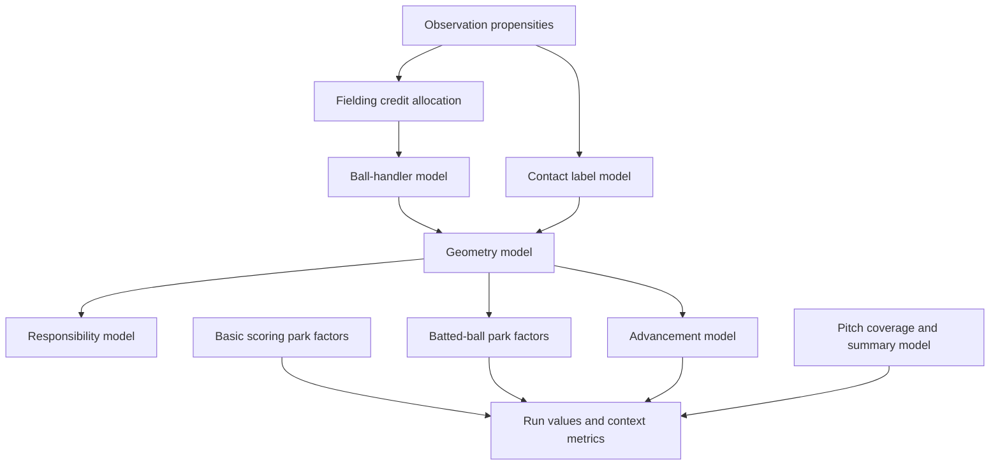

# Hierarchical Models For Data Coverage

## TL;DR

Fit separate hierarchical models whose estimands match the baseball problem: observation propensities, official fielding credit, ball-handler probabilities, latent batted-ball geometry, park effects, run values, advancement, responsibility, and pitch summaries. Each model consumes frozen modeling datasets, prep ledgers, deterministic evidence, and calibrated deep proposals where useful; each model exports probability tables, expected counters, posterior draws, diagnostics, and validation reports.

Do not build one giant joint model first. Use modular models with draw propagation, strong interface contracts, and explicit cut-feedback decisions. Join modules only where downstream data legitimately updates upstream latent quantities.

## Shared Statistical Contract

Every model must specify:

- Estimand and unit.
- Target population.
- Observed data and missingness indicators.
- Latent variables.
- Likelihood and constraints.
- Pooling structure and exchangeability assumptions.
- Priors on interpretable baseball scales.
- Deep-proposal inputs, if any.
- Validation and sensitivity checks.
- Artifact outputs and SQL consumers.

Invariant: posterior means are not raw facts. Probability vectors, posterior draws, and expected counters must carry `model_version`, `source_snapshot_id`, `draw_id` when applicable, `method`, and uncertainty summaries.

## Model Composition



Pass uncertainty forward in one of three ways:

| Interface | Use |
| --- | --- |
| Long probability table | Event categorical quantities such as geometry class, handler, contact label. |
| Posterior draw table | Nonlinear downstream estimates such as park factors, run values, rankings, and interval summaries. |
| Expected counter table | Additive metric inputs when SQL consumers need a compact stable table. |

Use a cut-feedback boundary when a downstream metric should not update upstream measurement parameters. For example, park-factor outcomes should not update scorer label-confusion parameters if the purpose of the scorer model is measurement correction.

## Model A: Scorer And Source Observation

### Estimand

For event `i` and dimension `d`:

```latex
\Pr(R_{i,d} = 1 \mid x_i, s_i, q_i)
```

where `R` is whether the field is observed as source truth, `x_i` is baseball context, `s_i` is scorer/source context, and `q_i` is provenance reliability.

### Likelihood

```latex
R_{i,d} \sim \operatorname{Bernoulli}(p_{i,d})
```

```latex
\operatorname{logit}(p_{i,d}) =
\alpha_d
+ a^{season,league}_{d,t_i,l_i}
+ a^{source}_{d,u_i}
+ a^{scorer}_{d,c_i}
+ a^{park}_{d,p_i}
+ \beta^{result}_{d,r_i}
+ \beta^{hitout}_{d,h_i}
+ \beta^{affil}_{d} A_i
+ \beta^{lev}_{d} L_i
+ \gamma^{dl}_{d} \operatorname{logit}(\tilde p^{dl}_{i,d})
```

`tilde p^{dl}` is optional and must be out-of-fold calibrated before use.

### Pooling

- Season/league effects use a random walk or dynamic hierarchy.
- Scorer, inputter, translator, park, and team-affiliation effects use partial pooling.
- Source family is a fixed or hierarchical effect depending on support.
- Park and scorer effects should be merged or strongly regularized when EDA shows collinearity.

### Priors

- Intercepts centered on observed base rates by dimension.
- Group standard deviations use half-normal priors on logit scale with prior predictive checks.
- Dynamic season effects use small step-scale priors to prevent year-to-year noise from becoming signal.
- Deep-proposal coefficient `gamma_dl` is regularized toward zero so deep models cannot dominate without validation.

### Outputs

| Table | Grain | Contents |
| --- | --- | --- |
| `scorer_observation_propensities` | `event_key, dimension` | Posterior mean and intervals for `P(observed)`, source/scorer effects, and weak-identification flags. |
| `observation_model_draws` | `draw_id, event_key, dimension` | Draw-level propensities for downstream weighting. |
| `observation_model_diagnostics` | run/slice | Calibration, posterior predictive rates, and grouped holdout metrics. |

### Validation

- Prior predictive knownness rates by dimension.
- Scorer holdouts.
- Park holdouts.
- Source-family holdouts.
- Hit/out-specific holdouts.
- MNAR sensitivity for hit location and detailed contact labels.

Block publication when scorer, park, team, and source cannot be separated in the target slice.

## Model B: Contact Label Confusion

### Estimand

Estimate latent broad or detailed contact class `Z_i` and scorer/source label process `L_i`.

```latex
\Pr(Z_i = z \mid x_i)
```

```latex
\Pr(L_i = l \mid Z_i = z, scorer_i, decade_i, source_i)
```

### Likelihood

```latex
Z_i \sim \operatorname{Categorical}(\pi_i)
```

```latex
L_i \mid Z_i \sim \operatorname{Categorical}(\Omega_{z,c_i,t_i})
```

where `Omega` is a scorer/decade confusion matrix.

### Subject-Matter Boundary

Broad `GroundBall` versus `AirBall` is the first publishable target. Detailed fly/line/pop labels are scorer-adjusted label distributions, not claims about measured launch angle.

### Constraints

- Recorded labels are direct measurements of scorer/source vocabulary.
- Deduced labels from `calc_batted_ball_type` are high-confidence measurements with failure modes, not absolute truth.
- Home run labels and high-salience hits need separate sensitivity checks.

### Outputs

- `normalized_contact_probabilities(event_key, contact_class)`.
- `contact_confusion_summaries(scorer, decade, source_family, recorded_label, latent_class)`.
- `contact_expected_counters` for aggregate metrics.

## Model C: Fielding Credit Allocation

### Estimand

For event `e`, eligible player-position `k`, and credit type `c`:

```latex
E[Y_{e,k,c} \mid evidence]
```

where `Y` is official credit such as putout, assist, error, double play, or related fielding stat.

### Likelihood

For unknown putout or assist counts `U_{e,c}`:

```latex
Y_{e,1:K,c} \sim \operatorname{Multinomial}(U_{e,c}, \pi_{e,1:K,c})
```

```latex
\operatorname{softmax}(\eta_{e,k,c}) =
\pi_{e,k,c}
```

```latex
\eta_{e,k,c} =
\alpha_{c,pos_k}
+ \beta^{result}_{c,pos_k,r_e}
+ \beta^{state}_{c,pos_k,b_e,o_e}
+ \beta^{contact}_{c,pos_k,z_e}
+ \beta^{handler}_{c} H_{e,k}
+ a^{teamseason}_{c,pos_k,t_e}
+ a^{scorer}_{c,pos_k,s_e}
+ \gamma^{dl}_{c} \log(\tilde \pi^{dl}_{e,k,c})
```

`H_{e,k}` is handler evidence or a handler probability from the handler model. `tilde pi^{dl}` is an optional calibrated deep proposal.

### Aggregate Constraint Likelihood

When box residuals exist:

```latex
B_{g,k,c} \sim \operatorname{Normal}
\left(
\sum_{e \in g} Y_{e,k,c},
\sigma_{aggregate,c}
\right)
```

Use a tighter `sigma_aggregate` only for clean official aggregate totals. Issue-flagged totals become weak measurements or are excluded.

### Constraints

- Probability mass only goes to personnel-eligible players.
- Expected event putouts reconcile to event outs and unknown putout counts.
- Expected player-game credits reconcile to clean box-score residuals where official aggregate constraints are used.
- Putouts and assists are modeled separately.
- Battery plays, steals, pickoffs, bunts, strikeouts, passed balls, and unusual plays use separate strata or submodels.

### First Implementation

1. Train a known-credit multinomial model on complete events with hard personnel masks.
2. Condition event probabilities on box residual constraints with deterministic constrained optimization or posterior importance weighting.
3. Add direct aggregate constraint likelihood after the first version validates.

### Outputs

| Table | Grain | Contents |
| --- | --- | --- |
| `imputed_fielding_credit` | `event_key, player_id, fielding_position, credit_type` | Expected credit, intervals, source/method/confidence, aggregate-constraint status. |
| `fielding_credit_draws` | `draw_id, event_key, player_id, fielding_position, credit_type` | Draw-level credit when needed. |
| `fielding_credit_expected_counters` | player-game and player-season | Additive expected counters. |

## Model D: Ball Handler

### Estimand

```latex
\Pr(H_i = k \mid event_i, personnel_i, fielding_evidence_i)
```

where `H` is the player or fielding position that handled or completed the play. This is not official credit and not defensive responsibility.

### Likelihood

```latex
H_i \sim \operatorname{Categorical}(\pi_i)
```

```latex
\eta_{i,k} =
\alpha_{pos_k}
+ \beta^{result}_{r_i,pos_k}
+ \beta^{contact}_{z_i,pos_k}
+ \beta^{baseouts}_{b_i,o_i,pos_k}
+ a^{seasonleague}_{t_i,l_i,pos_k}
+ a^{scorer}_{s_i,pos_k}
+ \gamma^{credit} \hat Y_{i,k}
+ \gamma^{dl} \log(\tilde \pi^{dl}_{i,k})
```

### Outputs

- `ball_handler_probabilities(event_key, player_id, fielding_position)`.
- `handler_expected_counters` for geometry and responsibility inputs.

### Validation

- Known handler holdouts by hit/out.
- Era and alignment-regime holdouts.
- Calibration by batter hand, base state, result, and position.

## Model E: Latent Geometry

### Estimand

For event `i` and geometry dimension `d`:

```latex
\Pr(G_{i,d} = g \mid recorded_i, deduced_i, handler_i, scorer_i, era_i, context_i)
```

Dimensions:

- `trajectory_broad`
- `trajectory_detail`
- `location_side`
- `location_depth`
- `location_edge`
- `region`

### Measurement Model

```latex
G_{i,d} \sim \operatorname{Categorical}(\pi_{i,d})
```

```latex
Recorded_{i,d} \mid G_{i,d}, scorer_i, era_i \sim
\operatorname{Categorical}(\Omega_{d,G_{i,d},scorer_i,era_i})
```

```latex
Deduced_{i,d} \mid G_{i,d}, rule_i \sim
\operatorname{Categorical}(\Delta_{d,G_{i,d},rule_i})
```

`Delta` should be strongly concentrated for high-confidence deterministic rules and weaker for known failure modes such as shifted fielder-to-location mappings or 2000-2002 shallow outfield cases.

### Predictor Structure

```latex
\eta_{i,g,d} =
\alpha_{d,g}
+ a^{seasonleague}_{d,g,t_i,l_i}
+ a^{park}_{d,g,p_i}
+ a^{scorer}_{d,g,s_i}
+ \beta^{hand}_{d,g,bh_i}
+ \beta^{state}_{d,g,b_i,o_i}
+ \beta^{handler}_{d,g} P(H_i)
+ \beta^{alignment}_{d,g,A_i}
+ \gamma^{dl}_{d,g} \log(\tilde \pi^{dl}_{i,g,d})
```

### Outputs

| Table | Grain | Contents |
| --- | --- | --- |
| `imputed_batted_ball_geometry` | `event_key, geometry_dimension, class` | Recorded, deduced, estimated probability, intervals, method. |
| `geometry_draws` | `draw_id, event_key, geometry_dimension, class` | Draw-level class probabilities. |
| `geometry_expected_counters` | metric grain | Additive expected counters. |

### Validation

- Hold out known locations for hits and outs separately.
- Hold out scorers and scorer-team affiliations.
- Train/test within alignment regimes before cross-regime transfer.
- Compare raw, deduced, deep proposal, and posterior probabilities.
- Stress-test source-pattern slices called out in existing docs.

## Model F: Park Factors

### Estimand

For park `p`, season `t`, league `l`, and outcome `o`:

```latex
\theta_{p,t,l,o}
```

is the counterfactual log rate ratio or log odds ratio for the same batter/pitcher/context mix in that park versus neutral or league-average context.

### Event Outcome Model

For binary outcomes:

```latex
y_{i,o} \sim \operatorname{Bernoulli}(\operatorname{logit}^{-1}(\mu_{i,o}))
```

```latex
\mu_{i,o} =
\alpha_{t_i,l_i,o}
+ b_{batter_i,o}
+ p_{pitcher_i,o}
+ \beta^{hand}_{o,bh_i,ph_i}
+ \beta^{state}_{o,state_i}
+ \beta^{team}_{o,team_i}
+ \theta_{park_i,t_i,l_i,o}
+ \gamma^{obs}_{o} \hat R_{i,o}
```

For runs:

```latex
r_g \sim \operatorname{NegativeBinomial}(\lambda_g, \phi)
```

```latex
\log(\lambda_g) =
\log(exposure_g)
+ \alpha_{season_g,league_g}
+ team\_offense_{team_g}
+ opponent\_pitching_{opp_g}
+ \theta_{park_g,season_g,league_g}
```

### Dynamic Park Prior

```latex
\theta_{p,t,l,o} \sim \operatorname{Normal}
(\rho_o \theta_{p,t-1,l,o}, \sigma_{park,o})
```

Park episodes can add another level:

```latex
\theta_{p,t,l,o} =
\theta^{identity}_{park\_episode(p,t),o}
+ \theta^{season}_{p,t,l,o}
```

### Deep Inputs

Use deep embeddings or residual proposals only after cross-fitting:

- `park_embedding`
- `batter_embedding`
- `pitcher_embedding`
- `scorer_embedding` for batted-ball outcomes

Regularize embedding coefficients strongly. If embeddings predict source/scorer identity better than baseball outcomes, use them only for diagnostics.

### Outputs

- `park_factor_posterior(park_id, park_episode_id, season, league, outcome, draw_id, log_factor)`.
- `park_factor_summary` with mean, median, interval columns, weak-identification flags, and compatibility rounded factors.
- `park_factor_validation` by park-season/outcome.

## Model G: Run Expectancy And Linear Weights

### Estimand

```latex
V_{state,t,l} = E[runs\_to\_end \mid state, season=t, league=l]
```

Play values are generated quantities:

```latex
\Delta_i = runs\_on\_play_i + V_{end(i),t_i,l_i} - V_{start(i),t_i,l_i}
```

### Likelihood

```latex
runs\_to\_end_i \sim \operatorname{NegativeBinomial}
(\lambda_{state_i,t_i,l_i}, \phi)
```

```latex
\log(\lambda_{state,t,l}) =
\alpha_{state}
+ a^{seasonleague}_{state,t,l}
+ a^{park}_{state,park}
```

Start with run expectancy, then add win expectancy after inning, score, home/away, walk-off, suspended, and game-length policies validate.

### Outputs

- `run_expectancy_posterior(state, season, league, draw_id, value)`.
- `linear_weight_posterior(play_type, season, league, draw_id, value)`.
- `linear_weight_summary` with intervals and sparse-state flags.

## Model H: Advancement

### Estimand

For runner opportunity `i`:

```latex
\Pr(A_i = a \mid pre\_state_i, geometry_i, runner_i, fielder_i, park_i, era_i)
```

where `A_i` is an advancement category or bases/outs outcome.

### Likelihood

```latex
A_i \sim \operatorname{Categorical}(\pi_i)
```

```latex
\eta_{i,a} =
\alpha_{a,base_i,outs_i}
+ \beta^{score}_{a,score_i}
+ \beta^{geometry}_{a} G_i
+ \beta^{park}_{a,park_i}
+ runner_{a,runner_i}
+ fielder_{a,fielder_i,pos_i}
+ team_{a,team_i}
+ seasonleague_{a,t_i,l_i}
```

### Guardrails

- Do not condition the first advancement model on post-advancement labels that encode success.
- Fit context-only models before player effects.
- Pass geometry uncertainty as draws or probability vectors.
- Tag runner/fielder effects as weak when geometry dominates uncertainty.

## Model I: Fielding Responsibility

### Estimand

```latex
\Pr(Responsible_i = k \mid G_i, alignment_i, batter\_hand_i, base\_out_i, personnel_i)
```

This is an analytical opportunity model, not an official-credit model.

### Model Shape

- Use geometry posterior draws.
- Use alignment-regime priors.
- Separate infield, outfield, pitcher/catcher, bunt, deflection, and unusual-play mechanisms.
- Use high-coverage location slices for validation, not as universal truth.

### Outputs

- `fielder_responsibility_probabilities(event_key, player_id, fielding_position)`.
- `responsibility_expected_counters` for range-style metrics.

Invariant: responsibility probabilities never rewrite official putouts, assists, errors, or double plays.

## Model J: Pitch Coverage And Summary

### Estimands

- `P(count observed | source/context)`
- `P(sequence observed | source/context)`
- `P(pitch_summary | result, count, batter, pitcher, era, source)`

### First Model

Fit coverage and summary-count models before ordered sequence generation:

```latex
R^{pitch}_i \sim \operatorname{Bernoulli}(p_i)
```

```latex
summary_i \sim p(summary \mid plate\_appearance\_result_i, count_i, era_i, batter_i, pitcher_i)
```

Full sequence generation is a later model because it must preserve count, plate appearance result, pickoffs, pitchouts, wild pitches, passed balls, stolen-base attempts, and baserunning coupling.

## PyMC Builder Pattern

Model code should be small, named by estimand, and built from prepared arrays:

```python
from __future__ import annotations

from dataclasses import dataclass

import numpy as np
import pymc as pm


@dataclass(frozen=True)
class ObservationData:
    y: np.ndarray
    season_idx: np.ndarray
    scorer_idx: np.ndarray
    source_idx: np.ndarray
    dl_logit: np.ndarray
    coords: dict[str, list[str]]


def build_observation_model(data: ObservationData) -> pm.Model:
    with pm.Model(coords=data.coords) as model:
        y = pm.Data("y", data.y, dims="event")
        season_idx = pm.Data("season_idx", data.season_idx, dims="event")
        scorer_idx = pm.Data("scorer_idx", data.scorer_idx, dims="event")
        source_idx = pm.Data("source_idx", data.source_idx, dims="event")
        dl_logit = pm.Data("dl_logit", data.dl_logit, dims="event")

        alpha = pm.Normal("alpha", 0.0, 1.5)
        sigma_season = pm.HalfNormal("sigma_season", 0.5)
        sigma_scorer = pm.HalfNormal("sigma_scorer", 0.7)
        sigma_source = pm.HalfNormal("sigma_source", 0.7)

        z_season = pm.Normal("z_season", 0.0, 1.0, dims="season")
        z_scorer = pm.Normal("z_scorer", 0.0, 1.0, dims="scorer")
        z_source = pm.Normal("z_source", 0.0, 1.0, dims="source")
        beta_dl = pm.Normal("beta_dl", 0.0, 0.5)

        eta = (
            alpha
            + z_season[season_idx] * sigma_season
            + z_scorer[scorer_idx] * sigma_scorer
            + z_source[source_idx] * sigma_source
            + beta_dl * dl_logit
        )

        p = pm.Deterministic("p_observed", pm.math.sigmoid(eta), dims="event")
        pm.Bernoulli("observed", p=p, observed=y, dims="event")

    return model
```

This skeleton is not the final formula. It shows required mechanics: named dimensions, data outside the model block, non-centered group effects, explicit deep-proposal coefficient, and generated quantities.

## Sampling And Approximation Strategy

| Model | First implementation | Full implementation |
| --- | --- | --- |
| Observation | Aggregated binomial where possible; event-level for key covariates. | Dynamic hierarchy with scorer/source/park effects and MNAR sensitivity. |
| Fielding credit | Trained multinomial probabilities plus constrained allocation. | Joint event plus aggregate residual likelihood. |
| Geometry | Categorical model with deterministic measurement reliability. | Joint handler/contact/geometry measurement model. |
| Park factors | Outcome-specific hierarchical GLM. | Multivariate correlated park-season effects. |
| Run values | Hierarchical run expectancy. | Run and win expectancy with posterior draw propagation. |
| Advancement | Context-only categorical model. | Geometry-draw-aware runner/fielder effects. |
| Pitch summary | Coverage and summary counts. | Ordered sequence generation. |

Use aggregated likelihoods for group counts when event-level predictors are not essential. Use event-level likelihoods only where the estimand needs event context.

## Validation Gates

Every model must pass:

- Prior predictive checks on baseball-scale rates/counts.
- Simulated-data recovery for latent quantities.
- Sampler diagnostics or approximation diagnostics.
- Posterior predictive checks by source, era, scorer, park, team, player role, and missingness regime.
- Grouped holdouts matching the missingness mechanism.
- Calibration curves for probability outputs.
- Conservation audits for official aggregate constraints.
- Sensitivity to priors, MNAR assumptions, deep-proposal inputs, and artifact downweighting.

Block SQL ingestion when diagnostics fail. Failed models can still write exploratory artifacts, but those artifacts should not be joined into production metric models.

## Artifact Outputs

```text
artifacts/statistical/<model_name>/<model_version>/
  dataset/
    dataset.parquet
    dataset_metadata.json
  inference/
    posterior.nc
    posterior_predictive.nc
    prior_predictive.nc
  exports/
    probability_table.parquet
    expected_counters.parquet
    posterior_summary.parquet
    diagnostics.parquet
    validation_report.md
  manifest.json
```

The manifest must include:

- Source snapshot and query hashes.
- Dataset schema and category maps.
- Model formula and prior config.
- Deep artifact versions used as inputs.
- Random seeds.
- Package versions.
- Sampler settings and diagnostics.
- Validation status and blocking findings.
