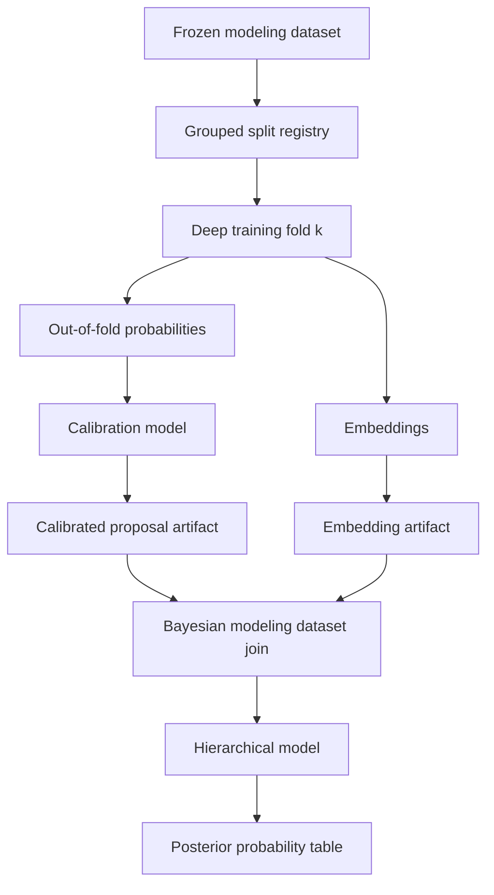

# Deep Learning Supplements For Imputation

## TL;DR

Use deep learning as a supplement, not an authority layer. Deep models should produce calibrated out-of-fold probability vectors, embeddings, proposal distributions, and residual diagnostics that feed hierarchical models as uncertain inputs. They should not publish argmax labels, resolve official credits, override personnel constraints, decide source data-error risk, or replace Bayesian uncertainty.

The useful integration pattern is cross-fitted deep output -> calibration -> provenance and constraint checks -> hierarchical model coefficient or prior -> posterior model output. This lets flexible models discover interactions while the final statistical layer preserves source authority, baseball constraints, calibration, and uncertainty.

## Current ML Surface

The repo already has a Keras 3 + PyTorch + MLflow pipeline under `bc/python_models/ml/`. Current traits to preserve:

| Existing surface | Current role |
| --- | --- |
| `bc/python_models/ml/features.py` | Defines high-cardinality embeddings, low-cardinality categories, numeric columns, and `TargetSpec`. |
| `bc/python_models/ml/training.py` | Streams `ml_features`, builds vocabularies on the training partition, trains Keras models, and pins versioned outputs. |
| `bc/models/intermediate/machine_learning/ml_features.sql` | Event-level feature table with target columns and train/test split. |
| `predictions_*` SQLMesh Python models | Gate prediction materialization on versioned output existence. |

The coverage implementation should reuse the versioned-output gating idea and the streaming/batching pattern. It should not reuse the current `ml_features` table blindly, because imputation models need provenance, observed-status, source, data-error risk, and split metadata columns that the current ML feature table does not carry.

Invariant: a deep model trained on observed labels learns the observed label process unless the modeling dataset, split, calibration, and downstream model explicitly correct for source and scorer bias.

## Where Deep Learning Helps

| Supplement | Candidate targets | Output consumed by Bayesian model |
| --- | --- | --- |
| Proposal distributions | Contact class, location side/depth, handler, advancement category, pitch summary. | `dl_logit` or `log(dl_probability)` with regularized coefficient. |
| Embeddings | Batter, pitcher, runner, fielder, park, scorer, team, era. | Low-dimensional covariates or hierarchical prior features. |
| Residual discovery | Park-factor residuals, geometry misses, advancement misses, fielding allocation errors. | Candidate interactions for EDA and formulas. |
| Sequence baseline | Pitch sequence summaries and optional ordered pitch strings. | Calibrated sequence-summary probabilities, not canonical sequences. |
| Anomaly scoring | Source/parser data errors, unusual box/event residuals, impossible context rows. | Diagnostic flags for review, not automatic exclusion. |

Where deep learning should not lead:

- Official fielding credit allocation.
- Box-residual reconciliation.
- Entity linkage and personnel eligibility.
- Source data-error risk decisions.
- Exposure and denominator policy.
- Official scoring convention regimes.

## Integration Architecture



The split registry is the key. Bayesian models should consume out-of-fold deep predictions for rows used in fitting; otherwise deep predictions become in-sample target encodings.

## Cross-Fitting Contract

For each target:

1. Build a modeling dataset with `fold_id`, `split_family`, `holdout_regime`, `source_snapshot_id`, and target-specific `can_train_as_truth`.
2. For each fold `k`, train the deep model on rows where `fold_id != k` and `split_family = 'TRAIN'`.
3. Predict rows where `fold_id = k`, plus validation/test holdouts.
4. Calibrate predictions using validation folds that match the target failure mode.
5. Export a long probability table with one row per entity/class.
6. Join the probability table back into Bayesian modeling datasets by `artifact_id`, key columns, and class.

Invariant: Bayesian training rows must receive out-of-fold deep proposals. In-sample deep probabilities are allowed only for posterior predictive diagnostics, never as training covariates.

## Output Tables

### `dl_proposal_probabilities`

| Field | Meaning |
| --- | --- |
| `artifact_id` | Deep model artifact ID. |
| `target_name` | `geometry_side`, `trajectory_broad`, `handler_position`, `advancement_category`, etc. |
| `grain_key` | Serialized event/player key or explicit key columns in model-specific views. |
| `event_key` | Event key when applicable. |
| `player_id` | Player key when applicable. |
| `fielding_position` | Position key when applicable. |
| `class_name` | Target class. |
| `raw_probability` | Model softmax/sigmoid output before calibration. |
| `calibrated_probability` | Post-calibration probability. |
| `log_probability` | Clipped log probability for Bayesian model input. |
| `fold_id` | Producing fold. |
| `prediction_scope` | `out_of_fold`, `validation`, `test`, `full_fit`. |
| `calibration_status` | `passed`, `weak_slice`, `failed`, `not_evaluated`. |

### `dl_embedding_vectors`

| Field | Meaning |
| --- | --- |
| `artifact_id` | Embedding model artifact ID. |
| `entity_type` | `batter`, `pitcher`, `runner`, `fielder`, `park`, `scorer`, `team`, `era`. |
| `entity_id` | Entity key. |
| `embedding_index` | Stable coordinate index. |
| `embedding_value` | Numeric value. |
| `fold_id` | Producing fold if cross-fitted. |
| `source_snapshot_id` | Source dataset snapshot. |

Embeddings should usually be joined through stable embedding IDs or a vector artifact path, not exploded into many SQL columns unless the vector is small.

### `dl_calibration_report`

| Field | Meaning |
| --- | --- |
| `artifact_id` | Deep model artifact ID. |
| `target_name` | Target name. |
| `slice_name` | Era, scorer, source, hit/out, park, alignment regime, or missingness slice. |
| `n` | Rows in slice. |
| `log_loss` | Probabilistic accuracy. |
| `brier_score` | Calibration-sensitive score. |
| `ece` | Expected calibration error. |
| `max_calibration_gap` | Worst reliability-bin gap. |
| `status` | `passed`, `weak`, `failed`. |

## Target Candidates

### Geometry Proposal

Inputs:

- `event_observation_context`
- deterministic `calc_batted_ball_type` outputs
- fielding/handler evidence
- source/scorer context
- batter/pitcher/park/team embeddings
- alignment regime

Outputs:

- `P(trajectory_broad)`
- `P(location_side)`
- `P(location_depth)`
- `P(location_edge)`
- `P(region)`

Bayesian use:

```latex
\eta_{i,g} =
\eta^{explicit}_{i,g}
+ \gamma_g \log(\tilde p^{dl}_{i,g})
```

where `gamma_g` gets a shrinkage prior and `tilde p` is calibrated out-of-fold probability.

### Fielding Credit Proposal

Inputs:

- event context
- personnel state
- complete known-credit examples
- box residual state
- broad contact and geometry evidence

Outputs:

- `P(putout player-position)`
- `P(assist player-position)`
- optional `P(error player-position)` for subsets with enough support

Bayesian use:

- proposal probabilities in the multinomial allocation linear predictor.
- no direct authority over aggregate residual constraints.

Guardrail: proposal mass must be zeroed for ineligible personnel before calibration or before Bayesian ingestion.

### Advancement Proposal

Inputs:

- base/out/score state
- runner, batter, fielder, team, park, season
- geometry probabilities
- result family

Outputs:

- category probabilities for runner advancement or bases/outs outcome.

Bayesian use:

- benchmark for context-only advancement model.
- proposal covariate after out-of-fold calibration.

Guardrail: do not train on post-treatment result labels that encode the advancement target for the first model.

### Park And Player Embeddings

Inputs:

- event outcomes from high-coverage modeling datasets
- regular-season filters and source/artifact masks
- batter, pitcher, park, team, scorer, era IDs

Outputs:

- entity embeddings.
- residual diagnostics for unmodeled interactions.

Bayesian use:

- optional covariates for park or geometry models.
- prior mean features for player/park random effects only after sensitivity checks.

Guardrail: run an adversarial diagnostic that predicts source family or scorer from embeddings. Embeddings that strongly encode source-specific collection patterns should be diagnostic-only.

## Model Sketch

A shared multi-head proposal model can cover several categorical targets, but first implementations should keep target-specific wrappers so calibration and splits are explicit.

```python
from __future__ import annotations

from dataclasses import dataclass

import keras


@dataclass(frozen=True)
class DeepTarget:
    name: str
    classes: tuple[str, ...]
    loss: str
    weight_column: str


def build_proposal_model(
    numeric_dim: int,
    low_card_dim: int,
    high_card_vocab_sizes: dict[str, int],
    embedding_dim: int,
    target: DeepTarget,
) -> keras.Model:
    numeric = keras.Input(shape=(numeric_dim,), name="numeric")
    low_card = keras.Input(shape=(low_card_dim,), name="low_card")
    high_inputs = {
        name: keras.Input(shape=(1,), dtype="int32", name=name)
        for name in high_card_vocab_sizes
    }
    embeddings = []
    for name, size in high_card_vocab_sizes.items():
        emb = keras.layers.Embedding(size, embedding_dim, name=f"{name}_embedding")(high_inputs[name])
        embeddings.append(keras.layers.Flatten()(emb))
    x = keras.layers.Concatenate()([numeric, low_card, *embeddings])
    x = keras.layers.Dense(256, activation="relu")(x)
    x = keras.layers.Dropout(0.15)(x)
    x = keras.layers.Dense(128, activation="relu")(x)
    output = keras.layers.Dense(len(target.classes), activation="softmax", name=target.name)(x)
    model = keras.Model(inputs={"numeric": numeric, "low_card": low_card, **high_inputs}, outputs=output)
    model.compile(optimizer="adam", loss=target.loss, metrics=["accuracy"])
    return model
```

The production version should reuse the existing `TargetSpec` pattern or extend it into a coverage-specific `DeepTargetSpec` that includes provenance fields, target-population filters, split policy, calibration slices, and output table names.

## Calibration

Use calibration per target and per failure-prone slice.

Candidate calibrators:

- Temperature scaling for multiclass probabilities.
- Isotonic regression for binary or one-vs-rest outputs when enough data exists.
- Dirichlet calibration for multiclass outputs after validation.
- Hierarchical calibration curves by era/source/scorer for sparse slices.

Code sketch:

```python
from __future__ import annotations

from dataclasses import dataclass

import numpy as np
from sklearn.isotonic import IsotonicRegression


@dataclass(frozen=True)
class BinaryCalibrator:
    target_name: str
    class_name: str
    model: IsotonicRegression


def fit_binary_isotonic(probability: np.ndarray, observed: np.ndarray, target_name: str, class_name: str) -> BinaryCalibrator:
    model = IsotonicRegression(out_of_bounds="clip")
    model.fit(probability, observed)
    return BinaryCalibrator(target_name=target_name, class_name=class_name, model=model)
```

Calibration reports should block downstream use if reliability curves fail in key slices even when global metrics look strong.

## Hierarchical Model Inputs

Deep outputs enter Bayesian models in controlled forms:

| Deep output | Bayesian input | Prior |
| --- | --- | --- |
| Calibrated class probability | `log(p)` or `logit(p)` covariate | Coefficient shrunk toward zero. |
| Embedding vector | Low-dimensional covariate or group-level predictor | Coefficients use shrinkage priors. |
| Deep residual score | Candidate interaction or diagnostic flag | Not used until EDA validates mechanism. |
| Sequence proposal | Proposal distribution for constrained model | Constrained by count/result rules. |

Example:

```latex
\eta_{i,k} =
\eta^{domain}_{i,k}
+ \gamma_k \log(\tilde p^{dl}_{i,k})
```

```latex
\gamma_k \sim \operatorname{Normal}(0, 0.5)
```

The Bayesian posterior should be allowed to ignore the deep model when it is unhelpful or biased.

## Leakage And Bias Audits

Required audits:

| Audit | Method |
| --- | --- |
| Group leakage | Verify all rows from a `game_id` are in one fold. |
| Source leakage | Hold out source family or source era and compare calibration. |
| Scorer leakage | Hold out scorers/inputters/translators. |
| Artifact learning | Compare predictions on issue-flagged and clean rows. |
| Embedding source fingerprint | Train a probe to predict source/scorer from embeddings. |
| Argmax temptation | Ensure SQL artifact views expose probability vectors, not only max class. |
| Constraint violation | Apply personnel, box, count, and base/out constraints after proposal. |

Probe sketch:

```python
from __future__ import annotations

import polars as pl
from sklearn.linear_model import LogisticRegression
from sklearn.metrics import roc_auc_score


def source_probe_auc(embeddings: pl.DataFrame, source_labels: pl.Series) -> float:
    x = embeddings.to_numpy()
    y = source_labels.to_numpy()
    clf = LogisticRegression(max_iter=500)
    clf.fit(x, y)
    p = clf.predict_proba(x)[:, 1]
    return float(roc_auc_score(y, p))
```

If embeddings predict source family or scorer too well, they can still be useful diagnostics, but they should not be fed into official coverage models without a sensitivity study.

## Artifact Gate

SQLMesh ingestion should mirror existing ML prediction gates:

```python
from __future__ import annotations

from pathlib import Path

import pandas as pd
from sqlmesh import ExecutionContext, model


ARTIFACT_ROOT = Path("artifacts/statistical/deep")


def artifact_exists(target_name: str, artifact_id: str) -> bool:
    return (ARTIFACT_ROOT / target_name / artifact_id / "exports" / "probabilities.parquet").exists()


@model(
    "main_models.dl_geometry_proposals",
    kind="FULL",
    columns={
        "event_key": "UINTEGER",
        "geometry_dimension": "VARCHAR",
        "class_name": "VARCHAR",
        "calibrated_probability": "DOUBLE",
        "artifact_id": "VARCHAR",
    },
)
def execute(context: ExecutionContext, **kwargs) -> pd.DataFrame:
    artifact_id = context.var("dl_geometry_artifact_id")
    if not artifact_exists("geometry", artifact_id):
        return pd.DataFrame(
            columns=["event_key", "geometry_dimension", "class_name", "calibrated_probability", "artifact_id"]
        )
    path = ARTIFACT_ROOT / "geometry" / artifact_id / "exports" / "probabilities.parquet"
    return context.fetchdf(f"SELECT * FROM read_parquet('{path}')")
```

Production code should use the shared artifact manifest and path resolver from `05-runtime-artifacts-and-library.md`; the sketch shows the gating behavior.

## Acceptance Criteria

Deep supplements are ready for hierarchical consumption when:

- Predictions are out-of-fold for Bayesian training rows.
- Calibration passes by era, scorer/source, hit/out, missingness pattern, and target class.
- Probability tables normalize within key/class groups.
- Personnel and structural masks are applied before fielding proposal probabilities reach Bayesian modeling datasets.
- Embedding probes and sensitivity checks are documented.
- Simple baselines and existing deterministic rules remain in the validation report.
- No downstream SQL table exposes only an argmax class for a probabilistic target.
