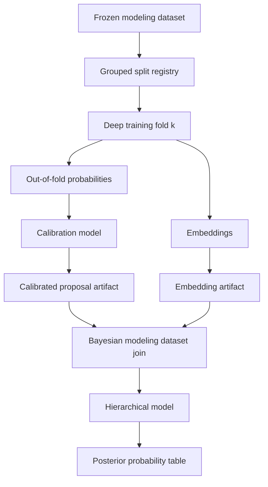

# Deep Learning Supplements For Imputation

## Phase-3 v6 rearchitecture (2026-05-16)

This document predates the v6 rearchitecture and remains the
canonical design intent. Three invariants now constrain every
DL supplement registered under
`bc/python_models/statistical/deep/targets/`:

1. **Pre-event input layouts only.** The `FeatureLayout` for each
   spec may contain only features observable at inference time. Post-
   event / outcome-correlated columns are forbidden — see
   [`bc/python_models/statistical/CLAUDE.md`](../../bc/python_models/statistical/CLAUDE.md#phase-3-v6-invariants)
   and the deny-list in `feature_layout.validate_pre_event`. v5's
   trajectory model included `fielder_chain` and shortcuts to it
   (perm-imp Δ_CE +1.16); the model never learned entity priors, and
   v5 acceptance gates missed. v6 strips the layouts and the trajectory
   batter signal rebounds from +0.015 → +0.053.
2. **Non-redundant pretrain pretext heads.** v6 pretrain ships 11
   non-redundant heads (`EVENT_UNIVERSE_HEADS_V6`). Drops `result_family`
   (deterministic 9-class grouping of `pa_result`) and `hit_or_out`
   (binary derivable from `pa_result`) — both let the trunk reuse
   `pa_result` statistics instead of forcing entity-embedding signal.
   Remaining 11 still correlate (e.g. `runs/outs_on_play` with
   `pa_result`; `batted_location_*` with `trajectory_remapped`;
   `r1/r2/r3_advancement` with outs/runs) but each carries residual
   variance the trunk has to learn. Not orthogonal — just
   no-deterministic-derivation.
3. **Time-forward gate eval.** Per-supplement acceptance gates
   (perm-imp Δ_CE per entity, v6-pretrained vs no-pretrain baseline)
   run on `time_forward_fold = 'VALIDATE'` (season = 2023). Training
   still uses `primary_fold` (HASH(game_id)) to maximize data. Gates
   table: [`phase3-acceptance-gates-v6.md`](phase3-acceptance-gates-v6.md).

`park_factors` and `run_values` remain Phase-4 hierarchical-Bayes
targets, not DL specs, per §"Where Deep Learning Helps" below.

## TL;DR

Use deep learning as a supplement, not an authority layer. Deep models should produce calibrated out-of-fold probability vectors, embeddings, proposal distributions, and residual diagnostics that feed hierarchical models as uncertain inputs. They should not publish argmax labels, resolve official credits, override personnel constraints, decide source data-error risk, or replace Bayesian uncertainty.

The useful integration pattern is cross-fitted deep output -> calibration -> provenance and constraint checks -> hierarchical model coefficient or prior -> posterior model output. This lets flexible models discover interactions while the final statistical layer preserves source authority, baseball constraints, calibration, and uncertainty.

## Current ML Surface

The repo already has a Keras 3 + PyTorch + MLflow pipeline under `bc/python_models/ml/`. Current traits to preserve:

| Existing surface | Current role |
| --- | --- |
| `bc/python_models/ml/features.py` | Defines high-cardinality embeddings, low-cardinality categories, numeric columns, and `TargetSpec`. |
| `bc/python_models/ml/training.py` | Streams `ml_features`, builds vocabularies on the training partition, trains Keras models, and pins versioned outputs. |
| `bc/models/intermediate/machine_learning/ml_features.sql` | Event-level feature table with target columns and train/test split. |
| `predictions_*` SQLMesh Python models | Gate prediction materialization on versioned output existence. |

The coverage implementation should reuse the versioned-output gating idea and the streaming/batching pattern. It should not reuse the current `ml_features` table blindly, because imputation models need provenance, observed-status, source, data-error risk, and split metadata columns that the current ML feature table does not carry.

Invariant: a deep model trained on observed labels learns the observed label process unless the modeling dataset, split, calibration, and downstream model explicitly correct for source and scorer bias.

## Where Deep Learning Helps

| Supplement | Candidate targets | Output consumed by Bayesian model |
| --- | --- | --- |
| Proposal distributions | Contact class, location side/depth, handler, advancement category, pitch summary. | `dl_logit` or `log(dl_probability)` with regularized coefficient. |
| Embeddings | Batter, pitcher, runner, fielder, park, scorer, team, era. | Low-dimensional covariates or hierarchical prior features. |
| Residual discovery | Park-factor residuals, geometry misses, advancement misses, fielding allocation errors. | Candidate interactions for EDA and formulas. |
| Sequence baseline | Pitch sequence summaries and optional ordered pitch strings. | Calibrated sequence-summary probabilities, not canonical sequences. |
| Anomaly scoring | Source/parser data errors, unusual box/event residuals, impossible context rows. | Diagnostic flags for review, not automatic exclusion. |

Where deep learning should not lead:

- Official fielding credit allocation.
- Box-residual reconciliation.
- Entity linkage and personnel eligibility.
- Source data-error risk decisions.
- Exposure and denominator policy.
- Official scoring convention regimes.

## Integration Architecture



The split registry is the key. Bayesian models should consume out-of-fold deep predictions for rows used in fitting; otherwise deep predictions become in-sample target encodings.

## Cross-Fitting Contract

For each target:

1. Build a modeling dataset with `fold_id`, `split_family`, `holdout_regime`, `source_snapshot_id`, and target-specific `can_train_as_truth`.
2. For each fold `k`, train the deep model on rows where `fold_id != k` and `split_family = 'TRAIN'`.
3. Predict rows where `fold_id = k`, plus validation/test holdouts.
4. Calibrate predictions using validation folds that match the target failure mode.
5. Export a long probability table with one row per entity/class.
6. Join the probability table back into Bayesian modeling datasets by `artifact_id`, key columns, and class.

Invariant: Bayesian training rows must receive out-of-fold deep proposals. In-sample deep probabilities are allowed only for posterior predictive diagnostics, never as training covariates.

## Ablation Contract

Each downstream Bayesian model that consumes a DL proposal is fit twice:

- once with `gamma_dl = 0` (the DL covariate is omitted from the linear predictor entirely).
- once with `gamma_dl ~ Normal(0, 0.5)` (the shrinkage prior described in the hierarchical model inputs section).

Both posteriors are written under the same `model_name` with distinct `artifact_id`s and a manifest field `ablation_status in {gamma_dl_zero, gamma_dl_shrunk}` (schema lives in `05-runtime-artifacts-and-library.md`). Per-model publication tier is chosen by comparing posterior change magnitude on target slices: if including the DL covariate shifts publication-tier random-effect posteriors by more than 0.25 SD on most scorer/park/era cells, the `gamma_dl_zero` flavor is published (interpreted as DL absorbing scorer/source signal — leakage risk) and the proposal is recorded as diagnostic-only for that model; otherwise the `gamma_dl_shrunk` flavor is published (DL adds incremental lift without contaminating the hierarchy). Threshold and direction must match 03-hierarchical-models.md and 06-rollout-and-validation.md.

Implication for this doc: DL proposal artifacts must be **loadable without affecting the Bayes prior structure**. The proposal is consumed conditionally by the Bayes layer — the deep training and export code never assumes the proposal will be used downstream. Proposal artifacts are written independent of any per-Bayes-model decision; the ablation is a property of how the Bayes model is configured at fit time, not of the DL artifact.

## Output Tables

### `dl_proposal_probabilities`

| Field | Meaning |
| --- | --- |
| `artifact_id` | Deep model artifact ID (UUID per fit; see `05-runtime-artifacts-and-library.md` versioning glossary). |
| `target_name` | `geometry_side`, `trajectory_broad`, `handler_position`, `advancement_category`, etc. |
| `event_key` | Event key when applicable. |
| `player_id` | Player key when applicable. |
| `fielding_position` | Position key when applicable. |
| `class_name` | Target class. |
| `raw_probability` | Model softmax/sigmoid output before calibration. |
| `calibrated_probability` | Post-calibration probability. |
| `log_probability` | Clipped log probability for Bayesian model input. |
| `fold_id` | Producing fold. |
| `prediction_scope` | `out_of_fold`, `validation`, `test`, `full_fit`. |
| `calibration_status` | `passed`, `weak_slice`, `failed`, `not_evaluated`. |

### `dl_embedding_vectors`

| Field | Meaning |
| --- | --- |
| `artifact_id` | Embedding model artifact ID. |
| `entity_type` | `batter`, `pitcher`, `runner`, `fielder`, `park`, `scorer`, `team`, `era`. |
| `entity_id` | Entity key. |
| `embedding_index` | Stable coordinate index. |
| `embedding_value` | Numeric value. |
| `fold_id` | Producing fold if cross-fitted. |
| `source_snapshot_id` | Source dataset snapshot. |

Embeddings should usually be joined through stable embedding IDs or a vector artifact path, not exploded into many SQL columns unless the vector is small.

### `dl_calibration_report`

| Field | Meaning |
| --- | --- |
| `artifact_id` | Deep model artifact ID. |
| `target_name` | Target name. |
| `slice_name` | Era, scorer, source, hit/out, park, alignment regime, or missingness slice. |
| `n` | Rows in slice. |
| `log_loss` | Probabilistic accuracy. |
| `brier_score` | Calibration-sensitive score. |
| `ece` | Expected calibration error. |
| `max_calibration_gap` | Worst reliability-bin gap. |
| `status` | `passed`, `weak`, `failed`. |

## Target Candidates

### Geometry Proposal

Inputs:

- `event_observation_context`
- deterministic `calc_batted_ball_type` outputs
- fielding/handler evidence
- source/scorer context
- batter/pitcher/park/team embeddings
- alignment regime

Outputs:

- `P(trajectory_broad)`
- `P(location_side)`
- `P(location_depth)`
- `P(location_edge)`
- `P(region)`

Bayesian use:

```latex
\eta_{i,g} =
\eta^{explicit}_{i,g}
+ \gamma_g \log(\tilde p^{dl}_{i,g})
```

where `gamma_g` gets a shrinkage prior and `tilde p` is calibrated out-of-fold probability.

### Fielding Credit Proposal

Inputs:

- event context
- personnel state
- complete known-credit examples
- box residual state
- broad contact and geometry evidence

Outputs:

- `P(putout player-position)`
- `P(assist player-position)`
- optional `P(error player-position)` for subsets with enough support

Bayesian use:

- proposal probabilities in the multinomial allocation linear predictor.
- no direct authority over aggregate residual constraints.

Guardrail: proposal mass must be zeroed for ineligible personnel before calibration or before Bayesian ingestion.

### Advancement Proposal

Inputs:

- base/out/score state
- runner, batter, fielder, team, park, season
- geometry probabilities
- result family

Outputs:

- category probabilities for runner advancement or bases/outs outcome.

Bayesian use:

- benchmark for context-only advancement model.
- proposal covariate after out-of-fold calibration.

Guardrail: do not train on post-treatment result labels that encode the advancement target for the first model.

### Park And Player Embeddings

Inputs:

- event outcomes from high-coverage modeling datasets
- regular-season filters and source/data-error masks
- batter, pitcher, park, team, scorer, era IDs

Outputs:

- entity embeddings.
- residual diagnostics for unmodeled interactions.

Bayesian use:

- optional covariates for park or geometry models.
- prior mean features for player/park random effects only after sensitivity checks.

Initialization (PR8): per-target Embedding layers no longer learn entity priors from each target's row slice in isolation. They are warm-started from the shared `event_universe` pretrain artifact (see "Entity Embedding Pretraining" below) and fine-tuned on the per-target loss. The per-target source-probe AUC gate still applies post-fit.

Guardrail: run an adversarial diagnostic that predicts source family or scorer from embeddings. Embeddings that strongly encode source-specific collection patterns should be diagnostic-only.

Concrete thresholds on the source-probe AUC, evaluated on a held-out source family (see `source_probe_auc` sketch below):

- `auc >= 0.75`: the DL embedding (or proposal that consumes it) is treated as **diagnostic-only** for that source family. It may not be used as a Bayes covariate downstream — the `gamma_dl_shrunk` ablation is unavailable and only the `gamma_dl_zero` artifact is publishable.
- `auc < 0.65`: full publication-tier eligibility. The embedding is allowed as a Bayes covariate subject to the ablation contract above.
- `0.65 <= auc < 0.75`: gray zone. Artifact is flagged for manual review in the validation report; the publication decision is recorded in the manifest with an explicit reviewer note.

Thresholds are per source family, not global — an embedding may be publication-eligible on Retrosheet event sources while being diagnostic-only on early-century box sources.

## Model Sketch

A shared multi-head proposal model can cover several categorical targets, but first implementations should keep target-specific wrappers so calibration and splits are explicit.

```python
from __future__ import annotations

from dataclasses import dataclass

import keras


@dataclass(frozen=True)
class DeepTarget:
    name: str
    classes: tuple[str, ...]
    loss: str
    weight_column: str


def build_proposal_model(
    numeric_dim: int,
    low_card_dim: int,
    high_card_vocab_sizes: dict[str, int],
    embedding_dim: int,
    target: DeepTarget,
) -> keras.Model:
    numeric = keras.Input(shape=(numeric_dim,), name="numeric")
    low_card = keras.Input(shape=(low_card_dim,), name="low_card")
    high_inputs = {
        name: keras.Input(shape=(1,), dtype="int32", name=name)
        for name in high_card_vocab_sizes
    }
    embeddings = []
    for name, size in high_card_vocab_sizes.items():
        emb = keras.layers.Embedding(size, embedding_dim, name=f"{name}_embedding")(high_inputs[name])
        embeddings.append(keras.layers.Flatten()(emb))
    x = keras.layers.Concatenate()([numeric, low_card, *embeddings])
    x = keras.layers.Dense(256, activation="relu")(x)
    x = keras.layers.Dropout(0.15)(x)
    x = keras.layers.Dense(128, activation="relu")(x)
    output = keras.layers.Dense(len(target.classes), activation="softmax", name=target.name)(x)
    model = keras.Model(inputs={"numeric": numeric, "low_card": low_card, **high_inputs}, outputs=output)
    model.compile(optimizer="adam", loss=target.loss, metrics=["accuracy"])
    return model
```

The production version should reuse the existing `TargetSpec` pattern or extend it into a coverage-specific `DeepTargetSpec` that includes provenance fields, target-population filters, split policy, calibration slices, and output table names.

### Entity Embedding Pretraining

Each per-target deep model owns its own Embedding layers for high-cardinality features (`batter_id`, `pitcher_id`, `park_id`, `scorer`, ...). Trained in isolation these embeddings only see the rows the target uses (e.g. trajectory only sees observed batted-ball events) and a permutation-importance probe on the v3 trajectory fit confirmed they contribute < 0.03 nats each — crowded out by `fielder_chain` (1.0 nat).

PR8 pretrains those embeddings once over the full 18.1M-event universe (`main_models.model_input_event_universe`) against a multi-head pretext objective, then per-target deep models warm-start from the resulting artifact:

- Dataset (v2): one row per event_key (no per-dimension fanout), driver = `event_observation_context` filtered to `target_population_status = 'event_level'`. Joins `event_states_full` (count + outs), `stg_events` (pa_result), `event_fielders_flat` (positions 2–9), a baserunner pivot over `stg_event_baserunners` (runner_on_1b/2b/3b_id + r1/r2/r3_advancement), `stg_games` (weather + time_of_day + day_of_year), and `event_observation_geometry` per-dimension for trajectory / general_location / location_depth / location_edge / ball_handler_position.
- Shared `"player"` Embedding (v2): 13 player-slot inputs — batter + pitcher + 8 fielders + 3 runners — route through ONE `embed_player` layer whose vocab is the union of player_ids appearing in any slot in TRAIN. Declared on the layout via `FeatureLayout.embedding_groups=(("player", PLAYER_GROUP_COLS),)`. Park + scorer remain per-column.
- Pretext heads (v2, 13 total): the original six (`pa_result`, `result_family`, `hit_or_out`, `outs_on_play_capped`, `runs_on_play_capped`, `trajectory_remapped`) + three baserunner-advancement (`r1/r2/r3_advancement`, 7-class `{Stayed, Advanced1, Advanced2, Scored, OutAdvancing, OutCaughtStealing, OutPickoff}`) + four batted-ball geometry (`batted_location_general`, `batted_location_depth`, `batted_location_edge`, `batted_to_fielder_class`). NULL targets are masked out of the per-head loss; the row still contributes to every other head.
- Leak-safe inputs: `batter_hand` / `pitcher_hand` deliberately excluded so the embedding absorbs handedness as a stable trait. `runners_count_start` (collinear with `base_state_start`) and `leverage_index` (function of inning / outs / score_margin / base_state) dropped from v2.
- Multi-task loss (v2): Kendall-Gal uncertainty weighting via `PretrainModel`. Per-head trainable `log_sigma`; total = `Σ 0.5 * exp(-log_sigma_h) * loss_h + 0.5 * log_sigma_h`. Avoids manual `loss_weights` tuning.
- Split optimizers (v2): `trunk_optimizer` (Adam, base 1e-3) for cross / deep / layernorm / head Denses; `embed_optimizer` (Adam, base 5e-3 stage 1, 1.5e-3 stage 2) for `embed_*` + `log_sigma_*`. Both schedules linearly warm up over 5% of the stage's total steps then `CosineDecay(alpha=0.1)`.
- Two-stage schedule (v2): stage 1 = freeze trunk (cross / deep / layernorm) for `stage1_epochs=4`, training only embeddings + heads + `log_sigma`; stage 2 = unfreeze for the remaining `epochs - stage1_epochs` (default 21) with a fresh schedule. Recompile across the boundary.
- `HardHeadEarlyStopping` (v2): watches the mean of val accuracy for `pa_result`, `result_family`, `trajectory_remapped`, `batted_location_general`, `batted_to_fielder_class`. UW `val_loss` is dominated by easy heads like `hit_or_out`, which would otherwise stop training before embeddings absorb the hard-head signal. Patience 5, restore best weights.
- `SlashLineProbe` (v2): env-gated diagnostic (`BC_PRETRAIN_SLASH_PROBE=1` + `BC_DB_PATH`). Logs implied AVG / OBP / SLG per epoch for a 10-row probe batch — 5 batter tiers (HOF / AllStar / Average / BelowAvg / Replacement) vs neutral pitcher and 5 mirrored pitcher tiers. AVG / OBP / SLG derived from the `pa_result` softmax via the seed-supplied flag vectors (`is_hit / is_at_bat / is_on_base_success / is_on_base_opportunity / total_bases`).
- Split: same `HASH(game_id) % 100` formula and `TRAIN / VALIDATE / TEST` labels as every other `model_input_*` dataset. VALIDATE / TEST rows are held out at the pretrain step — no eval leakage into per-target evaluations.
- Vocabulary reconciliation (v2): `vocab.json` is keyed by **embedding unit** (group name or ungrouped col name) — one ordered `entity_id` list per unit, with `<oov>` at index 0. At per-target load time, `set_pretrained_embeddings(..., embedding_groups=…)` resolves each high-card column to its unit, looks up `embed_<unit>`, and copies rows for matching `entity_id`s into the consumer's per-column matrix.
- Default load mode: fine-tune. `DeepTargetSpec.pretrained_embeddings_artifact_id` triggers the load post-`build_model`; embeddings continue training at the normal LR. `DeepTargetSpec.freeze_pretrained_embeddings` is opt-in and recompiles the model so the freeze takes effect.
- `build_pretrain_model` (in `python_models.ml.model_factory`) shares the trunk extractor `_build_backbone` with `build_model`. Backbone v2 adds `SpatialDropout1D(0.1)` after each Embedding lookup and a `LayerNormalization` at the trunk concat; `EMBEDDING_L2` lowered to 1e-7.
- Artifact layout: `artifacts/statistical/deep/event_universe/<artifact_id>/{exports/{embeddings.parquet, vocab.json}, manifest.json}` with `manifest.kind = "pretrain"`. Published via `bc-stats publish-pretrain` to `<BC_STATS_PUBLISHED_ROOT>/pretrain/<name>.json`.

## Calibration

Use calibration per target and per failure-prone slice.

Candidate calibrators:

- Temperature scaling for multiclass probabilities.
- Isotonic regression for binary or one-vs-rest outputs when enough data exists.
- Dirichlet calibration for multiclass outputs after validation.
- Per-slice Platt scaling by era/source/scorer for sparse slices where global calibration leaves residual bias.

### Per-Slice Platt Calibrators

Per-slice calibration is implemented as a fit-per-`slice_key` Platt-scaling sweep with the resulting coefficients stored in a single Parquet keyed on `slice_key`. `slice_key` is a composite string (e.g. `era=deadball|source=retrosheet|scorer=NULL`) defined by the calibration plan for each target. Sparse slices fall back to a parent slice (e.g. `era=*|source=retrosheet|scorer=NULL`) recorded in the same Parquet so the resolver always has a row to read.

```python
from __future__ import annotations

from dataclasses import dataclass

import numpy as np
import polars as pl
from sklearn.linear_model import LogisticRegression


@dataclass(frozen=True)
class PlattCoefficients:
    slice_key: str
    target_name: str
    class_name: str
    coef: float
    intercept: float
    n: int
    fallback_slice_key: str | None


def fit_platt_per_slice(
    df: pl.DataFrame,
    target_name: str,
    class_name: str,
    min_rows_per_slice: int,
) -> list[PlattCoefficients]:
    rows: list[PlattCoefficients] = []
    for slice_key, group in df.group_by("slice_key"):
        if group.height < min_rows_per_slice:
            continue
        logit = np.log(group["raw_probability"].to_numpy().clip(1e-6, 1 - 1e-6))
        logit = logit - np.log(1 - np.exp(logit).clip(1e-6, 1 - 1e-6))
        observed = group["observed"].to_numpy().astype(int)
        clf = LogisticRegression(C=1e6, solver="lbfgs", max_iter=500)
        clf.fit(logit.reshape(-1, 1), observed)
        rows.append(
            PlattCoefficients(
                slice_key=str(slice_key[0]),
                target_name=target_name,
                class_name=class_name,
                coef=float(clf.coef_[0, 0]),
                intercept=float(clf.intercept_[0]),
                n=int(group.height),
                fallback_slice_key=None,
            )
        )
    return rows


def write_calibrator_parquet(coefficients: list[PlattCoefficients], path: str) -> None:
    pl.DataFrame([c.__dict__ for c in coefficients]).write_parquet(path)
```

The Parquet (`calibrators.parquet`) lives next to `probabilities.parquet` in the deep artifact exports directory. Bayesian ingestion joins it by `slice_key` and applies `sigmoid(coef * logit + intercept)` to the raw probability column, falling back to `fallback_slice_key` when the row's `slice_key` is absent.

Code sketch:

```python
from __future__ import annotations

from dataclasses import dataclass

import numpy as np
from scipy.optimize import minimize
from scipy.special import logsumexp, softmax
from sklearn.isotonic import IsotonicRegression


@dataclass(frozen=True)
class BinaryCalibrator:
    target_name: str
    class_name: str
    model: IsotonicRegression


def fit_binary_isotonic(probability: np.ndarray, observed: np.ndarray, target_name: str, class_name: str) -> BinaryCalibrator:
    model = IsotonicRegression(out_of_bounds="clip")
    model.fit(probability, observed)
    return BinaryCalibrator(target_name=target_name, class_name=class_name, model=model)


@dataclass(frozen=True)
class TemperatureCalibrator:
    target_name: str
    classes: tuple[str, ...]
    temperature: float


def fit_temperature_scaling(logits: np.ndarray, observed_class_idx: np.ndarray, target_name: str, classes: tuple[str, ...]) -> TemperatureCalibrator:
    def objective(log_temperature: np.ndarray) -> float:
        temperature = float(np.exp(log_temperature[0]))
        scaled = logits / temperature
        log_probs = scaled - logsumexp(scaled, axis=1, keepdims=True)
        return float(-np.mean(log_probs[np.arange(observed_class_idx.shape[0]), observed_class_idx]))

    result = minimize(objective, x0=np.array([0.0]), method="BFGS")
    return TemperatureCalibrator(target_name=target_name, classes=classes, temperature=float(np.exp(result.x[0])))


def calibrate_multiclass(logits: np.ndarray, calibrator: TemperatureCalibrator) -> np.ndarray:
    return softmax(logits / calibrator.temperature, axis=1)
```

Calibration reports should block downstream use if reliability curves fail in key slices even when global metrics look strong.

## Hierarchical Model Inputs

Deep outputs enter Bayesian models in controlled forms:

| Deep output | Bayesian input | Prior |
| --- | --- | --- |
| Calibrated class probability | `log(p)` or `logit(p)` covariate | Coefficient shrunk toward zero. |
| Embedding vector | Low-dimensional covariate or group-level predictor | Coefficients use shrinkage priors. |
| Deep residual score | Candidate interaction or diagnostic flag | Not used until EDA validates mechanism. |
| Sequence proposal | Proposal distribution for constrained model | Constrained by count/result rules. |

Example:

```latex
\eta_{i,k} =
\eta^{domain}_{i,k}
+ \gamma_k \log(\tilde p^{dl}_{i,k})
```

```latex
\gamma_k \sim \operatorname{Normal}(0, 0.5)
```

The Bayesian posterior should be allowed to ignore the deep model when it is unhelpful or biased.

## Leakage And Bias Audits

Required audits:

| Audit | Method |
| --- | --- |
| Group leakage | Verify all rows from a `game_id` are in one fold. |
| Source leakage | Hold out source family or source era and compare calibration. |
| Scorer leakage | Hold out scorers/inputters/translators. |
| Artifact learning | Compare predictions on issue-flagged and clean rows. |
| Embedding source fingerprint | Train a probe to predict source/scorer from embeddings. |
| Argmax temptation | Ensure SQL artifact views expose probability vectors, not only max class. |
| Constraint violation | Apply personnel, box, count, and base/out constraints after proposal. |

Probe sketch:

```python
from __future__ import annotations

import polars as pl
from sklearn.linear_model import LogisticRegression
from sklearn.metrics import roc_auc_score


def source_probe_auc(embeddings: pl.DataFrame, source_labels: pl.Series) -> float:
    x = embeddings.to_numpy()
    y = source_labels.to_numpy()
    clf = LogisticRegression(max_iter=500)
    clf.fit(x, y)
    p = clf.predict_proba(x)[:, 1]
    return float(roc_auc_score(y, p))
```

If embeddings predict source family or scorer too well, they can still be useful diagnostics, but they should not be fed into official coverage models without a sensitivity study.

## Artifact Gate

SQLMesh ingestion should mirror existing ML prediction gates:

```python
from __future__ import annotations

from pathlib import Path

import pandas as pd
from sqlmesh import ExecutionContext, model


ARTIFACT_ROOT = Path("artifacts/statistical/deep")


def artifact_exists(target_name: str, artifact_id: str) -> bool:
    return (ARTIFACT_ROOT / target_name / artifact_id / "exports" / "probabilities.parquet").exists()


@model(
    "main_models.dl_geometry_proposals",
    kind="FULL",
    columns={
        "event_key": "UINTEGER",
        "geometry_dimension": "VARCHAR",
        "class_name": "VARCHAR",
        "calibrated_probability": "DOUBLE",
        "artifact_id": "VARCHAR",
    },
)
def execute(context: ExecutionContext, **kwargs) -> pd.DataFrame:
    artifact_id = context.var("dl_geometry_artifact_id")
    if not artifact_exists("geometry", artifact_id):
        return pd.DataFrame(
            columns=["event_key", "geometry_dimension", "class_name", "calibrated_probability", "artifact_id"]
        )
    path = ARTIFACT_ROOT / "geometry" / artifact_id / "exports" / "probabilities.parquet"
    return context.fetchdf(f"SELECT * FROM read_parquet('{path}')")
```

Production code should use the shared artifact manifest and path resolver from `05-runtime-artifacts-and-library.md`; the sketch shows the gating behavior.

## Acceptance Criteria

Deep supplements are ready for hierarchical consumption when:

- Predictions are out-of-fold for Bayesian training rows.
- Calibration passes by era, scorer/source, hit/out, missingness pattern, and target class.
- Probability tables normalize within key/class groups.
- Personnel and structural masks are applied before fielding proposal probabilities reach Bayesian modeling datasets.
- Embedding probes and sensitivity checks are documented.
- Simple baselines and existing deterministic rules remain in the validation report.
- No downstream SQL table exposes only an argmax class for a probabilistic target.
