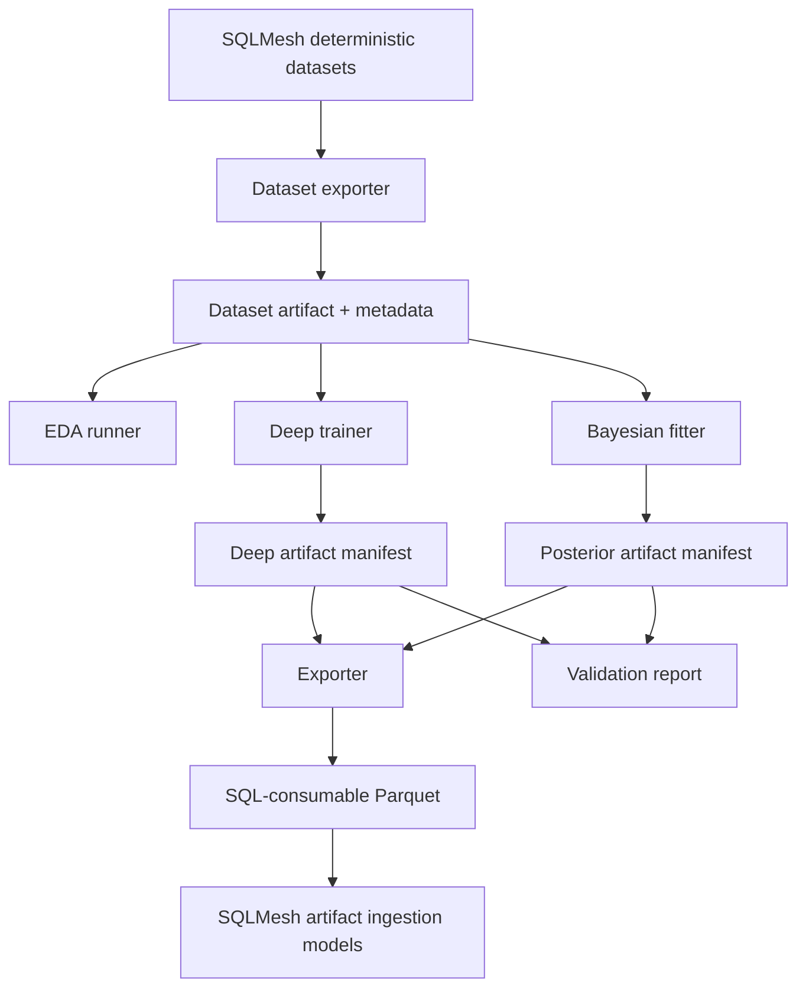
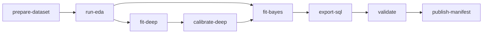

# Statistical Runtime Artifacts And Library

## TL;DR

Create a shared `bc/python_models/statistical` library before implementing individual models. The library owns modeling dataset export, artifact manifests, typed schemas, split registries, logging, calibration utilities, PyMC helpers, diagnostics, validation reports, and SQLMesh artifact ingestion. Individual models should be thin modules that plug into this shared runtime.

Without this shared layer, each model will invent different paths, metadata, logging, split rules, and validation formats. That makes posterior model outputs impossible to audit and dangerous to publish.

## Versioning Glossary

The statistical layer uses several version-like identifiers. They are not interchangeable. Code, manifests, and SQL ingestion must use them with the meanings below.

| Identifier | Type | Meaning |
| --- | --- | --- |
| `artifact_id` | UUID v4 | Immutable per-fit handle. Generated once when a fit succeeds. Canonical handle for joining model outputs across tables — every probability row, embedding row, posterior summary row, and manifest record carries the `artifact_id` of the fit that produced it. |
| `model_version` | semver string (`"1.0"`, `"1.1"`, `"2.0"`) | Bumps on any change to the model's API: input schema, output schema, prior structure, ablation contract, or other reader-visible contract. Patch bumps are not used; the smallest reader-visible change is a minor bump. |
| `run_id` | string | Per-fit-attempt label. May equal `artifact_id` if the fit succeeded on the first attempt and no retries were needed. When a fit is retried (e.g. sampler restart, divergence retry), each attempt has its own `run_id`; the final successful attempt's `run_id` is the one that becomes the `artifact_id`. Failed attempts have `run_id`s but no `artifact_id`. |
| `query_hash` | SHA-256 hex | Hash of the rendered SQLMesh-generated dataset query (the text the exporter actually sends to DuckDB). Identifies dataset version. Two datasets with the same `query_hash` and the same source snapshot are byte-identical. |
| `schema_hash` | SHA-256 hex | Hash of the column schema — sorted `(column_name, dtype)` tuples serialized canonically. Detects breaking schema changes independent of `query_hash` (e.g. a `SELECT *` query whose underlying table grew a column). |

Usage rules:

- Downstream joins use `artifact_id`. Never join on `run_id`.
- Reader-visible contracts (SQL ingestion, validation reports, published manifests) reference `model_version` for compatibility checks and `artifact_id` for the specific fit.
- `run_id` is internal to the fitting layer; it appears in fit logs and (optionally) in the manifest's metadata block, but not in SQL-consumable exports.
- `query_hash` and `schema_hash` are dataset-level identifiers. They are recorded on dataset manifests and propagated to fit manifests so a fit can be traced to the exact dataset bytes it consumed.

## Runtime Boundary



SQLMesh owns:

- deterministic ledgers
- modeling dataset SQL
- stable artifact ingestion
- audits
- compatibility views

Offline Python owns:

- dataset snapshots
- EDA reports
- deep training
- Bayesian fitting
- calibration
- posterior predictive checks
- artifact export
- validation summaries

Invariant: ordinary SQLMesh plans should not train models, sample posteriors, or mutate artifact manifests. They should read published artifacts by ID.

## Proposed Package Layout

```text
bc/python_models/statistical/
  __init__.py
  artifacts.py
  calibration.py
  config.py
  diagnostics.py
  duckdb_io.py
  datasets.py
  logging.py
  manifests.py
  orchestration.py
  pymc_utils.py
  schemas.py
  splits.py
  validation.py
  deep/
    __init__.py
    calibrators.py
    embeddings.py
    proposals.py
  models/
    __init__.py
    advancement.py
    fielding_credit.py
    geometry.py
    observation.py
    park_factors.py
    pitch_summary.py
    run_values.py
  cli.py
```

Package responsibilities:

| Module | Responsibility |
| --- | --- |
| `config.py` | Repo paths, DB paths, artifact roots, dependency-group assumptions, run defaults. |
| `duckdb_io.py` | Read-only DuckDB connections, query execution, modeling dataset export, hash computation. |
| `schemas.py` | Pydantic v2 models for dataset metadata, model configs, artifacts, diagnostics. |
| `datasets.py` | Modeling dataset export and schema validation. |
| `splits.py` | Split registry and grouped split validation. |
| `calibration.py` | Reliability curves, ECE, Brier/log-loss, calibration status. |
| `pymc_utils.py` | Shared PyMC sampling, prior/posterior predictive, diagnostics extraction. |
| `diagnostics.py` | ArviZ summaries, simulation recovery, posterior predictive slice checks. |
| `validation.py` | Conservation audits and blocking findings. |
| `manifests.py` | Manifest read/write, artifact IDs, version checks. |
| `artifacts.py` | Atomic artifact writes and SQL-consumable export helpers. |
| `orchestration.py` | Run DAG execution, step status, idempotent reruns. |
| `logging.py` | Structured logging setup. |
| `deep/*` | Deep proposal, embedding, and calibration code. |
| `models/*` | Model-specific prepare/build/export functions. |

## Dependency Group

Decision: add a new `stats` dependency group for the first Bayesian implementation. PyMC and ArviZ are the default backend unless smoke runs, diagnostics, or performance gates fail.

```toml
[dependency-groups]
stats = [
    {include-group = "build"},
    "pymc>=5",
    "arviz>=0.20",
    "xarray>=2025.1",
    "zarr>=2.18",
    "scikit-learn>=1.5",
]
```

Keep `stats` separate from the existing `ml` group unless dependency resolution forces a more specific split. SQLMesh ingestion models should not require importing PyMC.

The `stats` group intentionally repeats the `scikit-learn` constraint instead of including the full `ml` group. Calibration utilities need `scikit-learn`, but Bayesian runs should not pull in Keras, Torch, or MLflow unless a command is explicitly training deep proposals.

## CLI Shape

The package lives at `bc/python_models/statistical/`; the importable module path is `bc.python_models.statistical`. Expose a console-script entry point in `pyproject.toml` so recipes invoke a short binary name instead of a long dotted module path:

```toml
[project.scripts]
bc-stats = "bc.python_models.statistical.cli:main"
```

`just` recipes and ad-hoc commands use `bc-stats`:

```text
uv run --group stats bc-stats prepare-dataset --dataset model_input_fielding_credit --artifact-id <id>
uv run --group stats bc-stats run-eda --dataset-artifact <id>
uv run --group ml bc-stats fit-deep --target geometry_side --dataset-artifact <id>
uv run --group stats bc-stats fit-bayes --model fielding_credit --dataset-artifact <id>
uv run --group stats bc-stats export-sql --model fielding_credit --artifact-id <id>
uv run --group stats bc-stats validate --artifact-id <id>
```

The equivalent dotted-path form (`uv run --group stats python -m bc.python_models.statistical.cli ...`) is supported as a fallback for environments where the entry point is not installed (e.g. running directly from a source checkout without `uv sync`). Documentation and `just` recipes prefer `bc-stats`.

Subcommands:

| Command | Output |
| --- | --- |
| `prepare-dataset` | Parquet dataset snapshot and dataset metadata. |
| `run-eda` | EDA tables, weak-identification flags, markdown report. |
| `fit-deep` | Cross-fitted deep predictions, embeddings, calibration report. |
| `fit-bayes` | Prior predictive, posterior, posterior predictive, diagnostics. |
| `export-sql` | SQL-consumable probability, expected-counter, and summary Parquet files. |
| `validate` | Conservation, calibration, grouped holdout, and publication status report. |
| `publish-manifest` | Writes the `artifact_id` SQLMesh may ingest for a given `model_name`. |

## Artifact Layout

```text
artifacts/statistical/
  datasets/
    <dataset_name>/<dataset_version>/<source_snapshot_id>/
      dataset.parquet
      dataset_metadata.json
      schema.json
  deep/
    <target_name>/<artifact_id>/
      model/
      exports/
        probabilities.parquet
        embeddings.parquet
        calibration_report.parquet
      manifest.json
  bayes/
    <model_name>/<artifact_id>/
      inference/
        prior_predictive.nc
        posterior.nc
        posterior_predictive.nc
      exports/
        probability_table.parquet
        expected_counters.parquet
        posterior_summary.parquet
        diagnostics.parquet
      validation/
        report.md
        blocking_findings.parquet
        conservation_audits.parquet
      manifest.json
  published/
    <model_name>.json
```

`published/<model_name>.json` should contain the approved artifact ID for SQLMesh ingestion. This avoids editing SQL every time a new statistical run is approved.

### Branch-Scoped Published Roots

Branch envs resolve `published/<model_name>.json` via the `BC_STATS_PUBLISHED_ROOT` environment variable so two branches racing to publish the same model do not stomp on each other.

- `just` recipes for branch envs set `BC_STATS_PUBLISHED_ROOT=artifacts/statistical/published-${BC_DEV_ENV_SLUG}/`.
- `just promote-prod` and other prod recipes set `BC_STATS_PUBLISHED_ROOT=artifacts/statistical/published/`.
- The ingestion `@model` resolves `${BC_STATS_PUBLISHED_ROOT}/<model_name>.json` first and falls back to the global `artifacts/statistical/published/<model_name>.json` if the branch-scoped manifest is absent. This lets a branch reuse prod manifests for models it has not refit while overriding only the manifests it has refit locally.
- Manifest writes always target `${BC_STATS_PUBLISHED_ROOT}` — the writer never touches the global directory unless the recipe is a prod recipe.

The fallback is one-way: branch-scoped manifests can override prod, but prod ingestion never reads from a branch-scoped directory.

## Manifest Schema

Use Pydantic v2 for manifests.

```python
from __future__ import annotations

from datetime import datetime
from pathlib import Path
from typing import Literal

from pydantic import BaseModel, Field


ArtifactKind = Literal["dataset", "deep", "bayes", "sql_export"]
ValidationStatus = Literal["passed", "failed", "exploratory"]
AblationStatus = Literal["gamma_dl_zero", "gamma_dl_shrunk", "not_applicable"]


class ArtifactManifest(BaseModel):
    artifact_id: str
    kind: ArtifactKind
    name: str
    version: str
    created_at: datetime
    source_snapshot_id: str
    query_hash: str | None = None
    schema_hash: str | None = None
    dataset_artifact_id: str | None = None
    input_artifact_ids: tuple[str, ...] = ()
    output_paths: dict[str, Path]
    package_versions: dict[str, str]
    random_seed: int | None = None
    validation_status: ValidationStatus = "exploratory"
    ablation_status: AblationStatus = "not_applicable"
    blocking_findings: tuple[str, ...] = ()
    metadata: dict[str, str | int | float | bool] = Field(default_factory=dict)
```

Manifest invariants:

- Artifact IDs are immutable.
- New runs create new artifact directories.
- Published manifests point to immutable `artifact_id`s.
- Validation status is never inferred from file existence.
- SQLMesh ingestion reads only artifacts with explicit published manifests unless the environment variable allows exploratory artifacts in dev.

`ablation_status` semantics (paired with the ablation contract in `04-deep-learning-supplements.md`):

- `not_applicable` — model does not consume any DL proposal. Default for deep artifacts, dataset artifacts, sql_export artifacts, and Bayes models that have no DL covariate.
- `gamma_dl_zero` — Bayes fit with the DL covariate omitted (`gamma_dl = 0`).
- `gamma_dl_shrunk` — Bayes fit with the DL covariate included under a `Normal(0, 0.5)` shrinkage prior.

Bayes models that consume a DL proposal emit two artifacts per fit cycle — one with `ablation_status='gamma_dl_zero'`, one with `ablation_status='gamma_dl_shrunk'`. Only one is referenced by the published manifest; the per-model selection criterion lives in the model's validation report and the choice is recorded in the published manifest's `metadata` block.

## Logging

Use structured stdlib logging. Every long step should log start, stop, row counts, artifact paths, elapsed time, and blocking findings.

```python
from __future__ import annotations

import logging
import time
from collections.abc import Iterator
from contextlib import contextmanager


log = logging.getLogger(__name__)


@contextmanager
def logged_step(step: str, **fields: object) -> Iterator[None]:
    started = time.perf_counter()
    log.info("step_start", extra={"step": step, **fields})
    try:
        yield
    except Exception:
        log.exception("step_failed", extra={"step": step, **fields})
        raise
    elapsed = time.perf_counter() - started
    log.info("step_done", extra={"step": step, "elapsed_seconds": elapsed, **fields})
```

No statistical job should rely on `print()` diagnostics. Verbose sampler logs should go to files under the artifact directory.

## Dataset Metadata

```python
from __future__ import annotations

from pathlib import Path

from pydantic import BaseModel


class DatasetColumn(BaseModel):
    name: str
    dtype: str
    role: str


class DatasetMetadata(BaseModel):
    dataset_name: str
    dataset_version: str
    source_snapshot_id: str
    query_hash: str
    row_count: int
    target_population_count: int
    observed_truth_count: int
    parquet_path: Path
    columns: tuple[DatasetColumn, ...]
    split_policy: str
    category_maps: dict[str, dict[str, int]]
```

Dataset validation should check:

- Required columns exist.
- Dtypes match expected schema.
- Split columns are present and valid.
- Category maps are stable.
- No production dataset has null source or observed-status columns.

## Split Registry

The split registry makes grouped validation reproducible:

```python
from __future__ import annotations

from pydantic import BaseModel


class SplitAssignment(BaseModel):
    split_registry_id: str
    unit_type: str
    unit_id: str
    fold_id: int
    split_family: str
    holdout_regime: str
```

Required checks:

- No `game_id` appears in multiple folds for event models.
- Scorer holdouts are exclusive for scorer validation.
- Park holdouts are exclusive for park validation.
- Source-family holdouts do not leak file-family rows across folds.
- Deep out-of-fold predictions use the same registry as Bayesian modeling datasets.

## PyMC Utilities

Shared helper responsibilities:

- run prior predictive.
- run short smoke sampling.
- run full sampling.
- extract diagnostics.
- write ArviZ NetCDF/Zarr.
- export posterior summaries.
- validate dimensions and coordinates.

Code sketch:

```python
from __future__ import annotations

from dataclasses import dataclass
from pathlib import Path

import arviz as az
import pymc as pm


@dataclass(frozen=True)
class SamplingConfig:
    draws: int
    tune: int
    chains: int
    target_accept: float
    random_seed: int


def sample_model(model: pm.Model, config: SamplingConfig, output_path: Path) -> az.InferenceData:
    with model:
        prior = pm.sample_prior_predictive(random_seed=config.random_seed)
        idata = pm.sample(
            draws=config.draws,
            tune=config.tune,
            chains=config.chains,
            target_accept=config.target_accept,
            random_seed=config.random_seed,
            return_inferencedata=True,
        )
        posterior_predictive = pm.sample_posterior_predictive(idata, random_seed=config.random_seed)
    idata.extend(prior)
    idata.extend(posterior_predictive)
    output_path.parent.mkdir(parents=True, exist_ok=True)
    idata.to_netcdf(output_path)
    return idata
```

The production helper should run diagnostics before returning a publishable status. It should not hide divergences by raising `target_accept` without reporting the underlying issue.

## Diagnostics Schema

`diagnostics.parquet` should include:

| Field | Meaning |
| --- | --- |
| `artifact_id` | Bayesian fit artifact ID (canonical handle; see Versioning Glossary). |
| `model_name` | Model name. |
| `diagnostic_name` | `r_hat`, `ess_bulk`, `ess_tail`, `divergences`, `bfmi`, `loo`, etc. |
| `variable` | Parameter or generated quantity. |
| `slice_name` | Optional data slice. |
| `value` | Numeric diagnostic. |
| `threshold` | Required threshold. |
| `status` | `passed`, `warn`, `failed`. |

Blocking defaults:

- Any unexplained divergences fail production publication.
- R-hat above documented threshold fails affected variables.
- Very low ESS fails affected summaries.
- Posterior predictive failures in target slices fail the model even if sampler diagnostics are clean.

## Validation Library

Validation helpers should operate on SQL-consumable exports so they test the exact artifact SQLMesh will ingest.

Validation families:

| Family | Examples |
| --- | --- |
| Conservation | Expected putouts by event, player-game residual reconciliation, count/result constraints, base/out transitions. |
| Calibration | Reliability curves, ECE, Brier/log loss by slice. |
| Holdout | Era, scorer, source, park, alignment, aggregate-total. |
| Sensitivity | Priors, MNAR shifts, data-error downweighting, deep proposal inclusion/exclusion. |
| Publication | Required metadata, source/method enums, uncertainty columns. |

Code sketch:

```python
from __future__ import annotations

from dataclasses import dataclass

import polars as pl


@dataclass(frozen=True)
class ValidationFinding:
    severity: str
    code: str
    message: str


def probability_normalization_check(df: pl.DataFrame, key_cols: list[str], prob_col: str) -> list[ValidationFinding]:
    sums = df.group_by(key_cols).agg(pl.col(prob_col).sum().alias("p_sum"))
    bad = sums.filter((pl.col("p_sum") < 0.999) | (pl.col("p_sum") > 1.001))
    if bad.height == 0:
        return []
    return [
        ValidationFinding(
            severity="block",
            code="probability_not_normalized",
            message=f"{bad.height} probability groups do not sum to 1",
        )
    ]
```

## SQLMesh Artifact Ingestion

Use Python SQLMesh models for artifact ingestion when paths and manifests need runtime logic. Keep these models small:

- resolve the branch-scoped published manifest path via `BC_STATS_PUBLISHED_ROOT`, falling back to the global `published/` directory.
- return an **empty typed DataFrame** (correct columns and dtypes) with a warning log when the manifest is missing, instead of raising.
- read Parquet exports for the published `artifact_id`.
- avoid importing PyMC, Keras, or training code.

Rationale for the empty-table-on-missing-manifest behavior: branch envs are spun up before every model has been refit locally, so the ingestion `@model` must succeed against an empty published-root directory. A separate prod-only health-check audit flags any non-empty model-output table whose model is in the publication tier — that audit is what catches accidentally-empty prod manifests, not the ingestion model itself. Missing manifests are a normal branch-env state; missing prod manifests for a publication-tier model are a separate, audited failure.

Sketch:

```python
from __future__ import annotations

import logging
import os
from pathlib import Path

import pandas as pd
from sqlmesh import ExecutionContext, model

from bc.python_models.statistical.manifests import ArtifactManifest


log = logging.getLogger(__name__)


GLOBAL_PUBLISHED_ROOT = Path("artifacts/statistical/published")


def resolve_published_roots() -> tuple[Path, Path]:
    branch_root = Path(os.environ.get("BC_STATS_PUBLISHED_ROOT", str(GLOBAL_PUBLISHED_ROOT)))
    return branch_root, GLOBAL_PUBLISHED_ROOT


def find_manifest(model_name: str) -> Path | None:
    branch_root, global_root = resolve_published_roots()
    branch_path = branch_root / f"{model_name}.json"
    if branch_path.exists():
        return branch_path
    global_path = global_root / f"{model_name}.json"
    if global_path.exists():
        return global_path
    return None


FIELDING_CREDIT_COLUMNS: dict[str, str] = {
    "event_key": "UINTEGER",
    "player_id": "VARCHAR",
    "fielding_position": "UTINYINT",
    "credit_type": "VARCHAR",
    "expected_credit": "DOUBLE",
    "model_version": "VARCHAR",
    "artifact_id": "VARCHAR",
}

FIELDING_CREDIT_PANDAS_DTYPES: dict[str, str] = {
    "event_key": "uint32",
    "player_id": "string",
    "fielding_position": "UInt8",
    "credit_type": "string",
    "expected_credit": "float64",
    "model_version": "string",
    "artifact_id": "string",
}


def empty_typed_frame(columns: dict[str, str], dtypes: dict[str, str]) -> pd.DataFrame:
    return pd.DataFrame({name: pd.Series(dtype=dtypes[name]) for name in columns})


@model(
    "main_models.imputed_fielding_credit",
    kind="FULL",
    columns=FIELDING_CREDIT_COLUMNS,
)
def execute(context: ExecutionContext, **kwargs) -> pd.DataFrame:
    manifest_path = find_manifest("fielding_credit")
    if manifest_path is None:
        log.warning(
            "manifest missing for fielding_credit; emitting empty table",
            extra={"model_name": "fielding_credit", "branch_root": os.environ.get("BC_STATS_PUBLISHED_ROOT")},
        )
        return empty_typed_frame(FIELDING_CREDIT_COLUMNS, FIELDING_CREDIT_PANDAS_DTYPES)
    manifest = ArtifactManifest.model_validate_json(manifest_path.read_text())
    path = manifest.output_paths["expected_counters"]
    return context.fetchdf(f"SELECT * FROM read_parquet('{path}')")
```

In actual code, put `ArtifactManifest` in a lightweight module that ingestion can import without pulling in `stats` dependencies. The schema constants for each ingestion model (`*_COLUMNS`, `*_PANDAS_DTYPES`) live next to the `@model` so the column list and dtype list cannot drift apart.

Missing-manifest is recoverable in branch envs that have not fit the model yet. Prod has a separate health-check audit that flags non-empty model-output tables for any model listed in the publication tier — that audit is the prod safety net, not the ingestion model itself.

## Orchestration DAG

Use a DAG runner simple enough to debug locally:



Each step should be idempotent by artifact ID. Rerunning with the same artifact ID either verifies outputs or fails before overwriting. New inputs create new IDs.

### First Bayesian Smoke-Run Target

The first Bayesian model to be implemented end-to-end on this runtime is the **observation/scorer model** (`scorer_observation_propensities`). All subsequent Bayesian models depend on the observation-model patterns being correct: it exercises the dataset exporter, the split registry, the PyMC helpers, the calibration utilities, the manifest writer, the ablation contract (with no DL covariate initially — `ablation_status='not_applicable'` until a deep proposal exists for scorer/source behavior), the SQL ingestion `@model` skeleton, and the publication tier policy. Geometry, fielding credit, advancement, park factors, and run values land afterwards and reuse the patterns the observation model establishes.

A model that lands before the observation model is out of order — its patterns will be re-derived once observation lands and the work will not compound.

## Testing

Unit tests:

- schema validation.
- query hash determinism.
- manifest serialization.
- split exclusivity.
- probability normalization checks.
- artifact path resolution.
- PyMC model builds on tiny fixtures.

Integration smoke tests:

- export a tiny modeling dataset.
- run EDA on the dataset.
- fit a tiny model with few draws.
- export probabilities.
- run SQLMesh ingestion against the tiny artifact in dev.

Data-analysis smoke runs:

- one season.
- one league.
- a known high-coverage slice.
- a worst-case sparse slice.

Full runs should not start until smoke runs pass and logs show expected row counts.

## Acceptance Criteria

The runtime/library work is done when:

- A shared package can export modeling datasets, write manifests, validate schemas, and resolve artifacts.
- Model modules do not duplicate path, logging, split, calibration, or manifest logic.
- SQLMesh ingestion reads published manifests and compact Parquet exports.
- Missing artifacts fail loudly except for explicitly optional dev-only gates.
- Every artifact has a validation status independent of file existence.
- The docs for each model point to the same artifact and validation contracts.
