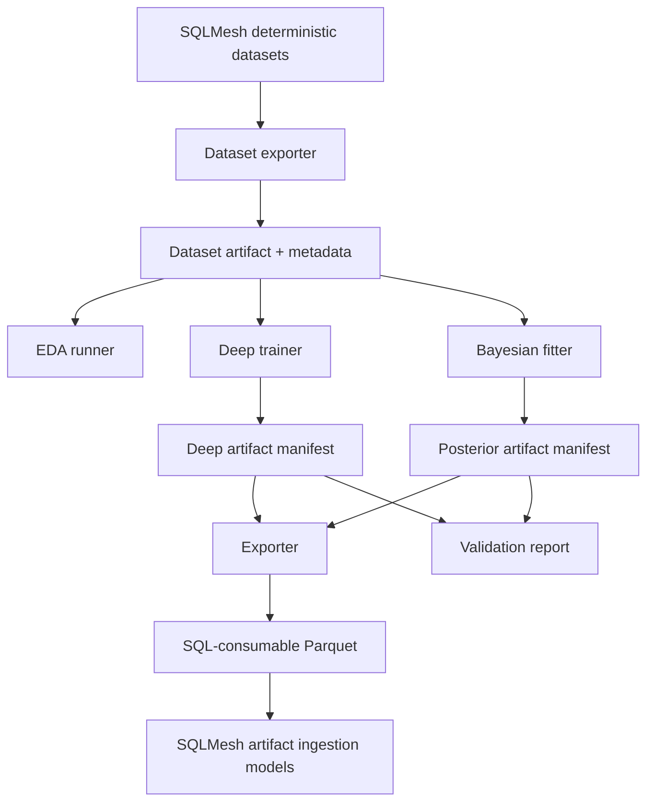
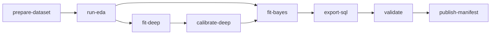

# Statistical Runtime Artifacts And Library

## TL;DR

Create a shared `bc/python_models/statistical` library before implementing individual models. The library owns modeling dataset export, artifact manifests, typed schemas, split registries, logging, calibration utilities, PyMC helpers, diagnostics, validation reports, and SQLMesh artifact ingestion. Individual models should be thin modules that plug into this shared runtime.

Without this shared layer, each model will invent different paths, metadata, logging, split rules, and validation formats. That makes posterior model outputs impossible to audit and dangerous to publish.

## Runtime Boundary



SQLMesh owns:

- deterministic ledgers
- modeling dataset SQL
- stable artifact ingestion
- audits
- compatibility views

Offline Python owns:

- dataset snapshots
- EDA reports
- deep training
- Bayesian fitting
- calibration
- posterior predictive checks
- artifact export
- validation summaries

Invariant: ordinary SQLMesh plans should not train models, sample posteriors, or mutate artifact manifests. They should read published artifacts by ID.

## Proposed Package Layout

```text
bc/python_models/statistical/
  __init__.py
  artifacts.py
  calibration.py
  config.py
  diagnostics.py
  duckdb_io.py
  datasets.py
  logging.py
  manifests.py
  orchestration.py
  pymc_utils.py
  schemas.py
  splits.py
  validation.py
  deep/
    __init__.py
    calibrators.py
    embeddings.py
    proposals.py
  models/
    __init__.py
    advancement.py
    fielding_credit.py
    geometry.py
    observation.py
    park_factors.py
    pitch_summary.py
    run_values.py
  cli.py
```

Package responsibilities:

| Module | Responsibility |
| --- | --- |
| `config.py` | Repo paths, DB paths, artifact roots, dependency-group assumptions, run defaults. |
| `duckdb_io.py` | Read-only DuckDB connections, query execution, modeling dataset export, hash computation. |
| `schemas.py` | Pydantic v2 models for dataset metadata, model configs, artifacts, diagnostics. |
| `datasets.py` | Modeling dataset export and schema validation. |
| `splits.py` | Split registry and grouped split validation. |
| `calibration.py` | Reliability curves, ECE, Brier/log-loss, calibration status. |
| `pymc_utils.py` | Shared PyMC sampling, prior/posterior predictive, diagnostics extraction. |
| `diagnostics.py` | ArviZ summaries, simulation recovery, posterior predictive slice checks. |
| `validation.py` | Conservation audits and blocking findings. |
| `manifests.py` | Manifest read/write, artifact IDs, version checks. |
| `artifacts.py` | Atomic artifact writes and SQL-consumable export helpers. |
| `orchestration.py` | Run DAG execution, step status, idempotent reruns. |
| `logging.py` | Structured logging setup. |
| `deep/*` | Deep proposal, embedding, and calibration code. |
| `models/*` | Model-specific prepare/build/export functions. |

## Dependency Group

Add a new `stats` dependency group when implementation begins:

```toml
[dependency-groups]
stats = [
    {include-group = "build"},
    "pymc>=5",
    "arviz>=0.20",
    "xarray>=2025.1",
    "zarr>=2.18",
    "scikit-learn>=1.5",
]
```

Keep `stats` separate from the existing `ml` group unless dependency resolution forces a more specific split. SQLMesh ingestion models should not require importing PyMC.

## CLI Shape

Use one CLI entrypoint for repeatable operations:

```text
uv run --group stats python -m python_models.statistical.cli prepare-dataset --dataset model_input_fielding_credit --artifact-id <id>
uv run --group stats python -m python_models.statistical.cli run-eda --dataset-artifact <id>
uv run --group ml python -m python_models.statistical.cli fit-deep --target geometry_side --dataset-artifact <id>
uv run --group stats python -m python_models.statistical.cli fit-bayes --model fielding_credit --dataset-artifact <id>
uv run --group stats python -m python_models.statistical.cli export-sql --model fielding_credit --run-id <id>
uv run --group stats python -m python_models.statistical.cli validate --run-id <id>
```

Subcommands:

| Command | Output |
| --- | --- |
| `prepare-dataset` | Parquet dataset snapshot and dataset metadata. |
| `run-eda` | EDA tables, weak-identification flags, markdown report. |
| `fit-deep` | Cross-fitted deep predictions, embeddings, calibration report. |
| `fit-bayes` | Prior predictive, posterior, posterior predictive, diagnostics. |
| `export-sql` | SQL-consumable probability, expected-counter, and summary Parquet files. |
| `validate` | Conservation, calibration, grouped holdout, and publication status report. |
| `publish-manifest` | Marks a run as the artifact ID SQLMesh may ingest. |

## Artifact Layout

```text
artifacts/statistical/
  datasets/
    <dataset_name>/<dataset_version>/<source_snapshot_id>/
      dataset.parquet
      dataset_metadata.json
      schema.json
  deep/
    <target_name>/<artifact_id>/
      model/
      exports/
        probabilities.parquet
        embeddings.parquet
        calibration_report.parquet
      manifest.json
  bayes/
    <model_name>/<run_id>/
      inference/
        prior_predictive.nc
        posterior.nc
        posterior_predictive.nc
      exports/
        probability_table.parquet
        expected_counters.parquet
        posterior_summary.parquet
        diagnostics.parquet
      validation/
        report.md
        blocking_findings.parquet
        conservation_audits.parquet
      manifest.json
  published/
    <model_name>.json
```

`published/<model_name>.json` should contain the approved artifact ID for SQLMesh ingestion. This avoids editing SQL every time a new statistical run is approved.

## Manifest Schema

Use Pydantic v2 for manifests.

```python
from __future__ import annotations

from datetime import datetime
from pathlib import Path
from typing import Literal

from pydantic import BaseModel, Field


ArtifactKind = Literal["dataset", "deep", "bayes", "sql_export"]
ValidationStatus = Literal["passed", "failed", "exploratory"]


class ArtifactManifest(BaseModel):
    artifact_id: str
    kind: ArtifactKind
    name: str
    version: str
    created_at: datetime
    source_snapshot_id: str
    query_hash: str | None = None
    dataset_artifact_id: str | None = None
    input_artifact_ids: tuple[str, ...] = ()
    output_paths: dict[str, Path]
    package_versions: dict[str, str]
    random_seed: int | None = None
    validation_status: ValidationStatus = "exploratory"
    blocking_findings: tuple[str, ...] = ()
    metadata: dict[str, str | int | float | bool] = Field(default_factory=dict)
```

Manifest invariants:

- Artifact IDs are immutable.
- New runs create new artifact directories.
- Published manifests point to immutable run IDs.
- Validation status is never inferred from file existence.
- SQLMesh ingestion reads only artifacts with explicit published manifests unless the environment variable allows exploratory artifacts in dev.

## Logging

Use structured stdlib logging. Every long step should log start, stop, row counts, artifact paths, elapsed time, and blocking findings.

```python
from __future__ import annotations

import logging
import time
from collections.abc import Iterator
from contextlib import contextmanager


log = logging.getLogger(__name__)


@contextmanager
def logged_step(step: str, **fields: object) -> Iterator[None]:
    started = time.perf_counter()
    log.info("step_start", extra={"step": step, **fields})
    try:
        yield
    except Exception:
        log.exception("step_failed", extra={"step": step, **fields})
        raise
    elapsed = time.perf_counter() - started
    log.info("step_done", extra={"step": step, "elapsed_seconds": elapsed, **fields})
```

No statistical job should rely on `print()` diagnostics. Verbose sampler logs should go to files under the artifact directory.

## Dataset Metadata

```python
from __future__ import annotations

from pathlib import Path

from pydantic import BaseModel


class DatasetColumn(BaseModel):
    name: str
    dtype: str
    role: str


class DatasetMetadata(BaseModel):
    dataset_name: str
    dataset_version: str
    source_snapshot_id: str
    query_hash: str
    row_count: int
    target_population_count: int
    observed_truth_count: int
    parquet_path: Path
    columns: tuple[DatasetColumn, ...]
    split_policy: str
    category_maps: dict[str, dict[str, int]]
```

Dataset validation should check:

- Required columns exist.
- Dtypes match expected schema.
- Split columns are present and valid.
- Category maps are stable.
- No production dataset has null source or observed-status columns.

## Split Registry

The split registry makes grouped validation reproducible:

```python
from __future__ import annotations

from pydantic import BaseModel


class SplitAssignment(BaseModel):
    split_registry_id: str
    unit_type: str
    unit_id: str
    fold_id: int
    split_family: str
    holdout_regime: str
```

Required checks:

- No `game_id` appears in multiple folds for event models.
- Scorer holdouts are exclusive for scorer validation.
- Park holdouts are exclusive for park validation.
- Source-family holdouts do not leak file-family rows across folds.
- Deep out-of-fold predictions use the same registry as Bayesian modeling datasets.

## PyMC Utilities

Shared helper responsibilities:

- run prior predictive.
- run short smoke sampling.
- run full sampling.
- extract diagnostics.
- write ArviZ NetCDF/Zarr.
- export posterior summaries.
- validate dimensions and coordinates.

Code sketch:

```python
from __future__ import annotations

from dataclasses import dataclass
from pathlib import Path

import arviz as az
import pymc as pm


@dataclass(frozen=True)
class SamplingConfig:
    draws: int
    tune: int
    chains: int
    target_accept: float
    random_seed: int


def sample_model(model: pm.Model, config: SamplingConfig, output_path: Path) -> az.InferenceData:
    with model:
        prior = pm.sample_prior_predictive(random_seed=config.random_seed)
        idata = pm.sample(
            draws=config.draws,
            tune=config.tune,
            chains=config.chains,
            target_accept=config.target_accept,
            random_seed=config.random_seed,
            return_inferencedata=True,
        )
        posterior_predictive = pm.sample_posterior_predictive(idata, random_seed=config.random_seed)
    idata.extend(prior)
    idata.extend(posterior_predictive)
    output_path.parent.mkdir(parents=True, exist_ok=True)
    idata.to_netcdf(output_path)
    return idata
```

The production helper should run diagnostics before returning a publishable status. It should not hide divergences by raising `target_accept` without reporting the underlying issue.

## Diagnostics Schema

`diagnostics.parquet` should include:

| Field | Meaning |
| --- | --- |
| `run_id` | Bayesian run ID. |
| `model_name` | Model name. |
| `diagnostic_name` | `r_hat`, `ess_bulk`, `ess_tail`, `divergences`, `bfmi`, `loo`, etc. |
| `variable` | Parameter or generated quantity. |
| `slice_name` | Optional data slice. |
| `value` | Numeric diagnostic. |
| `threshold` | Required threshold. |
| `status` | `passed`, `warn`, `failed`. |

Blocking defaults:

- Any unexplained divergences fail production publication.
- R-hat above documented threshold fails affected variables.
- Very low ESS fails affected summaries.
- Posterior predictive failures in target slices fail the model even if sampler diagnostics are clean.

## Validation Library

Validation helpers should operate on SQL-consumable exports so they test the exact artifact SQLMesh will ingest.

Validation families:

| Family | Examples |
| --- | --- |
| Conservation | Expected putouts by event, player-game residual reconciliation, count/result constraints, base/out transitions. |
| Calibration | Reliability curves, ECE, Brier/log loss by slice. |
| Holdout | Era, scorer, source, park, alignment, aggregate-total. |
| Sensitivity | Priors, MNAR shifts, artifact downweighting, deep proposal inclusion/exclusion. |
| Publication | Required metadata, source/method enums, uncertainty columns. |

Code sketch:

```python
from __future__ import annotations

from dataclasses import dataclass

import polars as pl


@dataclass(frozen=True)
class ValidationFinding:
    severity: str
    code: str
    message: str


def probability_normalization_check(df: pl.DataFrame, key_cols: list[str], prob_col: str) -> list[ValidationFinding]:
    sums = df.group_by(key_cols).agg(pl.col(prob_col).sum().alias("p_sum"))
    bad = sums.filter((pl.col("p_sum") < 0.999) | (pl.col("p_sum") > 1.001))
    if bad.height == 0:
        return []
    return [
        ValidationFinding(
            severity="block",
            code="probability_not_normalized",
            message=f"{bad.height} probability groups do not sum to 1",
        )
    ]
```

## SQLMesh Artifact Ingestion

Use Python SQLMesh models for artifact ingestion when paths and manifests need runtime logic. Keep these models small:

- read published manifest.
- return empty typed table in dev when artifact is missing and the model is explicitly optional.
- read Parquet exports.
- avoid importing PyMC, Keras, or training code.

Sketch:

```python
from __future__ import annotations

from pathlib import Path

import pandas as pd
from sqlmesh import ExecutionContext, model

from python_models.statistical.config import STATISTICAL_PUBLISHED_ROOT
from python_models.statistical.manifests import ArtifactManifest


def published_export_path(model_name: str, export_name: str) -> Path:
    manifest_path = STATISTICAL_PUBLISHED_ROOT / f"{model_name}.json"
    if not manifest_path.exists():
        raise FileNotFoundError(manifest_path)
    manifest = ArtifactManifest.model_validate_json(manifest_path.read_text())
    return manifest.output_paths[export_name]


@model(
    "main_models.imputed_fielding_credit",
    kind="FULL",
    columns={
        "event_key": "UINTEGER",
        "player_id": "VARCHAR",
        "fielding_position": "UTINYINT",
        "credit_type": "VARCHAR",
        "expected_credit": "DOUBLE",
        "model_version": "VARCHAR",
    },
)
def execute(context: ExecutionContext, **kwargs) -> pd.DataFrame:
    path = published_export_path("fielding_credit", "expected_counters")
    return context.fetchdf(f"SELECT * FROM read_parquet('{path}')")
```

In actual code, put `ArtifactManifest` in a lightweight module that ingestion can import without pulling in `stats` dependencies.

## Orchestration DAG

Use a DAG runner simple enough to debug locally:



Each step should be idempotent by artifact ID. Rerunning with the same artifact ID either verifies outputs or fails before overwriting. New inputs create new IDs.

## Testing

Unit tests:

- schema validation.
- query hash determinism.
- manifest serialization.
- split exclusivity.
- probability normalization checks.
- artifact path resolution.
- PyMC model builds on tiny fixtures.

Integration smoke tests:

- export a tiny modeling dataset.
- run EDA on the dataset.
- fit a tiny model with few draws.
- export probabilities.
- run SQLMesh ingestion against the tiny artifact in dev.

Data-analysis smoke runs:

- one season.
- one league.
- a known high-coverage slice.
- a worst-case sparse slice.

Full runs should not start until smoke runs pass and logs show expected row counts.

## Acceptance Criteria

The runtime/library work is done when:

- A shared package can export modeling datasets, write manifests, validate schemas, and resolve artifacts.
- Model modules do not duplicate path, logging, split, calibration, or manifest logic.
- SQLMesh ingestion reads published manifests and compact Parquet exports.
- Missing artifacts fail loudly except for explicitly optional dev-only gates.
- Every artifact has a validation status independent of file existence.
- The docs for each model point to the same artifact and validation contracts.
