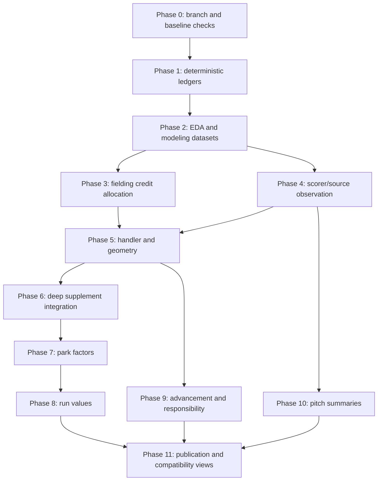

# Data Coverage Rollout And Validation

## TL;DR

Roll out the 1910-2025 coverage implementation in gated phases: deterministic ledgers, EDA and modeling datasets, fielding-credit allocation, observation and geometry models, deep supplements, park factors, run values, advancement/responsibility, pitch summaries, and publication. Each phase must be additive, auditable, reversible, and blocked from publication until provenance, calibration, conservation, and grouped holdout checks pass.

The first production release should publish no probabilistic values. It should publish ledgers, gap classifications, dataset metadata, EDA summaries, and validation gaps. This makes the assumptions visible before any imputed counter reaches a metric.

## Rollout DAG



The phases can overlap only after their dependency gates pass. For example, basic run-scoring park factors can start before full geometry models, but batted-ball park factors require observation-adjusted geometry inputs.

## Phase 0: Baseline Checks

Purpose: capture the current data state and prevent stale metadata from controlling the implementation.

Tasks:

- Record source counts by `source_type` for 1910-2025.
- Record event count and game count from `event_states_full`.
- Record baseline batted-ball unknown counts.
- Record baseline unknown putouts and fielding residual counts.
- Compare LSF coverage metadata against current DB source counts.
- Capture current `unknown_fielding_play_shares`, `park_factors`, and `linear_weights` outputs as legacy baselines.

Acceptance:

- Baseline report exists under `artifacts/statistical/baseline/<date>/`.
- Any metadata drift is filed in `notes/followups.md` or fixed in the relevant metadata source.
- All later validation reports link to the baseline artifact.

Example baseline query:

```sql
SELECT
    source_type,
    COUNT(*) AS games
FROM main_models.game_start_info
WHERE season BETWEEN 1910 AND 2025
GROUP BY 1
ORDER BY 1;
```

## Phase 1: Deterministic Ledgers

Purpose: build the prep layer from `01-prep-ledgers.md`.

SQLMesh targets:

- `main_models.source_acquisition_ledger`
- `main_models.source_data_error_risk_ledger`
- `main_models.official_aggregate_availability`
- `main_models.official_credit_authority`
- `main_models.personnel_state_reliability`
- `main_models.entity_link_reliability`
- `main_models.game_context_observation_ledger`
- `main_models.game_exposure_ledger`
- `main_models.event_observation_ledger`
- `main_models.event_observation_context`
- `main_models.fielding_credit_gaps`

Acceptance gates:

| Gate | Requirement |
| --- | --- |
| Source reconciliation | Ledger source counts match `game_start_info`, `season_team_coverage`, schedule, gamelog, and event surfaces. |
| Sentinel preservation | `Unknown`, `Default`, null, zero, empty sequence, and not-applicable states remain distinguishable. |
| Data-error joins | Known issue rows become masks, weights, or diagnostic flags. |
| Aggregate-total clarity | Primary `BoxScore` source status is distinct from usable aggregate totals in `PlayByPlay` games. |
| Personnel hard masks | Hard eligibility masks exist only for high-confidence personnel states. |
| Exposure policy | Suspended, forfeited, shortened, walk-off, and unknown completion statuses have denominator rules. |

Rollback:

- These tables are additive. Exclude them from downstream models if a ledger audit fails.

## Phase 2: EDA And Modeling Datasets

Purpose: build frozen model inputs and decide model terms before fitting.

SQLMesh targets:

- `model_input_observation_batted_ball`
- `model_input_fielding_credit`
- `model_input_geometry`
- `model_input_park_factors`
- `model_input_run_values`
- `model_input_advancement`
- `model_input_pitch_summary`

Offline artifacts:

- dataset Parquet snapshots
- dataset metadata JSON
- split registry
- EDA reports
- weak-identification flags

Acceptance gates:

| Gate | Requirement |
| --- | --- |
| Dataset contract | Required provenance, reliability, aggregate-constraint, and split columns exist. |
| Leakage firewall | Grouped splits prevent game/source/scorer/park leakage for the intended validation. |
| EDA blockers | Source-family block missingness, source/parser data-error contamination, and weak connectivity are flagged. |
| Interaction list | Candidate interactions are justified by EDA and subject-matter reasoning. |
| Reproducibility | Dataset metadata includes query hash, source snapshot, schema, category maps, and row counts. |

Rollback:

- Rebuild modeling datasets from ledgers and keep prior dataset snapshots immutable.

## Phase 3: Fielding Credit Allocation

Purpose: replace `unknown_fielding_play_shares` as the long-term estimated official-credit layer.

First scope:

- Unknown putouts and hidden assist risk in event-level games.
- Clean box-score residual constraints.
- No-box unknowns tagged low-confidence.
- Battery and baserunning-related credits modeled separately or withheld.

Outputs:

- `imputed_fielding_credit`
- `fielding_credit_expected_counters`
- `fielding_credit_validation`

Acceptance gates:

| Gate | Requirement |
| --- | --- |
| Conservation | Expected event putouts reconcile to event outs and unknown putouts. |
| Aggregate reconciliation | Expected player-game credits reconcile to clean box-score residuals where official aggregate constraints are used. |
| Personnel | No credit assigned outside reliable personnel states. |
| Backtest | Held-out complete events beat legacy allocation or match it with better calibration and uncertainty. |
| No-box confidence | No-box estimates are tagged lower confidence and separated from estimates constrained by official aggregate totals. |

Rollback:

- Keep `unknown_fielding_play_shares` as the legacy compatibility source.
- Publish new outputs only in an estimated namespace until validation clears.

## Phase 4: Scorer And Source Observation

Purpose: estimate observation propensities and label-bias surfaces for batted-ball and pitch dimensions.

First scope:

- `trajectory` observedness.
- `location_side` and `location_depth` observedness.
- broad ground/air contact observedness.

Later scope:

- detailed fly/line/pop label confusion.
- pitch sequence and strike-type observedness.

Outputs:

- `scorer_observation_propensities`
- `observation_model_draws`
- `observation_weighted_metric_inputs`
- `scorer_label_confusion_summaries`

Acceptance gates:

| Gate | Requirement |
| --- | --- |
| Calibration | Propensities calibrate by era, scorer, source, hit/out, result, and team affiliation. |
| Holdout | Scorer and source-family holdouts do not collapse. |
| Sensitivity | MNAR sensitivity intervals exist for hit location and detailed contact labels. |
| Metric baseline | Existing coverage-weighted metrics can be reproduced as a baseline. |

Rollback:

- Continue publishing raw and existing coverage-weighted metrics.

## Phase 5: Handler And Geometry

Purpose: estimate handler and batted-ball geometry probabilities without treating fielder position as universal location.

First scope:

- handler probability by player/position.
- broad trajectory and side/depth geometry.
- recorded and deduced layers preserved.
- alignment regimes included.

Outputs:

- `ball_handler_probabilities`
- `imputed_batted_ball_geometry`
- `normalized_contact_probabilities`
- `geometry_expected_counters`

Acceptance gates:

| Gate | Requirement |
| --- | --- |
| Layer separation | Recorded, deduced, normalized, and estimated geometry remain separate. |
| Regime validation | Train/test within alignment regimes passes before cross-regime transfer. |
| Hit/out validation | Location holdouts pass separately for hits and outs. |
| Scorer validation | Scorer/source holdouts pass or produce weak flags. |
| Fielding separation | Official credit, handler, and responsibility are not collapsed. |

Rollback:

- Keep `calc_batted_ball_type` as the default geometry source.

## Phase 6: Deep Supplement Integration

Purpose: add calibrated deep proposals and embeddings as inputs to hierarchical models.

First scope:

- Geometry proposal probabilities.
- Handler proposal probabilities.
- Batter/pitcher/park/scorer embeddings for diagnostics.

Acceptance gates:

| Gate | Requirement |
| --- | --- |
| Cross-fitting | Bayesian training rows use out-of-fold deep predictions. |
| Calibration | Reliability reports pass by source, scorer, era, hit/out, and missingness pattern. |
| Constraint masks | Personnel and structural masks zero impossible fielding proposal mass. |
| Baseline comparison | Deep proposals beat or complement deterministic and simple tabular baselines. |
| Artifact status | Probability tables and embeddings have manifests and validation status. |

Rollback:

- Bayesian models run without deep covariates by setting deep coefficients to zero or omitting proposal columns.

## Phase 7: Park Factors

Purpose: replace fixed pseudo-count park factors with hierarchical posterior park effects.

First scope:

- Basic scoring and event-outcome factors.
- Sparse-league shrinkage.
- Compatibility view with existing factor columns.

Later scope:

- Observation-adjusted batted-ball park factors.
- Multivariate correlated park effect vectors.

Acceptance gates:

| Gate | Requirement |
| --- | --- |
| Connectivity | Park-season connectedness report supports estimation or flags weak slices. |
| Posterior predictive | Rates calibrate by park, season, league, handedness, team, and outcome. |
| Legacy comparison | Stable high-sample MLB periods agree directionally with current factors. |
| Sparse behavior | Sparse leagues shrink through hierarchy instead of fixed pseudo-counts. |
| Observation sensitivity | Batted-ball factors include sensitivity to observation-model draws. |

Rollback:

- Existing `park_factors` remains the compatibility view until posterior factors are approved.

## Phase 8: Run Values

Purpose: replace hard sample-size thresholds in run expectancy and linear weights with hierarchical value models.

First scope:

- run expectancy by base/out state, season, and league.
- generated run values for event/play categories.

Later scope:

- win expectancy after game-end and exposure policy validation.

Acceptance gates:

| Gate | Requirement |
| --- | --- |
| State conservation | Start/end state transitions pass audits. |
| Posterior predictive | Runs per inning and state values calibrate by era, league, and park. |
| Sparse states | Rare states expose intervals and shrink to plausible neighbors. |
| Metric compatibility | Downstream metrics recompute from counters or expected counters. |

Rollback:

- Keep current `linear_weights` as the legacy baseline.

## Phase 9: Advancement And Responsibility

Purpose: estimate runner advancement and fielding responsibility only after geometry and handler uncertainty are stable.

First scope:

- context-only advancement model.
- responsibility readiness report.

Later scope:

- runner and fielder effects.
- range-style responsibility probabilities.

Acceptance gates:

| Gate | Requirement |
| --- | --- |
| Geometry propagation | Geometry uncertainty is passed as draws or probability vectors. |
| Post-treatment guard | First model avoids conditioning on labels that encode advancement success. |
| Opportunity checks | Fielder effects improve calibration without absorbing opportunity bias. |
| Responsibility separation | Responsibility outputs do not alter official credits. |

Rollback:

- Keep `runner_advance_expectancy`, `fielder_advance_expectancy`, and `ground_ball_blame` as exploratory views.

## Phase 10: Pitch Summaries

Purpose: model pitch coverage and pitch summary distributions after source-family block absence is classified.

First scope:

- count observedness.
- sequence observedness.
- pitch summary counts.

Later scope:

- ordered pitch sequence generation for analyses that require order.

Acceptance gates:

| Gate | Requirement |
| --- | --- |
| Source-family block separation | Game/source-level absence is not treated as event-level missingness. |
| Constraint preservation | Summary outputs preserve count, result, and pitch-event constraints. |
| Era validation | Modern pitch patterns are not transported to early eras without strong weak-identification flags. |

Rollback:

- Keep pitch sequence outputs as observed-only.

## Phase 11: Publication And Compatibility Views

Purpose: publish estimated outputs safely and preserve existing consumer expectations.

Publication tiers:

| Tier | Consumer-facing meaning |
| --- | --- |
| `official` | Authoritative source value at target grain. |
| `deterministic` | Rule-based value from canonical inputs. |
| `estimated` | Posterior expected value, probability, or interval. |
| `synthetic` | Generated row/value from aggregate-only or synthetic namespace. |
| `withheld` | Not published because validation or identification failed. |

Required columns for estimated tables:

- `source_snapshot_id`
- `model_name`
- `model_version`
- `artifact_id`
- `method`
- `observed_status`
- `estimate_mean` or `expected_counter`
- interval columns or probability columns
- `confidence_status`
- `weak_identification_flag`

Compatibility views:

- Keep existing point-factor columns where needed.
- Add estimated counterparts under explicit names.
- Do not silently change official metric semantics.

## Validation Matrix

| Model family | Conservation | Calibration | Holdout | Sensitivity | Publication blocker |
| --- | --- | --- | --- | --- | --- |
| Source ledgers | source reconciliation | not applicable | season/source spot checks | not applicable | source counts or statuses disagree. |
| Fielding credit | outs and box residuals | credit probabilities | aggregate-total and known-credit holdouts | no-box confidence | expected credits violate personnel or aggregate constraints. |
| Observation | not applicable | observedness reliability | scorer/source/era holdouts | MNAR shifts | hit/out or scorer calibration fails. |
| Geometry | probability normalization | class calibration | hit/out, scorer, alignment holdouts | deep/no-deep, deterministic reliability | fielder-location transport fails. |
| Park factors | exposure denominators | posterior predictive rates | park-season holdouts | roster/team/source controls | weak connectivity unflagged. |
| Run values | state transitions | runs by state | season/league holdouts | priors, park/context | sparse states overconfident. |
| Advancement | base/out consistency | category reliability | runner/fielder/context holdouts | geometry uncertainty | player effects absorb opportunity bias. |
| Pitch summaries | count/result constraints | sequence summary reliability | source/era holdouts | modern-to-historical transport | source-family block absence misclassified. |

## SQLMesh Gates

Before any new SQLMesh model family is promoted:

1. Run `sqlmesh plan` in a dev environment for the selected models.
2. Run audits for the selected models and direct downstream consumers.
3. Compare row counts against baseline and dataset metadata.
4. Run `git diff --check`.
5. Confirm artifact manifests referenced by ingestion models exist.

Promotion should be model-scoped. Avoid restating unrelated downstream model families until the estimated namespace is stable.

## Review Checklist

Before marking a phase complete:

- Estimand is written down.
- Target population is ledgered.
- EDA report exists and is linked.
- Dataset artifact is immutable.
- Split policy matches the validation question.
- Deep proposals, if present, are out-of-fold and calibrated.
- Bayesian diagnostics pass.
- Conservation and calibration reports pass.
- Weakly identified slices are withheld or tagged.
- Rollback path is documented.
- Existing docs are updated with the new table names and publication policy.

## Project Follow-Ups

Track open work in `notes/followups.md` when implementation reveals:

- stale LSF metadata.
- new source/parser data-error classes.
- source/schema drift.
- model assumptions that fail validation.
- tables that need semantic-layer exposure.
- public metric naming decisions.

Do not bury these in model artifacts alone. Follow-ups need to be grep-able from the repo.
