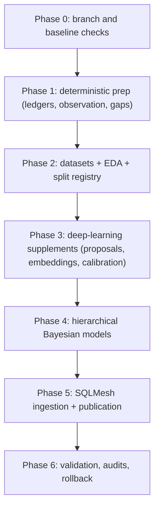

# Data Coverage Rollout And Validation

## TL;DR

Roll out the 1910-2025 coverage implementation in six gated phases that mirror the README DAG: deterministic prep, datasets+EDA+splits, deep-learning supplements, hierarchical Bayesian models (observation, fielding, geometry, park, run values, advancement, responsibility, pitch summary, shift propensity), SQLMesh ingestion + publication, then validation/audits/rollback. Each phase must be additive, auditable, reversible, and blocked from publication until provenance, calibration, conservation, and grouped holdout checks pass.

The first production release should publish no probabilistic values. It should publish ledgers, gap classifications, dataset metadata, EDA summaries, and validation gaps. This makes the assumptions visible before any imputed counter reaches a metric.

## Rollout DAG

This rollout's phase numbering matches the README's canonical DAG. Phase 0 is a baseline-capture preamble; phases 1-6 mirror the README's five-phase implementation DAG plus a final validation/rollback phase.



Phase 4 is itself a layered model family. Within Phase 4 the sub-order is: observation models first; then fielding allocation; then geometry; then park factors; then run values; then advancement; then responsibility; then pitch summary; then Model K (shift propensity), which is fit on event-level 2015+ and pitch-level 2009+ and feeds geometry, responsibility (primary alignment basis), and run values. The phases can overlap only after their dependency gates pass.

## Phase 0: Baseline Checks

Purpose: capture the current data state and prevent stale metadata from controlling the implementation.

Tasks:

- Record source counts by `source_type` for 1910-2025.
- Record event count and game count from `event_states_full`.
- Record baseline batted-ball unknown counts.
- Record baseline unknown putouts and fielding residual counts.
- Compare LSF coverage metadata against current DB source counts.
- Capture current `unknown_fielding_play_shares`, `park_factors`, and `linear_weights` outputs as legacy baselines.

Acceptance:

- Baseline report exists under `artifacts/statistical/baseline/<date>/`.
- Any metadata drift is filed in `notes/followups.md` or fixed in the relevant metadata source.
- All later validation reports link to the baseline artifact.

Example baseline query:

```sql
SELECT
    source_type,
    COUNT(*) AS games
FROM main_models.game_start_info
WHERE season BETWEEN @VAR('start_season', 1910) AND @VAR('end_season', 2025)
GROUP BY 1
ORDER BY 1;
```

## Phase 1: Deterministic Prep

Purpose: build the prep layer from `01-prep-ledgers.md`. Ledgers, the three sibling event observation tables, and gap classification.

SQLMesh targets:

- `main_models.source_acquisition_ledger`
- `main_models.source_data_error_risk_ledger`
- `main_models.official_aggregate_availability`
- `main_models.official_credit_authority`
- `main_models.personnel_state_reliability`
- `main_models.entity_link_reliability`
- `main_models.game_context_observation_ledger`
- `main_models.game_exposure_ledger`
- `main_models.event_observation_geometry`
- `main_models.event_observation_pitch`
- `main_models.event_observation_credit`
- `main_models.event_observation_context`
- `main_models.fielding_credit_gaps`

The three `event_observation_*` siblings share the same schema with narrower dimension enums per family (geometry: trajectory/location/edge/depth/side; pitch: count/sequence/result/strike-type; credit: putout/assist/error/handler).

Acceptance gates:

| Gate | Requirement |
| --- | --- |
| Source reconciliation | Ledger source counts match `game_start_info`, `season_team_coverage`, schedule, gamelog, and event surfaces. |
| Sentinel preservation | `Unknown`, `Default`, null, zero, empty sequence, and not-applicable states remain distinguishable. |
| Data-error joins | Known issue rows become masks, weights, or diagnostic flags. |
| Aggregate-total clarity | Primary `BoxScore` source status is distinct from usable aggregate totals in `PlayByPlay` games. |
| Personnel hard masks | Hard eligibility masks exist only for high-confidence personnel states. |
| Exposure policy | Suspended, forfeited, shortened, walk-off, and unknown completion statuses have denominator rules. |
| Observation sibling parity | The three `event_observation_*` tables share schema and remain joinable on `event_key`. |

Rollback:

- These tables are additive. Rollback path is `just promote-prod main_models.<previous_compatibility_view>` to restate the legacy view in prod, plus a `sqlmesh janitor` step to clean per-branch env snapshots for the bad ledger. Per-branch envs reference the bad ledger fingerprint and must be invalidated separately (via `just plan` on each affected branch).

## Phase 2: EDA And Modeling Datasets

Purpose: build frozen model inputs and decide model terms before fitting.

SQLMesh targets:

- `model_input_observation_batted_ball`
- `model_input_fielding_credit`
- `model_input_geometry`
- `model_input_park_factors`
- `model_input_run_values`
- `model_input_advancement`
- `model_input_pitch_summary`

Offline artifacts:

- dataset Parquet snapshots
- dataset metadata JSON
- split registry
- EDA reports
- weak-identification flags

Acceptance gates:

| Gate | Requirement |
| --- | --- |
| Dataset contract | Required provenance, reliability, aggregate-constraint, and split columns exist. |
| Leakage firewall | Grouped splits prevent game/source/scorer/park leakage for the intended validation. |
| EDA blockers | Source-family block missingness, source/parser data-error contamination, and weak connectivity are flagged. |
| Interaction list | Candidate interactions are justified by EDA and subject-matter reasoning. |
| Reproducibility | Dataset metadata includes query hash, source snapshot, schema, category maps, and row counts. |

Rollback:

- Rebuild modeling datasets from ledgers and keep prior dataset snapshots immutable. Rollback path is `just promote-prod main_models.<previous_compatibility_view>` plus `sqlmesh janitor` for affected per-branch env snapshots.

## Phase 3: Deep-Learning Supplements

Purpose: add calibrated deep proposals and embeddings as inputs to hierarchical models. Trained on the frozen Phase 2 datasets; outputs are out-of-fold predictions and embedding tables.

First scope:

- Geometry proposal probabilities.
- Handler proposal probabilities.
- Batter/pitcher/park/scorer embeddings for diagnostics and Phase 4 priors.

Acceptance gates:

| Gate | Requirement |
| --- | --- |
| Cross-fitting | Bayesian training rows use out-of-fold deep predictions. |
| Calibration | Reliability reports pass by source, scorer, era, hit/out, and missingness pattern. |
| Constraint masks | Personnel and structural masks zero impossible fielding proposal mass. |
| Baseline comparison | Deep proposals beat or complement deterministic and simple tabular baselines. |
| Artifact status | Probability tables and embeddings have manifests and validation status. |

Rollback:

- Bayesian models run without deep covariates by setting deep coefficients to zero or omitting proposal columns. Per-model `gamma_dl_zero` ablation flavors stay published as fallbacks (see Phase 4).

## Phase 4: Hierarchical Bayesian Models

Purpose: fit the model families from `03-hierarchical-models.md` in the strict dependency order. Each family is a separate model with its own dataset, prior, and acceptance gates, but they share the Phase 4 publication gate below.

Model families, in order:

- **Model A — Scorer/source observation.** Observation propensities and label-bias surfaces. Outputs feed every downstream model as weights and masks.
- **Model B — Fielding allocation.** Replaces `unknown_fielding_play_shares`. Putouts, assists, errors, no-box and box-residual constraints. Uses Model A weights.
- **Model C — Handler.** Ball-handler probability by player/position; feeds geometry.
- **Model D — Geometry.** Trajectory and side/depth/edge with recorded, deduced, normalized, and estimated layers preserved. Consumes Model A, B, C and Model K (shift posterior).
- **Model E — Park factors.** Hierarchical posterior park effects, replacing fixed pseudo-counts. Consumes Model D for batted-ball factors.
- **Model F — Run values.** Run expectancy and event/play run values, replacing hard sample-size thresholds in `linear_weights`. Consumes Model E and Model K.
- **Model G — Advancement.** Runner advancement after geometry and handler uncertainty are stable.
- **Model H — Pitch summary.** Pitch coverage and pitch summary distributions (count, sequence observedness, summary counts) after source-family block absence is classified.
- **Model I — Responsibility.** Fielding responsibility / range distribution. Consumes Model D and Model K (alignment basis).
- **Model K — Shift propensity.** Fit on event-level 2015+ and pitch-level 2009+. Feeds geometry, responsibility (primary alignment basis), run values.

Outputs (the union across families; see `03-hierarchical-models.md` for per-model schemas):

- `scorer_observation_propensities`
- `observation_model_draws`
- `observation_weighted_metric_inputs`
- `scorer_label_confusion_summaries`
- `observation_model_diagnostics`
- `imputed_fielding_credit`
- `fielding_credit_expected_counters`
- `fielding_credit_validation`
- `ball_handler_probabilities`
- `imputed_batted_ball_geometry`
- `normalized_contact_probabilities`
- `geometry_expected_counters`
- posterior `park_factors`
- posterior run-value tables
- runner/fielder advancement posteriors
- pitch-summary posteriors
- responsibility posteriors
- shift-propensity posteriors (Model K)

### Schema Sketches For Outputs Without A Home In `03-hierarchical-models.md`

These three outputs are referenced as Phase 4 deliverables but do not have a schema in `03-hierarchical-models.md`. Sketch them here so consumers can plan against them:

- `observation_weighted_metric_inputs` — `(metric_grain, observation_propensity_weight, source_method, confidence)`. Used by aggregate metrics for inverse-probability weighting.
- `scorer_label_confusion_summaries` — `(scorer_id, era_bucket, true_class, observed_class, confusion_prob_mean, confusion_prob_lower, confusion_prob_upper)`. Long format; one row per (scorer, era, true, observed) combination.
- `observation_model_diagnostics` — `(slice_key, calibration_metric, coverage_pct, n_events, n_holdout)`. Per-slice posterior-predictive diagnostics.

### Acceptance Gates (per-family)

Each model carries its own conservation, calibration, and holdout gates from `03-hierarchical-models.md`. The union of those gates is summarized in the Validation Matrix below.

### Cross-Family Acceptance Gate: gamma_dl Ablation

Each Bayes model is fit twice (`gamma_dl_zero` and `gamma_dl_shrunk`). Publication tier is selected per-model based on posterior-change magnitude — if including DL shifts publication-tier random-effect posteriors by more than 0.25 SD on most cells, the `gamma_dl_zero` flavor is published; otherwise the shrunk flavor. Both artifacts are stored; the published tier is named in the manifest.

Rollback (Phase 4 as a whole):

- Keep `unknown_fielding_play_shares`, `calc_batted_ball_type`, existing `park_factors`, `linear_weights`, `runner_advance_expectancy`, `fielder_advance_expectancy`, and `ground_ball_blame` as legacy compatibility surfaces until each posterior family clears validation.
- Rollback path is `just promote-prod main_models.<previous_compatibility_view>` to restate the legacy view in prod, plus a `sqlmesh janitor` step to clean per-branch env snapshots for the bad model. Per-branch envs reference the bad model fingerprint and must be invalidated separately (via `just plan` on each affected branch).

## Phase 5: SQLMesh Ingestion And Publication

Purpose: publish estimated outputs safely and preserve existing consumer expectations.

Publication tiers:

| Tier | Consumer-facing meaning |
| --- | --- |
| `official` | Authoritative source value at target grain. |
| `deterministic` | Rule-based value from canonical inputs. |
| `estimated` | Posterior expected value, probability, or interval. |
| `synthetic` | Generated row/value from aggregate-only or synthetic namespace. |
| `withheld` | Not published because validation or identification failed. |

Required columns for estimated tables:

- `source_snapshot_id`
- `model_name`
- `model_version`
- `artifact_id`
- `method`
- `observed_status`
- `estimate_mean` or `expected_counter`
- interval columns or probability columns
- `confidence_status`
- `weak_identification_flag`

Compatibility views:

- Keep existing point-factor columns where needed.
- Add estimated counterparts under explicit names.
- Do not silently change official metric semantics.

## Phase 6: Validation, Audits, And Rollback

Purpose: run the post-publication validation and audit pass against the rollout. This phase produces validation reports, not new model artifacts.

Tasks:

- Run the full validation matrix below against each Phase 4 model family at the published tier (`gamma_dl_zero` or `gamma_dl_shrunk`, per manifest).
- Run conservation, calibration, holdout, and sensitivity diagnostics against frozen Phase 2 datasets.
- Compare estimated namespace counters against legacy compatibility views and explain any directional drift.
- Confirm rollback paths still work: `just promote-prod main_models.<previous_compatibility_view>` plus `sqlmesh janitor` for each affected per-branch env, then `just plan` on each branch that referenced the bad fingerprint.

Acceptance gates:

| Gate | Requirement |
| --- | --- |
| Validation matrix | Every model family in the matrix below clears its row. |
| Drift explanation | Direction of change versus legacy is documented per family. |
| Rollback rehearsal | At least one per-branch env is rolled back end-to-end as a dry run. |
| Manifest completeness | Every published artifact lists model name, version, tier, `gamma_dl` flavor, and dataset snapshot. |

## Validation Matrix

| Model family | Conservation | Calibration | Holdout | Sensitivity | Publication blocker |
| --- | --- | --- | --- | --- | --- |
| Source ledgers | source reconciliation | not applicable | season/source spot checks | not applicable | source counts or statuses disagree. |
| Fielding credit | outs and box residuals | credit probabilities | aggregate-total and known-credit holdouts | no-box confidence | expected credits violate personnel or aggregate constraints. |
| Observation | not applicable | observedness reliability | scorer/source/era holdouts | MNAR shifts | hit/out or scorer calibration fails. |
| Geometry | probability normalization | class calibration | hit/out, scorer, alignment holdouts | deep/no-deep, deterministic reliability | fielder-location transport fails. |
| Park factors | exposure denominators | posterior predictive rates | park-season holdouts | roster/team/source controls | weak connectivity unflagged. |
| Run values | state transitions | runs by state | season/league holdouts | priors, park/context | sparse states overconfident. |
| Advancement | base/out consistency | category reliability | runner/fielder/context holdouts | geometry uncertainty | player effects absorb opportunity bias. |
| Responsibility | event-level normalization | range distribution reliability | alignment-regime and scorer holdouts | shift-regime, geometry uncertainty | range estimates overwrite official credit or transport across alignment regimes. |
| Pitch summaries | count/result constraints | sequence summary reliability | source/era holdouts | modern-to-historical transport | source-family block absence misclassified. |
| Shift propensity (Model K) | per-event/per-pitch normalization | era-conditional reliability | era/team/park holdouts | pre-2009 alignment uncertainty | pre-2009 alignment basis treated as observed rather than prior. |

## SQLMesh Gates

> **DEV_ONLY trap.** This project runs with `virtual_environment_mode=DEV_ONLY`
> plus `always_recreate_environment=True`. A bare `sqlmesh plan` without an env
> argument will silently advance state without rebuilding the unsuffixed
> `main_models.*` prod tables. Use `just plan` for per-branch dev iteration
> and `just promote-prod` for promoting a code change to prod. See
> `.claude/rules/sqlmesh.md`.

Before any new SQLMesh model family is promoted:

1. Iterate on the current branch with `just plan` (per-branch env auto-derived
   from the git branch slug; preview with `just which-env`). For a single
   model, use `just plan-model main_models.<model>`.
2. Run audits for the selected models and direct downstream consumers.
3. Compare row counts against baseline and dataset metadata.
4. Run `git diff --check`.
5. Confirm artifact manifests referenced by ingestion models exist.
6. Promote to prod with `just promote-prod main_models.<model> [more...]`,
   which runs `sqlmesh plan --restate-model <each>` and cascades to
   downstream consumers. For a clean wipe, use `just rebuild-prod`.

Promotion should be model-scoped. Avoid restating unrelated downstream model families until the estimated namespace is stable.

## Review Checklist

Before marking a phase complete:

- Estimand is written down.
- Target population is ledgered.
- EDA report exists and is linked.
- Dataset artifact is immutable.
- Split policy matches the validation question.
- Deep proposals, if present, are out-of-fold and calibrated.
- Bayesian diagnostics pass.
- Conservation and calibration reports pass.
- Weakly identified slices are withheld or tagged.
- Rollback path is documented.
- Existing docs are updated with the new table names and publication policy.

## Project Follow-Ups

Track open work in `notes/followups.md` when implementation reveals:

- stale LSF metadata.
- new source/parser data-error classes.
- source/schema drift.
- model assumptions that fail validation.
- tables that need semantic-layer exposure.
- public metric naming decisions.

Do not bury these in model artifacts alone. Follow-ups need to be grep-able from the repo.
