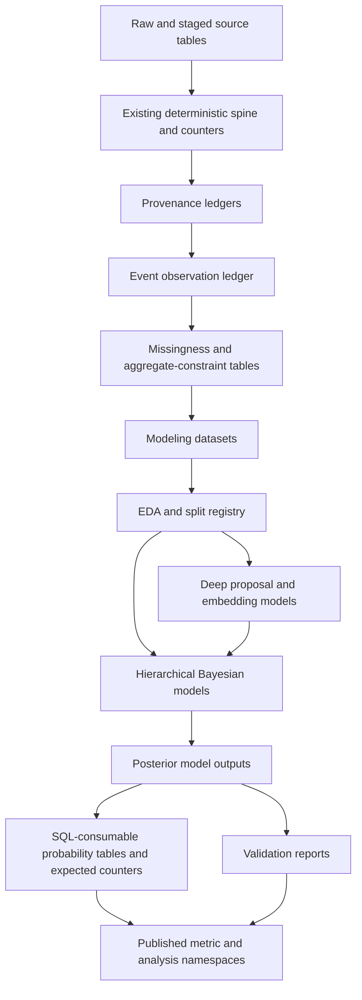

<!-- Shape: index and system-level RFC for a multi-document implementation plan. The companion docs own detailed contracts, code sketches, and rollout gates. -->

# Data Coverage Implementation Plan, 1910-2025

## TL;DR

This project defines how `baseball.computer` will represent, validate, and estimate incomplete baseball data for the 1910-2025 seasons. The database already contains event-level play-by-play for most games in that span plus smaller blocks of box-score-only and gamelog-only games. The current transformations use deterministic baseball rules, source precedence rules, and informal statistical reasoning. The goal is to replace those implicit assumptions with explicit provenance records, statistical models, validation reports, and publishable uncertainty.

The first implementation milestone is not filling missing values. It is a set of source and reliability tables that say what evidence exists for each game, player, event, official scoring total, personnel state, park/context field, and exposure denominator. After that, fit separate models for official fielding credit, scorer/source observation bias, batted-ball geometry, park effects, run values, runner advancement, fielder responsibility, and pitch summaries.

Invariant: raw source facts, deterministic derived facts, official aggregate totals, and probabilistic estimates remain separate. A box-score putout, a rule-derived batted-ball location, an estimated expected putout, and a synthetic event distribution are different quantities.

## Motivation

Historical baseball data is uneven. A modern game can include pitch sequences, batted-ball descriptions, scorer names, substitutions, line scores, and player-level box-score totals. Earlier games can have complete play-by-play but sparse batted-ball detail, unknown fielders, missing pitch sequences, scorer-specific language, or only aggregate box-score totals. Some games have a known final result but no event-level account.

The existing database already handles many of these cases with practical rules:

- derive broad batted-ball type from fielding evidence when the source omits trajectory;
- prefer event-derived stats when event data is complete;
- use box-score player totals when event fielding credit is incomplete;
- use grouped empirical rates for sparse fielding, batted-ball, park, and advancement contexts;
- fall back from narrow samples to broader historical averages.

Those rules are useful, but they hide statistical assumptions. They do not say how uncertain an estimate is, whether complete cases are representative, whether a scorer or source systematically omitted certain details, whether an aggregate total is reliable enough to constrain event estimates, or whether a park effect is really a park effect rather than a team, scorer, schedule, or era effect.

This implementation makes those assumptions explicit before the database publishes estimated values.

## Goal

Build an additive modeling layer for 1910-2025 that:

- identifies which facts are directly observed, rule-derived, aggregate-only, missing, contradictory, or structurally unavailable;
- records source reliability and known data-error risk before using a value as training truth or a statistical constraint;
- estimates missing or biased quantities with hierarchical Bayesian models and calibrated deep-learning supplements where they help;
- validates models with baseball conservation laws, grouped holdouts, posterior predictive checks, calibration reports, and sensitivity analyses;
- publishes probability tables, expected counters, posterior summaries, and compatibility views without overwriting raw or deterministic data.

The output is a set of implementation docs and model contracts, not a claim that every missing historical event detail can be recovered. Some data is structurally absent. Some effects are weakly identified. The database should expose that uncertainty rather than hide it behind point fills.

## Non-Goals

- Do not rewrite raw source tables or deterministic derived tables with model output.
- Do not create canonical event records for games that only have box-score or gamelog evidence.
- Do not publish neural-network classifications as facts.
- Do not collapse official scoring credit, physical ball handling, and analytical responsibility into one field.
- Do not treat a statistically weak estimate as complete data. Weakly identified slices should be labeled or withheld.

## Reader Assumptions

This document assumes the reader knows baseball scoring concepts and statistical modeling concepts:

- baseball grains such as game, team-game, player-game, plate appearance, event, half-inning, base/out state, box score, and official scoring credit;
- statistical ideas such as missingness mechanisms, measurement error, partial pooling, posterior prediction, calibration, and holdout validation.

This document does not assume the reader knows `baseball.computer` internals. Project-specific terms are introduced before they are used.

## Project Context

`baseball.computer` builds a DuckDB database from several historical baseball source families:

| Source family | Typical grain | Role in this plan |
| --- | --- | --- |
| Play-by-play | Event and event-player | Primary source for event states, batting, pitching, fielding, baserunning, batted-ball clues, and pitch sequences. |
| Box score | Game-player and game-team | Official aggregate totals for batting, pitching, fielding, line scores, decisions, earned runs, and reconciliation. |
| Gamelog or schedule | Game and team-game | Game existence, final result, coarse context, and coverage inclusion when detailed sources are absent. |
| Season supplements | Season-player and season-team | Aggregate season totals when event or box-score coverage is coarser. |
| Derived tables | Any downstream grain | Current deterministic transformations, completeness flags, metrics, and exploratory analyses. |

The implementation uses SQLMesh for deterministic database transformations and offline Python for expensive statistical fitting. SQLMesh should build stable inputs and ingest approved model outputs; it should not run Markov chain Monte Carlo or train neural networks inside ordinary database plans.

## Terminology

| Term | Meaning |
| --- | --- |
| Data coverage | The question of which historical baseball facts exist at which grain, which source supports them, and how missing or biased facts are represented. |
| Direct source value | A value recorded by an authoritative source at the same grain as the target fact. |
| Deterministic derived value | A rule-based value computed from source facts, such as broad batted-ball type inferred from fielding evidence. |
| Official aggregate total | A box-score or season-level total that can constrain estimates at a coarser grain. |
| Probabilistic estimate | A posterior probability, expected counter, draw, or interval from a fitted model. |
| Modeling dataset | A frozen Parquet input table with source, missingness, reliability, split, and target columns for one model family. |
| Provenance table | A deterministic table that records source family, observed status, authority, known data-error risk, reliability, and allowed downstream use. |
| Statistical model output | A versioned model output such as posterior draws, probability tables, expected counters, metadata, and validation reports. |
| Synthetic namespace | A separate output namespace for generated event-like distributions when the source exists only at an aggregate grain. |

## Doc Set

| Doc | Purpose |
| --- | --- |
| `README.md` | High-level implementation plan and directory index. |
| `data-coverage-taxonomy-1910-2025.md` | Taxonomy of source surfaces, missingness classes, fielding/geometry coupling, and imputation order. |
| `statistical-modeling-coverage-design.md` | Statistical design and model-family critique. |
| `01-prep-ledgers.md` | Deterministic SQLMesh tables for source availability, official aggregate totals, personnel/context/exposure reliability, and SQL sketches. |
| `02-eda-and-modeling-datasets.md` | Exploratory data analysis, interaction discovery, leakage-safe splits, modeling dataset contracts, and reusable dataset-builder sketches. |
| `03-hierarchical-models.md` | Bayesian model specs for observation, fielding allocation, geometry, park factors, run values, advancement, responsibility, pitch summaries, and synthetic personnel uncertainty. |
| `04-deep-learning-supplements.md` | Deep-learning proposal, embedding, calibration, cross-fitting, and integration contracts for hierarchical models. |
| `05-runtime-artifacts-and-library.md` | Shared Python library, orchestration, model-output registry, logging, metadata, diagnostics, and SQLMesh ingestion boundary. |
| `06-rollout-and-validation.md` | Phased rollout, acceptance gates, backtests, audits, publication policy, and rollback paths. |

## Current Data Shape

The local DuckDB database file produced by this project, `bc.db`, was verified on 2026-05-12 with this source mix for 1910-2025:

| Source type | Games | Implementation meaning |
| --- | ---: | --- |
| `PlayByPlay` | 205845 | Event-level models can operate after source and reliability checks classify the missing fields. |
| `BoxScore` | 1953 | Official aggregate totals can support aggregate outputs and constrained estimates, but they do not create canonical event facts. |
| `GameLog` | 4 | Coarse game evidence exists; event and player-game details are structurally absent. |

`event_states_full` has `18137758` events across the `205845` `PlayByPlay` games. Current scale checks also show `12038982` batted-ball rows in `calc_batted_ball_type`; `3992018` retain unknown final trajectory after deterministic inference, and `6989832` have unknown recorded location. `calc_fielding_play_agg` has `463102` unknown putouts in the target span. These counts are not implementation acceptance thresholds; they size the first modeling targets.

Invariant: event-level estimation is scoped to games with event-level sources. Aggregate-only and gamelog-only rows need aggregate outputs or a clearly named synthetic namespace.

## Target Architecture



The sequence in operational terms:

1. SQLMesh materializes deterministic provenance tables and modeling dataset extracts from the database model layer.
2. Offline Python reads frozen modeling dataset snapshots, validates splits, and runs EDA.
3. Deep models train only as cross-fitted proposal or embedding components.
4. Bayesian models consume provenance records, official aggregate constraints, deterministic evidence, and calibrated deep outputs.
5. Model-output exporters write versioned Parquet, NetCDF or Zarr, JSON metadata, and validation summaries.
6. SQLMesh ingests compact model outputs into additive model namespaces.
7. Published metrics opt into expected counters, probability tables, or official-only views explicitly.

Invariant: SQLMesh plans should never run full MCMC or train neural models. SQLMesh owns deterministic transforms, stable ingestion, and audits.

## Namespaces

| Namespace | Meaning | Example |
| --- | --- | --- |
| Raw source | Direct source fields and source sentinels. | `stg_events.batted_trajectory` |
| Deterministic derived | Rule-based transformations from source facts. | `calc_batted_ball_type.trajectory` |
| Official aggregate | Box, gamelog, or Databank-style official counters at their source grain. | `stg_box_score_fielding_lines.putouts` |
| Provenance ledger | Source, authority, observed status, known data-error risk, and reliability facts. | `event_observation_ledger` |
| Statistical estimate | Probability, expected counter, posterior draw, or uncertainty summary. | `imputed_fielding_credit` |
| Deep supplement | Calibrated proposal distribution or embedding used by statistical models. | `dl_geometry_proposals` |
| Synthetic namespace | Generated rows for aggregate-only sources when explicitly accepted. | `synthetic_event_distribution` |

Invariant: a posterior expected putout, a box-score putout, a deterministic deduced putout, and a sampled synthetic putout are different values. Do not store them in one column without `source`, `method`, `observed_status`, `model_version`, and uncertainty metadata.

## Workstreams

| Workstream | First outputs | Modeling dependency |
| --- | --- | --- |
| Source availability and data-error flags | `source_acquisition_ledger`, `source_data_error_risk_ledger` | All later modules use these as masks, strata, and training weights. |
| Official aggregate totals and authority | `official_aggregate_availability`, `official_credit_authority` | Fielding allocation and aggregate reconciliation require field-level totals at the right grain. |
| Identity, personnel, context, exposure | `entity_link_reliability`, `personnel_state_reliability`, `game_context_observation_ledger`, `game_exposure_ledger` | Fielding, park, advancement, and run-value models need reliable constraints and denominators. |
| Observation ledger | `event_observation_ledger`, `event_observation_context` | Every statistical model consumes these contracts. |
| Gap classification | `fielding_credit_gaps`, batted-ball and pitch gap views | Converts generic missingness into model-specific target populations. |
| EDA and modeling datasets | `stat_model_dataset_*`, `stat_model_eda_*`, split registry | Determines interaction terms, weak identification, and leakage-safe evaluation. |
| Deep supplements | `dl_proposal_*`, `dl_embedding_*`, calibration reports | Supplies cross-fitted probabilities and embeddings to Bayesian models. |
| Hierarchical models | `imputed_fielding_credit`, `imputed_batted_ball_geometry`, `park_factor_posterior`, `run_value_posterior` | Produces uncertainty-aware model outputs. |
| Publication | expected-counter views, compatibility views, validation reports | Makes official, deterministic, and estimated metrics explicit to consumers. |

## Implementation DAG

```mermaid
flowchart LR
  subgraph Prep["Phase 1: deterministic prep"]
    P1["source ledgers"]
    P2["official aggregate total ledgers"]
    P3["personnel/context/exposure"]
    P4["event observation"]
    P5["gap classification"]
  end

  subgraph Datasets["Phase 2: datasets and EDA"]
    F1["dataset contracts"]
    F2["split registry"]
    F3["interaction EDA"]
    F4["connectivity EDA"]
  end

  subgraph ML["Phase 3: deep supplements"]
    M1["proposal models"]
    M2["embeddings"]
    M3["calibration"]
  end

  subgraph Bayes["Phase 4: hierarchical models"]
    B1["observation models"]
    B2["fielding allocation"]
    B3["geometry/contact"]
    B4["park factors"]
    B5["run values"]
    B6["advancement/responsibility"]
    B7["pitch summaries"]
  end

  subgraph Publish["Phase 5: ingestion and publication"]
    O1["posterior model outputs"]
    O2["SQL model-output views"]
    O3["metric consumers"]
    O4["validation reports"]
  end

  P1 --> P4
  P2 --> P5
  P3 --> P4
  P4 --> P5
  P5 --> F1
  F1 --> F2
  F2 --> F3
  F2 --> F4
  F3 --> M1
  F4 --> B1
  M1 --> M3
  M2 --> M3
  M3 --> B1
  B1 --> B2
  B1 --> B3
  B2 --> B3
  B3 --> B4
  B3 --> B6
  B4 --> B5
  B5 --> O1
  B6 --> O1
  B7 --> O1
  O1 --> O2
  O2 --> O3
  O4 --> O3
```



## Repository Shape

Proposed new code lives in a dedicated statistical package instead of being mixed into the existing ML or park-factor packages:

```text
bc/python_models/statistical/
  __init__.py
  outputs.py
  calibration.py
  config.py
  duckdb_io.py
  datasets.py
  logging.py
  manifests.py
  orchestration.py
  splits.py
  validation.py
  pymc_utils.py
  models/
    observation.py
    fielding_credit.py
    geometry.py
    park_factors.py
    run_values.py
    advancement.py
    pitch_summary.py
  deep/
    proposals.py
    embeddings.py
    calibrators.py
  cli.py
```

SQLMesh model additions should be grouped by role:

```text
bc/models/intermediate/coverage/
  source_acquisition_ledger.sql
  source_data_error_risk_ledger.sql
  official_aggregate_availability.sql
  official_credit_authority.sql
  personnel_state_reliability.sql
  entity_link_reliability.sql
  game_context_observation_ledger.sql
  game_exposure_ledger.sql
  event_observation_ledger.sql
  fielding_credit_gaps.sql

bc/models/intermediate/statistical_datasets/
  model_input_observation_batted_ball.sql
  model_input_fielding_credit.sql
  model_input_geometry.sql
  model_input_park_factors.sql
  model_input_run_values.sql
  model_input_advancement.sql
  model_input_pitch_summary.sql

bc/models/intermediate/statistical_outputs/
  imputed_fielding_credit.py
  imputed_batted_ball_geometry.py
  scorer_observation_propensities.py
  park_factor_posterior.py
  run_value_posterior.py
  advancement_posterior.py
  pitch_summary_posterior.py
  statistical_model_runs.py
```

The exact directory names can change, but the separation should not: deterministic SQL, frozen modeling datasets, offline fitting code, and SQL model-output ingestion are different concerns.

## Dependency Policy

Add a separate optional dependency group for Bayesian and statistical model-output work:

```toml
[dependency-groups]
stats = [
    {include-group = "build"},
    "pymc>=5",
    "arviz>=0.20",
    "xarray>=2025.1",
    "zarr>=2.18",
    "scikit-learn>=1.5",
]
```

Keep neural-model training in the existing `ml` group unless a shared dependency forces a split. The `stats` group should not become a default requirement for ordinary SQLMesh builds until model-output ingestion depends on a small runtime-only subset.

## Acceptance Definition

The implementation is complete only when each published probabilistic table has:

- A named estimand and grain.
- A deterministic modeling dataset with source family, source inclusion status, observation status, data-error flags, personnel/context/exposure reliability, official aggregate constraint state, and split metadata.
- Prior predictive, simulated-data recovery, posterior predictive, calibration, and conservation reports where applicable.
- Versioned model outputs with query hashes, schema hashes, category maps, seeds, package versions, sampler diagnostics, and validation status.
- SQLMesh audits proving unique grain, non-null keys, probability normalization, expected-counter conservation, and valid source/method enums.
- A rollback path to official-only or deterministic-only outputs.

## Open Decisions

1. Choose canonical model naming and SQL directory placement before adding files.
2. Decide whether first Bayesian prototypes live in notebooks/scripts or immediately in `bc/python_models/statistical`.
3. Decide whether public metrics should expose posterior intervals or only estimated counters plus method/confidence fields.
4. Decide the minimum confidence threshold for no-box official-credit estimates.
5. Decide whether synthetic event distributions for aggregate-only games are in scope for this implementation cycle or a later project.
