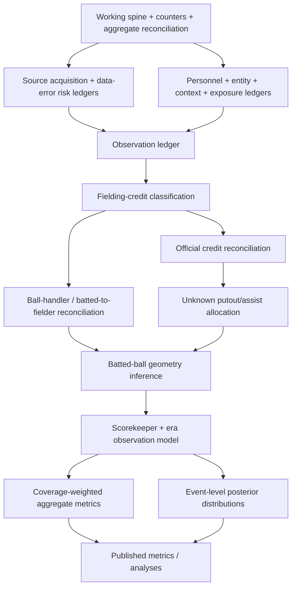

<!-- Shape: report/reference note rather than the stock architecture template. The request is an ontology of missing data and imputation order, so the doc keeps the required frontmatter and decision-first opener but uses taxonomy, dependency, and playbook sections. -->

# Data Coverage Taxonomy, 1910-2025

## TL;DR

For 1910-2025, treat the game/event/personnel spine, deterministic event counters, aggregate reconciliation, and known data-issue ledgers as the working foundation, not as facts that imputation can use blindly. The next dependency is a provenance layer: classify source availability, source data-error risk, personnel reliability, context reliability, and exposure before filling event fields.

After provenance is explicit, the hard problem starts with fielding credit, because unknown fielders and box/event fielding discrepancies are both missing data and inputs to batted-ball-location inference. The safe order is: build source and observation ledgers, classify fielding-credit gaps, reconcile official fielding credit versus ball-location evidence, allocate unknown putouts/assists with constrained expected values, normalize batted-ball geometry with explicit era/shift/scorer effects, adjust contact-type labels for scorekeeper judgment bias, then use pitch/baserunning/ML only as downstream parallel signals.

Implementation details now live in `README.md` and the companion docs in this directory. This taxonomy defines the missingness ontology and order of operations; the implementation docs define the SQLMesh ledgers, modeling datasets, model code, model-output layer, and rollout gates.

## Scope

This report covers the database shape implied by the general models, data-quality/completeness models, and `bc/models/analyses` for seasons 1910-2025. It follows the project goal of treating this span as the target event-coverage range, but it does not assume every game inside the span has event rows.

The local `bc.db` snapshot verified on 2026-05-12 contains `205845` `PlayByPlay` games, `1953` `BoxScore` games, and `4` `GameLog` games in 1910-2025. `event_states_full` contains `18137758` events across the `205845` `PlayByPlay` games only. LSF metadata in `docs/llm/supplement.yaml` and `docs/llm/lsf_1_spec.md` now reports event-level play-by-play as complete from 1910 with sparse 1871-1909 coverage, matching the database; the 1910-1911 drift item is resolved.

This report does not provide completeness rates or rank seasons, teams, scorers, or players by coverage. It classifies missingness types and gives a dependency order for daisy-chained imputation.

## Current Source Snapshot

The current source mix inside the target span is mixed:

| Source type | Games, 1910-2025 | Meaning for imputation |
| --- | ---: | --- |
| `PlayByPlay` | 205845 | Event-level imputation can operate after observation and reliability ledgers classify field-level gaps. |
| `BoxScore` | 1953 | Official aggregate totals exist, but canonical event facts should not be fabricated without a synthetic namespace. |
| `GameLog` | 4 | Game existence and coarse result/context evidence exist, but event and player-game detail are structurally absent. |

`season_team_coverage` reports `2929` `PlayByPlay` team-seasons and `269` `BoxScore` team-seasons in 1910-2025. This is the right coarse surface for source-availability ledgers, but imputation needs a game/team/dimension ledger because source absence is not uniform within every season.

Invariant: `game_data_completeness.has_box_score` currently marks games whose primary `game_start_info.source_type` is `BoxScore`; it does not prove that a `PlayByPlay` game has a usable box-score total for every player-game field. Official aggregate totals need their own availability and data-error checks.

## Source Surfaces

| Surface | Representative models | Role in coverage reasoning |
| --- | --- | --- |
| Source availability and provenance | `season_team_coverage`, `game_start_info.source_type`, `stg_schedule`, `stg_gamelog`, `stg_games` | Separates event-level missingness from source-family block absence and determines whether a row belongs to the event-imputation target population. |
| Game and event spine | `game_start_info`, `game_results`, `team_game_start_info`, `event_states_full`, `season_team_coverage` | Defines which games, teams, event ids, lineups, base/out state, score state, and source type exist. |
| Event stat derivation | `event_batting_stats`, `event_baserunning_stats`, `event_pitching_stats`, `event_fielding_stats`, `event_offense_stats`, `event_player_fielding_stats` | Converts parsed events into canonical counting stats before game, season, and metric aggregation. |
| Game/player aggregation | `player_game_*`, `team_game_*`, `player_team_season_*`, `team_season_fielding_stats`, `metrics_*` | Blends event, box-score, and Databank-like aggregate sources where available. |
| Data-quality exceptions | `box_score_data_issues`, `team_game_data_issues`, audit macros | Distinguishes known source/parser data errors from model bugs. |
| Completeness views | `game_data_completeness`, `player_game_data_completeness`, `event_completeness_*`, `player_completeness` | Names field-level availability dimensions without turning them into final estimates. |
| Exploratory analyses | `unknown_plays`, `unknown_play_no_box`, `box_event_fielding_discrepancies`, `scorekeeper_tendencies_*`, `ground_ball_blame`, `fielder_advance_expectancy`, `runner_advance_expectancy` | Identifies missingness mechanisms and candidate priors for imputation. |
| Existing inference surfaces | `calc_batted_ball_type`, `unknown_fielding_play_shares`, `ml_features`, `predictions_*`, `park_factors` | Already applies deterministic or model-based inference that future imputation should reuse rather than duplicate. |

## Ontology

### Coverage Grain

Coverage needs to be described at the smallest grain where the missingness mechanism is defined:

| Grain | Missingness question | Canonical detector |
| --- | --- | --- |
| Season-team | Is the team's season built from play-by-play, box score, or gamelog only? | `season_team_coverage.least_granular_source_type` |
| Game-team | Does this team-game have play-by-play, box-score aggregates, starting pitcher, official line score, and enough fielding detail? | `game_start_info.source_type`, `game_data_completeness`, `team_game_*` |
| Player-game | Does this player-game have offensive, pitching, fielding, pitch, batted-ball, and lineup participation detail? | `player_game_data_completeness`, `player_game_appearances`, `player_game_*` |
| Event | Is the plate appearance, baserunning play, pitch sequence, batted ball, fielding credit, and state transition known? | `event_completeness_*`, `stg_events`, `stg_event_*` |
| Event-player | Is the credited player known for a fielding or pitching contribution? | `calc_fielding_play_agg`, `event_player_fielding_stats`, `event_pitching_stats` |
| Derived metric | Is the metric calculated from complete upstream counters, partial event detail, or coverage-weighted event detail? | `metrics_*`, metric registry, `event_coverage_rate` |

Invariant: Missingness is not a single boolean. A row can be complete for basic batting, incomplete for batted-ball trajectory, complete for team fielding, incomplete for player fielding credit, and unusable for pitch-sequence metrics.

### Missingness Classes

| Class | Definition | Current examples | Reliable imputation family |
| --- | --- | --- | --- |
| Structural absence | Data does not exist at the target grain even though a coarser grain exists. | No event-shaped rows for gamelog-only games, including the few `GameLog` rows inside 1910-2025. | Do not impute inside the event models unless a new event generator is explicitly accepted. Prefer aggregate-only rows with source flags. |
| Source-family block absence | The target grain exists for some games or dimensions, but an entire source family or file block was not acquired or not usable. | `BoxScore` and `GameLog` games inside 1910-2025; pitch-sequence blocks missing by source era; source-family gaps within team-seasons. | Build source acquisition and inclusion ledgers before event imputation. Use inclusion weights only after target-population decisions are explicit. |
| Aggregate-only coverage | Official or parser-derived aggregate exists, but event attribution is unavailable or incomplete. | Box-score lines filling `player_game_offense_stats` and `player_game_pitching_stats` for box-score-only games; Databank supplements season stats. | Fill additive counters from the aggregate source only at that aggregate grain; never pretend event-level detail exists. |
| Field-level unknown | Event exists, but a parsed field is `Unknown`, `0`, `Default`, or null. | Unknown fielder on putouts, unknown batted trajectory, default location depth/angle, missing count, unknown pitch type. | Deterministic inference first, empirical priors second, ML predictions third. Preserve raw and imputed fields separately. |
| Selection-biased detail | Detail is recorded only for non-random subsets, often depending on result salience or scorer habits. | Batted-ball trajectory and location, especially hits before broad modern coverage; line-drive/pop-up distinctions. | Estimate missingness propensity and correct at the aggregate/stat layer before event-level stochastic imputation. |
| Cross-source disagreement | Event-derived and box-score-derived totals disagree. | Fielding discrepancies, putout/innings gaps, known within-row box-score violations. | Define authority order by stat and grain; use exception tables for known upstream artifacts; reconcile with bounded audits. |
| State reconstruction gap | The event exists but state needed to interpret it is incomplete or derived indirectly. | Base/out state, score state, personnel state, current pitcher, charged pitcher. | Reconstruct deterministically from the event sequence, then audit conservation laws before using downstream. |
| Official scoring convention gap | The raw facts are known, but official credit differs from simple event logic. | Scratched starting pitchers, inherited/bequeathed runs, official earned runs versus run assignment. | Use official aggregate source where scoring convention is official; model event attribution separately and expose both. |
| Taxonomy collapse | Raw codes exist, but the desired category is less granular or more semantically stable than the raw code. | Trajectory broad class, location depth/side/edge, pulled/opposite-field direction, baserunning result categories. | Seed-table taxonomy and deterministic mapping. This is derivation, not imputation, unless a missing raw field is filled. |
| Sparse-context estimation | Detail exists, but the conditional bucket needed for adjustment is sparse. | Park factors, fielder-location shares, runner/fielder advance expectancy, ground-ball blame. | Hierarchical fallback: exact bucket, broader bucket, season/league baseline, historical prior. |

Invariant: Any imputed or reliability-adjusted value needs companion facts for `source`, `method`, `observed_status`, and `confidence` or `weight`. Without those, downstream aggregations cannot distinguish official, deterministic, probabilistic, source-family-block-missing, and data-error-prone data.

## Current Coverage Semantics

### Game And Event Spine

`game_start_info` is the root game table. It merges `stg_games` with gamelog-only rows, attaches franchise metadata, lineups, fielding maps, game type flags, and start-time information. For this report's scope, the play-by-play rows should be treated as the canonical spine.

`game_results` attaches final score, winning/losing teams, pitcher decisions when present, line scores, duration, suspension, and forfeit flags. It can read from event/box rows or gamelog rows. This table defines completed game outcomes but should not be used to infer missing event outcomes except as a conservation check.

`team_game_start_info` duplicates each game into home and away team rows and derives team-side, opponent, series, season-game number, and rest information. Any team-game imputation should join through this table so home/away and team/opponent semantics stay stable.

`event_states_full` is the core event-state table. It combines `stg_events`, game start info, personnel, and base/out state into one event row with start and end state, run/win expectancy keys, score margins, batter/pitcher hands, and team ids.

### Event Statistics

`event_batting_stats` calculates plate-appearance outcomes and core batting counters. It handles special responsibility fields such as strikeout-responsible batter and walk-responsible pitcher.

`event_baserunning_stats` turns the baserunner table into run, out, advance, stolen-base, caught-stealing, pickoff, force, lead-runner, and extra-base-advance counters. This model is a dependency for run assignment and for runner-level imputation.

`event_run_assignment_stats` assigns runs to the current or charged pitcher and separates inherited and bequeathed runners. This table is where official charged-pitcher semantics enter event pitching.

`event_pitching_stats` merges batting, baserunning, batted-ball, pitch-sequence, and run-assignment data for pitchers. It inserts supplemental rows when a charged pitcher is not the current pitcher.

`event_fielding_stats` aggregates team fielding by event and retains unknown-putout and incomplete-event indicators. `event_player_fielding_stats` expands fielding to every player-position present in the fielding state, then joins actual fielding plays when credited.

Invariant: Event-level offense, pitching, fielding, and baserunning stats are additive counters. Rates and context-adjusted metrics must be recomputed from counters at the target grouping grain.

### Aggregate Reconciliation

`player_game_offense_stats` uses event offense for play-by-play games and unions box-score batting lines for box-score-only games. In the 1910-2025 play-by-play scope, event offense should dominate, but the model shape still matters because it defines how coarser sources are allowed to enter.

`player_game_pitching_stats` uses event pitching plus pitching flags for play-by-play games and box-score pitching lines for box-score-only games. It then joins official game decisions and earned runs. Earned runs are a key example of official scoring data that should not be reconstructed solely from event runs.

`player_position_game_fielding_stats` does not simply union event and box fielding. It joins both, uses event outs played as authoritative, and chooses event fielding when there are no unknown putouts while the fielder was on the field; otherwise it can use box-score fielding when available. This is the database's clearest existing example of source-specific authority order.

`team_game_fielding_stats` uses team-level event fielding, player-level fielding, and team box-score lines. It generally trusts play-by-play for baserunning-derived team fielding events such as stolen bases, caught stealing, double plays, and triple plays, while using largest-of-source logic for some team fielding counters where NLB data quality is uneven.

Season models aggregate player-game rows and supplement from Databank where relevant. The supplement is currently fill-on-null for many batting and pitching counters, with a separate pre-1920 override for stolen bases and caught stealing.

Invariant: Aggregate sources should fill aggregate counters, not create hidden event rows. If an aggregate source fills a counter, the filled grain must remain visible.

## Completeness Dimensions

### Play-By-Play And Box Coverage

`game_data_completeness` names coarse game-level booleans: play-by-play, box score, trajectory, location, batted-to-fielder, fielder putouts/assists/errors, counts, pitch sequence, pitch results, and strike types.

`player_game_data_completeness` projects the same idea onto batting and pitching player-games. It intentionally tracks player-game availability for batted balls and pitch data, but fielding-credit completeness is still marked as future work.

`player_completeness` aggregates player-game completeness booleans and is useful as an index of where detailed data can support player-level research, not as a final imputation input.

### Batted-Ball Detail

`event_completeness_batted_balls` tracks several layers:

| Dimension | Meaning |
| --- | --- |
| `has_trajectory` | Detailed trajectory is not `Unknown`. |
| `has_general_location` | General Retrosheet location is known. |
| `has_batted_to_fielder` | Credited fielder exists, with a special exemption for non-in-play home run or ground-rule-double location. |
| `has_any_location` | Either fielder proxy or general location exists. |
| `has_depth`, `has_angle`, `has_strength` | Optional subfields are populated beyond default codes. |
| groundball/airball-specific flags | Coverage is evaluated within broad contact class because scorekeeper behavior differs by contact type. |
| `has_misclassified_home_run_distance` | Flags a likely depth-missingness signal for middle-field home runs that are not deep. |

`calc_batted_ball_type` already derives broad trajectory and coarse location from fielding credit and seed tables. It preserves recorded trajectory/location separately from derived trajectory/location. This should remain the first stage for batted-ball imputation.

### Pitch Detail

`event_completeness_pitches` separates count coverage from pitch sequence coverage:

| Dimension | Meaning |
| --- | --- |
| `has_count_balls` / `has_count_strikes` | Count at the event level is present. |
| `has_count` | Both count fields are present. |
| `has_pitches` | At least one pitch-like sequence item exists. |
| `has_pitch_results` | Pitch sequence items are not all unknown. |
| `has_strike_types` | Strike sequence items distinguish called/swinging/foul/in-play rather than `StrikeUnknownType`. |

`event_pitch_sequence_stats` converts sequences into pitch counters, swing/contact counters, strike type counters, ball counters, pickoff/pitchout metadata, and pitch-related baserunning events. A pitch-sequence imputation should target the sequence-stat layer or a parallel imputed-sequence layer; it should not silently rewrite raw sequences.

### Fielding Credit

`event_completeness_fielding_credit` marks whether fielder putouts, assists, and errors are known. Unknown putouts are more important than explicit unknown assists because an unknown putout often means the assist chain is also missing.

`calc_fielding_play_agg` carries `unknown_putouts` and `incomplete_events`. These fields are the bridge between raw unknown fielding plays and all downstream fielding imputation.

`unknown_fielding_play_shares` estimates how to allocate unknown plays to fielders by comparing event-derived plays against box-score surplus and historical unassisted-putout rates. It splits estimated unknown plays into assist and putout subsets.

Invariant: Unknown fielding credit is not just "missing player id." It can mean a known putout count with unknown fielder, an unknown assist chain, or a box/event disagreement where the event has enough team information but not player attribution.

### State, Personnel, And Official Scoring

Personnel and state gaps are load-bearing because downstream imputation conditions on batter, pitcher, fielders, handedness, base/out state, score, park, league, and season.

`player_game_appearances` merges event lineup appearances and box-score batting/fielding appearances. It defines games started, pinch-hit/pinch-run/defensive-sub flags, lineup position, first fielding position, and fielding-position list.

`team_game_data_issues` currently enumerates scratched starting pitchers: games where `game_start_info` records a starting pitcher who never appears in event pitching. The audit carve-out preserves MLB scoring semantics while keeping ordinary starter-count checks tight.

Earned runs are a separate official-scoring channel. `player_game_pitching_stats` joins `stg_game_earned_runs` when available. Event run assignment can explain run responsibility and inherited/bequeathed runners, but official earned-run credit has conventions that should remain a separate source.

## Existing Imputation And Adjustment Patterns

### Deterministic Inference

Deterministic inference is already used in `calc_batted_ball_type`:

| Missing target | Available signal | Existing inference |
| --- | --- | --- |
| Broad trajectory | Unassisted putout, outfield location, home run, assisted infield putout | Infer air ball or ground ball when explicit trajectory is unknown. |
| Coarse location | `batted_to_fielder`, recorded location, trajectory | Map fielder position and location seeds to depth/side/edge; treat outfielder-fielded ground balls carefully. |
| Pull/opposite direction | Batter hand plus inferred/known angle | Derive pulled and opposite-field batted-ball counters. |

This family is the most reliable because it is rule-based, auditable, and preserves raw versus derived fields.

### Aggregate Fill

Aggregate fill happens in player-game and season models:

| Target | Source | Pattern |
| --- | --- | --- |
| Box-score-only player batting/pitching games | `stg_box_score_*_lines` | Union aggregate rows when there is no event file. |
| Fielding player-game counters | Event and box fielding | Choose event when complete; otherwise choose box if it has the field. |
| Season offense/pitching | Databank | Fill null Retrosheet-derived regular-season counters from Databank. |
| Pre-1920 stolen bases/caught stealing | Databank | Override Retrosheet totals rather than fill-on-null. |

This family is reliable only when the source grain matches the target grain. It should not drive event-level reconstruction without a separately accepted stochastic event generator.

### Coverage-Weighted Metrics

The metrics layer already handles batted-ball selection bias with event-based coverage metrics:

| Metric family | Purpose |
| --- | --- |
| `known_trajectory_*_rate` | Measures how often trajectory is known overall and separately for hits versus outs. |
| `known_trajectory_*_out_hit_ratio` | Captures hit/out selection bias in trajectory recording. |
| `known_angle_*_rate` | Measures whether left/right/middle angle is known, again separated by hits and outs. |
| `coverage_weighted_*_batting_average` | Adjusts batted-ball batting average by the observed hit/out coverage ratio. |
| `pitch_data_coverage_rate` | Measures the rate of plate appearances with pitch-by-pitch data. |

This is an adjustment strategy, not event imputation. It is often preferable when the downstream question is aggregate and the missingness is selection-biased.

### Empirical Priors

The analysis folder contains candidate prior surfaces:

| Prior surface | Candidate target |
| --- | --- |
| `scorekeeper_tendencies_contact` | Scorekeeper/decade bias in trajectory knownness and contact labels. |
| `scorekeeper_tendencies_location` | Scorekeeper/decade bias in location knownness and outfield/infield detail. |
| `scorekeeper_tendencies_batter` | Batter/team deviations in location and trajectory recording for hits. |
| `ground_ball_blame` | Shares from ground-ball location/fielder combinations to responsible infielder/outfielder positions. |
| `fielder_location_shares` | Conditional distribution of batted location and fielder, with batter hand, shift era, base state, and outs. |
| `runner_advance_expectancy` | Expected runner advancement by state, fielder, contact, and result. |
| `fielder_advance_expectancy` | Fielding contribution on runner advancement after conditioning on state, contact, and fielder. |
| `park_factors` | Park/season/league priors with fallback from advanced to basic factors. |

These are useful only after deterministic and aggregate reconciliation have stabilized the row set. Many are experimental and should be promoted to production only after they write provenance and have fallback hierarchy.

### Machine-Learning Predictions

The ML surface trains and scores event outcomes from `ml_features`. Targets include plate-appearance category, in-play flag, batted trajectory, batted location, baserunning category, runs following, win flag, and has-batting flag.

ML prediction tables are gated by artifact existence. This is correct for production safety: a fresh plan skips untrained targets. For coverage work, ML should be treated as the last imputation family because it is least transparent and most sensitive to target leakage, calibration, and historical distribution shift.

Invariant: ML predictions should never replace deterministic facts. They can supply a parallel predicted field or posterior distribution for fields that remain missing after deterministic and aggregate reconciliation.

## Post-Reconciliation Imputation Order

### Working Foundation

The rest of this report assumes these pieces are usable after provenance ledgers verify their source and reliability status:

1. Game, team, event, lineup, personnel, score, and base/out spine.
2. Deterministic event counters for batting, baserunning, pitching, and fielding.
3. Official aggregate reconciliation for box scores, earned runs, decisions, and season aggregates.
4. Known source-data exception ledgers and strict audits.
5. Multi-grain completeness flags that identify which data dimensions are present.

The open problem begins earlier than event-field allocation: the project needs deterministic ledgers that say which rows are in the event-imputation target population, which fields are missing by source-family block, which observed values are likely source/parser data errors, and which personnel/context/exposure facts are reliable enough to become hard constraints.

### Required Provenance Ledgers

| Ledger | Grain | Why it comes first |
| --- | --- | --- |
| `source_acquisition_ledger` | `game_id, team_id, dimension` | Distinguishes event-level missingness from `BoxScore` or `GameLog` source-family block absence. |
| `source_data_error_risk_ledger` | source row or modeled row | Prevents known source/parser issues from becoming training truth or official aggregate constraints. |
| `personnel_reliability_ledger` | `event_key, side, fielding_position` or `game_id, player_id` | Determines whether eligibility masks for fielding allocation are hard constraints or weak evidence. |
| `entity_link_reliability_ledger` | entity id episode | Protects player, team, park, scorer, and umpire random effects from unresolved aliases or temporal instability. |
| `context_observation_ledger` | `game_id, context_field` | Marks park, weather, handedness, rule, scorer, and schedule context as observed, derived, missing, or suspect. |
| `exposure_ledger` | game/team-game/half-inning | Defines innings, outs, suspended/forfeit/walk-off status, and denominator policy for rates and value models. |

Invariant: field imputation should consume these ledgers as masks, strata, weights, and uncertainty inputs. Each fitted model should not rediscover source reliability independently.

### Dependency DAG

The same sequence in prose:

1. Start from the working spine, counters, aggregate reconciliation, audits, and completeness views.
2. Build source acquisition, data-error risk, personnel, entity, context, and exposure ledgers.
3. Build the event observation ledger from raw fields, sentinel semantics, deterministic derivations, and provenance outputs.
4. Classify fielding-credit gaps before estimating official credit, handler, or geometry.
5. Use fielding and handler probabilities to inform batted-ball geometry, then fit scorer/source observation models and downstream metric inputs.

Invariant: Fielding imputation feeds batted-ball imputation. If the fielder is unknown, the database loses one of its strongest deterministic signals for batted-ball side, depth, broad contact, and ground-ball responsibility.

## Fielding Credit

### Separate Three Targets

Fielding data cannot be fixed by "assigning the fielder." There are at least three different targets:

| Target | Meaning | Best source | Why it must stay separate |
| --- | --- | --- | --- |
| Official fielding credit | Who gets putouts, assists, errors, double plays, passed balls, etc. | Box score when event credit is incomplete; event when complete. | This is the stat line. It can disagree with ball geometry without either being wrong. |
| Ball handler | Which position/player fielded or completed the play. | Event fielding plays and `batted_to_fielder`. | This feeds batted-ball side/depth inference but is not always the responsible defender. |
| Fielding responsibility/opportunity | Which fielder should be charged/credited for reaching or not reaching a ball. | Location, trajectory, batter hand, alignment era, base/out, result, and priors. | This is an analytical estimate, especially for range, and cannot be read directly from official credit. |

The current models already imply this split. `player_position_game_fielding_stats` reconciles official-ish player-game fielding counters; `calc_batted_ball_type` uses fielder/location evidence for geometry; `ground_ball_blame` explores responsibility as a conditional distribution rather than a fact.

### Bias And Failure Modes

| Problem | Where it appears | Consequence | Handling |
| --- | --- | --- | --- |
| Unknown putout implies unknown assist chain | `calc_fielding_play_agg.unknown_putouts`, `incomplete_events` | The database may know an out happened but not the putout fielder or whether assists occurred. | Allocate putout and assist expectation separately; do not infer `assists = 0` from no explicit assist. |
| Box/event disagreement | `surplus_box_putouts`, `surplus_box_assists`, `surplus_box_errors`, `box_event_fielding_discrepancies` | Event credit may be incomplete while box totals are complete, or one source may contain a scorer/parser data error. | Use event only when no unknown putouts affected the fielder-game; otherwise use box for official counters and keep event evidence for geometry. |
| No-box unknown plays | `unknown_play_no_box` | There is no official aggregate total for player allocation. | Use constrained empirical priors with lower confidence; never promote to official stat without a source flag. |
| Assists recorded like putouts or conventional plays miscoded | `assists_as_putouts_finder`, `putout_innings_gaps` | Apparent fielding credit can be internally coherent but semantically wrong. | Classify these as source-pattern issues before allocation; avoid training priors on flagged games unless explicitly weighted down. |
| Shift-era fielder/location mismatch | `ground_ball_blame`, `fielder_location_shares` | `batted_to_fielder = 6` no longer means "ball hit to normal shortstop zone." | Treat fielder position as handler, not geometry or responsibility, in shift-heavy eras. Condition priors on era and batter hand. |
| Catcher and pitcher special cases | `event_player_fielding_stats`, `notes/measuring_fielding.md` | Catcher putouts are dominated by strikeouts; pitcher/catcher opportunities are unlike other fielders. | Exclude or model battery positions separately for range/responsibility estimates. |
| Hit-location and good-fielding eras are not representative | `ground_ball_blame` uses 1989-1999 and 2020+ style slices | The best-observed modern data is affected by shifts, positioning data quality, and changed scoring conventions. | Use era-specific priors; do not train a universal ground-ball responsibility model on 2020+ and apply it to pre-shift seasons. |

### Fielding Allocation Order

1. Start with explicit `stg_event_fielding_plays`.
2. Aggregate to `calc_fielding_play_agg` and classify each event as complete, unknown-putout, unknown-assist-risk, or error-credit-only.
3. Aggregate event-player fielding with `event_player_fielding_stats`.
4. Compare to box-score fielding in `player_position_game_fielding_stats` and compute residuals.
5. Split residuals into official-credit residuals and geometry residuals.
6. Allocate known-box unknowns with `unknown_fielding_play_shares`.
7. Allocate no-box unknowns with a lower-confidence prior conditioned on event result, outs, base state, broad contact, fielder positions on the field, team, park, season, and scorer.
8. Emit expected-value outputs, not single deterministic fake credits, unless a deterministic rule fully resolves the play.

### Allocation Constraints

Every fielding-credit imputation should satisfy these constraints:

| Constraint | Reason |
| --- | --- |
| Sum of expected putouts for an event equals known unknown putouts plus any explicit known putouts. | Preserves outs and official team totals. |
| Expected assists are independent from expected putouts but bounded by play type and historical assist structure. | Unknown putouts often hide assists; treating them as zero biases infielders. |
| Player-game expected credits reconcile to box-score residuals when box-score residuals exist. | Uses the strongest official aggregate constraint available. |
| No expected credit for a player who was not in the fielding personnel state. | Preserves lineup/personnel truth. |
| Battery positions use separate priors. | Strikeouts, passed balls, pickoffs, bunts, and catcher putouts have different mechanisms. |
| Event-level official credit and responsibility estimates remain different columns. | Prevents range estimates from rewriting official stats. |

### Recommended Fielding Outputs

| Output | Grain | Meaning |
| --- | --- | --- |
| `estimated_putouts` | `event_key, player_id, fielding_position` | Expected putout credit after unknown allocation. |
| `estimated_assists` | `event_key, player_id, fielding_position` | Expected assist credit after unknown allocation. |
| `official_credit_source` | same | `event`, `box`, `event_box_reconciled`, `estimated_no_box`, etc. |
| `fielding_credit_confidence` | same | Numeric weight or enum tied to source/method. |
| `responsible_position_probs` | long table by `event_key, fielding_position` | Analytical responsibility distribution for range-style metrics. |

Invariant: `estimated_putouts` and `responsible_position_probs` are not the same quantity. A first baseman can receive a putout on a ground ball for which another infielder has most of the range responsibility.

## Batted-Ball Geometry

### Geometry Targets

Use four target layers instead of one "imputed location":

| Layer | Columns | Meaning |
| --- | --- | --- |
| Recorded | `recorded_trajectory`, `recorded_location`, raw `batted_location_*` | What the source explicitly said. |
| Deduced | `calc_batted_ball_type.trajectory`, `location_depth`, `location_side`, `location_edge` | Rule-based inference from fielding and seed taxonomies. |
| Normalized | scorer/era-adjusted contact and location categories | Same underlying event expressed under a common observation standard. |
| Estimated | probability distribution or expected values for missing geometry | Model-based fill for still-missing fields. |

The database already has the first two layers. The next step should add normalized and estimated layers without overwriting recorded or deduced fields.

### Era And Shift Problems

| Era / slice | What is useful | What is dangerous |
| --- | --- | --- |
| 1910s-1980s | Full event spine, many deterministic fielding and result signals. | Detailed trajectory/location are sparse and selected; fielder position is often the only proxy. |
| 1989-1999 | Good candidate pre-shift detailed-location baseline in current analyses. | Smaller historical window; scorer conventions still differ from modern data. |
| 2000-2019 | Important modern run environment and pre/early-shift transition. | Current comments mark this span as not broadly safe for location/trajectory coverage; missingness can be highly source-version-dependent. |
| 2020-2025 | High-quality modern batted-ball/location coverage. | Defensive shifts and modern positioning dominate the relationship between fielder, location, and responsibility. Post-2023 shift restrictions also change the meaning of "shift era." |

The shift issue is not only a modern-era nuisance. It changes which conditional distribution can travel backward. A 2021 ground ball fielded by the shortstop may be a ball to the right side under a shift; a 1951 shortstop-handled grounder is much closer to a normal-position location proxy. Use 2020+ for observation mechanics and calibration, not as a universal responsibility prior.

### Geometry Imputation Order

1. Use recorded Retrosheet location and trajectory when present.
2. Use `calc_batted_ball_type` deterministic inference for broad trajectory and coarse side/depth.
3. Use fielding-credit allocation only for geometry when the allocation identifies a handler with high confidence; otherwise carry a probability distribution over handlers.
4. Estimate the observation process: whether location/trajectory would be recorded for this scorer, decade, hit/out state, result type, leverage, runners-on state, and affiliated team.
5. For aggregate metrics, use inverse-probability weighting or the existing hit/out coverage-weighted metrics before event-level stochastic fills.
6. For event-level geometry, emit class probabilities over depth/side/trajectory rather than a single replacement where uncertainty is material.

### Hit/Out Selection Bias

The metric registry already separates known trajectory and angle rates for hits and outs. That split matters because the missingness mechanism is result-dependent:

| Bias | Symptom | Handling |
| --- | --- | --- |
| Outs have better fielder/trajectory evidence than hits | `known_trajectory_rate_outs` differs from `known_trajectory_rate_hits`. | Use hit/out-specific missingness propensities; do not apply out-derived contact distributions directly to hits. |
| Singles/doubles/triples have different location recording rates | `scorekeeper_tendencies_location` tracks known-location rates by hit type. | Condition location priors on hit type and use scorer/decade effects. |
| Salient plays are over-described | High leverage, run-scoring, and runners-on plays can have better location detail. | Include leverage, runs on play, and base state in the observation model. |
| Unknown fielder hits may still imply outfield depth | `unknown_fielder_hit_in_outfield_rate` appears in scorekeeper location analysis. | Estimate outfield-depth probability separately from exact fielder responsibility. |

Invariant: "Known location among hits" is not a random sample of all hit locations. It is a scorekeeper/source-selected subset.

## Contact-Type Bias

### Treat Contact Type As An Observation, Not Ground Truth

Scorekeepers vary sharply in how they label fly balls, line drives, pop-ups, and sometimes even ground balls versus low liners. The safest hierarchy is:

1. `GroundBall` versus broad `AirBall` when deterministic evidence supports it.
2. Ground-ball versus air-ball probabilities when deterministic evidence is weak.
3. Detailed fly/line/pop labels only after scorer/era normalization.
4. Raw detailed contact labels only for source-facing diagnostics.

The existing docs already warn that line-drive/pop-up/fly-ball distinctions remain arbitrary deep into modern coverage. That means a model trained on raw detailed labels learns scorekeeper vocabulary as much as baseball physics.

### Scorekeeper Observation Model

`game_scorekeeping` gives the normalized scorer, raw scorer, inputter, translator, weighted game share, and likely affiliated team. The scorekeeper analyses use this to expose several observation effects:

| Effect | Detector | Use |
| --- | --- | --- |
| Scorer-level contact knownness | `scorekeeper_tendencies_contact.trajectory_known_hit_rate` | Estimate whether a missing label means no data or just scorer habit. |
| Affiliated-team bias | affiliated versus opposing team hit known rates | Avoid baking home/team scorer bias into player estimates. |
| Hit-type label bias | single/double/triple known rates | Separate geometry completeness from hit-type salience. |
| Detailed contact label bias | hit/out ground-ball, line-drive, pop-up rates | Normalize detailed contact categories by scorer/decade before comparing players. |
| Location knownness and distribution | `scorekeeper_tendencies_location` | Model location recording and side/depth distributions together. |

Recommended shape:

1. Estimate `P(label observed | scorer, decade, inputter, translator, affiliated_team, result_type, hit/out, leverage, base_state)`.
2. Estimate `P(recorded label | true/latent broad class, scorer, decade)` for detailed contact labels.
3. Use inverse-probability weights for aggregate metrics.
4. Use posterior class distributions for event-level fills.
5. Report scorer-adjusted and raw metrics separately until calibration is proven.

Invariant: A scorekeeper's high line-drive rate can mean true batted-ball mix, scorer judgment, inputter convention, or source parsing. The model should not collapse those without a scorer effect.

## Fielding-Geometry Coupling

Fielding and batted-ball imputation are coupled but not symmetric:

| Direction | Safe use | Unsafe use |
| --- | --- | --- |
| Fielding credit -> geometry | Known fielder helps infer broad location and sometimes broad trajectory. | In shift eras, fielder position should not be treated as normal-zone location or responsibility. |
| Geometry -> fielding responsibility | Known location/trajectory can estimate which fielder had range responsibility. | Location should not rewrite official putouts/assists. |
| Box residual -> fielding credit | Box surplus can allocate missing official player credits. | Box surplus does not identify event location. |
| Contact/trajectory -> assist probability | Ground balls support infield assist priors; air balls generally do not. | Unknown trajectory should not force assists to zero. |

This coupling argues for a joint output where each event can carry:

- Official credit expected values.
- Ball-handler probabilities.
- Geometry probabilities.
- Responsibility probabilities.

Downstream fielding metrics can choose the appropriate target instead of relying on one all-purpose imputed fielder.

## Priors And Fallback Hierarchy

### Fielding Credit Priors

Use this fallback order for official credit allocation:

1. Same game/team/player-position box residuals.
2. Same event type, outs, base state, broad trajectory, batting side, and personnel positions.
3. Same team-season and scorer for known plays.
4. Same season/league/position and broad event type.
5. Same era/league/position.
6. Global position prior with low confidence.

For no-box unknowns, skip the box-residual step and lower confidence by construction.

### Geometry Priors

Use this fallback order for batted-ball geometry:

1. Recorded location/trajectory.
2. Deterministic `calc_batted_ball_type` result.
3. Same scorer/decade/result/hit-out/batter-hand/fielding-position bucket.
4. Same era/league/result/hit-out/batter-hand bucket.
5. Pre-shift detailed-location baseline for pre-shift seasons.
6. Shift-era or post-shift-restriction modern baseline only when the target season shares that alignment regime.
7. Global prior with explicit low confidence.

### Responsibility Priors

Use this fallback order for ground-ball responsibility:

1. Recorded location plus batter hand, base state, outs, and shift/post-shift era.
2. Recorded location plus broad era and batter hand.
3. Fielder-position proxy only for eras where normal positioning is a reasonable assumption.
4. Team/season fielding-position distribution.
5. Global position prior.

Do not use a 2020+ shifted-defense prior to assign a 1930s shortstop/third-base boundary unless the estimate is explicitly tagged as modern-observation-derived and low confidence.

## Pitch And Baserunning After Geometry

Pitch detail and runner-advance estimates should come after fielding and geometry because they depend on the same event context:

| Dimension | Order | Reason |
| --- | --- | --- |
| Pitch sequence | Explicit sequence, count fields, unknown strike preservation, aggregate pitch-rate estimates, then sequence posterior. | Pitch labels are not needed to resolve fielding credit, but contact and result type matter for pitch-sequence estimation. |
| Runner advancement | Explicit baserunner facts, conservation checks, `runner_advance_expectancy`, then residual analysis. | Advancement is an outcome, not a fielding fact. It should inform value estimates, not rewrite play results. |
| Fielder advancement impact | `fielder_advance_expectancy` after geometry and handler/responsibility are stable. | Otherwise a missing/shift-biased fielder contaminates the defensive value estimate. |

## Validation

### Conservation Audits

Every fielding/batted-ball imputation pass should preserve:

- Game and team outs.
- Known official team/player box totals where used as aggregate constraints.
- Event score and base/out transitions.
- Personnel eligibility for credited players.
- Existing known source-data exception boundaries.

### Backtests

Use multiple backtests, not one random holdout:

| Backtest | Purpose |
| --- | --- |
| Hide known fielding credit within well-covered games. | Tests whether allocation recovers official player credits. |
| Hide box-score residual constraints. | Tests how much the no-box prior drifts. |
| Train pre-shift, test pre-shift; train shift-era, test shift-era. | Tests within-regime geometry/responsibility behavior. |
| Train modern, test pre-shift with era adjustment. | Measures how dangerous cross-era transfer is. |
| Hold out scorers or scorer-team affiliations. | Tests scorekeeper observation model generalization. |
| Hold out hits separately from outs. | Tests selection-bias correction instead of letting out-rich evidence dominate. |

### Bias Audits

Track these as first-class diagnostics:

- Raw versus scorer-adjusted trajectory rates.
- Raw versus scorer-adjusted location rates.
- Hit/out knownness ratios by scorer, decade, team, and result type.
- Fielding-credit residuals by position, team, scorer, and source type.
- Responsibility estimates by shift era and batter hand.
- Difference between official credit and responsibility estimates by position.

## What To Avoid

- Do not write imputed values back into raw staging models.
- Do not use a single `is_complete` flag for multi-dimensional coverage.
- Do not aggregate stored rates; recompute from counters or expected counters.
- Do not fill event-level records from aggregate-only sources without a separate synthetic namespace.
- Do not treat `Unknown`, `Default`, null, and `0` as the same missingness marker; each field has its own sentinel semantics.
- Do not train a universal fielding-responsibility model on 2020+ data and apply it unchanged to pre-shift seasons.
- Do not treat `batted_to_fielder` as true location in shift-heavy eras.
- Do not compare raw line-drive or pop-up rates across scorers without a scorer/era adjustment.
- Do not let box-score official credit overwrite event geometry evidence.
- Do not use ML predictions as facts or suppress audit failures with predictions.
- Do not repair known upstream source/parser data errors silently; put them in issue tables or upstream parser fixes.

## Suggested Implementation Shape

The clean long-term shape is a set of parallel observation and imputation tables rather than rewriting existing facts. The implementation should make the distinction between raw source evidence, official-credit estimates, geometry estimates, and responsibility estimates impossible to miss.

Event observation lives in three sibling tables (`event_observation_geometry`, `event_observation_pitch`, `event_observation_credit`) rather than a single ledger. The three siblings share an identical schema; only the dimension enum differs per family. Splitting them keeps geometry, pitch, and credit observation independently auditable and avoids forcing one wide enum to cover heterogeneous evidence patterns.

Synthetic event distribution for `BoxScore`-only and `GameLog`-only games is out of scope for this implementation cycle. `BoxScore`-only games stay at aggregate grain with `target_population_status='aggregate_only'` and a `usable_as_aggregate_constraint` boolean. A synthetic namespace is a future project.

| Table family | Grain | Purpose |
| --- | --- | --- |
| `source_acquisition_ledger` | `game_id, team_id, dimension` | Source availability, target-population status, structural absence, source-family block absence, and usable target flag. |
| `source_data_error_risk_ledger` | source row or modeled row | Known issue flags, suspected parser/source data errors, training weights, and reconciliation action. |
| `personnel_reliability_ledger` | `event_key, side, fielding_position` or `game_id, player_id` | Direct, derived, missing, ambiguous, or synthetic eligibility evidence for hard fielding masks. |
| `context_observation_ledger` | `game_id, context_field` | Park, weather, handedness, scorer, inputter, translator, rules, and schedule fields with observed status and source authority. |
| `exposure_ledger` | game/team-game/half-inning | Innings, outs, suspended/forfeit/truncated/walk-off status, and denominator policy. |
| `event_observation_geometry` | `event_key, dimension` | Canonical record for geometry dimensions (trajectory, location side/depth/edge). Same schema as its sibling tables; the dimension enum is restricted to geometry. |
| `event_observation_pitch` | `event_key, dimension` | Canonical record for pitch dimensions (count, pitch sequence, pitch result, strike type). |
| `event_observation_credit` | `event_key, dimension` | Canonical record for fielding-credit dimensions (putout, assist, error, handler). |
| `fielding_credit_gaps` | `event_key, fielding_team_id` | Classifies unknown putouts, unknown-assist risk, box residuals, no-box gaps, event/box disagreement, and known source-pattern issues. |
| `imputed_fielding_credit` | `event_key, player_id, fielding_position, credit_type` | Expected official putouts, assists, errors, double plays, and related credits. This table answers stat-line questions, not range-responsibility questions. |
| `ball_handler_probabilities` | `event_key, player_id, fielding_position` | Probability that a player/position actually handled the batted ball or completed the play. This can feed geometry even when official putout credit goes elsewhere. |
| `imputed_batted_ball_geometry` | `event_key, geometry_dimension, class` | Recorded, deduced, normalized, and estimated probability distributions for trajectory, side, depth, edge, and broad infield/outfield region. |
| `batted_ball_observation_model` | scorer/era/result bucket | Observation propensities and label-confusion estimates for scorer, decade, inputter, translator, result type, hit/out state, and leverage. |
| `fielder_responsibility_probabilities` | `event_key, fielding_position` or `event_key, player_id` | Analytical opportunity/responsibility distribution for range-style metrics. It should be built from geometry and era-aware alignment assumptions, not from official putout totals. |
| `coverage_weighted_metric_inputs` | target metric grain | Additive expected counters, inverse-probability weights, denominator gates, and source/method confidence needed by aggregate metrics. |
| `imputation_validation_report` | run id + slice | Conservation, backtest, and bias-audit outputs by era, scorer, team, position, hit/out state, and shift regime. |

Each imputation table should expose additive expected values where possible. For categorical fields, prefer a long probability table. A chosen class can be a convenience column, but it should never be the only representation when uncertainty is material.

The table build order should mirror the dependency order:

1. Build `source_acquisition_ledger`, `source_data_error_risk_ledger`, `personnel_reliability_ledger`, `context_observation_ledger`, and `exposure_ledger`.
2. Build the three sibling `event_observation_*` tables (`geometry`, `pitch`, `credit`) from the existing completeness models, raw event fields, sentinel semantics, and provenance ledgers.
3. Build `fielding_credit_gaps` from `calc_fielding_play_agg`, `event_player_fielding_stats`, `player_position_game_fielding_stats`, `unknown_plays`, `unknown_play_no_box`, and the fielding discrepancy analyses.
4. Build `imputed_fielding_credit` using event evidence, box-score residual constraints, and no-box priors.
5. Build `ball_handler_probabilities` separately from official credit.
6. Build `imputed_batted_ball_geometry` from recorded geometry, deterministic inference, and handler probabilities.
7. Build `batted_ball_observation_model` and use it to normalize scorer/era contact and location labels.
8. Build `fielder_responsibility_probabilities` only after geometry and shift-regime handling are explicit.
9. Feed aggregate metrics from expected counters and weights; reserve event-level sampled classes for analyses that truly need one row-level class.

## Resolved (2026-05-13 Review)

- **Official-credit estimates in the public stat line.** Yes, always included with a `fielding_credit_confidence` column so consumers can filter or weight.
- **No-box unknown fielding confidence cap.** Same answer: always included with `fielding_credit_confidence`; the column carries the cap rather than withholding the row.
- **`batted_to_fielder` rename.** The raw `stg_events.batted_to_fielder` column stays. Downstream consumers (`event_observation_geometry`, fielder responsibility, geometry models) use the semantically-correct `ball_handler_position` name. This forces consumers to think "handler, not location" — the design intent in shift-heavy eras.
- **Detailed contact label publication.** Publish scorer-adjusted broad classes plus the detailed-label posterior distribution as a separate column, not one normalized fly/line/pop label.
- **LSF 1910-1911 metadata.** Fixed upstream in `docs/llm/supplement.yaml` and `docs/llm/lsf_1_spec.md`; LSF now reports event-level play-by-play as complete from 1910 with sparse 1871-1909 coverage.

## Open Questions

- **Range/responsibility alignment basis.** Should range/responsibility estimates represent actual alignment when it can be inferred, normal defensive alignment for the era, or both? Model K (shift propensity) answers most of this: the shift posterior is the primary alignment basis, with an era-normal fallback prior. Pre-2009 alignment basis remains open because Model K's training window starts at pitch-level 2009.
- **Shift regime splits.** At minimum, pre-shift, shift-growth, full shift-era, and post-2023 restriction seasons should not share one fielder-to-location prior. Model K partially resolves this for 2009+ (event-level 2015+); specifics around pre-2009 alignment splits remain open.
- **Scorer/inputter/translator entanglement.** What sample-size and fallback rules should govern scorer effects when scorer, inputter, translator, and likely affiliated team are entangled? Open.

## Next Work

1. Promote source acquisition, data-error risk, personnel reliability, context observation, and exposure ledgers before any field imputation.
2. Promote the three sibling event observation tables (`event_observation_geometry`, `event_observation_pitch`, `event_observation_credit`) for fielding credit, handler evidence, batted-ball trajectory, batted-ball location, contact label, scorer, inputter, translator, source type, sentinel semantics, and provenance status.
3. Promote a fielding gap table that splits unknown putouts, unknown-assist risk, box residuals, no-box unknowns, and source-pattern issues before any allocation happens.
4. Implement expected-value `imputed_fielding_credit` with hard conservation constraints against event outs and box residuals where available.
5. Implement `ball_handler_probabilities` so batted-ball inference does not have to misuse official putout credit.
6. Build batted-ball geometry probabilities from recorded/deduced geometry, handler probabilities, hit/out-specific missingness, and era/shift-specific priors.
7. Add scorer/era observation models for trajectory, location, and detailed contact labels, then publish raw and adjusted versions side by side.
8. Backtest across era, scorer, team, position, hit/out, and shift-regime slices before wiring outputs into public metrics.
9. Let metrics consume expected counters, probabilities, and weights. Do not require a single fake event-level truth unless a downstream analysis explicitly needs sampled rows.
