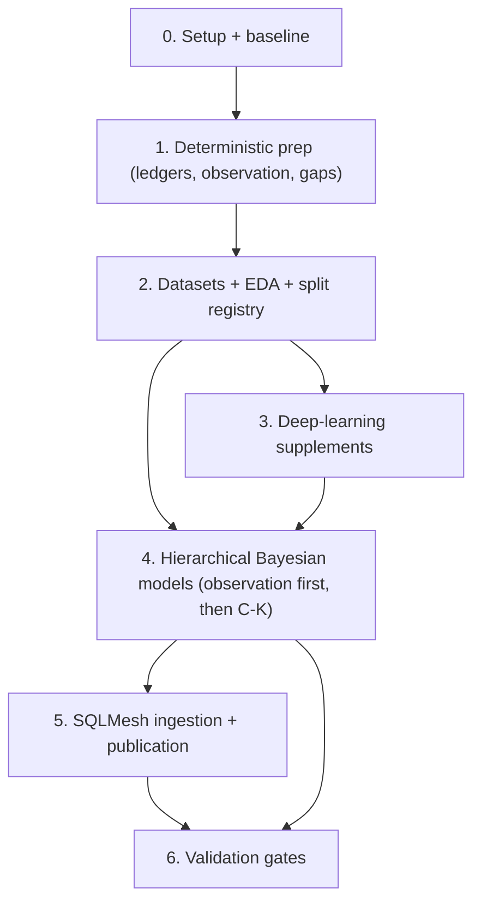

# Data Coverage Implementation Checklist

## Where We Are (2026-05-13)

- **Done:** Phase 0 baseline + Phase 1 runtime scaffolding sub-gate. Squash-merged into `data_coverage`.
- **Next PR:** `main_models.source_acquisition_ledger` (see Phase 1 §"Source Availability"). Cut branch off `data_coverage`, squash-merge back to `data_coverage`. **Do NOT merge into `main`** until the whole initiative graduates.
- **Read before opening the next PR:** `01-prep-ledgers.md` §"Shared Status Seeds" + §"`source_acquisition_ledger`"; this file's Phase 1 ledger checklist; `bc/.claude/rules/sqlmesh.md`.
- **Settled decisions (do not re-litigate):** see the Decision Log below, plus the `data-coverage-review-decisions` + `data-coverage-shift-model` auto-memory entries.

## TL;DR

Use this checklist to implement the 1910-2025 data coverage plan in dependency order. The implementation starts with branch setup, baseline measurement, deterministic provenance ledgers, shared runtime code, and frozen modeling datasets. Probabilistic values are published only after source reliability, data-error risk, personnel eligibility, aggregate constraints, grouped holdouts, conservation audits, calibration reports, and posterior diagnostics pass.

Invariant: no modeled value enters a public or compatibility view until its source facts, modeling dataset, model output, validation report, and rollback path are versioned and linked.

## How To Use This Checklist

Edit this file as work progresses. Keep the checkboxes current and add short notes under the relevant phase when an assumption changes.

Status markers:

| Marker | Meaning |
| --- | --- |
| `[ ]` | Not started. |
| `[~]` | In progress or partially complete. |
| `[x]` | Complete and verified. |
| `[!]` | Blocked; describe the blocker below the item. |
| `[?]` | Needs a decision before implementation proceeds. |

Completion rule:

- A phase is not complete because code exists. It is complete when code, audits, validation outputs, documentation, and rollback behavior all satisfy that phase's exit gate.
- If a later phase exposes a broken upstream assumption, reopen the upstream checkbox and write the finding in the phase notes.
- Keep generated model outputs immutable. New inputs or changed code create a new output ID instead of mutating a published output.

## Dependency Map

Phases mirror the README implementation DAG so the two docs stay aligned.

Parallelism rule:

- Runtime scaffolding and the ledger SQL inside Phase 1 can proceed in parallel once Phase 0 completes.
- Within Phase 4, the observation models (A/B) must publish before geometry, batted-ball park factors, advancement, responsibility, and pitch summaries consume them; fielding credit (C), shift propensity (K), and basic run-scoring park factors can run in parallel once their inputs are ready.
- Deep supplements (Phase 3) can train after the split registry and modeling datasets exist, but their outputs remain proposal inputs until calibration and leakage gates pass in Phase 6.
- Basic run-scoring park-factor prototypes can start before full geometry; batted-ball park factors wait for observation-adjusted geometry.

## Invariants (verify-and-keep-verifying)

These are properties to maintain forever, not tasks to complete. Each phase's exit gate verifies the relevant subset; downstream phases must not erode them.

- Raw source values, deterministic derived values, official aggregate totals, probabilistic estimates, deep proposals, and synthetic outputs are stored in distinct namespaces or with distinct `source`, `method`, `observed_status`, `model_version`, and uncertainty fields.
- SQLMesh does not run full MCMC, train neural models, or mutate model-output manifests during ordinary plans.
- Every statistical model consumes ledgered source/reliability inputs, not ad hoc joins against raw event tables.
- Every modeling dataset includes source availability, observation status, reliability inputs, official aggregate constraint state where applicable, split metadata, query hash, schema, and category maps.
- Every fitted model has prior predictive checks, simulated-data recovery where feasible, posterior diagnostics, posterior predictive checks, grouped holdouts, calibration reports, sensitivity checks, and conservation audits.
- Every SQLMesh ingestion model reads an explicitly published model-output ID and fails loudly when a required output is missing.
- Estimated outputs are additive expected counters, probability tables, posterior summaries, or draw tables. Chosen classes are convenience outputs only when uncertainty is also retained.
- `Unknown`, `Default`, null, zero, empty sequence, not-applicable, structural absence, aggregate-only coverage, source-family block absence, contradicted evidence, and data-error-prone evidence remain distinguishable.
- Season bounds in production SQL use `@VAR('start_season', 1910)` and `@VAR('end_season', 2025)`.
- Weakly identified slices are tagged or withheld; they are not silently shrunk into confident point estimates.

## Phase 0: Branch, Baseline, And Scope Lock

Purpose: capture the current data state before adding ledgers or fitting models.

### Setup

- [x] Create or confirm an implementation branch before code changes begin.
- [x] Confirm dev DB and SQLMesh state paths target `bc_dev.db` and `bc/bc_state_dev.db`.
- [x] Confirm target span variables: `start_season = 1910`, `end_season = 2025`.
- [x] Confirm PyMC/ArviZ are the first Bayesian backend and `stats` is the optional dependency group.
- [x] Confirm the first publication namespace for estimates. Default: estimated namespace only, no replacement of official stat lines.
- [x] Confirm follow-up location for implementation discoveries. Default: `notes/followups.md`.

### Baseline Report

- [x] Record game counts by `game_start_info.source_type`.
- [x] Record event count and game count from `event_states_full`.
- [x] Record batted-ball row count, unknown final trajectory count, and unknown recorded location count from `calc_batted_ball_type`.
- [x] Record unknown putout count and incomplete-event count from `calc_fielding_play_agg`.
- [x] Record fielding residual counts from `player_position_game_fielding_stats` and discrepancy views.
- [x] Snapshot current `unknown_fielding_play_shares` outputs.
- [x] Snapshot current `park_factors` and `calc_park_factor_*` outputs.
- [x] Snapshot current `linear_weights` sparse-cell behavior.
- [~] Compare LSF coverage metadata against current DB source counts. _(baseline records the season span; the 1910-1911 LSF metadata flip lands in its own PR per the 2026-05-13 review decision.)_
- [~] File or fix metadata drift when source reality contradicts generated LSF metadata. _(deferred to the 1910-1911 LSF flip PR.)_

### Phase 0 Exit Gate

- [x] Baseline report exists under the statistical output root.
- [x] Baseline report records query text, row counts, DB path, source snapshot ID, and command/environment metadata.
- [x] Later validation reports have a stable baseline ID to reference.
- [x] Any stale documentation or metadata discovered in the baseline pass is recorded before Phase 1 starts.

## Phase 1: Deterministic Prep (Runtime Scaffolding, Ledgers, Observation, Gaps)

Purpose: create the shared runtime machinery and materialize every deterministic provenance ledger before any imputation. Runtime scaffolding and ledger SQL can proceed in parallel; both must land before Phase 2.

### Canonical Enum Seeds

- [x] Create `bc/seeds/misc/seed_observed_status.csv` with canonical values consumed by every event observation ledger and modeling dataset.
- [x] Create `bc/seeds/misc/seed_reliability_class.csv` with canonical values consumed by entity, personnel, context, and exposure reliability tables.

### Dependency Group

- [x] Add optional `stats` dependency group with `pymc`, `arviz`, `xarray`, `zarr`, and calibration dependencies.
- [x] Keep `stats` separate from `ml`; do not import Keras, Torch, or MLflow for Bayesian-only commands.
- [x] Confirm SQLMesh ingestion modules can import lightweight manifest/schema code without importing PyMC.
- [x] Add a smoke command that imports the statistical package under the `stats` group.

### Package Skeleton

- [x] Create `bc/python_models/statistical/__init__.py`.
- [x] Create `config.py` for repo paths, DB paths, output roots, and default vars.
- [x] Create `schemas.py` with Pydantic models for dataset metadata, model configs, output manifests, diagnostics, and validation status.
- [x] Create `duckdb_io.py` for read-only DuckDB connections and query/export helpers.
- [x] Create `datasets.py` for dataset export, schema validation, category-map creation, and query hashing.
- [x] Create `splits.py` for grouped split registry and split-leakage checks.
- [x] Create `manifests.py` for output IDs, published pointers, dependency IDs, and version checks.
- [x] Create `artifacts.py` or `outputs.py` for atomic writes and SQL-consumable exports.
- [x] Create `logging.py` for structured stdlib logging.
- [x] Create `orchestration.py` for idempotent step execution and step status.
- [x] Create `diagnostics.py` for ArviZ summaries, posterior predictive checks, and simulation recovery.
- [x] Create `validation.py` for conservation and calibration blocking findings.
- [x] Create `calibration.py` for ECE, Brier/log loss, reliability curves, temperature scaling, and binary isotonic helpers.
- [x] Create `pymc_utils.py` for shared sampler configuration, prior predictive, posterior predictive, diagnostics extraction, and smoke-run settings.
- [x] Create model modules: `observation.py`, `fielding_credit.py`, `geometry.py`, `park_factors.py`, `run_values.py`, `advancement.py`, `pitch_summary.py`. _(Plus `shift_propensity.py` per the 2026-05-13 Model-K decision.)_
- [x] Create deep supplement modules: `deep/proposals.py`, `deep/embeddings.py`, `deep/calibrators.py`.
- [x] Create `cli.py` with subcommands for `prepare-dataset`, `run-eda`, `fit-deep`, `fit-bayes`, `export-sql`, `validate`, and `publish-manifest`.

### Runtime Tests

- [x] Add unit tests for path resolution.
- [x] Add unit tests for output ID generation and manifest read/write.
- [x] Add unit tests for atomic output writes.
- [x] Add unit tests for category-map generation.
- [x] Add unit tests for split registry grouping and leakage detection.
- [x] Add unit tests for calibration metrics.
- [x] Add a tiny PyMC smoke model test under the `stats` group.
- [x] Add a tiny SQLMesh ingestion fixture that reads a local model-output manifest without importing heavy fitting dependencies.

### Runtime Scaffolding Sub-Gate

- [x] Statistical package imports under the `stats` group.
- [x] CLI help works for every planned subcommand.
- [x] Manifest schema can represent dataset snapshots, deep outputs, posterior outputs, validation reports, and published pointers.
- [x] Unit tests for shared runtime pass.
- [x] Runtime docs in `05-runtime-artifacts-and-library.md` match the implemented package names.

### Source Availability

- [x] Implement `main_models.source_acquisition_ledger`.
- [x] Include `game_id`, `team_id`, `dimension`, `source_family`, `source_type`, `target_population_status`, `source_availability_status`, `usable_for_event_imputation`, `usable_as_aggregate_constraint`, and `authority_rank`.
- [x] Classify event-level, aggregate-only, gamelog-only, structural absence, and out-of-scope rows.
- [x] Split source availability by dimension: event, box batting, box pitching, box fielding, line score, pitch sequence, batted ball, gamelog, schedule.
- [x] Reconcile against `season_team_coverage`, `game_start_info`, `stg_schedule`, `stg_gamelog`, and `stg_games`.
- [x] Verify 1910 and 1911 are not excluded by stale "complete from 1912" metadata.

### Source Data-Error Risk

- [x] Implement `main_models.source_data_error_risk_ledger`.
- [x] Include stable row/field keys, source table, game/team/player keys, field name, data-error class, training action, training weight, and issue source.
- [x] Load confirmed issues from `box_score_data_issues`.
- [x] Load confirmed issues from `team_game_data_issues`.
- [x] Load contradiction signals from `box_event_fielding_discrepancies`.
- [x] Add known diagnostic issue sources such as `unknown_play_no_box` and promoted analysis views where appropriate.
- [x] Ensure data-error risk is not treated as missingness.
- [x] Verify no confirmed issue has `training_action = allow`.

### Official Aggregate Availability And Authority

- [ ] Implement `main_models.official_aggregate_availability`.
- [ ] Include game/team/player/position/stat grain, aggregate grain, aggregate status, aggregate value, event value, residual value, authority rank, and data-error risk.
- [ ] Cover fielding stats first: putouts, assists, errors, double plays.
- [ ] Add batting, pitching, line score, earned runs, and decisions after fielding contract validates.
- [ ] Distinguish primary `BoxScore` games from usable official aggregate totals in `PlayByPlay` games.
- [ ] Separate missing aggregate totals, clean positive residuals, clean zero residuals, negative residuals, contradicted totals, issue-flagged totals, and not-applicable stats.
- [ ] Implement `main_models.official_credit_authority`.
- [ ] Encode authority source: event, box, event-box reconciled, estimated with aggregate constraint, estimated without aggregate constraint, withheld.

### Personnel And Entity Reliability

- [ ] Implement `main_models.personnel_state_reliability`.
- [ ] Classify direct event evidence, box-derived evidence, deduped evidence, synthetic evidence, missing evidence, ambiguous evidence, and not-applicable states.
- [ ] Add hard-zero eligibility only for high-confidence personnel states.
- [ ] Audit duplicate fielding positions by event/side.
- [ ] Audit missing fielding positions by season/source.
- [ ] Mark Ohtani-rule, DH, multi-position, courtesy runner, deduped roster, and substitution ambiguity classes.
- [ ] Implement `main_models.entity_link_reliability`.
- [ ] Cover players, teams, parks, leagues, scorers, inputters, translators, and umpires where available.
- [ ] Add park episode reliability for renovations, aliases, dimensions, surfaces, and multi-park seasons.
- [ ] Prevent weak entity links from silently becoming random-effect levels.

### Context And Exposure Reliability

- [ ] Implement `main_models.game_context_observation_ledger`.
- [ ] Cover park, weather, temperature, wind, start time, attendance, DH/rule flags, extra-inning runner rule, game type, scorer, inputter, translator, umpires, batter hand, and pitcher hand where applicable.
- [ ] Start missing context handling with observed-status flags, missing indicators, deterministic fallbacks, and simple tabular baselines.
- [ ] Reserve Bayesian context imputation for high-impact covariates that materially affect park, advancement, or run-value estimates.
- [ ] Implement `main_models.game_exposure_ledger`.
- [ ] Include scheduled innings, actual batting/fielding outs, completion status, denominator policy, and exposure confidence.
- [ ] Cover complete, walk-off, shortened, suspended, forfeit, and unknown completion statuses.
- [ ] Verify exposure policy does not override official suspension, forfeit, or walk-off facts.

### Event Observation And Gap Ledgers

- [ ] Implement `main_models.event_observation_context`.
- [ ] Include shared event covariates: season, league, game type, source family, scorer, inputter, translator, park, teams, batter/pitcher, hands, base/out state, score, leverage, result, personnel indicators, target population status.
- [ ] Implement `main_models.event_observation_geometry`.
- [ ] Implement `main_models.event_observation_pitch`.
- [ ] Implement `main_models.event_observation_credit`.
- [ ] Use long grain `event_key, dimension` in each sibling.
- [ ] Preserve raw value, deduced value, sentinel type, observed status, source family, data-error risk, deterministic confidence, training eligibility, and measurement eligibility in every sibling.
- [ ] `event_observation_geometry` covers batted-ball trajectory, location, `batted_to_fielder`, and direct handler evidence dimensions.
- [ ] `event_observation_pitch` covers pitch sequence and count dimensions.
- [ ] `event_observation_credit` covers fielding credit and scorer/source observation dimensions.
- [ ] Implement `main_models.fielding_credit_gaps`.
- [ ] Classify complete events, unknown putouts, unknown assist risk, positive/negative box residuals, no-box unknowns, data-error flagged rows, and not-applicable rows.
- [ ] Add `eligible_for_allocation` without requiring ad hoc joins to issue tables.

### Audits And Validation

- [ ] Add uniqueness audits for every ledger grain.
- [ ] Add accepted-value audits for status columns.
- [ ] Add not-null audits for required keys and dimensions.
- [ ] Add residual arithmetic audits for official aggregate availability.
- [ ] Add deterministic-confidence range audits.
- [ ] Add hard-mask personnel audits.
- [ ] Add source-count reconciliation queries.
- [ ] Add rollup checks showing existing completeness models can be reproduced from ledgers.

### Phase 1 Exit Gate

- [ ] Runtime scaffolding sub-gate above passes.
- [ ] Canonical enum seeds (`seed_observed_status`, `seed_reliability_class`) load and are referenced by every ledger that needs them.
- [ ] All Phase 1 SQLMesh ledger targets materialize in dev.
- [ ] Ledger audits pass.
- [ ] Source counts match Phase 0 baseline unless upstream data changed and the baseline was updated.
- [ ] Existing completeness models can be reproduced from ledger rollups.
- [ ] Fielding allocation target rows can be selected from `fielding_credit_gaps` without raw issue-table joins.
- [ ] No statistical model is allowed to consume raw rows where a ledgered equivalent exists.

## Phase 2: Datasets, EDA, And Split Registry

Purpose: freeze model inputs and discover identification problems before fitting.

### Modeling Dataset SQL

- [ ] Implement `main_models.model_input_observation_batted_ball`.
- [ ] Implement `main_models.model_input_fielding_credit`.
- [ ] Implement `main_models.model_input_geometry`.
- [ ] Implement `main_models.model_input_park_factors`.
- [ ] Implement `main_models.model_input_run_values`.
- [ ] Implement `main_models.model_input_advancement`.
- [ ] Implement `main_models.model_input_pitch_summary`.
- [ ] Ensure each dataset includes entity keys, source availability, observation status, reliability inputs, official aggregate constraints where applicable, context, actors, and split metadata.
- [ ] Ensure each dataset can be rebuilt from deterministic ledgers and not ad hoc raw joins.

### Dataset Exporter

- [ ] Implement `prepare-dataset` CLI command.
- [ ] Export Parquet snapshots from SQLMesh-built dataset models.
- [ ] Store query hash, source snapshot ID, schema, row count, category maps, and split metadata.
- [ ] Compute stable category maps before model code reads the dataset.
- [ ] Validate that category maps are split-stable and include explicit unseen-category policy where needed.
- [ ] Ensure rerunning an existing dataset output ID verifies or fails before overwrite.
- [ ] Write dataset metadata atomically.

### Split Registry

- [ ] Define default `game_hash` split.
- [ ] Define season or era block holdouts.
- [ ] Define scorer/inputter/translator holdouts.
- [ ] Define source family and file-family holdouts.
- [ ] Define park-season or park-episode holdouts.
- [ ] Define alignment-regime holdouts.
- [ ] Define aggregate-total holdouts for fielding.
- [ ] Define player-group holdouts for embeddings and player effects.
- [ ] Store split assignments in the dataset and in a split registry output.
- [ ] Add validation that no game/source/scorer/park leakage exists for the intended holdout.

### EDA Runner

- [ ] Implement `run-eda` CLI command.
- [ ] Generate dataset summaries.
- [ ] Generate missingness-by-slice tables.
- [ ] Generate target distributions by split.
- [ ] Generate source-family block missingness reports.
- [ ] Generate data-error concentration reports.
- [ ] Generate connectivity graphs for scorer, park, team, batter, pitcher, league, and season effects.
- [ ] Generate collinearity screens for scorer x park, source family x era, team x park, player career x era, observed geometry x result.
- [ ] Generate candidate interaction reports.
- [ ] Generate weak-identification flags.
- [ ] Generate a short markdown EDA summary for each dataset.

### Blocking EDA Findings

- [ ] Block if source-family block absence is treated as event-level missingness.
- [ ] Block if high data-error rows can train as truth.
- [ ] Block if target categories appear in validation/test but have no training support and no hierarchy/unseen policy.
- [ ] Block if a modeled effect has no connected component across the relevant holdout.
- [ ] Block if one scorer, park, team, source, or era dominates a target slice and the model lacks a weak-identification policy.
- [ ] Block if conservation violations appear in modeling datasets.

### Phase 2 Exit Gate

- [ ] Each planned model has a named dataset model or a deliberate deferral note.
- [ ] Each dataset has exported snapshot metadata with query hash, schema, row count, category maps, source snapshot ID, and split policy.
- [ ] EDA reports exist for the first model family targeted for fitting.
- [ ] Split registry has passed leakage checks.
- [ ] Weak-identification flags are available to model configs and publication gates.

## Phase 3: Deep-Learning Supplements

Purpose: train deep proposal distributions, embeddings, and calibrators on frozen modeling datasets so Phase 4 Bayesian models can consume out-of-fold deep outputs as regularized inputs. Deep outputs never publish as facts; they remain proposal inputs gated by Phase 6 calibration and leakage checks.

### Training Contracts

- [ ] Train only from frozen modeling dataset snapshots.
- [ ] Use grouped splits from the split registry.
- [ ] Write out-of-fold predictions for Bayesian consumption.
- [ ] Store model config, target schema, feature schema, split policy, source snapshot ID, and training data hash.
- [ ] Avoid leakage from validation/test rows into vocabularies, embeddings, scalers, or calibration.

### Proposal Models

- [ ] Train geometry proposal distributions.
- [ ] Train handler proposal distributions if EDA shows they add calibrated value.
- [ ] Train advancement proposal distributions only after geometry inputs exist.
- [ ] Train pitch-summary proposal distributions after pitch coverage datasets exist.
- [ ] Keep fielding-credit deep proposals diagnostic or weakly weighted unless they pass conservation and leakage checks.

### Embeddings

- [ ] Train batter embeddings only from training folds.
- [ ] Train pitcher embeddings only from training folds.
- [ ] Train fielder/runner embeddings only where target support is sufficient.
- [ ] Train park/scorer/team embeddings only after adversarial source/scorer diagnostics are defined.
- [ ] Store embedding IDs or vector paths, not wide vectors, unless vectors are small and stable.

### Calibration And Leakage

- [ ] Fit temperature scaling for multiclass probabilities.
- [ ] Fit binary isotonic calibrators for binary or one-vs-rest outputs when support is sufficient.
- [ ] Evaluate Dirichlet calibration where temperature scaling is not enough.
- [ ] Report reliability curves and ECE by era, source, scorer, hit/out, missingness pattern, and target class.
- [ ] Run adversarial diagnostics predicting source family and scorer from embeddings.
- [ ] Mark deep outputs diagnostic-only if they encode source/scorer identity more strongly than baseball signal.

### Phase 3 Exit Gate

- [ ] Deep outputs are out-of-fold for every downstream Bayesian training row.
- [ ] Calibration passes globally and in critical slices.
- [ ] Probability vectors are preserved; argmax labels are not published as facts.
- [ ] Deep output manifests include validation status and blocking findings.
- [ ] Downstream Bayesian configs can include or exclude deep inputs for sensitivity checks.

## Phase 4: Hierarchical Bayesian Models

Purpose: fit every Bayesian model behind the doc-03 letter scheme. Observation models (A/B) must publish before geometry, batted-ball park factors, advancement, responsibility, and pitch summaries consume them. Fielding credit (C), shift propensity (K), and basic run-scoring park factors can run in parallel once their inputs are ready.

Each Bayes model is fit twice in two `gamma_dl` ablation flavors: `gamma_dl_zero` (no deep prior weight) and `gamma_dl_shrunk` (calibrated deep prior weight). Both artifacts are stored; the published tier is selected per model based on posterior-change magnitude and named in the manifest.

### Observation (A, B): Scorer And Source Observation Models

#### First Scope

- [ ] Fit trajectory observedness model.
- [ ] Fit location side observedness model.
- [ ] Fit location depth observedness model.
- [ ] Fit broad ground/air contact observedness model.
- [ ] Keep detailed fly/line/pop label confusion out of first publication unless broad models calibrate.

#### Statistical Workflow

- [ ] Write estimand for each observedness dimension.
- [ ] Draw missingness DAG for each dimension.
- [ ] Identify post-treatment variables that cannot enter each model.
- [ ] Run prior predictive checks.
- [ ] Run small smoke fit.
- [ ] Run simulated-data recovery where feasible.
- [ ] Run full fit only after smoke diagnostics pass.
- [ ] Generate posterior predictive checks by era, source, scorer, result, hit/out, leverage, and team affiliation.
- [ ] Run scorer and source-family holdouts.
- [ ] Run MNAR sensitivity variants for hit location and detailed contact.
- [ ] Export observation propensities and uncertainty summaries.

#### Gamma_dl Ablation

- [ ] Fit `gamma_dl_zero` flavor of each observation model.
- [ ] Fit `gamma_dl_shrunk` flavor of each observation model.
- [ ] Select publication tier per observation model and record it in the manifest.

#### Outputs

- [ ] `scorer_observation_propensities`.
- [ ] `observation_model_draws` when downstream uncertainty needs draws.
- [ ] `observation_weighted_metric_inputs`.
- [ ] `scorer_label_confusion_summaries` after broad models validate.
- [ ] `observation_model_validation`.

#### Observation Sub-Gate

- [ ] Observation propensities calibrate by key slices.
- [ ] Scorer/source holdouts do not collapse.
- [ ] MNAR sensitivity intervals are published for MNAR-prone outputs.
- [ ] Existing coverage-weighted metrics can be reproduced as a baseline.
- [ ] Detailed contact normalization remains withheld until broad geometry/contact models calibrate.

### Fielding Credit Allocation (C)

Purpose: estimate official fielding credit without confusing official credit, handler evidence, and responsibility.

#### First Scope

- [ ] Target event-level games only.
- [ ] Target unknown putouts first.
- [ ] Target hidden assist risk with a separate assist-count model.
- [ ] Use clean official aggregate constraints where available.
- [ ] Tag no-box estimates as lower confidence.
- [ ] Model or withhold battery and baserunning-related credits separately.
- [ ] Use direct handler evidence only; do not consume posterior `ball_handler_probabilities` in the first fielding-credit model.

### Putout Model

- [ ] Build known-putout training set from complete events.
- [ ] Apply hard personnel masks only from high-confidence personnel states.
- [ ] Fit putout multinomial by eligible player/position.
- [ ] Include event result, base/out state, broad contact, direct handler evidence, team-season, scorer/source, and calibrated deep proposal only when available out-of-fold.
- [ ] Condition allocations on clean box-score residual constraints.
- [ ] Run no-box prior validation separately.

#### Assist Model

- [ ] Build complete-event training set for assist counts by play type.
- [ ] Estimate missing assist count before player allocation.
- [ ] Fit assist-count model with result, base/out state, force/double-play opportunity, broad contact, scorer/source, and personnel context.
- [ ] Fit assist-allocation model conditional on estimated assist count.
- [ ] Validate putouts and assists separately.
- [ ] Treat catcher, pitcher, strikeout, steal, pickoff, bunt, passed-ball, and rundown mechanisms separately.

#### Validation

- [ ] Hide known fielding credit in complete games.
- [ ] Hide clean aggregate constraints and test no-box drift.
- [ ] Validate player-game residual conservation.
- [ ] Validate event-out conservation.
- [ ] Validate no credit assigned outside personnel state.
- [ ] Report calibration by position, credit type, event result, scorer/source, era, and aggregate-total availability.
- [ ] Report no-box confidence and weak-identification flags.

#### Gamma_dl Ablation

- [ ] Fit `gamma_dl_zero` flavor of putout, assist-count, and assist-allocation models.
- [ ] Fit `gamma_dl_shrunk` flavor of putout, assist-count, and assist-allocation models.
- [ ] Select publication tier per fielding-credit submodel and record it in the manifest.

#### Outputs

- [ ] `imputed_fielding_credit`.
- [ ] `fielding_credit_draws` if downstream nonlinear summaries require draws.
- [ ] `fielding_credit_expected_counters`.
- [ ] `fielding_credit_validation`.

#### Fielding Credit Sub-Gate

- [ ] Conservation audits pass.
- [ ] Held-out known credit backtests beat legacy allocation or match it with calibrated uncertainty.
- [ ] Aggregate-total holdouts pass.
- [ ] Assist-count model passes separate validation.
- [ ] No-box estimates are always included; `fielding_credit_confidence` exposes their reliability rather than a hard suppression threshold.
- [ ] Outputs remain in estimated namespace until explicit publication decision.

### Shift Propensity (K)

Purpose: estimate latent alignment-regime propensities so geometry, advancement/responsibility, and run-value models can consume shift as a covariate rather than treating fielder positions as ground truth.

- [ ] Build modeling dataset on event coverage 2015+ and pitch coverage 2009+ where direct shift evidence exists.
- [ ] Fit shift propensity model with batter hand, pitcher hand, base/out state, team-season, park, leverage, and scorer/source covariates.
- [ ] Run prior predictive checks and small smoke fit before full fit.
- [ ] Run grouped holdouts by team-season and by batter cohort.
- [ ] Fit `gamma_dl_zero` flavor.
- [ ] Fit `gamma_dl_shrunk` flavor.
- [ ] Select publication tier and record it in the manifest.
- [ ] Publish `imputed_shift_propensity` posterior.
- [ ] Wire `imputed_shift_propensity` into the geometry model as an alignment-regime covariate.
- [ ] Wire `imputed_shift_propensity` into the advancement/responsibility models as an opportunity covariate.
- [ ] Optionally wire `imputed_shift_propensity` into run-value models as a context covariate after geometry consumes it.
- [ ] Decide withholding policy outside the supported coverage windows and record the decision.

### Handler And Batted-Ball Geometry

Purpose: estimate handler and geometry probabilities without treating fielder position as universal location.

#### Handler Model

- [ ] Define handler estimand separately from official fielding credit and responsibility.
- [ ] Use fielding-credit expected counters as optional validated inputs, not as raw truth.
- [ ] Use direct fielding-play evidence, `batted_to_fielder`, personnel state, event result, broad contact, base/out state, season/league, scorer/source, and alignment regime.
- [ ] Validate by batter hand, base state, result, position, era, and source.
- [ ] Publish `ball_handler_probabilities`.

#### Geometry Model

- [ ] Preserve recorded geometry, deduced geometry, normalized labels, and estimated probabilities as separate layers.
- [ ] Estimate broad trajectory first.
- [ ] Estimate side and depth after broad trajectory validates.
- [ ] Include alignment regimes: pre-shift, shift-growth, full-shift, post-2023 restriction.
- [ ] Consume `imputed_shift_propensity` as a latent alignment-regime covariate.
- [ ] Include batter hand and fielder position interactions only where EDA supports them.
- [ ] Use observation model outputs for missingness and label bias.
- [ ] Use calibrated deep proposals only as regularized inputs.
- [ ] Stress-test known 2000-2002 shallow outfield fly/grounder source-pattern slices.

#### Validation

- [ ] Hold out known locations separately for hits and outs.
- [ ] Hold out scorers and scorer-team affiliations.
- [ ] Validate within alignment regimes before cross-regime transfer.
- [ ] Compare recorded, deduced, normalized, and estimated rates.
- [ ] Confirm probability rows sum to one.
- [ ] Confirm expected counters are additive.

#### Gamma_dl Ablation

- [ ] Fit `gamma_dl_zero` flavor of handler and geometry models.
- [ ] Fit `gamma_dl_shrunk` flavor of handler and geometry models.
- [ ] Select publication tier per submodel and record it in the manifest.

#### Outputs

- [ ] `ball_handler_probabilities`.
- [ ] `imputed_batted_ball_geometry`.
- [ ] `normalized_contact_probabilities`.
- [ ] `geometry_expected_counters`.
- [ ] `geometry_validation`.

#### Handler/Geometry Sub-Gate

- [ ] Handler, official credit, geometry, and responsibility are documented as separate estimands.
- [ ] Geometry calibration passes by era, alignment regime, batter hand, hit/out, and scorer/source.
- [ ] Cross-regime transport is either validated or weakly identified.
- [ ] Downstream metric inputs consume probability tables or expected counters, not forced classes.

### Park Factors

Purpose: replace fixed pseudo-counts and raw known-only batted-ball park factors with hierarchical counterfactual estimates.

#### Readiness

- [ ] Build park/team/batter/pitcher connectivity graphs.
- [ ] Verify park episode reliability.
- [ ] Verify exposure denominators.
- [ ] Verify handedness reliability.
- [ ] Decide first publication scope: basic run-scoring factors before batted-ball geometry factors.
- [ ] Withhold or heavily shrink weakly connected park-seasons.

#### Basic Park Factors

- [ ] Fit binary/rate event-outcome model for high-support outcomes.
- [ ] Fit team-game run-scoring model with exposure offset.
- [ ] Include batter, pitcher, handedness, team, season/league, and context effects.
- [ ] Add dynamic park prior with first-season `t_0` boundary condition.
- [ ] Add park episode identity level.
- [ ] Run prior predictive checks.
- [ ] Run park-season holdouts.
- [ ] Compare against current `calc_park_factors_basic` and `calc_park_factors_advanced`.

#### Batted-Ball Park Factors

- [ ] Wait for observation-adjusted geometry expected counters.
- [ ] Fit raw known-only factor as baseline.
- [ ] Fit observation-adjusted factor using geometry probability inputs.
- [ ] Report sensitivity to observation-model draws.
- [ ] Check scorer x park confounding.

#### Gamma_dl Ablation

- [ ] Fit `gamma_dl_zero` flavor of basic and batted-ball park-factor models.
- [ ] Fit `gamma_dl_shrunk` flavor of basic and batted-ball park-factor models.
- [ ] Select publication tier per submodel and record it in the manifest.

#### Outputs

- [ ] `park_factor_posterior` (with posterior intervals exposed in the published view).
- [ ] `park_factor_summary`.
- [ ] `park_factor_validation`.
- [ ] Compatibility rounded-factor view.

#### Park Factors Sub-Gate

- [ ] Posterior factors reproduce stable current factors where data is abundant.
- [ ] Sparse leagues shrink sensibly without hand-tuned pseudo-counts.
- [ ] Weakly connected park-seasons are withheld or tagged.
- [ ] Batted-ball factors document sensitivity to observation and geometry uncertainty.

### Run Expectancy And Linear Weights

Purpose: replace hard sample-size thresholds with hierarchical run-value estimates while keeping standard linear weights context-neutral.

#### Readiness

- [ ] Confirm event state transitions conserve outs, bases, score, and runs.
- [ ] Confirm exposure policy for shortened, suspended, forfeited, walk-off, and unknown games.
- [ ] Confirm game type inclusion/exclusion policy.
- [ ] Confirm park/context adjustment is a nuisance adjustment for standard linear weights.

#### Markov Transition Submodel

- [ ] Build base/out state transition matrix from event sequences.
- [ ] Fit Markov transition submodel with hierarchical priors over season/league and context.
- [ ] Validate state conservation (outs, bases, runs) under sampled transitions.
- [ ] Feed transition posterior into run-expectancy and run-value generated quantities.

#### Run Expectancy

- [ ] Fit run expectancy before win expectancy.
- [ ] Model `runs_to_end` by base/out state, season, and league.
- [ ] Include park/context effects as nuisance adjustments only when they improve calibration.
- [ ] Generate `V^{neutral}` for standard linear weights.
- [ ] Generate optional `V^{context}` only for park-specific analyses.
- [ ] Pool sparse states toward structurally similar base/out states.
- [ ] Report rare-state uncertainty.

#### Linear Weights

- [ ] Compute play values as posterior generated quantities from `V^{neutral}`.
- [ ] Compare against current `linear_weights` in stable high-coverage seasons.
- [ ] Preserve posterior intervals and sparse-state flags.
- [ ] Ensure downstream metrics recompute rates from counters or expected counters.

#### Gamma_dl Ablation

- [ ] Fit `gamma_dl_zero` flavor of Markov transition and run-expectancy models.
- [ ] Fit `gamma_dl_shrunk` flavor of Markov transition and run-expectancy models.
- [ ] Select publication tier per submodel and record it in the manifest.

#### Run Values Sub-Gate

- [ ] Posterior predictive checks match runs per inning by era, league, and park.
- [ ] Rare state uncertainty is visible.
- [ ] Standard linear weights are context-neutral by construction.
- [ ] Current compatibility baseline remains available.

### Advancement And Responsibility

Purpose: estimate runner/fielder advancement and defensive responsibility only after geometry and opportunity inputs are reliable.

#### Advancement

- [ ] Define advancement outcome before adding result labels.
- [ ] Fit context-only advancement baseline.
- [ ] Add geometry probability inputs.
- [ ] Consume `imputed_shift_propensity` as an opportunity covariate.
- [ ] Add runner effects only if holdouts show calibrated improvement.
- [ ] Add fielder effects only if holdouts show calibrated improvement without absorbing opportunity bias.
- [ ] Do not condition the first model on post-advancement labels such as sacrifice fly when estimating advancement ability.
- [ ] Validate by base/out state, runner starting base, score state, park, era, and geometry uncertainty.

#### Responsibility

- [ ] Define responsibility separately from official credit and handler.
- [ ] Exclude pitcher/catcher, bunts, deflections, and unusual plays from first range-style responsibility model unless explicitly modeled.
- [ ] Use latent geometry draws.
- [ ] Use alignment-regime priors.
- [ ] Validate against high-coverage location slices.
- [ ] Hold out alignment regimes.
- [ ] Quantify responsibility posterior variance caused by geometry uncertainty.

#### Gamma_dl Ablation

- [ ] Fit `gamma_dl_zero` flavor of advancement and responsibility models.
- [ ] Fit `gamma_dl_shrunk` flavor of advancement and responsibility models.
- [ ] Select publication tier per submodel and record it in the manifest.

#### Outputs

- [ ] `advancement_expected_counters`.
- [ ] `runner_advancement_summary`.
- [ ] `fielder_advancement_summary`.
- [ ] `fielder_responsibility_probabilities`.
- [ ] `responsibility_expected_counters`.
- [ ] `advancement_responsibility_validation`.

#### Advancement/Responsibility Sub-Gate

- [ ] Context-only advancement baseline is documented.
- [ ] Player effects improve calibration without absorbing opportunity bias.
- [ ] Responsibility estimates do not alter official credits.
- [ ] Geometry uncertainty is propagated into advancement/responsibility uncertainty.

### Pitch Coverage And Summaries

Purpose: model pitch coverage and pitch summary distributions after source-family block absence is classified.

#### Coverage

- [ ] Separate count coverage from pitch-sequence coverage.
- [ ] Measure coverage by season, source family, scorer/inputter, game type, park, and file family.
- [ ] Classify missingness as game-level, source-family block, event-level, or not applicable.
- [ ] Fit count observedness model.
- [ ] Fit pitch-sequence observedness model.

#### Summary Models

- [ ] Fit pitch summary counts before ordered sequence generation.
- [ ] Preserve plate appearance result and count constraints.
- [ ] Include batter, pitcher, era, source, and result context.
- [ ] Validate modern-to-historical transport.
- [ ] Defer ordered pitch sequence generation until a downstream analysis requires order.

#### Gamma_dl Ablation

- [ ] Fit `gamma_dl_zero` flavor of pitch coverage and pitch summary models.
- [ ] Fit `gamma_dl_shrunk` flavor of pitch coverage and pitch summary models.
- [ ] Select publication tier per submodel and record it in the manifest.

#### Outputs

- [ ] `pitch_coverage_propensities`.
- [ ] `pitch_summary_probabilities`.
- [ ] `pitch_summary_expected_counters`.
- [ ] `pitch_summary_validation`.

#### Pitch Coverage Sub-Gate

- [ ] Source-family block absence is not treated as event-level missingness.
- [ ] Pitch summary outputs preserve count, result, and pitch-event constraints.
- [ ] Modern pitch patterns are not transported to early eras without weak-identification flags.

### Phase 4 Exit Gate

- [ ] Every Bayesian submodel in this phase has passed its sub-gate.
- [ ] Every submodel has both `gamma_dl_zero` and `gamma_dl_shrunk` artifacts stored, with the published tier named in the manifest.
- [ ] Model K (shift propensity) is fit, published, and consumed downstream by geometry, advancement/responsibility, and any run-value covariate that needs it.

## Phase 5: SQLMesh Ingestion And Publication

Purpose: publish validated model outputs safely while preserving official and deterministic semantics.

### Ingestion Models

- [ ] Implement lightweight SQLMesh ingestion model for each published output family.
- [ ] Read published model-output ID from manifest or explicit variable.
- [ ] Return typed empty tables only for explicitly optional dev-only gates.
- [ ] Fail loudly for missing required outputs.
- [ ] Avoid importing PyMC, Keras, Torch, MLflow, or fitting code.
- [ ] Validate schema against manifest.
- [ ] Validate row counts against manifest.

### Publication Tiers

- [ ] Define `official` tier.
- [ ] Define `deterministic` tier.
- [ ] Define `estimated` tier.
- [ ] Define `synthetic` tier.
- [ ] Define `withheld` tier.
- [ ] Ensure every published estimated table includes source snapshot ID, model name, model version, output ID, method, observed status, uncertainty fields, confidence status, and weak-identification flag.

### Compatibility Views

- [ ] Keep existing point-factor columns where consumers expect them.
- [ ] Add estimated counterparts under explicit names.
- [ ] Do not silently change official metric semantics.
- [ ] Ensure official-only views can exclude estimated rows.
- [ ] Ensure estimated views expose uncertainty, not only point estimates.

### Semantic And LLM Metadata

- [ ] Update BSL semantic table docs if estimated outputs become queryable.
- [ ] Update metric registry semantics where expected counters are used.
- [ ] Regenerate LSF metadata if public schema changes.
- [ ] Document official versus estimated values in user-facing docs.
- [ ] Add follow-up items for any intentionally withheld semantic exposure.

### Phase 5 Exit Gate

- [ ] SQLMesh ingestion audits pass in dev.
- [ ] Compatibility views match legacy outputs where no estimated values are opted in.
- [ ] Estimated namespaces include uncertainty and validation status.
- [ ] Documentation clearly states which downstream metrics consume expected counters.
- [ ] Rollback path restores legacy sources without deleting model outputs.

## Phase 6: Cross-Phase Validation Gates

Run this matrix before promoting any model-output family beyond exploratory use. Phase 6 is the gate every Phase 4 sub-model must pass to leave the estimated tier.

| Model family | Conservation | Calibration | Holdout | Sensitivity | Blocker |
| --- | --- | --- | --- | --- | --- |
| Source ledgers | Source counts and statuses reconcile. | Not applicable. | Season/source spot checks. | Source metadata drift. | Source counts or target-population statuses disagree. |
| Observation | Not applicable. | Observedness reliability by scorer/source/era/result. | Scorer, source, era. | MNAR shifts. | Hit/out or scorer calibration fails. |
| Fielding credit | Event outs and aggregate residuals. | Credit probability reliability. | Known credit and aggregate-total holdouts. | No-box confidence cap. | Expected credits violate personnel or constraints. |
| Handler/geometry | Probability normalization and additive expected counters. | Class reliability by era/alignment/scorer. | Hit/out, scorer, alignment. | Deep/no-deep, deterministic reliability. | Fielder-location transport fails. |
| Park factors | Exposure denominators. | Posterior predictive rates. | Park-season. | Roster/team/source controls. | Weak connectivity unflagged. |
| Run values | State transitions and runs to end. | Runs by state. | Season/league. | Priors, park/context nuisance controls. | Sparse states are overconfident. |
| Advancement | Base/out consistency. | Category reliability. | Runner/fielder/context. | Geometry uncertainty. | Player effects absorb opportunity bias. |
| Responsibility | Probability normalization. | Responsibility reliability in high-coverage slices. | Alignment regimes. | Geometry uncertainty. | Responsibility rewrites official credit semantics. |
| Pitch summaries | Count/result constraints. | Sequence summary reliability. | Source/era. | Modern-to-historical transport. | Source-family block absence misclassified. |

## Promotion Checklist

Use this before promoting a phase's outputs from exploratory to published.

- [ ] The estimand is written in the relevant doc.
- [ ] Target population is ledgered.
- [ ] Modeling dataset snapshot is immutable and linked.
- [ ] Category maps are stored.
- [ ] Split policy matches the validation question.
- [ ] EDA blockers are resolved or explicitly waived with rationale.
- [ ] Deep proposals, if used, are out-of-fold and calibrated.
- [ ] Prior predictive checks pass.
- [ ] Simulated-data recovery passes where feasible.
- [ ] MCMC diagnostics pass: R-hat, ESS, divergences, BFMI, trace behavior.
- [ ] Posterior predictive checks pass by critical slices.
- [ ] Conservation audits pass.
- [ ] Calibration reports pass.
- [ ] Sensitivity checks pass or publish wider intervals/withholding flags.
- [ ] Weakly identified slices are tagged or withheld.
- [ ] SQLMesh ingestion model reads only published model-output IDs.
- [ ] Compatibility view behavior is tested.
- [ ] Rollback path is documented.
- [ ] README and relevant planning docs are updated.
- [ ] Follow-up items are added to `notes/followups.md` when implementation reveals new source/data issues or model assumptions.

## Current Progress Tracker

Update this table as implementation proceeds.

| Phase | Status | Current output ID or branch | Blocking issue | Next action |
| --- | --- | --- | --- | --- |
| 0. Setup + baseline | `[x]` | branch `data-coverage-phase-0-1-scaffolding`; baseline at `artifacts/statistical/baseline/baseline_${ISO_DATE}_${GIT_SHA_SHORT}.json` | LSF 1910-1911 flip deferred to separate PR | Open Phase 1 ledger PR (source acquisition first) |
| 1. Deterministic prep (runtime, ledgers, observation, gaps) | `[~]` | `source_data_error_risk_ledger` on branch `data-coverage-source-data-error-risk-ledger`; ledgers #1-#2 done, remaining ledgers unstarted |  | Implement `official_aggregate_availability` |
| 2. Datasets + EDA + split registry | `[ ]` |  |  |  |
| 3. Deep-learning supplements | `[ ]` |  |  |  |
| 4a. Observation models (A, B) | `[ ]` |  |  |  |
| 4b. Fielding credit (C) | `[ ]` |  |  |  |
| 4c. Shift propensity (K) | `[ ]` |  |  |  |
| 4d. Handler + geometry | `[ ]` |  |  |  |
| 4e. Park factors | `[ ]` |  |  |  |
| 4f. Run values + Markov transitions | `[ ]` |  |  |  |
| 4g. Advancement + responsibility | `[ ]` |  |  |  |
| 4h. Pitch coverage + summaries | `[ ]` |  |  |  |
| 5. SQLMesh ingestion + publication | `[ ]` |  |  |  |
| 6. Cross-phase validation gates | `[ ]` |  |  |  |

## Decision Log To Fill During Implementation

Record decisions here when they become concrete.

| Date | Decision | Rationale | Follow-up |
| --- | --- | --- | --- |
| 2026-05-13 | Implementation branch is `data-coverage-phase-0-1-scaffolding`. | Per global workflow rule, cut a new branch before code changes. | Squash-merge back to `main` once Phase 0 + runtime scaffolding sub-gate is reviewed. |
| 2026-05-13 | Baseline JSON lives at `artifacts/statistical/baseline/baseline_${ISO_DATE}_${GIT_SHA_SHORT}.json`; recipe: `just baseline-data-coverage`. | Co-locates baseline with other statistical artifacts; deterministic filename lets later validation reports cite a stable ID. | Re-run after any prod rebuild to refresh the baseline. |
| 2026-05-13 | Ledger SQL (`source_acquisition_ledger` and siblings) stays out of this PR. | Each ledger is its own design surface; keeping runtime scaffolding separate unblocks parallel ledger work without coupling. | Open follow-up PR(s) per ledger family. |
| 2026-05-13 | Boolean flag semantics in `seed_observed_status` and `seed_reliability_class` chosen during seed-write. | Doc 01 enumerated tokens but not flag truth tables; chose `is_observed = true` only for `observed`, `is_training_eligible = true` for `observed` + `derived`, `is_hard_mask_eligible = true` for `direct` + `derived`. | Confirm during first ledger review; adjust if a ledger needs different gating. |
| 2026-05-13 | Added `start_season = 1910` and `end_season = 2025` SQLMesh vars to `bc/config.py`. | Every Phase 1 ledger and downstream modeling dataset will filter on the 1910-2025 target span; centralizing in `config.py` lets `--vars` override at plan time without per-model defaults drifting. | All later coverage ledgers reference `@start_season` / `@end_season`. |
| 2026-05-13 | Reconciled `source_acquisition_ledger` column names against the real `game_data_completeness` view; doc 01 sketch updated in the same PR. | Doc-only names `has_pitch_sequence`/`has_pitch_count_data`/`has_offense_batted_ball`/`has_defense_batted_ball` never existed in the DB. Real columns: `has_pitches`, `has_count`, plus `has_trajectory OR has_location OR has_batted_to_fielder` for batted-ball signal. | None — zero downstream consumers referenced the doc-only names. |
| 2026-05-13 | New SQLMesh model directory `bc/models/intermediate/coverage/`. | Phase 1 will land 8+ data-coverage ledgers; co-locating them keeps the SQLMesh tree navigable. | Each subsequent ledger PR lands its `.sql` file alongside `source_acquisition_ledger.sql`. |
| 2026-05-13 | Dropped `relationships` FK audit on `source_acquisition_ledger.team_id`. | Game-wide dimensions (`event`, `pitch_sequence`, `batted_ball`, `gamelog`) carry `team_id IS NULL` by design, which would fail any standard FK audit. The `not_null` audit deliberately omits `team_id`. | Revisit when the side-dependent / game-wide split is closed by a separate table or a `team_id` value. |

## Blocker Log To Fill During Implementation

Record unresolved blockers here when a phase cannot proceed.

| Date | Phase | Blocker | Owner/context | Resolution |
| --- | --- | --- | --- | --- |
|  |  |  |  |  |
