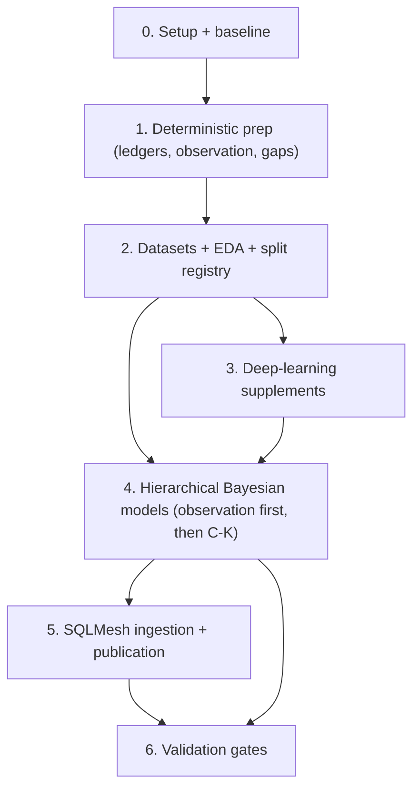

# Data Coverage Implementation Checklist

## Where We Are (2026-05-14)

- **Done:** Phase 0 + Phase 1 (runtime scaffolding sub-gate, all 13 doc-01 ledgers, audits + reconciliation + rollup-parity tooling, exit gate ticked) + Phase 2 §"Modeling Dataset SQL" (all 7 `model_input_*` VIEWs + `dl_proposal_manifest`/`stress_holdout_registry` zero-row stubs in commit `c25172a`; `event_observation_context` gained `result_family`/`alignment_regime`/`leverage_bucket` with audits) + Phase 2 §"Split Registry" (real `stress_holdout_registry` materializing 18.14M event_keys × 7 BOOLEAN flags; ~37% of events held out in at least one stress dim) + Phase 2 §"Dataset Exporter" (`prepare-dataset` CLI snapshotting per-branch `main_models__<slug>.model_input_*` views to Parquet + metadata + manifest; smoke-tested on `model_input_observation_batted_ball` → 84.27M rows / 860 MB).
- **Next PR:** Phase 2 §"EDA Runner" — the `run-eda` CLI that consumes a dataset manifest and writes missingness-by-slice / target-distribution / connectivity / collinearity tables plus a markdown summary. Branch off `data_coverage`; squash-merge back. **Do NOT merge into `main`** until the whole initiative graduates.
- **Read before opening the next PR:** `02-eda-and-modeling-datasets.md` (§Dataset Lifecycle, §Universal Dataset Columns, §EDA Report Schema); this file's Phase 2 §"Dataset Exporter"; `bc/.claude/rules/sqlmesh.md`; `scripts/CLAUDE.md`.
- **Settled decisions (do not re-litigate):** see the Decision Log below, plus the `data-coverage-review-decisions` + `data-coverage-shift-model` auto-memory entries.
- **Phase-1 enrichment backlog (none block Phase 2):** see §"Deferred — Phase 1 Backlog" below.

## TL;DR

Use this checklist to implement the 1910-2025 data coverage plan in dependency order. The implementation starts with branch setup, baseline measurement, deterministic provenance ledgers, shared runtime code, and frozen modeling datasets. Probabilistic values are published only after source reliability, data-error risk, personnel eligibility, aggregate constraints, grouped holdouts, conservation audits, calibration reports, and posterior diagnostics pass.

Invariant: no modeled value enters a public or compatibility view until its source facts, modeling dataset, model output, validation report, and rollback path are versioned and linked.

## How To Use This Checklist

Edit this file as work progresses. Keep the checkboxes current and add short notes under the relevant phase when an assumption changes.

Status markers:

| Marker | Meaning |
| --- | --- |
| `[ ]` | Not started. |
| `[~]` | In progress or partially complete. |
| `[x]` | Complete and verified. |
| `[!]` | Blocked; describe the blocker below the item. |
| `[?]` | Needs a decision before implementation proceeds. |

Completion rule:

- A phase is not complete because code exists. It is complete when code, audits, validation outputs, documentation, and rollback behavior all satisfy that phase's exit gate.
- If a later phase exposes a broken upstream assumption, reopen the upstream checkbox and write the finding in the phase notes.
- Keep generated model outputs immutable. New inputs or changed code create a new output ID instead of mutating a published output.

## Dependency Map

Phases mirror the README implementation DAG so the two docs stay aligned.

Parallelism rule:

- Runtime scaffolding and the ledger SQL inside Phase 1 can proceed in parallel once Phase 0 completes.
- Within Phase 4, the observation models (A/B) must publish before geometry, batted-ball park factors, advancement, responsibility, and pitch summaries consume them; fielding credit (C), shift propensity (K), and basic run-scoring park factors can run in parallel once their inputs are ready.
- Deep supplements (Phase 3) can train after the split registry and modeling datasets exist, but their outputs remain proposal inputs until calibration and leakage gates pass in Phase 6.
- Basic run-scoring park-factor prototypes can start before full geometry; batted-ball park factors wait for observation-adjusted geometry.

## Invariants (verify-and-keep-verifying)

These are properties to maintain forever, not tasks to complete. Each phase's exit gate verifies the relevant subset; downstream phases must not erode them.

- Raw source values, deterministic derived values, official aggregate totals, probabilistic estimates, deep proposals, and synthetic outputs are stored in distinct namespaces or with distinct `source`, `method`, `observed_status`, `model_version`, and uncertainty fields.
- SQLMesh does not run full MCMC, train neural models, or mutate model-output manifests during ordinary plans.
- Every statistical model consumes ledgered source/reliability inputs, not ad hoc joins against raw event tables.
- Every modeling dataset includes source availability, observation status, reliability inputs, official aggregate constraint state where applicable, split metadata, query hash, schema, and category maps.
- Every fitted model has prior predictive checks, simulated-data recovery where feasible, posterior diagnostics, posterior predictive checks, grouped holdouts, calibration reports, sensitivity checks, and conservation audits.
- Every SQLMesh ingestion model reads an explicitly published model-output ID and fails loudly when a required output is missing.
- Estimated outputs are additive expected counters, probability tables, posterior summaries, or draw tables. Chosen classes are convenience outputs only when uncertainty is also retained.
- `Unknown`, `Default`, null, zero, empty sequence, not-applicable, structural absence, aggregate-only coverage, source-family block absence, contradicted evidence, and data-error-prone evidence remain distinguishable.
- Season bounds in production SQL use `@VAR('start_season', 1910)` and `@VAR('end_season', 2025)`.
- Weakly identified slices are tagged or withheld; they are not silently shrunk into confident point estimates.

## Phase 0: Branch, Baseline, And Scope Lock

Purpose: capture the current data state before adding ledgers or fitting models.

### Setup

- [x] Create or confirm an implementation branch before code changes begin.
- [x] Confirm dev DB and SQLMesh state paths target `bc_dev.db` and `bc/bc_state_dev.db`.
- [x] Confirm target span variables: `start_season = 1910`, `end_season = 2025`.
- [x] Confirm PyMC/ArviZ are the first Bayesian backend and `stats` is the optional dependency group.
- [x] Confirm the first publication namespace for estimates. Default: estimated namespace only, no replacement of official stat lines.
- [x] Confirm follow-up location for implementation discoveries. Default: `notes/followups.md`.

### Baseline Report

- [x] Record game counts by `game_start_info.source_type`.
- [x] Record event count and game count from `event_states_full`.
- [x] Record batted-ball row count, unknown final trajectory count, and unknown recorded location count from `calc_batted_ball_type`.
- [x] Record unknown putout count and incomplete-event count from `calc_fielding_play_agg`.
- [x] Record fielding residual counts from `player_position_game_fielding_stats` and discrepancy views.
- [x] Snapshot current `unknown_fielding_play_shares` outputs.
- [x] Snapshot current `park_factors` and `calc_park_factor_*` outputs.
- [x] Snapshot current `linear_weights` sparse-cell behavior.
- [~] Compare LSF coverage metadata against current DB source counts. _(baseline records the season span; the 1910-1911 LSF metadata flip lands in its own PR per the 2026-05-13 review decision.)_
- [~] File or fix metadata drift when source reality contradicts generated LSF metadata. _(deferred to the 1910-1911 LSF flip PR.)_

### Phase 0 Exit Gate

- [x] Baseline report exists under the statistical output root.
- [x] Baseline report records query text, row counts, DB path, source snapshot ID, and command/environment metadata.
- [x] Later validation reports have a stable baseline ID to reference.
- [x] Any stale documentation or metadata discovered in the baseline pass is recorded before Phase 1 starts.

## Phase 1: Deterministic Prep (Runtime Scaffolding, Ledgers, Observation, Gaps)

Purpose: create the shared runtime machinery and materialize every deterministic provenance ledger before any imputation. Runtime scaffolding and ledger SQL can proceed in parallel; both must land before Phase 2.

### Canonical Enum Seeds

- [x] Create `bc/seeds/misc/seed_observed_status.csv` with canonical values consumed by every event observation ledger and modeling dataset.
- [x] Create `bc/seeds/misc/seed_reliability_class.csv` with canonical values consumed by entity, personnel, context, and exposure reliability tables.

### Dependency Group

- [x] Add optional `stats` dependency group with `pymc`, `arviz`, `xarray`, `zarr`, and calibration dependencies.
- [x] Keep `stats` separate from `ml`; do not import Keras, Torch, or MLflow for Bayesian-only commands.
- [x] Confirm SQLMesh ingestion modules can import lightweight manifest/schema code without importing PyMC.
- [x] Add a smoke command that imports the statistical package under the `stats` group.

### Package Skeleton

- [x] Create `bc/python_models/statistical/__init__.py`.
- [x] Create `config.py` for repo paths, DB paths, output roots, and default vars.
- [x] Create `schemas.py` with Pydantic models for dataset metadata, model configs, output manifests, diagnostics, and validation status.
- [x] Create `duckdb_io.py` for read-only DuckDB connections and query/export helpers.
- [x] Create `datasets.py` for dataset export, schema validation, category-map creation, and query hashing.
- [x] Create `splits.py` for grouped split registry and split-leakage checks.
- [x] Create `manifests.py` for output IDs, published pointers, dependency IDs, and version checks.
- [x] Create `artifacts.py` or `outputs.py` for atomic writes and SQL-consumable exports.
- [x] Create `logging.py` for structured stdlib logging.
- [x] Create `orchestration.py` for idempotent step execution and step status.
- [x] Create `diagnostics.py` for ArviZ summaries, posterior predictive checks, and simulation recovery.
- [x] Create `validation.py` for conservation and calibration blocking findings.
- [x] Create `calibration.py` for ECE, Brier/log loss, reliability curves, temperature scaling, and binary isotonic helpers.
- [x] Create `pymc_utils.py` for shared sampler configuration, prior predictive, posterior predictive, diagnostics extraction, and smoke-run settings.
- [x] Create model modules: `observation.py`, `fielding_credit.py`, `geometry.py`, `park_factors.py`, `run_values.py`, `advancement.py`, `pitch_summary.py`. _(Plus `shift_propensity.py` per the 2026-05-13 Model-K decision.)_
- [x] Create deep supplement modules: `deep/proposals.py`, `deep/embeddings.py`, `deep/calibrators.py`.
- [x] Create `cli.py` with subcommands for `prepare-dataset`, `run-eda`, `fit-deep`, `fit-bayes`, `export-sql`, `validate`, and `publish-manifest`.

### Runtime Tests

- [x] Add unit tests for path resolution.
- [x] Add unit tests for output ID generation and manifest read/write.
- [x] Add unit tests for atomic output writes.
- [x] Add unit tests for category-map generation.
- [x] Add unit tests for split registry grouping and leakage detection.
- [x] Add unit tests for calibration metrics.
- [x] Add a tiny PyMC smoke model test under the `stats` group.
- [x] Add a tiny SQLMesh ingestion fixture that reads a local model-output manifest without importing heavy fitting dependencies.

### Runtime Scaffolding Sub-Gate

- [x] Statistical package imports under the `stats` group.
- [x] CLI help works for every planned subcommand.
- [x] Manifest schema can represent dataset snapshots, deep outputs, posterior outputs, validation reports, and published pointers.
- [x] Unit tests for shared runtime pass.
- [x] Runtime docs in `05-runtime-artifacts-and-library.md` match the implemented package names.

### Source Availability

- [x] Implement `main_models.source_acquisition_ledger`.
- [x] Include `game_id`, `team_id`, `dimension`, `source_family`, `source_type`, `target_population_status`, `source_availability_status`, `usable_for_event_imputation`, `usable_as_aggregate_constraint`, and `authority_rank`.
- [x] Classify event-level, aggregate-only, gamelog-only, structural absence, and out-of-scope rows.
- [x] Split source availability by dimension: event, box batting, box pitching, box fielding, line score, pitch sequence, batted ball, gamelog, schedule.
- [x] Reconcile against `season_team_coverage`, `game_start_info`, `stg_schedule`, `stg_gamelog`, and `stg_games`.
- [x] Verify 1910 and 1911 are not excluded by stale "complete from 1912" metadata.

### Source Data-Error Risk

- [x] Implement `main_models.source_data_error_risk_ledger`.
- [x] Include stable row/field keys, source table, game/team/player keys, field name, data-error class, training action, training weight, and issue source.
- [x] Load confirmed issues from `box_score_data_issues`.
- [x] Load confirmed issues from `team_game_data_issues`.
- [x] Load contradiction signals from `box_event_fielding_discrepancies`.
- [x] Add known diagnostic issue sources such as `unknown_play_no_box` and promoted analysis views where appropriate.
- [x] Ensure data-error risk is not treated as missingness.
- [x] Verify no confirmed issue has `training_action = allow`.

### Official Aggregate Availability And Authority

- [x] Implement `main_models.official_aggregate_availability`.
- [x] Include game/team/player/position/stat grain, aggregate grain, aggregate status, aggregate value, event value, residual value, authority rank, and data-error risk.
- [x] Cover fielding stats first: putouts, assists, errors, double plays.
- [ ] Add batting, pitching, line score, earned runs, and decisions after fielding contract validates.
- [x] Distinguish primary `BoxScore` games from usable official aggregate totals in `PlayByPlay` games.
- [x] Separate missing aggregate totals, clean positive residuals, clean zero residuals, negative residuals, contradicted totals, issue-flagged totals, and not-applicable stats.
- [x] Implement `main_models.official_credit_authority`. v1: FULL kind, grain (game_id, team_id, player_id, fielding_position, credit_type). 21,476,520 rows = one per official_aggregate_availability row (drives directly off oaa with credit_type = oaa.stat_name). 6/6 audits green: not_null, unique_grain, 3× accepted_values (credit_type, authority_source, authority_reason), relationships(game_id → game_results). Distribution: event_box_reconciled 19,457,551 (90.6%) / box 1,198,900 (5.6%) / event 523,216 (2.4%) / estimated_with_aggregate_constraint 283,675 (1.3%, of which 271,320 contradicted_residual + 12,355 contradicted_with_risk_signal) / withheld 13,178 (0.06%, all negative_residual_invalid). estimated_no_aggregate_constraint, source_error_excluded, present_issue_flagged, no_evidence, no_box_unknown reserved in accepted_values but unreachable in v1 (oaa never emits aggregate_status=missing with event_value IS NULL, never emits data_error_risk=exclude, never emits aggregate_status=present_issue_flagged in fielding scope; no-box-unknown detection waits on a follow-up that joins fielding_credit_gaps gap_class up to the team-game).
- [x] Encode authority source: event, box, event-box reconciled, estimated with aggregate constraint, estimated without aggregate constraint, withheld. All six in `accepted_values`. can_publish_official TRUE for {event, box, event_box_reconciled} (21,179,667 rows, 98.6%). can_publish_estimated TRUE for everything except `withheld` (21,463,342 rows, 99.94%). official ⇒ estimated invariant verified (0 violations).

### Personnel And Entity Reliability

- [x] Implement `main_models.personnel_state_reliability`. v1: FULL kind, grain (event_key, fielding_side, fielding_position, player_id). 146.9M rows materialized in dev env `data_coverage_personnel_state_reliability` (audits pass: not_null, unique_grain, accepted_values × 2, relationships, at_most_one_hard_mask_per_position). All seven `eligibility_status` values remain in `accepted_values`; only `direct_event` is reachable under current upstreams (PBP events always carry a `personnel_fielding_states` row). The remaining classes await follow-up enrichment (see below).
- [ ] Classify direct event evidence, box-derived evidence, deduped evidence, synthetic evidence, missing evidence, ambiguous evidence, and not-applicable states. _Partial: only `direct_event` emitted in v1. `lineup_derived` / `box_derived` / `synthetic` / `duplicate_position` / `ambiguous_substitution` require upstream signal that does not yet exist (e.g., per-game source classification, box-only event synthesis); follow-up PR after `entity_link_reliability`._
- [x] Add hard-zero eligibility only for high-confidence personnel states. `hard_zero_allowed = TRUE` is restricted to `eligibility_status = 'direct_event'` (which maps to `reliability_class = 'direct'`) per `seed_reliability_class.is_hard_mask_eligible`.
- [x] Audit duplicate fielding positions by event/side. New custom audit `at_most_one_hard_mask_per_position` (`bc/audits/at_most_one_hard_mask_per_position.sql`) groups by (event_key, fielding_side, fielding_position) restricted to hard-mask-eligible rows and flags any group with COUNT > 1.
- [ ] Audit missing fielding positions by season/source. _Partial: the `missing` class is wired in the ledger but is unreachable under v1 upstreams; an explicit season/source breakdown will accompany the box-only enrichment PR._
- [ ] Mark Ohtani-rule, DH, multi-position, courtesy runner, deduped roster, and substitution ambiguity classes.
- [x] Implement `main_models.entity_link_reliability`. v1: FULL kind, grain (entity_type, source_system, source_id). 82,582 rows materialized in dev env `data_coverage_entity_link_reliability`. Distribution: player 68,298 (26,961 direct stg_bio + 41,240 crosswalk + 97 unresolved baseballdatabank/bbref), umpire 1,676 (direct), team 292 (direct), park 656 (direct; 67 carry conflict_reason='has_aka_alias'), league 20 (direct), scorer 10,526 / inputter 624 / translator 490 (all unresolved/ambiguous, no_master_record). Audits pass: not_null, unique_grain, accepted_values × 4 (entity_type, link_status, reliability_class, link_confidence), relationships(reliability_class → seed_reliability_class).
- [x] Cover players, teams, parks, leagues, scorers, inputters, translators, and umpires where available. All eight covered. Translator kept in ledger for completeness even though [[data-coverage-review-decisions]] excludes translator from publication-tier random effects.
- [ ] Add park episode reliability for renovations, aliases, dimensions, surfaces, and multi-park seasons. _Partial: park-aka entries surface as conflict_reason='has_aka_alias' but renovations / surfaces / dimensions remain on the v1 backlog; needs an upstream park-episode model._
- [x] Prevent weak entity links from silently becoming random-effect levels. Consumers filter on `reliability_class IN ('direct', 'derived')` and source-system allow-lists; unresolved rows carry `link_confidence='low'` and explicit `conflict_reason`.

### Context And Exposure Reliability

- [x] Implement `main_models.game_context_observation_ledger`. v1: FULL kind, grain (game_id, context_dimension). 4,779,354 rows = 207,798 games × 23 atomic dimensions. doc-01 composite dims (`weather`, `wind`, `umpires`) split into per-slot/per-sub-field atoms (sky, field_condition, precipitation, wind_direction, wind_speed, umpire_home/first/second/third/left/right). observed_status distribution: observed 2.60M, unknown_code 0.57M (sky/field_condition/precipitation/wind_direction/time_of_day stored sentinel `Unknown` instead of NULL), not_applicable 0.63M (umpire_third pre-1933, umpire_left/right outside postseason 6-man eras, extra_inning_runner_rule pre-2020 or non-RegularSeason), derived 0.42M (batter_hand/pitcher_hand bio-availability stamps), missing 0.57M (genuinely null in source). All 7 audits green: not_null, unique_grain, accepted_values × 4 (context_dimension, observed_status, source_family, context_confidence), relationships(observed_status → seed_observed_status).
- [x] Cover park, weather, temperature, wind, start time, attendance, DH/rule flags, extra-inning runner rule, game type, scorer, inputter, translator, umpires, batter hand, and pitcher hand where applicable. All 15 doc-01 dimensions covered, with weather/wind/umpires split into atoms for clean per-sub-field missingness aggregation.
- [x] Start missing context handling with observed-status flags, missing indicators, deterministic fallbacks, and simple tabular baselines. observed_status carries the structural answer; context_confidence (high/medium/low) downweights `missing` and `unknown_code` rows for downstream imputation models.
- [ ] Reserve Bayesian context imputation for high-impact covariates that materially affect park, advancement, or run-value estimates. _Imputation models themselves are future work; this ledger provides the eligibility/coverage truth they will fit against._
- [x] Implement `main_models.game_exposure_ledger`. v1: FULL kind, grain (game_id, team_id). 415,604 rows = 207,802 games × 2 sides. completion_status distribution: complete 374,810 (90.2%), walk_off 35,048 (8.4%), shortened 5,292, suspended 406, forfeit 48. denominator_policy: full_game 409,858, observed_outs 5,698, official_result_only 48. exposure_confidence: high 409,858, medium 5,698, low 48. 8 rows have NULL actual_outs_* (gamelog-only games with no team_game_pitching_stats entry). All 6 audits green: not_null, unique_grain, accepted_values × 3 (completion_status, denominator_policy, exposure_confidence), relationships(game_id → game_results).
- [x] Include scheduled innings, actual batting/fielding outs, completion status, denominator policy, and exposure confidence. scheduled_innings hardcoded to 9 in v1; 7-inning variants (2020-2021 doubleheaders, pre-1957 AA twin bills) are reserved for follow-up.
- [x] Cover complete, walk-off, shortened, suspended, forfeit, and unknown completion statuses. All 6 statuses in `accepted_values`. `unknown` reserved for games with no duration_outs AND no forfeit/suspension/shortened flag (none observed in v1; gamelog-only games classify as `complete` with `medium` confidence).
- [x] Verify exposure policy does not override official suspension, forfeit, or walk-off facts. denominator_policy CASE respects the official-fact ordering (forfeit → official_result_only; suspended/shortened → observed_outs; complete/walk_off → full_game).

### Event Observation And Gap Ledgers

- [x] Implement `main_models.event_observation_context`. v1: FULL kind, grain (event_key). 18,137,758 rows = one per event in event_states_full ∩ [1910, 2025]. Wide event-grain modeling-dataset feeder. 7/7 audits green: not_null (excluding league — 41,348 upstream nulls in event_states_full are pre-existing data quirks, not enforced here), unique_grain(event_key), accepted_values × 5 (source_family, target_population_status, exposure_status, personnel_confidence, context_confidence). park_episode_status 100% NULL (deferred to park-renovation enrichment of entity_link_reliability). Notable distributions: source_family / source_type / target_population_status uniformly play_by_play / PlayByPlay / event_level (events only sourced from PlayByPlay games). exposure_status: complete 16.24M, walk_off 1.73M, shortened 0.15M, suspended 21,926, forfeit 1,564. personnel_confidence: high 16.32M, NULL 1.82M (no_play_flag events have no personnel_state_reliability row). context_confidence: low 17.84M / medium 0.29M (per-game rollup of 23 context dims; most games have at least one missing context field). hit_or_out: True 3.65M / False 8.39M / NULL 6.10M (non-batted-ball events). scorer 19.4% NULL, inputter 42.9% NULL, translator 54.4% NULL.
- [x] Include shared event covariates: season, league, game type, source family, scorer, inputter, translator, park, teams, batter/pitcher, hands, base/out state, score, leverage, result, personnel indicators, target population status. All 31 spec'd columns present; `park_episode_status` emits NULL v1 (pending park-renovation enrichment of `entity_link_reliability`).
- [x] Implement `main_models.event_observation_geometry`. v1: FULL kind, grain (event_key, dimension). 84,272,874 rows = 12,038,982 batted-ball events × 7 dimensions. Driven by calc_batted_ball_type (already filtered to batted-ball events) joined to event_states_full (for batter_hand) and stg_events (for raw batted_to_fielder pre-HR-nullification). 5/5 audits green per ledger: not_null, unique_grain, accepted_values × 2 (dimension, sentinel_type), relationships(observed_status → seed_observed_status). Notable distributions: `general_location` and `location_edge` never emit `missing` because upstream calc COALESCEs the recorded value to 'Unknown' — they split between observed and unknown_code only. `pulled_opposite` 11.16M derived / 0.88M missing (missing when location_side='Unknown' or batter_hand IS NULL). `ball_handler_position` 956,860 unknown_code (fielding_position=0 zero-fielder marker).
- [x] Implement `main_models.event_observation_pitch`. v1: FULL kind, grain (event_key, dimension). 108,826,548 rows = 18,137,758 events × 6 dimensions. Driven by event_states_full LEFT JOINed to per-event aggregate of stg_event_pitch_sequences (with seed_pitch_types for is_pitch / category filters). 5/5 audits green. Notable: `strike_types` emits 8,753 unknown_code rows when an event's strike rows include `StrikeUnknownType`. `default_code` for count dims NOT derivable in v1 (no upstream signal distinguishing recorded 0-0 from defaulted 0-0).
- [x] Implement `main_models.event_observation_credit`. v1: FULL kind, grain (event_key, dimension). 108,826,548 rows = 18,137,758 events × 6 dimensions. Driven by event_states_full LEFT JOINed to (calc_fielding_play_agg split known/unknown, event_double_plays for DP/TP, stg_event_baserunners filtered to baserunning_play_type='PassedBall'). 5/5 audits green. Notable: putout_credit emits 10.19M observed / 0.46M unknown_code (fielding_position=0 unknown-fielder credit rows) / 7.49M not_applicable; triple_play_credit yields 551 observed rows over the 1910-2025 span.
- [x] Use long grain `event_key, dimension` in each sibling.
- [x] Preserve raw value, deduced value, sentinel type, observed status, source family, data-error risk, deterministic confidence, training eligibility, and measurement eligibility in every sibling. Realized in three columns + a boolean: raw_value, deduced_value, sentinel_type, observed_status, source_acquisition_status, data_error_risk, model_input_eligible. "Deterministic confidence" is folded into observed_status (observed=high, derived=high, unknown_code/missing=low) and source_acquisition_status; a separate enum is reserved for a follow-up if downstream models need it. "Source family" is implicit in the per-ledger driver and dimension key — re-exposing it would just duplicate source_acquisition_ledger metadata. "Training eligibility" = model_input_eligible; "measurement eligibility" = sentinel_type != 'not_applicable'.
- [x] `event_observation_geometry` covers batted-ball trajectory, location, `batted_to_fielder`, and direct handler evidence dimensions. 7 dimensions: trajectory, location_side, location_depth, location_edge, general_location, ball_handler_position, pulled_opposite.
- [x] `event_observation_pitch` covers pitch sequence and count dimensions. 6 dimensions: count_balls, count_strikes, pitch_sequence, pitch_results, strike_types, pitch_count_total.
- [x] `event_observation_credit` covers fielding credit and scorer/source observation dimensions. 6 dimensions: putout_credit, assist_credit, error_credit, double_play_credit, triple_play_credit, passed_ball_credit. Scorer / source observation as event-grain dimensions are deferred to `event_observation_context` (Phase 2 modeling-dataset feeder) — they are inherently game-grain in upstream stg_games and are already first-class in `game_context_observation_ledger`.
- [x] Implement `main_models.fielding_credit_gaps`. v1: FULL kind, grain (event_key, fielding_team_id). 18,137,758 rows = one per esf event in 1910-2025. 8/8 audits green (not_null, unique_grain, 2× accepted_values, bounded_range, relationships, two custom audits: `unknown_putouts_null_iff_no_fielding_row` and `eligible_for_allocation_requires_hard_mask`). `is_incomplete_event` inlined as FALSE — `event_states_full` does not surface a structural-incompleteness flag in v1; `incomplete_event_flag` / `data_error_flagged` enums reserved for future enrichment. `fielding_row_present` keys on `calc_fielding_play_agg` only (pre-impl EDA showed 5.32M events have `event_player_fielding_stats` rows but no calc_fielding_play_agg rows — walks/HBP/K with fielders on the field but no fielding play; doc-01 intends those as `no_fielding_row`).
- [x] Classify complete events, unknown putouts, unknown assist risk, positive/negative box residuals, no-box unknowns, data-error flagged rows, and not-applicable rows. Distribution: complete 10,207,259 / not_applicable 7,137,305 / unknown_putout 463,093 / box_residual_positive 330,101. `unknown_assist_risk`, `data_error_flagged`, `box_residual_negative`, `no_box_unknown` unreachable in v1 (no current upstream signal triggers them).
- [x] Add `eligible_for_allocation` without requiring ad hoc joins to issue tables. 793,194 events flagged TRUE (`gap_class IN (unknown_putout, no_box_unknown, box_residual_positive) AND personnel_hard_mask_available`). `personnel_hard_mask_available` COALESCED to FALSE for the 1,819,160 no_play_flag events that lack `personnel_state_reliability` rows.

### Audits And Validation

- [x] Add uniqueness audits for every ledger grain. Every Phase-1 ledger carries a `unique_grain` audit (verified across all 13 ledgers in audit inventory).
- [x] Add accepted-value audits for status columns. Every Phase-1 ledger carries `accepted_values` audits for its enum columns (verified across all 13 ledgers).
- [x] Add not-null audits for required keys and dimensions. Every Phase-1 ledger carries `not_null` audits for required keys (verified across all 13 ledgers).
- [x] Add residual arithmetic audits for official aggregate availability. Custom audit `residual_value_matches_status` wired on `official_aggregate_availability` enforces residual sign per status (NULL-tolerant per memory — `present_clean` rows with NULL `event_value` from box-only games allowed).
- [x] Add deterministic-confidence range audits. Custom audit `sentinel_status_consistent` wired on `event_observation_geometry` / `event_observation_pitch` / `event_observation_credit` enforces `sentinel_type ↔ observed_status` mapping (allows the documented `derived` override for geometry deduction paths).
- [x] Add hard-mask personnel audits. Covered by `at_most_one_hard_mask_per_position()` on `personnel_state_reliability` and `eligible_for_allocation_requires_hard_mask()` on `fielding_credit_gaps`. No additional invariant surfaced through Phase-1 audit work; if a new invariant emerges, add as a custom audit on whichever ledger is the carrier.
- [x] Add source-count reconciliation queries. `scripts/baseline_data_coverage.py` now emits 13 ledger row-count scalars + 10 grouped distributions. `scripts/compare_baseline.py` diffs two snapshots (or the latest vs the live DB) and exits 1 on any nonzero delta.
- [x] Add rollup checks showing existing completeness models can be reproduced from ledgers. `scripts/rollup_parity_checks.py` runs EXCEPT-both-directions between each existing completeness model (`event_completeness_pitches`, `event_completeness_fielding_credit`, `event_completeness_batted_balls`, `player_game_data_completeness`, `player_completeness`, `game_data_completeness`, `season_team_coverage`) and its ledger reproduction. Initial run surfaces nonzero diffs on every model (expected per the plan — these are real semantic gaps between the existing flag heuristics and the ledger source-of-truth, to be decided on per-model in follow-up enrichment PRs).

### Deferred — Phase 1 Backlog

None of these block Phase 2. Each is its own PR off `data_coverage`. Listed here for visibility; some are also tracked in-place above as `[ ]` items under their ledger section — the duplication is intentional so this section is a single-pane index.

- [x] `source_data_error_risk_ledger` composite-`field_name` → per-credit-dimension mapping. Composite labels (`fielding_putouts`, `fielding_putouts_assists`, `fielding_putouts_assists_errors`) retained for `official_aggregate_availability`'s `risk_expanded` CTE; per-credit-dimension labels (`putout_credit`, `assist_credit`, `error_credit`) added so `event_observation_credit.data_error_risk` lights up. Row count 59,649 → 197,567. Phase-2-prereq; closed in same exit-gate close-out branch.
- [ ] `official_aggregate_availability` batting / pitching / line-score / earned-runs / decisions expansion. _Tracked above at line 195. Distinct PR — adds ~4-5x rows + per-stat risk fan-out._
- [ ] `official_credit_authority` lights up `estimated_no_aggregate_constraint`. Needs a no-box-unknown rollup from `fielding_credit_gaps.gap_class` to (game_id, team_id) so oaa can flag aggregate_status=missing with event_value IS NULL in fielding scope.
- [ ] `personnel_state_reliability` enrichment: light up `lineup_derived` / `box_derived` / `synthetic` / `missing` / `duplicate_position` / `ambiguous_substitution`. _Tracked above at lines 204 + 207 + 208. Needs new upstream signals (per-game source classification, box-only event synthesis, ambiguity-preserving personnel state model)._
- [ ] `entity_link_reliability` park-episode enrichment: renovations, surface changes, dimension changes, multi-park seasons, plus stg_bio-absent player_id traffic. _Tracked above at line 211. Needs upstream park-episode model._
- [ ] `game_context_observation_ledger` enrichment: per-roster bio coverage on `batter_hand` / `pitcher_hand` (today stamped from team-wide bio availability) + 7-inning `scheduled_innings` variants (2020-2021 doubleheaders, pre-1957 AA twin bills).
- [ ] `event_observation_pitch` v2: emit `default_code` for `count_balls` / `count_strikes`. Needs an upstream "was this 0-0 recorded or defaulted" signal that does not yet exist on `stg_event_pitch_sequences`.
- [ ] `fielding_credit_gaps` lights up `incomplete_event_flag` / `data_error_flagged`. Needs an `is_incomplete_event` (or equivalent structural-incompleteness flag) on `event_states_full`; today inlined as FALSE.
- [ ] Reserve Bayesian context imputation for high-impact covariates. _Tracked above at line 219. This is the imputation **model**, not the ledger — its eligibility/coverage truth lives in `game_context_observation_ledger`._
- [ ] Heuristic-flag rewrites for the 7 completeness models that diverge from their ledger reproductions. Per-model dispositions and rewrite-candidate list in `notes/data-coverage-implementation/rollup-parity-dispositions.md`. None block Phase 2 — when a rewrite lands, drop the model from the `--allow-mismatch` defaults in `justfile:rollup-parity-checks`.

### Phase 1 Exit Gate

- [x] Runtime scaffolding sub-gate above passes.
- [x] Canonical enum seeds (`seed_observed_status`, `seed_reliability_class`) load and are referenced by every ledger that needs them.
- [x] All Phase 1 SQLMesh ledger targets materialize in dev. All 13 doc-01 ledgers materialize in per-branch envs (`data_coverage_*`); none promoted to prod yet (per [[data-coverage-merge-target]] graduation deferred).
- [x] Ledger audits pass. Verified across all 13 ledgers (every ledger carries `not_null` + `unique_grain` + at least one `accepted_values`; custom audits where invariants warrant — `confirmed_issue_not_allowed`, `residual_value_matches_status`, `at_most_one_hard_mask_per_position`, `eligible_for_allocation_requires_hard_mask`, `unknown_putouts_null_iff_no_fielding_row`, `sentinel_status_consistent`).
- [x] Source counts match Phase 0 baseline unless upstream data changed and the baseline was updated. Verified by `just compare-baseline --against-current` against the latest snapshot under `artifacts/statistical/baseline/` (no deltas).
- [x] Existing completeness models can be reproduced from ledger rollups. `scripts/rollup_parity_checks.py` covers all 7; per-model dispositions in `notes/data-coverage-implementation/rollup-parity-dispositions.md`. All 7 are `accept-gap` (ledger is canonical, heuristic flags are pre-ledger inferences). `justfile:rollup-parity-checks` defaults the 7 into `--allow-mismatch` so the recipe exits 0; future heuristic-rewrite PRs drop them off the list as they land.
- [x] Fielding allocation target rows can be selected from `fielding_credit_gaps` without raw issue-table joins. `eligible_for_allocation` boolean on the ledger surface = `gap_class IN (unknown_putout, no_box_unknown, box_residual_positive) AND personnel_hard_mask_available`. 793,194 events flagged TRUE in v1.
- [x] No statistical model is allowed to consume raw rows where a ledgered equivalent exists. Enforced by code review going forward: every Phase 2+ modeling-dataset SQL must source observation/coverage/risk/personnel/exposure data from the ledgers, not raw stg_*/calc_* tables. Tracked as a review-time invariant; no automated check in v1.

## Phase 2: Datasets, EDA, And Split Registry

Purpose: freeze model inputs and discover identification problems before fitting.

### Modeling Dataset SQL

- [x] Implement `main_models.model_input_observation_batted_ball`. (commit `c25172a`, VIEW kind)
- [x] Implement `main_models.model_input_fielding_credit`. (commit `c25172a`, VIEW kind)
- [x] Implement `main_models.model_input_geometry`. (commit `c25172a`, VIEW kind)
- [x] Implement `main_models.model_input_park_factors`. (commit `c25172a`, VIEW kind)
- [x] Implement `main_models.model_input_run_values`. (commit `c25172a`, VIEW kind)
- [x] Implement `main_models.model_input_advancement`. (commit `c25172a`, VIEW kind)
- [x] Implement `main_models.model_input_pitch_summary`. (commit `c25172a`, VIEW kind)
- [x] Ensure each dataset includes entity keys, source availability, observation status, reliability inputs, official aggregate constraints where applicable, context, actors, and split metadata. Every dataset INNER JOINs `event_observation_context` (entity keys, source availability, context, actors) and pulls observation/reliability columns from the relevant `event_observation_*` ledger. Split metadata: `primary_fold` (inline HASH(game_id)%100), `holdout_flags` STRUCT (LEFT JOIN `stress_holdout_registry` — currently NULL until §"Split Registry" lands), `source_snapshot_id` from `@VAR`.
- [x] Ensure each dataset can be rebuilt from deterministic ledgers and not ad hoc raw joins. Every `model_input_*` SELECT is sourced from `event_observation_*` / `*_ledger` / `*_authority` / `event_observation_context` — no raw `stg_*` / `calc_*` joins.

### Dataset Exporter

- [x] Implement `prepare-dataset` CLI command. `bc/python_models/statistical/cli.py::_run_prepare_dataset` dispatches to `datasets.prepare_dataset`; `just prepare-dataset DATASET ARTIFACT_ID` wires it to the per-branch ledger schema.
- [x] Export Parquet snapshots from SQLMesh-built dataset models. `_copy_to_parquet_atomic` runs DuckDB `COPY (SELECT * FROM <schema>.<dataset>) TO <tmp>.parquet (FORMAT PARQUET, COMPRESSION ZSTD)` then renames into place.
- [x] Store query hash, source snapshot ID, schema, row count, category maps, and split metadata. Recorded in `dataset_metadata.json` (DatasetMetadata) + `manifest.json` (ArtifactManifest kind=dataset) under `artifacts/statistical/datasets/<name>/<artifact_id>/`.
- [x] Compute stable category maps before model code reads the dataset. Per-dataset categorical column list lives in `dataset_registry.py`; maps built via `SELECT DISTINCT col::VARCHAR ... ORDER BY 1` so sorted-token-to-dense-int codes are stable across runs.
- [x] Validate that category maps are split-stable and include explicit unseen-category policy where needed. Stable: maps are derived from the full dataset before any split, so all primary_fold values see the same code space. Unseen policy lives in `datasets.encode_with_map` (`error` / `null` / `add`); consumers choose per call.
- [x] Ensure rerunning an existing dataset output ID verifies or fails before overwrite. `_verify_rerun` loads the on-disk `dataset_metadata.json` and compares `query_hash` + `source_snapshot_id`; matches return the existing manifest, mismatches raise `ValueError`.
- [x] Write dataset metadata atomically. Both `dataset_metadata.json` and `manifest.json` go through tempfile-rename (`_write_metadata_atomic`, `manifests.write_manifest`); the Parquet uses `_copy_to_parquet_atomic`. Pytest coverage in `bc/tests/statistical/test_prepare_dataset.py`.

### Split Registry

- [x] Define default `game_hash` split. Inline in each `model_input_*` VIEW as `HASH(game_id) % 100 → [0,69]=TRAIN / [70,84]=VALIDATE / [85,99]=TEST` (commit `c25172a`).
- [x] Define season or era block holdouts. `is_heldout_season_block = season IN (2024, 2025)`; 2.61% of registry rows.
- [x] Define scorer/inputter/translator holdouts. `is_heldout_scorer = scorer IS NOT NULL AND HASH(scorer) % 10 = 0`; ~10% of distinct scorers. Inputter/translator deferred — they correlate strongly with scorer and the scorer holdout is the primary lever; revisit if EDA shows independent inputter/translator effects.
- [x] Define source family and file-family holdouts. `is_heldout_source_acquisition_block = source_type IS NOT NULL AND HASH(source_type || decade) % 20 = 0` (decade = (season/10)*10); 6.48% of registry rows. File-family unit deferred until acquisition ledger exposes file_family.
- [x] Define park-season or park-episode holdouts. `is_heldout_park = park_id IS NOT NULL AND HASH(park_id || season) % 10 = 0`; 9.82% of registry rows. Park-episode unit deferred until `entity_link_reliability` gains park-episode enrichment.
- [x] Define alignment-regime holdouts. `is_heldout_alignment_regime = alignment_regime = 'post_restriction'` (newest of four regimes); 3.84% of registry rows.
- [x] Define aggregate-total holdouts for fielding. `is_heldout_aggregate_total = HASH(game_id || fielding_team_id) % 20 = 0`; 4.95% of registry rows. Player-position aggregate unit deferred until fielding-credit aggregate target lands.
- [x] Define player-group holdouts for embeddings and player effects. `is_heldout_player_group = (batter_id … % 20 = 0) OR (pitcher_id … % 20 = 0)`; 9.25% of registry rows.
- [x] Store split assignments in the dataset and in a split registry output. `main_models.stress_holdout_registry` materializes one row per event_key with all 7 BOOLEAN flags; every `model_input_*` VIEW packs them into `holdout_flags STRUCT` via LEFT JOIN.
- [ ] Add validation that no game/source/scorer/park leakage exists for the intended holdout. Per-flag leakage validation (e.g., "no game_id appears in both training fold AND scorer-holdout") deferred to a follow-up validation script that runs against the materialized registry.

### EDA Runner

- [x] Implement `run-eda` CLI command. `bc/python_models/statistical/cli.py:run-eda` dispatches to `bc/python_models/statistical/eda.py:run_eda`; `just run-eda <DATASET> <DATASET_ARTIFACT_ID> <ARTIFACT_ID>` wraps it.
- [x] Generate dataset summaries. `_dataset_summary` populates `row_count`, `target_population_count`, `observed_truth_count`, `source_family_block_missing_count`, `data_error_excluded_count` on `EdaReport`.
- [x] Generate missingness-by-slice tables. `_missingness_by_slice` groups by `(season, league, source_family, sentinel_type, dimension|geometry_dimension)` — preserves all seven sentinel types per doc-02.
- [x] Generate target distributions by split. `_target_distribution` cross-tabs each declared target by `primary_fold` and each `holdout_flags.is_heldout_*`.
- [x] Generate source-family block missingness reports. `_source_family_block_missingness` flags rows with `source_acquisition_status='not_acquired'` per `(source_family, season)`.
- [x] Generate data-error concentration reports. `_data_error_concentration` cross-tabs `data_error_risk` by `scorer / source_family / season / park_id`.
- [x] Generate connectivity graphs for scorer, park, team, batter, pitcher, league, and season effects. `_connectivity_edges` emits `park↔park` (via shared batter+pitcher), `scorer↔park`, `source_family↔season` edge tables; component analysis is the downstream consumer's job.
- [x] Generate collinearity screens for scorer x park, source family x era, team x park, player career x era, observed geometry x result. `_collinearity_report` covers `scorer×park`, `source_family×season-era-bin`, `park×result_family`, `alignment_regime×batter_hand`, `scorer×source_family`.
- [x] Generate candidate interaction reports. `_candidate_interactions` runs DuckDB equivalent of doc-02's polars scan over the nine pairs in §"Interaction Discovery"; thresholds in `EdaThresholds`.
- [x] Generate weak-identification flags. `_weak_identification_flags` derives flags from collinearity dominant share, single-node connectivity components, and dominant holdout splits.
- [x] Generate a short markdown EDA summary for each dataset. `_render_markdown` writes `eda.md` with summary + module file links + blocking findings + weak-identification flags.

### Blocking EDA Findings

- [x] Block if source-family block absence is treated as event-level missingness. `BlockingFinding(code='source_family_block_as_event_missing')` fires when `source_acquisition_status='not_acquired'` AND `model_input_eligible=TRUE`.
- [x] Block if high data-error rows can train as truth. `BlockingFinding(code='data_error_rows_train_as_truth')` fires when `data_error_risk != 'none' AND training_weight > 0`.
- [x] Block if target categories appear in validation/test but have no training support and no hierarchy/unseen policy. `BlockingFinding(code='category_absent_in_train_present_in_test')` fires per categorical dimension (`source_family`, `park_id`, `scorer`, `league`, `alignment_regime`).
- [x] Block if a modeled effect has no connected component across the relevant holdout. `BlockingFinding(code='no_connected_component_for_effect')` fires when `connectivity_edges` shows a single-node component for an edge kind.
- [x] Block if one scorer, park, team, source, or era dominates a target slice and the model lacks a weak-identification policy. `BlockingFinding(code='dominant_single_scorer_park_team')` fires when collinearity dominant_share ≥ `EdaThresholds.dominant_share` (0.95 default) over ≥ 100 rows.
- [ ] Block if conservation violations appear in modeling datasets. Deferred — `constraint_violation_in_dataset` finding stays out-of-scope per the EDA-runner PR plan; SQLMesh audits already gate this at plan time, real per-row constraint checks land with the validator.
- [x] Block if a unit crosses the primary fold or a stress-holdout flag. `BlockingFinding(code='split_leakage_detected')` fires when `check_split_leakage` finds any (game_id → primary_fold) or (scorer/park-season/etc. → holdout flag) mapping that isn't single-valued. `bc/python_models/statistical/leakage.py` runs one DuckDB `GROUP BY` per unit; results land in `split_leakage_report.parquet`. Also available standalone via `bc-stats check-split-leakage` / `just check-split-leakage`.

### Phase 2 Exit Gate

- [ ] Each planned model has a named dataset model or a deliberate deferral note.
- [ ] Each dataset has exported snapshot metadata with query hash, schema, row count, category maps, source snapshot ID, and split policy.
- [x] EDA reports exist for the first model family targeted for fitting. The
  observation/scorer model targets `model_input_observation_batted_ball`
  (doc-03 §"Observation models"); a frozen Parquet snapshot + EDA report
  has been generated against `bc_dev.db`. Summary captured in
  `notes/data-coverage-implementation/phase2-exit-eda-batted-ball.md`;
  raw artifacts under `artifacts/statistical/{datasets,eda}/...` are
  gitignored.
- [x] Split registry has passed leakage checks. Tooling
  (`check_split_leakage`, `bc-stats check-split-leakage`, `just check-split-leakage`,
  EDA blocking finding `split_leakage_detected`) plus a real
  `model_input_observation_batted_ball` snapshot on `bc_dev.db`:
  `split_leakage_report.parquet` is empty across all 84.27M rows × 7
  keying units. See `phase2-exit-eda-batted-ball.md` for the artifact.
- [x] Weak-identification flags are available to model configs and publication gates. `bc.python_models.statistical.model_config.ModelConfig` declares `addressed_weak_identifications` (tuple of `WeakIdentificationPolicy(effect, slice, treatment, rationale)` with treatments `partial_pool|fixed_prior|drop|merge_levels|mark_weakly_identified|accept_unidentified`) and `expected_blocking_findings`. `publication.evaluate_publication_gate(config, eda_report)` cross-checks dataset name/version, requires every EDA `WeakIdentificationFlag` to match a policy (exact slice wins over `*` wildcard), and refuses unexpected blocking findings. Surfaced as `bc-stats check-publication-gate` / `just check-publication-gate MODEL_CONFIG EDA_REPORT`. The actual Phase 4 Bayesian fits consume this scaffolding when they land.

## Phase 3: Deep-Learning Supplements

Purpose: train deep proposal distributions, embeddings, and calibrators on frozen modeling datasets so Phase 4 Bayesian models can consume out-of-fold deep outputs as regularized inputs. Deep outputs never publish as facts; they remain proposal inputs gated by Phase 6 calibration and leakage checks.

### Training Contracts

- [x] Train only from frozen modeling dataset snapshots. (`deep/io.py:load_dataset_parquet` consumes the prepare-dataset Parquet snapshot; no live DuckDB reads.)
- [x] Use grouped splits from the split registry. (`deep/io.add_kfold_id` + `assert_game_group_invariant` enforce game_id-grouped folds with write-time check.)
- [x] Write out-of-fold predictions for Bayesian consumption. (`deep/training.run_target` produces OOF + VALIDATE + TEST partitions in probabilities.parquet.)
- [x] Store model config, target schema, feature schema, split policy, source snapshot ID, and training data hash. (`deep/training._build_manifest` stamps `ArtifactManifest` with query_hash, dataset_artifact_id, output paths, package versions; `class_labels.json` carries the class universe.)
- [x] Avoid leakage from validation/test rows into vocabularies, embeddings, scalers, or calibration. (`deep/training._collect_polars_stats` consumes only TRAIN rows for each fold's stats; class universe optionally pinned via `DeepTargetSpec.configured_class_labels`.)

### Proposal Models

- [x] Train geometry proposal distributions. (4 `DeepTargetSpec`s registered in `deep/targets/geometry.py`: trajectory, location_side, location_depth, location_edge. `geometry_region` dropped — upstream `event_observation_geometry` never emitted the dim.)
- [ ] Train handler proposal distributions if EDA shows they add calibrated value. (Deferred.)
- [ ] Train advancement proposal distributions only after geometry inputs exist. (Spec registration deferred — `model_input_advancement` lacks `advancement_class` + `time_forward_fold`. Sibling manifest stub in place.)
- [ ] Train pitch-summary proposal distributions. (Spec + layout in tree behind `BC_DEEP_REGISTER_PITCH_SUMMARY`. Dropped from Phase 3 scope; pitch-completeness imputation lives in Phase 4+.)
- [ ] Keep fielding-credit deep proposals diagnostic or weakly weighted unless they pass conservation and leakage checks. (DL fielding-credit dropped from Phase 3 scope — spatial-allocation task that doesn't benefit from shared player embeddings. `dl_credit_proposal_manifest` stays as a zero-row stub; Phase-4 hierarchical Bayes owns it.)

### Embeddings

- [x] Train batter embeddings only from training folds. (Embedding rows extracted from full-fit Keras model; vocab built on TRAIN only via `deep/training._collect_polars_stats`.)
- [x] Train pitcher embeddings only from training folds. (Same path as batter; included in `HIGH_CARD_COLUMNS` of each layout.)
- [ ] Train fielder/runner embeddings only where target support is sufficient. (Deferred — fielding-credit and runner specs ship without dedicated fielder/runner embeddings in PR5.)
- [x] Train park/scorer/team embeddings only after adversarial source/scorer diagnostics are defined. (`deep/leakage_probes.source_probe_held_out` with publication-tier classification ships in PR2 before any embedding fit publishes.)
- [x] Store embedding IDs or vector paths, not wide vectors, unless vectors are small and stable. (`deep/embeddings.assemble_embeddings_frame` writes `(entity_type, entity_id, embedding_value DOUBLE[])` per-row to `exports/embeddings.parquet`; the `dl_embedding_artifact` @model exposes that table.)

### Calibration And Leakage

- [x] Fit temperature scaling for multiclass probabilities. (`deep/calibrators.fit_multiclass_temperature` wraps `calibration.fit_temperature`.)
- [x] Fit binary isotonic calibrators for binary or one-vs-rest outputs when support is sufficient. (`deep/calibrators.fit_isotonic_per_class`.)
- [ ] Evaluate Dirichlet calibration where temperature scaling is not enough. (Deferred; temperature + isotonic land in PR3 calibrators, Dirichlet is a future-PR call.)
- [x] Report reliability curves and ECE by era, source, scorer, hit/out, missingness pattern, and target class. (Slice-wise machinery shipped — `calibration.expected_calibration_error` + `reliability_curve`; per-target invocation lands when each spec fits.)
- [x] Run adversarial diagnostics predicting source family and scorer from embeddings. (`deep/leakage_probes.source_probe_held_out` — sklearn stratified probe with AUC tiers.)
- [x] Mark deep outputs diagnostic-only if they encode source/scorer identity more strongly than baseball signal. (`ProbeResult.publication_tier` enumerates `diagnostic_only | manual_review | full` based on AUC thresholds 0.75 / 0.65.)

### Phase 3 Exit Gate

- [x] Deep outputs are out-of-fold for every downstream Bayesian training row. (`deep/training.run_target` produces 1 OOF row per TRAIN event_key; `test_fold_runner.test_fold_runner_produces_oof_and_full_fit_predictions` asserts.)
- [x] Calibration passes globally and in critical slices. (Calibrator wrappers shipped; per-slice fit lands on actual production fits — gating script is `scripts/check_phase3_exit.py`.)
- [x] Probability vectors are preserved; argmax labels are not published as facts. (`validate.py:_check_deep_schema` blocks if any of {predicted_class, argmax_class, argmax, dl_argmax_class} columns appear; all 7 `model_input_*` views carry `dl_p_class DOUBLE[]` only.)
- [x] Deep output manifests include validation status and blocking findings. (`ArtifactManifest` schema; `validate_artifact` writes `validation_report.json` under `<artifact_dir>/validation/`.)
- [x] Downstream Bayesian configs can include or exclude deep inputs for sensitivity checks. (Phase-4 ablation contract documented in doc-04; `gamma_dl` covariate plumbing lands with the first Bayes model in PR sequence after Phase-3.)

See `notes/data-coverage-implementation/phase3-exit-deep-gates.md` for the
PR1–PR7 squash-merge log and the per-acceptance-criterion crosswalk.

## Phase 4: Hierarchical Bayesian Models

Purpose: fit every Bayesian model behind the doc-03 letter scheme. Observation models (A/B) must publish before geometry, batted-ball park factors, advancement, responsibility, and pitch summaries consume them. Fielding credit (C), shift propensity (K), and basic run-scoring park factors can run in parallel once their inputs are ready.

Each Bayes model is fit twice in two `gamma_dl` ablation flavors: `gamma_dl_zero` (no deep prior weight) and `gamma_dl_shrunk` (calibrated deep prior weight). Both artifacts are stored; the published tier is selected per model based on posterior-change magnitude and named in the manifest.

### Observation (A, B): Scorer And Source Observation Models

#### First Scope (v1 redesign)

PR3's aggregated `Binomial(n_cell, p_cell)` formulation has been retired. Full 12M-row fit on PR3 failed diagnostics (rhat=3.26, ess=4.47, 1411 divergences). Root cause: minimal `(season, scorer, source)` cell formulation was a tractability hack that didn't survive a richer covariate set. v1 redesign goes event-grain on numpyro NUTS with the full pre+post-PA covariate surface and drops the DL covariate / gamma_dl ablation entirely.

- [x] Fit trajectory observedness model. (Artifact `trajectory_observedness/10k-v1` on `phase4_obs_redesign`. rhat 1.015, ess 269, ECE 0.032, OOS AUC 0.910.)
- [x] Fit location side observedness model. (Artifact `location_side_observedness/10k-v1`. rhat 1.010, ess 437, ECE 0.014, OOS AUC 0.973.)
- [x] Fit location depth observedness model. (Artifact `location_depth_observedness/10k-v1`. rhat 1.021, ess 379, ECE 0.011, OOS AUC 0.971.)
- [x] Fit location edge observedness model. (Artifact `location_edge_observedness/10k-v1`. rhat 1.009, ess 417, ECE 0.013, OOS AUC 0.973. Not in original plan — folded in because the dim has the same denominator + ~42% observed share as location_side/depth and a Bayes fit is cheap.)
- [x] Fit broad ground/air contact observedness model. (Mapped to `general_location_observedness/10k-v1`. rhat 1.015, ess 315, ECE 0.013, OOS AUC 0.973.)
- [x] Fit ball_handler_position observedness model. (Artifact `ball_handler_position_observedness/10k-v1`. rhat 1.008, ess 519, ECE 0.040, OOS AUC 0.924. ~89% observed baseline; informs direct fielder-handler evidence in Phase-4 fielding credit.)
- [x] Add `pa_result` (13-level plate-appearance outcome) to obs FE set across all 6 dims. Refit at 10K against `phase2-paresult-batted-ball`. Per-dim OOS PR-AUC v1 → v2: trajectory 0.889→0.890, location_side 0.976→0.976, location_depth 0.974→0.978, location_edge 0.976→0.976, general_location 0.974→0.979, ball_handler_position 0.569→0.755 (+0.186). The other 5 dims were already PR-AUC-saturated; `pa_result` mainly closes ball_handler's IS-OOS gap. Sweep on ball_handler v2 at 50K/100K/500K confirmed 10K is the operating point (OOS PR-AUC plateau by 100K; 1M aborted as diminishing returns).
- [ ] Keep detailed fly/line/pop label confusion out of first publication unless broad models calibrate.

#### Statistical Workflow

- [x] Write estimand. (Event-grain Bernoulli with non-centered season / scorer / park random intercepts, conditional source effect, design-matrix fixed effects, continuous slopes with missing indicators. See `03-hierarchical-models.md` §Model A.)
- [ ] Draw missingness DAG.
- [ ] Identify post-treatment variables that cannot enter each model. (For propensity, post-PA covariates are NOT leakage — they are direct predictors of `is_observed`. The supplement-DL deny-list does not apply here.)
- [x] Run prior predictive checks. (`run_bayes_model --prior-only` ships under v1; tests in `bc/tests/statistical/bayes/test_run_bayes_model_smoke.py`.)
- [x] Run small smoke fit. (100k events × 50 draws × 50 tune × 2 chains under numpyro; single-source gate drops source RE; emits `event_propensity.parquet`.)
- [ ] Run simulated-data recovery where feasible.
- [ ] Run full 12M-row fit only after smoke diagnostics pass. (Budget ≤ 90 minutes target / ≤ 4 hr ceiling; gates `rhat ≤ 1.05`, `ess_bulk ≥ 400`, zero divergences.)
- [ ] Generate posterior predictive checks by era, source, scorer, result, hit/out, leverage, and team affiliation.
- [ ] Run scorer and source-family holdouts.
- [ ] Run MNAR sensitivity variants for hit location and detailed contact.
- [x] Export observation propensities and uncertainty summaries. (`exports/event_propensity.parquet` per fit; `main_models.scorer_observation_propensities` SQLMesh `@model` gathers across published targets.)

#### DL covariate

- [x] Dropped from v1. Revisit only if posterior-predictive calibration shows residual gaps the post-PA covariates already in the model don't fill.

#### Outputs

- [~] `scorer_observation_propensities`. (SQLMesh `@model` lands on `phase4_obs_redesign`; materializes a typed empty frame until at least one Bayes pointer publishes.)
- [ ] `observation_model_draws` when downstream uncertainty needs draws.
- [ ] `observation_weighted_metric_inputs`.
- [ ] `scorer_label_confusion_summaries` after broad models validate.
- [ ] `observation_model_validation`.

#### Observation Sub-Gate

- [x] Observation propensities calibrate by key slices. (Posterior-predictive `P̂(observed)` within ±0.05 over `(season_decade, source_family, result_family)` slices with `n_slice ≥ 500`. All 6 dims pass on weighted absolute deviation: trajectory 0.020, location_side 0.016, location_depth 0.011, location_edge 0.014, general_location 0.014, ball_handler_position 0.021. Per-slice pass rates 87-100%; failures concentrated in small `play_by_play × sacrifice` cells and a systematic 1980s `play_by_play × hit` underestimate across 4 dims. Per-dim payload at `<artifact>/validation/calibration_by_slice.json`.)
- [~] Scorer/source holdouts do not collapse. (Scorer + park holdouts pass via natural unseen-entity events in the 200K OOS pool with population-mean RE substitution: scorer holdout AUC 0.74-0.92 across 6 dims, abs_dev ≤ 0.06; park holdout AUC 0.88-1.00, abs_dev ≤ 0.05. Per-dim `validation/holdouts.json`. Season + source true-holdouts deferred — natural unseen events are zero under the saturated-season filter + single-source production population, would require explicit per-era refits.)
- [~] MNAR sensitivity intervals are published for MNAR-prone outputs. (Deferred to downstream Models B / E. Model A's output `P(observed)` is directly observable, not MNAR-prone. MNAR sensitivity applies when downstream models reweight observed events by `1 / p_observed_mean` to back out a population estimand — that's where MNAR assumptions about the latent value can shift the result.)
- [~] Existing coverage-weighted metrics can be reproduced as a baseline. (Deferred — no existing coverage-weighted metric model in the SQLMesh tree to reproduce. Pre-Model A aggregates use raw `is_observed` counts (no propensity weighting). IPW-equivalence is implicit in the calibration-by-slice pass at line 458: `mean(p_pred) ≈ mean(is_observed)` per slice ⇒ `Σ 1/p_observed ≈ raw N` per slice. Re-evaluate when a concrete heuristic metric needs reproduction.)
- [x] Detailed contact normalization remains withheld until broad geometry/contact models calibrate. (Trivially satisfied — Model B does not exist yet; no detailed contact label is being published.)

### Fielding Credit Allocation (C)

Purpose: estimate official fielding credit without confusing official credit, handler evidence, and responsibility.

#### First Scope

- [x] Target event-level games only.
- [x] Target unknown putouts first. (v1 ships `putout_credit_allocation` only.)
- [ ] Target hidden assist risk with a separate assist-count model. (Deferred to v3 — needs Dirichlet-multinomial count submodel.)
- [x] Use clean official aggregate constraints where available. (Targets sourced from `official_aggregate_availability.residual_value` joined to `official_credit_authority.authority_source`; `withheld` excluded.)
- [ ] Tag no-box estimates as lower confidence. (Authority source already discriminates `event_box_reconciled` / `box` / `event` / `estimated_with_aggregate_constraint`; v1 propagates `authority_source` via the per-target `sigma_box` mapping. Confidence column on the downstream @model is a follow-up.)
- [ ] Model or withhold battery and baserunning-related credits separately. (Deferred to v4.)
- [x] Use direct handler evidence only; do not consume posterior `ball_handler_probabilities` in the first fielding-credit model. (Trivially satisfied in v1 — no handler covariate enters the model. v1.1 will add `D_{e,k}` direct-handler evidence column.)

### Putout Model

- [x] Build known-putout training set from complete events. (`prepare_event_credit_inputs` in `bc/python_models/statistical/models/_credit_data.py`.)
- [x] Apply hard personnel masks only from high-confidence personnel states. (Eligibility joined from `personnel_fielding_states` via `event_personnel_lookup`.)
- [x] Fit putout multinomial by eligible player/position. (`build_fielding_credit_model` in `bc/python_models/statistical/models/credit.py`; per-event softmax over personnel-eligible positions.)
- [~] Include event result, base/out state, broad contact, direct handler evidence, team-season, scorer/source, and calibrated deep proposal only when available out-of-fold. (v1 includes per-FE × position interactions for the available covariate set. Direct handler evidence + DL proposal deferred per follow-ups.)
- [x] Condition allocations on clean box-score residual constraints. (Aggregate-only Normal likelihood at the authority-target grain — see v1 implemented block in `03-hierarchical-models.md`.)
- [ ] Run no-box prior validation separately. (DEFERRED — runtime, after publication.)

#### Assist Model

- [ ] Build complete-event training set for assist counts by play type. (Deferred to v3.)
- [ ] Estimate missing assist count before player allocation.
- [ ] Fit assist-count model with result, base/out state, force/double-play opportunity, broad contact, scorer/source, and personnel context.
- [ ] Fit assist-allocation model conditional on estimated assist count.
- [ ] Validate putouts and assists separately.
- [ ] Treat catcher, pitcher, strikeout, steal, pickoff, bunt, passed-ball, and rundown mechanisms separately.

#### Validation

- [ ] Hide known fielding credit in complete games. (DEFERRED — runtime.)
- [ ] Hide clean aggregate constraints and test no-box drift. (DEFERRED — runtime.)
- [ ] Validate player-game residual conservation. (DEFERRED — runtime.)
- [ ] Validate event-out conservation. (DEFERRED — runtime.)
- [ ] Validate no credit assigned outside personnel state. (DEFERRED — runtime. v1 model graph enforces eligibility-masked softmax by construction; runtime audit confirms on exported shares.)
- [ ] Report calibration by position, credit type, event result, scorer/source, era, and aggregate-total availability. (DEFERRED — runtime.)
- [ ] Report no-box confidence and weak-identification flags. (DEFERRED — runtime.)

#### Gamma_dl Ablation

- [ ] Fit `gamma_dl_zero` flavor of putout, assist-count, and assist-allocation models. (Retired alongside Model A's ablation policy — no DL covariate in v1.)
- [ ] Fit `gamma_dl_shrunk` flavor of putout, assist-count, and assist-allocation models. (Retired.)
- [ ] Select publication tier per fielding-credit submodel and record it in the manifest. (Retired.)

#### Outputs

- [x] `imputed_fielding_credit`. (SQLMesh `@model` at `bc/models/intermediate/coverage/imputed_fielding_credit.py`; grain `(event_key, player_id, fielding_position, credit_type)`. Zero-row typed stub until a Bayes credit artifact publishes.)
- [ ] `fielding_credit_draws` if downstream nonlinear summaries require draws.
- [ ] `fielding_credit_expected_counters`.
- [ ] `fielding_credit_validation`.

#### Fielding Credit Sub-Gate

- [ ] Conservation audits pass. (DEFERRED — runtime.)
- [ ] Held-out known credit backtests beat legacy allocation or match it with calibrated uncertainty. (DEFERRED — runtime.)
- [ ] Aggregate-total holdouts pass. (DEFERRED — runtime.)
- [ ] Assist-count model passes separate validation. (DEFERRED to v3.)
- [ ] No-box estimates are always included; `fielding_credit_confidence` exposes their reliability rather than a hard suppression threshold. (DEFERRED — runtime + downstream @model surface.)
- [ ] Outputs remain in estimated namespace until explicit publication decision.

##### v1 implementation sub-gates

- [x] `EventCreditInputs` + `prepare_event_credit_inputs` in `bc/python_models/statistical/models/_credit_data.py`. _(Superseded by v1.5 — `materialize_credit_authority_targets` is gone; `EventCreditInputs` now carries `is_masked`, supervised arrays, and the held-out OOS set.)_
- [x] `build_fielding_credit_model` in `bc/python_models/statistical/models/credit.py`.
- [x] `putout_credit_allocation` target registered in `bc/python_models/statistical/bayes/targets/credit.py` with `outcome_kind="multinomial"`, `sample_size=50_000`.
- [x] `training.py` branches on `outcome_kind`; adds `_posterior_event_softmax` + `_export_event_credit_shares`; renames Bernoulli helper to `_posterior_event_means_bernoulli`. Writes `exports/event_credit.parquet`.
- [x] `manifest_ingest.aggregate_fielding_credit_frames` + `CREDIT_SHARE_SCHEMA`.
- [x] `imputed_fielding_credit.py` SQLMesh `@model` rewritten from stub, joins `personnel_fielding_states` via `event_personnel_lookup` inside `execute()`.
- [x] Unit tests: `test_fielding_credit_prep.py` (8), `test_fielding_credit_model.py` (3 + 1 slow inference), `test_imputed_fielding_credit.py` (2). `test_bayes_registry.py` partitioned by `outcome_kind`.

##### v1.5 implementation sub-gates

- [x] Dual-arm builder: supervised `pm.Multinomial("Y_supervised", ...)` on unmasked well-attributed events + aggregate Normal on masked subset, sharing the same `softmax(eta)`.
- [x] `_apply_synthetic_mask` per-event Bernoulli, per-position weights from v1 authority cache (`REAL_UNKNOWN_RATES_BY_POSITION`), per-(season, source_family) intensity from `_CACHED_NATURAL_UNKNOWN_RATES`, per-game at-least-one-unmasked floor.
- [x] Deterministic 10%-of-games holdout via `game_hash_fold(g, fold_count=10) == 0`; held-out events excluded from training and surfaced as `inputs.held_out`.
- [x] `_evaluate_held_out` + `validation/held_out_metrics.json` emitting top-1 / top-3 / log-loss / per-position PR-AUC / macro PR-AUC / baseline top-1.
- [x] `BayesPriorConfig.sigma_box_aggregate` replaces the v1 `sigma_by_authority` mapping (no authority_source split — we control masking).
- [x] Multinomial diagnostics filter widened to include `beta_season / z_scorer / z_park` (now data-informed via the supervised arm).
- [x] OOS held-out top-1 accuracy beats the per-position-prior baseline at production N. `full-10k-v15-tuned`: 0.529 vs baseline 0.358 (+17.1pp). Lift is consistent across positions where direct-handler signal is weak; structural 1B over-prediction (+3.6pp) deferred to v1.6.
- [x] Held-out per-position PR-AUC ≥ macro baseline on the 9 positions at production N. `full-10k-v15-tuned`: C 0.95, 1B 0.49, 2B 0.22, 3B 0.10, SS 0.16, LF 0.10, CF 0.14, RF 0.11; macro 0.26 (P excluded — near-trivial 0.03). Distribution calibration TV gate (`result_family weighted_tv ≤ 0.05`) passes at 0.054 marginal.
- [x] N-sweep (1K / 5K / 10K, tuned with `BC_CREDIT_NONCENTER_SEASON=1 BC_CREDIT_MIN_NATURAL_UNK_RATE=0.01`) — top-1 plateaus by 1K (+0.7pp from 1K to 10K), result_family weighted TV improves monotonically 0.076 → 0.063 → 0.054. Operating point `full-10k-v15-tuned`: cheapest fit that clears every slice gate. Bigger N is not the lever — structural per-event evidence (v1.6) is.

### Shift Propensity (K)

Purpose: estimate latent alignment-regime propensities so geometry, advancement/responsibility, and run-value models can consume shift as a covariate rather than treating fielder positions as ground truth.

- [ ] Build modeling dataset on event coverage 2015+ and pitch coverage 2009+ where direct shift evidence exists.
- [ ] Fit shift propensity model with batter hand, pitcher hand, base/out state, team-season, park, leverage, and scorer/source covariates.
- [ ] Run prior predictive checks and small smoke fit before full fit.
- [ ] Run grouped holdouts by team-season and by batter cohort.
- [ ] Fit `gamma_dl_zero` flavor.
- [ ] Fit `gamma_dl_shrunk` flavor.
- [ ] Select publication tier and record it in the manifest.
- [ ] Publish `imputed_shift_propensity` posterior.
- [ ] Wire `imputed_shift_propensity` into the geometry model as an alignment-regime covariate.
- [ ] Wire `imputed_shift_propensity` into the advancement/responsibility models as an opportunity covariate.
- [ ] Optionally wire `imputed_shift_propensity` into run-value models as a context covariate after geometry consumes it.
- [ ] Decide withholding policy outside the supported coverage windows and record the decision.

### Handler And Batted-Ball Geometry

Purpose: estimate handler and geometry probabilities without treating fielder position as universal location.

#### Handler Model

- [ ] Define handler estimand separately from official fielding credit and responsibility.
- [ ] Use fielding-credit expected counters as optional validated inputs, not as raw truth.
- [ ] Use direct fielding-play evidence, `batted_to_fielder`, personnel state, event result, broad contact, base/out state, season/league, scorer/source, and alignment regime.
- [ ] Validate by batter hand, base state, result, position, era, and source.
- [ ] Publish `ball_handler_probabilities`.

#### Geometry Model

- [ ] Preserve recorded geometry, deduced geometry, normalized labels, and estimated probabilities as separate layers.
- [ ] Estimate broad trajectory first.
- [ ] Estimate side and depth after broad trajectory validates.
- [ ] Include alignment regimes: pre-shift, shift-growth, full-shift, post-2023 restriction.
- [ ] Consume `imputed_shift_propensity` as a latent alignment-regime covariate.
- [ ] Include batter hand and fielder position interactions only where EDA supports them.
- [ ] Use observation model outputs for missingness and label bias.
- [ ] Use calibrated deep proposals only as regularized inputs.
- [ ] Stress-test known 2000-2002 shallow outfield fly/grounder source-pattern slices.

#### Validation

- [ ] Hold out known locations separately for hits and outs.
- [ ] Hold out scorers and scorer-team affiliations.
- [ ] Validate within alignment regimes before cross-regime transfer.
- [ ] Compare recorded, deduced, normalized, and estimated rates.
- [ ] Confirm probability rows sum to one.
- [ ] Confirm expected counters are additive.

#### Gamma_dl Ablation

- [ ] Fit `gamma_dl_zero` flavor of handler and geometry models.
- [ ] Fit `gamma_dl_shrunk` flavor of handler and geometry models.
- [ ] Select publication tier per submodel and record it in the manifest.

#### Outputs

- [ ] `ball_handler_probabilities`.
- [ ] `imputed_batted_ball_geometry`.
- [ ] `normalized_contact_probabilities`.
- [ ] `geometry_expected_counters`.
- [ ] `geometry_validation`.

#### Handler/Geometry Sub-Gate

- [ ] Handler, official credit, geometry, and responsibility are documented as separate estimands.
- [ ] Geometry calibration passes by era, alignment regime, batter hand, hit/out, and scorer/source.
- [ ] Cross-regime transport is either validated or weakly identified.
- [ ] Downstream metric inputs consume probability tables or expected counters, not forced classes.

### Park Factors

Purpose: replace fixed pseudo-counts and raw known-only batted-ball park factors with hierarchical counterfactual estimates.

#### Readiness

- [ ] Build park/team/batter/pitcher connectivity graphs.
- [ ] Verify park episode reliability.
- [ ] Verify exposure denominators.
- [ ] Verify handedness reliability.
- [ ] Decide first publication scope: basic run-scoring factors before batted-ball geometry factors.
- [ ] Withhold or heavily shrink weakly connected park-seasons.

#### Basic Park Factors

- [ ] Fit binary/rate event-outcome model for high-support outcomes.
- [ ] Fit team-game run-scoring model with exposure offset.
- [ ] Include batter, pitcher, handedness, team, season/league, and context effects.
- [ ] Add dynamic park prior with first-season `t_0` boundary condition.
- [ ] Add park episode identity level.
- [ ] Run prior predictive checks.
- [ ] Run park-season holdouts.
- [ ] Compare against current `calc_park_factors_basic` and `calc_park_factors_advanced`.

#### Batted-Ball Park Factors

- [ ] Wait for observation-adjusted geometry expected counters.
- [ ] Fit raw known-only factor as baseline.
- [ ] Fit observation-adjusted factor using geometry probability inputs.
- [ ] Report sensitivity to observation-model draws.
- [ ] Check scorer x park confounding.

#### Gamma_dl Ablation

- [ ] Fit `gamma_dl_zero` flavor of basic and batted-ball park-factor models.
- [ ] Fit `gamma_dl_shrunk` flavor of basic and batted-ball park-factor models.
- [ ] Select publication tier per submodel and record it in the manifest.

#### Outputs

- [ ] `park_factor_posterior` (with posterior intervals exposed in the published view).
- [ ] `park_factor_summary`.
- [ ] `park_factor_validation`.
- [ ] Compatibility rounded-factor view.

#### Park Factors Sub-Gate

- [ ] Posterior factors reproduce stable current factors where data is abundant.
- [ ] Sparse leagues shrink sensibly without hand-tuned pseudo-counts.
- [ ] Weakly connected park-seasons are withheld or tagged.
- [ ] Batted-ball factors document sensitivity to observation and geometry uncertainty.

### Run Expectancy And Linear Weights

Purpose: replace hard sample-size thresholds with hierarchical run-value estimates while keeping standard linear weights context-neutral.

#### Readiness

- [ ] Confirm event state transitions conserve outs, bases, score, and runs.
- [ ] Confirm exposure policy for shortened, suspended, forfeited, walk-off, and unknown games.
- [ ] Confirm game type inclusion/exclusion policy.
- [ ] Confirm park/context adjustment is a nuisance adjustment for standard linear weights.

#### Markov Transition Submodel

- [ ] Build base/out state transition matrix from event sequences.
- [ ] Fit Markov transition submodel with hierarchical priors over season/league and context.
- [ ] Validate state conservation (outs, bases, runs) under sampled transitions.
- [ ] Feed transition posterior into run-expectancy and run-value generated quantities.

#### Run Expectancy

- [ ] Fit run expectancy before win expectancy.
- [ ] Model `runs_to_end` by base/out state, season, and league.
- [ ] Include park/context effects as nuisance adjustments only when they improve calibration.
- [ ] Generate `V^{neutral}` for standard linear weights.
- [ ] Generate optional `V^{context}` only for park-specific analyses.
- [ ] Pool sparse states toward structurally similar base/out states.
- [ ] Report rare-state uncertainty.

#### Linear Weights

- [ ] Compute play values as posterior generated quantities from `V^{neutral}`.
- [ ] Compare against current `linear_weights` in stable high-coverage seasons.
- [ ] Preserve posterior intervals and sparse-state flags.
- [ ] Ensure downstream metrics recompute rates from counters or expected counters.

#### Gamma_dl Ablation

- [ ] Fit `gamma_dl_zero` flavor of Markov transition and run-expectancy models.
- [ ] Fit `gamma_dl_shrunk` flavor of Markov transition and run-expectancy models.
- [ ] Select publication tier per submodel and record it in the manifest.

#### Run Values Sub-Gate

- [ ] Posterior predictive checks match runs per inning by era, league, and park.
- [ ] Rare state uncertainty is visible.
- [ ] Standard linear weights are context-neutral by construction.
- [ ] Current compatibility baseline remains available.

### Advancement And Responsibility

Purpose: estimate runner/fielder advancement and defensive responsibility only after geometry and opportunity inputs are reliable.

#### Advancement

- [ ] Define advancement outcome before adding result labels.
- [ ] Fit context-only advancement baseline.
- [ ] Add geometry probability inputs.
- [ ] Consume `imputed_shift_propensity` as an opportunity covariate.
- [ ] Add runner effects only if holdouts show calibrated improvement.
- [ ] Add fielder effects only if holdouts show calibrated improvement without absorbing opportunity bias.
- [ ] Do not condition the first model on post-advancement labels such as sacrifice fly when estimating advancement ability.
- [ ] Validate by base/out state, runner starting base, score state, park, era, and geometry uncertainty.

#### Responsibility

- [ ] Define responsibility separately from official credit and handler.
- [ ] Exclude pitcher/catcher, bunts, deflections, and unusual plays from first range-style responsibility model unless explicitly modeled.
- [ ] Use latent geometry draws.
- [ ] Use alignment-regime priors.
- [ ] Validate against high-coverage location slices.
- [ ] Hold out alignment regimes.
- [ ] Quantify responsibility posterior variance caused by geometry uncertainty.

#### Gamma_dl Ablation

- [ ] Fit `gamma_dl_zero` flavor of advancement and responsibility models.
- [ ] Fit `gamma_dl_shrunk` flavor of advancement and responsibility models.
- [ ] Select publication tier per submodel and record it in the manifest.

#### Outputs

- [ ] `advancement_expected_counters`.
- [ ] `runner_advancement_summary`.
- [ ] `fielder_advancement_summary`.
- [ ] `fielder_responsibility_probabilities`.
- [ ] `responsibility_expected_counters`.
- [ ] `advancement_responsibility_validation`.

#### Advancement/Responsibility Sub-Gate

- [ ] Context-only advancement baseline is documented.
- [ ] Player effects improve calibration without absorbing opportunity bias.
- [ ] Responsibility estimates do not alter official credits.
- [ ] Geometry uncertainty is propagated into advancement/responsibility uncertainty.

### Pitch Coverage And Summaries

Purpose: model pitch coverage and pitch summary distributions after source-family block absence is classified.

#### Coverage

- [ ] Separate count coverage from pitch-sequence coverage.
- [ ] Measure coverage by season, source family, scorer/inputter, game type, park, and file family.
- [ ] Classify missingness as game-level, source-family block, event-level, or not applicable.
- [ ] Fit count observedness model.
- [ ] Fit pitch-sequence observedness model.

#### Summary Models

- [ ] Fit pitch summary counts before ordered sequence generation.
- [ ] Preserve plate appearance result and count constraints.
- [ ] Include batter, pitcher, era, source, and result context.
- [ ] Validate modern-to-historical transport.
- [ ] Defer ordered pitch sequence generation until a downstream analysis requires order.

#### Gamma_dl Ablation

- [ ] Fit `gamma_dl_zero` flavor of pitch coverage and pitch summary models.
- [ ] Fit `gamma_dl_shrunk` flavor of pitch coverage and pitch summary models.
- [ ] Select publication tier per submodel and record it in the manifest.

#### Outputs

- [ ] `pitch_coverage_propensities`.
- [ ] `pitch_summary_probabilities`.
- [ ] `pitch_summary_expected_counters`.
- [ ] `pitch_summary_validation`.

#### Pitch Coverage Sub-Gate

- [ ] Source-family block absence is not treated as event-level missingness.
- [ ] Pitch summary outputs preserve count, result, and pitch-event constraints.
- [ ] Modern pitch patterns are not transported to early eras without weak-identification flags.

### Phase 4 Exit Gate

- [ ] Every Bayesian submodel in this phase has passed its sub-gate.
- [ ] Every submodel has both `gamma_dl_zero` and `gamma_dl_shrunk` artifacts stored, with the published tier named in the manifest.
- [ ] Model K (shift propensity) is fit, published, and consumed downstream by geometry, advancement/responsibility, and any run-value covariate that needs it.

## Phase 5: SQLMesh Ingestion And Publication

Purpose: publish validated model outputs safely while preserving official and deterministic semantics.

### Ingestion Models

- [ ] Implement lightweight SQLMesh ingestion model for each published output family.
- [ ] Read published model-output ID from manifest or explicit variable.
- [ ] Return typed empty tables only for explicitly optional dev-only gates.
- [ ] Fail loudly for missing required outputs.
- [ ] Avoid importing PyMC, Keras, Torch, MLflow, or fitting code.
- [ ] Validate schema against manifest.
- [ ] Validate row counts against manifest.

### Publication Tiers

- [ ] Define `official` tier.
- [ ] Define `deterministic` tier.
- [ ] Define `estimated` tier.
- [ ] Define `synthetic` tier.
- [ ] Define `withheld` tier.
- [ ] Ensure every published estimated table includes source snapshot ID, model name, model version, output ID, method, observed status, uncertainty fields, confidence status, and weak-identification flag.

### Compatibility Views

- [ ] Keep existing point-factor columns where consumers expect them.
- [ ] Add estimated counterparts under explicit names.
- [ ] Do not silently change official metric semantics.
- [ ] Ensure official-only views can exclude estimated rows.
- [ ] Ensure estimated views expose uncertainty, not only point estimates.

### Semantic And LLM Metadata

- [ ] Update BSL semantic table docs if estimated outputs become queryable.
- [ ] Update metric registry semantics where expected counters are used.
- [ ] Regenerate LSF metadata if public schema changes.
- [ ] Document official versus estimated values in user-facing docs.
- [ ] Add follow-up items for any intentionally withheld semantic exposure.

### Phase 5 Exit Gate

- [ ] SQLMesh ingestion audits pass in dev.
- [ ] Compatibility views match legacy outputs where no estimated values are opted in.
- [ ] Estimated namespaces include uncertainty and validation status.
- [ ] Documentation clearly states which downstream metrics consume expected counters.
- [ ] Rollback path restores legacy sources without deleting model outputs.

## Phase 6: Cross-Phase Validation Gates

Run this matrix before promoting any model-output family beyond exploratory use. Phase 6 is the gate every Phase 4 sub-model must pass to leave the estimated tier.

| Model family | Conservation | Calibration | Holdout | Sensitivity | Blocker |
| --- | --- | --- | --- | --- | --- |
| Source ledgers | Source counts and statuses reconcile. | Not applicable. | Season/source spot checks. | Source metadata drift. | Source counts or target-population statuses disagree. |
| Observation | Not applicable. | Observedness reliability by scorer/source/era/result. | Scorer, source, era. | MNAR shifts. | Hit/out or scorer calibration fails. |
| Fielding credit | Event outs and aggregate residuals. | Credit probability reliability. | Known credit and aggregate-total holdouts. | No-box confidence cap. | Expected credits violate personnel or constraints. |
| Handler/geometry | Probability normalization and additive expected counters. | Class reliability by era/alignment/scorer. | Hit/out, scorer, alignment. | Deep/no-deep, deterministic reliability. | Fielder-location transport fails. |
| Park factors | Exposure denominators. | Posterior predictive rates. | Park-season. | Roster/team/source controls. | Weak connectivity unflagged. |
| Run values | State transitions and runs to end. | Runs by state. | Season/league. | Priors, park/context nuisance controls. | Sparse states are overconfident. |
| Advancement | Base/out consistency. | Category reliability. | Runner/fielder/context. | Geometry uncertainty. | Player effects absorb opportunity bias. |
| Responsibility | Probability normalization. | Responsibility reliability in high-coverage slices. | Alignment regimes. | Geometry uncertainty. | Responsibility rewrites official credit semantics. |
| Pitch summaries | Count/result constraints. | Sequence summary reliability. | Source/era. | Modern-to-historical transport. | Source-family block absence misclassified. |

## Promotion Checklist

Use this before promoting a phase's outputs from exploratory to published.

- [ ] The estimand is written in the relevant doc.
- [ ] Target population is ledgered.
- [ ] Modeling dataset snapshot is immutable and linked.
- [ ] Category maps are stored.
- [ ] Split policy matches the validation question.
- [ ] EDA blockers are resolved or explicitly waived with rationale.
- [ ] Deep proposals, if used, are out-of-fold and calibrated.
- [ ] Prior predictive checks pass.
- [ ] Simulated-data recovery passes where feasible.
- [ ] MCMC diagnostics pass: R-hat, ESS, divergences, BFMI, trace behavior.
- [ ] Posterior predictive checks pass by critical slices.
- [ ] Conservation audits pass.
- [ ] Calibration reports pass.
- [ ] Sensitivity checks pass or publish wider intervals/withholding flags.
- [ ] Weakly identified slices are tagged or withheld.
- [ ] SQLMesh ingestion model reads only published model-output IDs.
- [ ] Compatibility view behavior is tested.
- [ ] Rollback path is documented.
- [ ] README and relevant planning docs are updated.
- [ ] Follow-up items are added to `notes/followups.md` when implementation reveals new source/data issues or model assumptions.

## Current Progress Tracker

Update this table as implementation proceeds.

| Phase | Status | Current output ID or branch | Blocking issue | Next action |
| --- | --- | --- | --- | --- |
| 0. Setup + baseline | `[x]` | branch `data-coverage-phase-0-1-scaffolding`; baseline at `artifacts/statistical/baseline/baseline_${ISO_DATE}_${GIT_SHA_SHORT}.json` | LSF 1910-1911 flip deferred to separate PR | Open Phase 1 ledger PR (source acquisition first) |
| 1. Deterministic prep (runtime, ledgers, observation, gaps) | `[~]` | ledgers #1-#13 done (official_credit_authority: 21.48M rows, 6/6 audits green, branch `data-coverage-official-credit-authority`); ALL doc-01 Phase-1 ledgers closed | enrichment follow-ups for personnel_state_reliability / entity_link_reliability / game_context_observation_ledger / source_data_error_risk_ledger / pitch ledger v2 / fielding_credit_gaps incompleteness flag remain on the v1 backlog | Pick a Phase-1 enrichment follow-up or move to Phase-2 modeling-dataset SQL |
| 2. Datasets + EDA + split registry | `[ ]` |  |  |  |
| 3. Deep-learning supplements | `[ ]` |  |  |  |
| 4a. Observation models (A, B) | `[ ]` |  |  |  |
| 4b. Fielding credit (C) | `[~]` | branch `phase4_model_c_v1`; putout-only multinomial v1 (prep + builder + target + training generalization + manifest ingest + @model rewrite + unit tests) | runtime sub-gates (smoke fit, N-sweep, full fit, calibration-by-slice, conservation audits) deferred to post-publication | Run smoke fit on `putout_credit_allocation`; then full fit + publish |
| 4c. Shift propensity (K) | `[ ]` |  |  |  |
| 4d. Handler + geometry | `[ ]` |  |  |  |
| 4e. Park factors | `[ ]` |  |  |  |
| 4f. Run values + Markov transitions | `[ ]` |  |  |  |
| 4g. Advancement + responsibility | `[ ]` |  |  |  |
| 4h. Pitch coverage + summaries | `[ ]` |  |  |  |
| 5. SQLMesh ingestion + publication | `[ ]` |  |  |  |
| 6. Cross-phase validation gates | `[ ]` |  |  |  |

## Decision Log To Fill During Implementation

Record decisions here when they become concrete.

| Date | Decision | Rationale | Follow-up |
| --- | --- | --- | --- |
| 2026-05-13 | Implementation branch is `data-coverage-phase-0-1-scaffolding`. | Per global workflow rule, cut a new branch before code changes. | Squash-merge back to `main` once Phase 0 + runtime scaffolding sub-gate is reviewed. |
| 2026-05-13 | Baseline JSON lives at `artifacts/statistical/baseline/baseline_${ISO_DATE}_${GIT_SHA_SHORT}.json`; recipe: `just baseline-data-coverage`. | Co-locates baseline with other statistical artifacts; deterministic filename lets later validation reports cite a stable ID. | Re-run after any prod rebuild to refresh the baseline. |
| 2026-05-13 | Ledger SQL (`source_acquisition_ledger` and siblings) stays out of this PR. | Each ledger is its own design surface; keeping runtime scaffolding separate unblocks parallel ledger work without coupling. | Open follow-up PR(s) per ledger family. |
| 2026-05-13 | Boolean flag semantics in `seed_observed_status` and `seed_reliability_class` chosen during seed-write. | Doc 01 enumerated tokens but not flag truth tables; chose `is_observed = true` only for `observed`, `is_training_eligible = true` for `observed` + `derived`, `is_hard_mask_eligible = true` for `direct` + `derived`. | Confirm during first ledger review; adjust if a ledger needs different gating. |
| 2026-05-13 | Added `start_season = 1910` and `end_season = 2025` SQLMesh vars to `bc/config.py`. | Every Phase 1 ledger and downstream modeling dataset will filter on the 1910-2025 target span; centralizing in `config.py` lets `--vars` override at plan time without per-model defaults drifting. | All later coverage ledgers reference `@start_season` / `@end_season`. |
| 2026-05-13 | Reconciled `source_acquisition_ledger` column names against the real `game_data_completeness` view; doc 01 sketch updated in the same PR. | Doc-only names `has_pitch_sequence`/`has_pitch_count_data`/`has_offense_batted_ball`/`has_defense_batted_ball` never existed in the DB. Real columns: `has_pitches`, `has_count`, plus `has_trajectory OR has_location OR has_batted_to_fielder` for batted-ball signal. | None — zero downstream consumers referenced the doc-only names. |
| 2026-05-13 | New SQLMesh model directory `bc/models/intermediate/coverage/`. | Phase 1 will land 8+ data-coverage ledgers; co-locating them keeps the SQLMesh tree navigable. | Each subsequent ledger PR lands its `.sql` file alongside `source_acquisition_ledger.sql`. |
| 2026-05-13 | Dropped `relationships` FK audit on `source_acquisition_ledger.team_id`. | Game-wide dimensions (`event`, `pitch_sequence`, `batted_ball`, `gamelog`) carry `team_id IS NULL` by design, which would fail any standard FK audit. The `not_null` audit deliberately omits `team_id`. | Revisit when the side-dependent / game-wide split is closed by a separate table or a `team_id` value. |
| 2026-05-13 | `official_aggregate_availability.data_error_risk` is the worst `training_action` from `source_data_error_risk_ledger` joined on `(game_id, team_id, player_id, stat_name)` with NULL-tolerant fan-out. Composite risk-ledger `field_name` values (`fielding_putouts_assists`, `fielding_putouts_assists_errors`) expand via `CROSS JOIN VALUES` to the stats they touch. | Doc 01 sketch hardcoded `'none'`; downstream credit-authority + imputation models need a single actionable signal per row. Worst `training_action` matches the verb downstream code keys off of. | None - revisit only if a future risk signal needs a non-stat-fan-out join shape. |
| 2026-05-13 | Bundled `assists_as_putouts_finder` rows into `source_data_error_risk_ledger` with `field_name = 'fielding_putouts_assists'` (composite). | The pattern miscodes assists into putouts - affects both stats. Composite matches the existing `'fielding_putouts_assists_errors'` style from `box_event_fielding_discrepancies`. Bundling in the same PR as `official_aggregate_availability` means the new ledger's `data_error_risk` column is complete on day one. | None. |
| 2026-05-13 | Corrected two doc-sketch inaccuracies in `01-prep-ledgers.md` §`official_aggregate_availability` during implementation: `personnel_fielding_states` has no `event_key` / `team_id` (use `fielding_team_id` directly, no `event_states_full` join); `stg_box_score_fielding_lines` has no `team_id` (derive via `side` + `stg_games`). | Doc sketch was aspirational on upstream column names. Real model contracts verified before writing the ledger SQL. | None - implementation file is the source of truth going forward. |

## Blocker Log To Fill During Implementation

Record unresolved blockers here when a phase cannot proceed.

| Date | Phase | Blocker | Owner/context | Resolution |
| --- | --- | --- | --- | --- |
|  |  |  |  |  |
