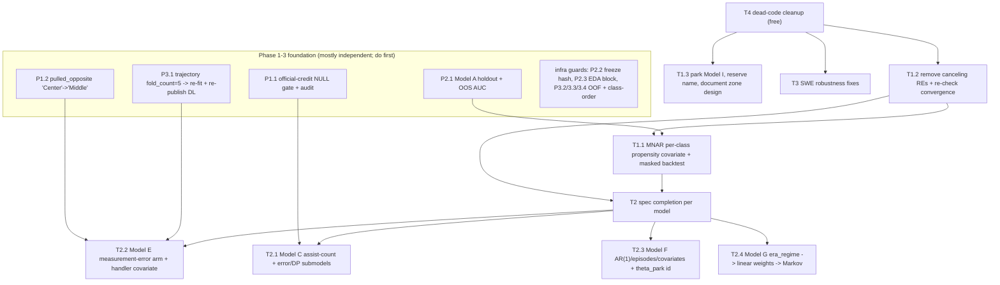

# Implementation Review — Phases 1-4

A pre-launch correctness review of the data-coverage initiative, weighted toward Phase 4
(the hierarchical Bayes layer — the most complex code, written with the most autonomy).
Nothing in this layer is consumed by published metrics yet, so this is a correctness and
completeness plan, not a publication-risk triage. The job of this doc: name what is wrong
and specify the right fix, so we can work the list before moving on.

## Method

Phase 4: three parallel adversarial reviewers (Bayesian/PyMC modeling, SWE engine + ingestion,
spec-gap + baseball-domain), then targeted empirical verification of the top structural claims
against `bc_dev.db` (72G, materialized) and two deep dives (Model B identifiability, Model I
responsibility, MNAR sizing). Phase 1-3: four parallel adversarial reviewers (Phase-1 ledgers /
authority / exposure, Phase-1 observation + gaps, Phase-2 datasets / splits / EDA, Phase-3 deep
supplements), each querying the materialized snapshots directly. Findings cross-checked across
reviewers; load-bearing claims verified by hand.

## Status legend

- **[empirical]** — confirmed by running queries / reading the exact code, not just inferred.
- **[static]** — confirmed by code read with `file:line`, not yet exercised at runtime.

Progress markers (added 2026-06-10, after wave 1 landed on `data-coverage-fix-wave-1`, 9 commits;
extended same day after wave 2 landed on `data-coverage-fix-wave-2`):

- **Status: fixed (wave 1)** — landed and verified in wave 1.
- **Status: fixed (wave 2)** — landed and verified in wave 2.
- **Status: attempted and refuted (wave 2)** — built in full, then refuted by a controlled
  experiment; the infrastructure ships, the correction does not.
- **Status: open (next wave)** — deliberately deferred to the next wave.
- **Status: open** — not addressed yet.

## Severity tiers

- **Tier 1** — correctness / project-invariant violations. Fix before anything builds on these.
- **Tier 2** — models materialized as cut-1s whose output does not satisfy the spec estimand.
- **Tier 3** — SWE correctness / robustness hazards (mostly latent pre-launch).
- **Tier 4** — dead / duplicative code.

## Decisions locked during this review

1. **Model I (responsibility)** — blocked, name reserved. It needs a geometry→zone positioning
   prior that does not exist in the pipeline. Joins B and K as "blocked pending a new input."
   Park/remove the current model; ship nothing called `fielder_responsibility`.
2. **MNAR / label-bias correction** — central must-fix, era-scoped to pre-1988. Per-class
   propensity covariate, not IPW, not a scalar offset. (Outcome: attempted and refuted at full
   scale in wave 2 — see T1.1.)
3. **F / G and other cut-1s** — fix to spec in this doc. No publication/relabel hedging; nothing
   is consumed yet.
4. **Model B (contact confusion)** — confirmed genuinely blocked, with proof and a single
   unblock condition (see appendix). No work beyond recording it.
5. **Model K (shift propensity)** — skipped, as decided. The dead stub gets deleted (Tier 4).

---

## Tier 1 — correctness / invariant violations

### T1.1 — No MNAR / label-bias correction anywhere downstream [empirical]

**Status: ATTEMPTED AND REFUTED (wave 2).** Not "fixed". The fix below was implemented in full,
and then a controlled experiment refuted the design itself.

**What was built (all of it ships).**

- The six Model A obs propensity targets refit as `10k-v4-fullscore`, each exporting a
  **full-coverage** `event_propensity.parquet` — every event of the dimension in saturated
  seasons (trajectory 10,706,330 of 12,038,982; the four location dims 11,163,039;
  `ball_handler_position` 12,038,982 = 100%). Held-out: trajectory ROC-AUC 0.898 / PR-AUC 0.909
  (baseline 0.450); location_side 0.973/0.957, location_depth 0.972/0.958, location_edge
  0.972/0.956 (location baselines 0.374); general_location 0.972/0.958; ball_handler_position
  0.942/0.992 (baseline 0.892). `scorer_observation_propensities` restated: 67,397,468 rows,
  per-dim counts equal to the export heights.
- Datasets frozen with the propensity join: `e-v10-geometry` + `obs-v3-propensity` (84,272,874
  rows each), `propensity_artifact_id=10k-v4-fullscore` on every Model-A-covered dim, propensity
  NULL only on unsaturated seasons (trajectory 1,332,652; location dims 875,943) and on
  `pulled_opposite` (fully NULL — no Model A target).
- The per-class covariate exactly as specified: `gamma_propensity[class]` (ZeroSumNormal) on the
  standardized logit of `propensity_p_observed`, mirroring the `gamma_dl` hook, in both the E and
  D builders, folded into `_posterior_event_softmax` reconstruction, with frozen training-slice
  standardization stats on held-out/production scoring.
- The masked-backtest harness: `scripts/mnar_masked_backtest.py` →
  `statistical/backtests/mnar_masked.py`.

**The refutation (both models, full scale).**

- geometry (`artifacts/statistical/backtests/mnar/geometry-seed20260610-budget10000/metrics.json`):
  masked-slice GroundBall truth share 0.467; the corrected model recovers **0.3526** vs
  uncorrected **0.3528** — focal share error 0.1144 vs 0.1142, relative reduction **−0.001**
  against the required ≥ 0.25. `gamma_propensity[GroundBall]` posterior −0.083 ± 0.026 — the
  **wrong sign**. Diagnostics clean (0 divergences, rhat/ess pass); held-out non-regression
  passed. `overall_pass=False`.
- ball_handler (`artifacts/statistical/backtests/mnar/ball_handler-seed20260610-budget10000/metrics.json`):
  focal error 0.0372 vs 0.0373 (relative reduction 0.003). `overall_pass=False`.

**Mechanism — why a learned coefficient on the marginal propensity cannot work.** Training is
observed-only. Under class-dependent masking, P(masked) = w_class × intensity: the focal class is
preferentially removed exactly in heavily-masked contexts. So among the *surviving* (observed)
events, low `p_observed` correlates with **less** focal class — a survivor tilt, the mirror image
of the truth in the masked slice (which is focal-*enriched*). The likelihood faithfully learns
this tilt and extrapolates it into the masked slice — the wrong direction, hence the wrong-signed
`gamma_propensity`. This is not a tuning or convergence problem; it is an identification failure.
A learned coefficient on the **marginal** propensity P(observed | x) cannot identify
class-dependent selection from observed-only data. The correct construction needs the
**per-class** selection probability P(observed | class, x) entering `eta` as a fixed Bayes-rule
offset (`−log P(obs | c, x)`), or a joint selection / pattern-mixture model. The class is unknown
exactly where the offset is needed, so estimating it is an EM-style joint design. Model A's
marginal propensity cannot supply it.

**Decision (user, locked).** Publish the `gamma_propensity_zero` ("noprop") fits as the E/D
operating points; park T1.1 as attempted-and-refuted. The `gamma_propensity` hook stays in code
with default `gamma_propensity_zero`; the propensity dataset columns and the full-coverage
Model A exports stay — any future selection-model design needs them. The redesign is tracked in
`notes/followups.md`.

**What ships instead.** Operating points `e-noprop-trajectory-shrunk`,
`e-noprop-location_side-shrunk`, `e-noprop-location_depth-shrunk`, `e-noprop-location_edge-shrunk`,
`e-noprop-general_location-zero`, and `d-noprop-10k` (Model D's first-ever publication; held-out
top-1 0.2170 vs prior-baseline 0.1709). gamma_dl flavors unchanged (shrunk for the 4 DL dims,
zero for general_location). Held-out prop-vs-noprop A/B (top-1 / log-loss), 12 fits total on
`e-v10-geometry` / `obs-v3-propensity`:

| dimension | prop | noprop |
|---|---|---|
| trajectory | 0.4915 / 1.1372 | 0.4916 / 1.1393 |
| location_side | 0.6977 / 0.9834 | 0.6976 / 0.9861 |
| location_depth | 0.5705 / 1.0704 | 0.5608 / 1.0818 |
| location_edge | 0.6552 / 0.8959 | 0.6543 / 0.8975 |
| general_location | 0.1848 / 2.4399 | 0.1868 / 2.4440 |
| ball_handler | 0.2182 / 1.9462 | 0.2170 / 1.9455 |

Trajectory, location_edge, and ball_handler are inert. `location_side` and `location_depth`
sit at or just below the majority-class top-1 baseline (side 0.6976 vs baseline 0.6976; depth
noprop 0.5608 vs baseline 0.5611) — a longstanding property of those dimensions, not a wave
regression: the noprop fits reproduce the pre-existing `e-cut1-*` fits' held-out metrics exactly,
and the imputation deliverable is the posterior class distribution (log-loss), not top-1.
`location_depth` is the one nontrivial prop-vs-noprop gap, and it does
**not** argue for publishing the prop fit: `z_prop` is a deterministic function of context already
available to the model, so it can add held-out predictive signal on the observation-rich holdout —
while its *extrapolation* into the unobserved production slice is exactly what the backtest showed
to be wrong-signed. Publishing it would trade honest uncertainty for a misdirected point estimate.

**In-sample-propensity note (accepted).** Model A trains on games that overlap the E/D training
games (the propensity input is not cross-fitted). Accepted because `p_observed` predicts
*observedness*, not the class label, and E/D train on the observed-only slice — the overlap does
not leak the label. This was slated as a CLAUDE.md note; it lives here instead since the hook
ships disabled.

**What's wrong.** Every imputation model (E geometry, H advancement, I responsibility, C credit,
D ball handler) trains on the observed-only slice (`observed_status='observed'`,
`training_weight > 0`) and scores the unobserved slice with no correction for the fact that
*whether a label was recorded is correlated with what the label would have been*. Model A
(observation propensity) was built precisely to supply this correction and is consumed by
nothing: its output (`event_propensity.parquet` / `p_observed_mean`) flows only into the
`scorer_observation_propensities` ingestion `@model` and is read by no prep or builder. `training_weight`
is uniformly `1.0` and used only as a `> 0` filter, never as a weight.

**Evidence (informative missingness, decisive pre-1988).** Using the deduced-ground-ball
("derived") rows as a partial-truth peek at the unobserved population, trajectory broad-class
ground share, observed (= training pop) vs observed+derived (= partial true pop):

| Era | Ground % observed | Ground % true (partial) | n_obs | n_derived |
|---|---|---|---|---|
| <1950 | 33.7% | **68.0%** | 712K | 764K |
| 1950–1987 | 44.0% | **77.7%** | 699K | 1.06M |
| 1988–2002 | 45.3% | 46.5% | 1.82M | 40K |
| 2003–2015 | 45.3% | 45.7% | 1.75M | 11K |
| 2016+ | 43.7% | 43.9% | 1.19M | 2K |

Scorers selectively omitted routine grounders pre-1988; the omitted population is far
ground-enriched. This is the textbook MNAR signature. The unobserved slice being imputed is
**78–95% of all events pre-1988** across geometry/location dimensions, vs **<8% with <1.5pt
divergence from 1988 on**. So uncorrected, the models under-impute ground balls by tens of
points in the exact era where nearly everything is imputed. Model A's per-event `p_observed`
already carries the corrective signal (pre-1988 mean: 0.154 on `unknown_code` vs 0.303 on
observed-air).

**Fix.** Per-class propensity covariate, era-scoped.
1. Join `scorer_observation_propensities` (`event_key, dimension, p_observed_mean`) into the
   imputation preps (`_geometry_data.py`, `_ball_handler_data.py`, the advancement/responsibility
   preps if those survive).
2. Add a per-class `gamma_propensity[class] * standardized_logit(p_observed)` term to
   `build_geometry_model`, mirroring the existing `gamma_dl` per-class hook
   (`models/geometry.py:90-97`). It must enter **per class** — a scalar-per-event `p_observed`
   offset cancels in the softmax (same mechanism as T1.2) and does nothing.
3. Fold the new term into `_posterior_event_softmax` reconstruction.
4. Validate with a masked backtest: mask observed pre-1988 air balls in a realistic scorer/era
   pattern, confirm the corrected model recovers the held-out class mix better than the
   uncorrected baseline, and confirm no regression on 1988+.

**Not** IPW: `pm.Multinomial(n=1)` has no row weight; IPW needs a `pm.Potential` logp rewrite
that breaks the export/eval helpers, plus weight-variance stabilization (pre-1988 weights reach
~6.5×). Higher blast radius for little gain over the per-class covariate.

Files: `models/geometry.py:75-104`, `models/_geometry_data.py:443`,
`coverage/scorer_observation_propensities.py`, `coverage/event_observation_geometry.sql`.

### T1.2 — Per-event random effects cancel in the softmax (C/D/E/H/I) [empirical]

**Status: fixed (wave 1).** Canceling REs removed from the geometry / ball_handler / credit
builders. Paired pre/post smoke comparison at the same seed passed 4/4 — held-out top-1 /
log-loss deltas ≤ 0.0015 / 0.00004, 0 divergences, convergence improved in 3 of 4.

**What's wrong.** In every softmax model the season-league / scorer / park / source random
effects (and in C the per-event global FE `gamma`) are summed into a scalar per event and
broadcast equally across all class logits:

```
per_event_sum = beta_season_league[idx] + beta_scorer[idx] (+ park + source + gamma)   # scalar per event
eta = alpha[None, :] + per_event_sum[:, None]                                           # broadcast across classes
pi  = softmax(eta, axis=1)
```

`softmax(x + c·1) = softmax(x)`, so these terms contribute exactly zero to predictions — in
both arms of Model C (the supervised `Multinomial` and the aggregate `U·pi`, since both consume
the same `pi`). They are sampled anyway: wasted compute, and a flat posterior direction on the
`sigma_*` hyperparameters that invites funnels and divergences. This is the likely cause of
Model I needing `tune=2000` to converge. The CLAUDE.md / docstring claim that the supervised arm
makes these "data-informed" is mathematically false for a complete-class softmax. The spec
wanted *per-class* season effects (`a^{seasonleague}_{d,g}`), so the intended covariate is
silently absent.

**Fix.** Drop `beta_season/scorer/park/source` and the per-event global `gamma` from the
single-arm softmax builders (D/E/H/I). For C, either drop them or make them genuinely per-class
(the deferred per-position extension). After removal, re-check convergence — expect the tune
inflation to disappear. If a season/scorer effect is actually wanted, it must be per-class.

Files: `models/geometry.py:75-76,97`, `models/credit.py:116-120,134`, `models/ball_handler.py:69-70`.

### T1.3 — Model I is not a responsibility model; estimand not identifiable [empirical]

**Status: fixed (wave 2)** (commit 01a1cdf). Model I parked, name reserved; nothing ships called
responsibility. The real zone-responsibility design (the locked disposition below) is documented
in `notes/data-coverage-implementation/responsibility-zone-design.md` for when the
geometry→zone positioning prior exists.

**What's wrong.** Model I trains on `LABEL_COLUMN = "ball_handler_position"` (the recorded
handler, 3-9) — it is Model D restricted to range positions, published as
`fielder_responsibility_probabilities`. The spec (03-hierarchical-models.md §Model I, L806-845)
defines responsibility as an **analytical opportunity** estimand —
`P(responsible=k | geometry, alignment, …)`, who *should* have had a play given where the ball
went, marginal over who actually got to it — and explicitly distinguishes it from the handler
(L416-420: handler "is not official credit and not defensive responsibility"). The confound was
pre-flagged as a validation check (02-eda-and-modeling-datasets.md L294). The training slice is
28% hits, where the handler is just the retriever (89% of hit-handlers are outfielders) — the
same source-coupling pathology that forced the v1.6 `direct_handler_position` retraction in C.

**Why it's blocked.** The estimand needs a geometry→zone positioning prior ("a ball in location
bin X is the SS's zone with prob p") that does not exist in the pipeline. There is no
responsibility label anywhere; the only position-valued label on a batted ball is the handler.
Any model fit on available labels collapses to `P(handled=k | geometry)`. Model E's geometry
posterior exists (253M rows) and the current Model I doesn't even consume it.

**Disposition (locked).** Block and reserve the name. Park/remove the current target and the
`fielder_responsibility_probabilities` `@model`; do not ship anything called responsibility.
Document the real design for when the input arrives:
`P(responsible=k) = Σ_location P(location | event, Model E) · π(k | location, alignment)`, with
`π` a Dirichlet zone-responsibility kernel under a positioning prior, shift-gated on Model K
when it exists (era-normal fallback otherwise), validated on the high-coverage outs slice and
against official putout/assist patterns without overwriting them.

Files: `models/_responsibility_data.py:50`, `bayes/targets/responsibility.py`,
`model_input_responsibility.sql`, `coverage/fielder_responsibility_probabilities.py`.

---

## Tier 2 — models materialized as cut-1s that don't satisfy the spec estimand

These ship honest cut-1s (disclosed-deferred in the checklist) but the materialized tables do
not estimate what their names imply. Per the locked decision, fix to spec; no publication hedging.

**Status (all of T2.1–T2.5): open (next wave).** No spec completions landed in wave 1.

### T2.1 — Model C (credit): assist-count and error/DP submodels absent

Spec wants a Multinomial putout (known `U`) **plus** a separate assist-**count**
(Dirichlet-multinomial over `M ∈ {1..4}` per event-class) then allocation, **plus** error and
double-play submodels, constrained by the box residual. Built: dual-arm putout (v1.5) + an
assist K=10 with a single NONE sentinel folded into the allocation softmax — handles only
`A_count ∈ {0,1}`; multi-assist rundowns/DPs are filtered out. Held-out per-fielder
identification on the production slice ≈ baseline (top-1 0.6635 vs 0.6523); only `P(any assist)`
clears baseline. The aggregate arm is rebuilt from a synthetic mask, not the spec's box residual.
**Fix:** build the assist-count Dirichlet-multinomial, the error/DP submodels, and the real box
residual constraint.

### T2.2 — Model E (geometry): no measurement-error arm, no handler covariate, + MNAR (T1.1)

Spec wants a per-class measurement-error confusion arm (`Ω`/`Δ`) over recorded+deduced layers,
a handler-posterior covariate `P(H)`, and MNAR/propensity correction. Built: per-dim K-class
softmax on recorded labels only, FEs + a per-class DL covariate. **Fix:** add the
measurement-error arm (note: the deduced layer is a deterministic function of the same scorer's
fielding — see Model B appendix — so the "second label" is not independent; the confusion arm
must be anchored on something real or stay recorded-only), the handler-posterior covariate, and
the T1.1 propensity term.

### T2.3 — Model F (park factors): missing structure + identification risk

Spec wants a hierarchical GLM with batter/pitcher/hand/umpire/weather/surface/day-night/home-adv
terms, an **AR(1) dynamic prior** (`ρ~Beta(2,1)`), `park_episode_id` boundaries, and batted-ball
factors. Built: `α_season_league + offense[team-szn] + pitching[team-szn] + θ_park[park-szn-lg]`
NB, none of the above. Two concerns: (a) `θ_park` is ZeroSumNormal globally across **all**
park-season-league cells, not within season-league — era scoring can leak into the park effect if
`α_season_league` under-absorbs; (b) home-park/home-team confound — a team plays all home games in
one park within a season, so home-team offense/pitching is partly collinear with `θ_park`, which
can inflate the held-out park lift. **Fix:** the AR(1) persistence, `park_episode_id`, the spec
covariates, and a within-season-league identification for `θ_park`; add a road-vs-home contrast
as a sensitivity check.

### T2.4 — Model G (run values): no era_regime, no Markov, no linear weights

Spec wants RE **plus** a Markov transition submodel (sum-to-1 hard invariant) **plus**
context-neutral **linear weights** (the headline deliverable), with an `era_regime` indicator.
Built: cell-grain NB RE only (global→state→cell), pooling all seasons 1901-2025 into one mean.
The missing `era_regime` is a real misspecification — the 2020+ ghost runner and the DH materially
shift run expectancy, and a published RE table without them is wrong, not merely incomplete.
**Fix (in priority order):** add `era_regime`; build the linear-weights deliverable; add the
Markov transition submodel.

### T2.5 — Model J (pitch summary): coverage Bernoulli arm deferred

Built: cell-grain Multinomial over 12 final counts. Spec also wants a coverage (`has_count`)
Bernoulli arm and batter/pitcher/source context. **Fix:** add the coverage arm and context terms.

---

## Tier 3 — SWE correctness / robustness

### T3.1 — Geometry export omits `geometry_dimension` on disk [static]

**Status: fixed (wave 1).** `geometry_dimension` column written in the export; ingest asserts
equality against the spec; the `pl.lit` stamp kept only for old artifacts.

`_export_geometry_probabilities` (`training.py:1271-1302`) writes
`(event_key, class_index, class_label, expected_share)`; the column is reconstructed at ingest
via `pl.lit(spec.dimension)` (`manifest_ingest.py:417-424`). Not a runtime break, but any direct
reader of `geometry_probabilities.parquet` (ad-hoc query, `validate-artifact`) won't find the
dimension it purports to carry. **Fix:** write the column in the export.

### T3.2 — Signed/unsigned dtype mismatch: run_expectancy + pitch_summary [static]

**Status: fixed (wave 1).** Signed ints in `run_expectancy_summary` + `pitch_summary_distribution`
(columns block and empty-schema stub); rebuilt on real data.

Exports write `Int8`/`Int16` (`training.py:1601-1662`, pitch-summary export); the `@model`
columns declare `UTINYINT`/`USMALLINT` (`run_expectancy_summary.py:53-55`,
`pitch_summary_distribution.py`). DuckDB silently coerces non-negative values, so it works today,
but becomes a silent truncation the moment any `-1` sentinel appears. **Fix:** unify to signed in
both the `@model` columns block and the empty-schema stub.

### T3.3 — DL covariate misnamed and unguarded [static]

**Status: fixed (wave 1).** Renamed to `compute_dl_log_probs_per_class`; row-length guard added;
class-vocab alignment check pinned to the dataset's `dl_artifact_id` (pointer fallback with a
warning). Same fix covers P3.4.

`compute_dl_logits_per_class` (`dl_covariate.py:69`) returns `log(p)` — log-probabilities, not
logits, despite the name (the sibling `compute_dl_logits` is a true logit). Using per-class
log-probs as a softmax offset is a defensible design (γ=1 recovers the DL distribution after
centering), but the name misleads. Separately, the per-class offset is indexed positionally
against hand-written `class_labels` tuples (`_geometry_data.py:95-126`) with no assert that the
published DL `class_labels.json` order matches — a silent scramble if they ever diverge. Only
masked because `gamma_dl_zero` is the shipped default. **Fix:** rename to `..._logprobs...`; add a
class-order assert + unit test in the geometry prep.

### T3.4 — Defensive robustness in the fit driver [static]

**Status: fixed (wave 1)** (the part that was real — backend env validation).

**Retracted:** the original claim that `_evaluate_held_out` leaves `held_out_metrics`
uninitialized (risking `UnboundLocalError` on a new export kind) did not survive re-verification —
the actual code structure differs from the review's description; no bug. The real finding:
`_resolve_sampler_config` (`training.py:263`) casts `BC_STATS_BAYES_BACKEND` with no validation
against `NutsBackend`, so a typo surfaces as a confusing sampler error. **Fix:** validate the
backend env against `get_args(NutsBackend)`.

### T3.5 — SAMPLE_SIZE doc drift [static]

**Status: fixed (wave 1).** Docs updated to the 10k operating point (code is the source of truth).

`targets/credit.py:25` and `targets/ball_handler.py:25` set `SAMPLE_SIZE = 10_000`; CLAUDE.md and
the checklist say `50_000`. 10k appears intentional (memory: "Model D operating point 10K";
credit "full-10k-v15-tuned"). **Fix:** update CLAUDE.md + checklist to 10k, or confirm and bump
code — pick one source of truth.

---

## Tier 4 — dead / duplicative code

### T4.1 — Delete dead stubs and predecessors [empirical]

**Status: fixed (wave 1).** Deleted: `park_factors.py` / `shift_propensity.py` / `advancement.py`
stubs, `validation.py`, `deep/proposals.py`, `deep/calibrators.py` (+ `calibration_method`
plumbing), and the dead `coords["position"]`. Covers P3.5/P3.6 as well.

Zero importers (grep-confirmed): `models/park_factors.py` (plural — footgun next to the real
`park_factor.py`), `models/advancement.py`, `models/shift_propensity.py` (K is skipped),
`statistical/validation.py` (live logic is in `validate.py`). Also dead coord
`_responsibility_data.py:221` (`coords["position"]` overwritten by the builder). **Fix:** delete.

### T4.2 — Deduplicate the fit/ingest helpers [static]

**Status: open.** Not addressed in wave 1.

- `_posterior_held_out_softmax` and `_posterior_event_softmax` (`training.py:614-677` vs
  `1090-1153`) are ~90% identical; unify behind one parameterized function.
- `manifest_ingest.py` repeats the `iterate_published_*` loop 9 times; the deep
  `deep/manifest_ingest.py` already has the clean parameterized
  `iterate_published_target_frames(...)`. Adopt that pattern here.
- Each ingestion `@model` redefines its empty-schema dict inline, duplicating the
  `*_SCHEMA` constants in `manifest_ingest.py`; import and reuse.

---

## Confirmed correct — do not touch

- The analytic softmax export math (`_posterior_event_softmax`, the putout-marginalized variant,
  `_score_putout_posterior`): scalar-per-event terms legitimately omitted (they cancel),
  normalization with max-subtraction, label-aligned cross-fit remap, posterior-mean reduction.
  **The `-1` unseen-level guard is present and applied in both the plain and marginalized paths.**
- Position encoding 1-9 throughout; responsibility correctly excludes P(1)/C(2) and bunts.
- `alignment_regime` is a pure season-era bucket (`event_observation_context.sql:254-257`), **not**
  a shift-observation leak — the authorized era-normal fallback given K is skipped.
- Credit (C) does not consume handler/responsibility posteriors; `direct_handler_position` was
  retracted with a 1% production-coverage guard. Separation holds at the credit input layer.
- Advancement (H) excludes sac flies, `runs_on_play`, `hit_or_out` from FEs — no post-event leak.
- Splits: `game_hash_fold` uses BLAKE2s (stable), partitions at game grain; the 8 non-A model
  preps hold out 10% of games and score it — genuine OOS, disjoint, no within-game leakage.
  (Model A is the exception — no holdout at all; see P2.1. The DL trajectory dim has a separate
  cross-fit leak; see P3.1.)
- Deep supplements honor pre-event-only *input* guards (`validate_pre_event` deny-list); no
  post-event feature leaks into a proposal head. (This is a different leak class from the
  out-of-fold contamination in P3.1 — the input guard can't see it.)
- Per-dimension `observed_status` partition is disjoint and exhaustive (verified: 0 duplicate
  grains, 0 null statuses, exact rows-per-event). The *values* behind it have bugs — see P1.2
  (`pulled_opposite`) and P1.3 (`model_input_eligible` mislabel).
- Phase-1 ledger grain integrity: all 8 ledgers verified unique at their declared grain, no
  fan-out. `fielding_credit_gaps` target-population logic is correct.

---

## Phase 1-3 findings

A deep adversarial pass (the earlier light sweep called these "clean" — it was right only about
grain). Numbered P1/P2/P3 by phase to keep them distinct from the Phase-4 `T` items.

### Blockers

#### P1.1 — NULL-valued box stats published as authoritative official credit [empirical]

**Status: fixed (wave 1).** Missing = `box_value IS NULL`; `box_present` removed; audit
tightened. Verified: exactly 20,236 rows `present_clean`→`missing`, authority `box` −20,236,
`can_publish_official` −20,236.

`official_aggregate_availability.sql` branches its status CASE on `box_present` (the box row
exists), not on whether the specific stat value is non-null. Early / Negro-League box fielding
lines carry a present row with NULL putouts/assists/errors. Result: **20,236 rows labeled
`aggregate_status='present_clean'` with `aggregate_value IS NULL`**, which `official_credit_authority.sql`
then maps to `authority_source='box'`, `can_publish_official=TRUE`. A consumer trusting
`can_publish_official` reads a NULL count as an authoritative official total. The custom audit
`residual_value_matches_status.sql` exempts exactly this case (`present_clean AND value IS NOT NULL`),
which is why it looked clean. **Fix:** gate on `box_present AND box_value IS NOT NULL`; a NULL stat
on a present row is `missing`; tighten the audit to assert `present_clean ⇒ value IS NOT NULL`.
Files: `official_aggregate_availability.sql:277-286,130`, `official_credit_authority.sql:63,75`.

#### P2.1 — Model A (observation propensity) has no held-out split; all validation in-sample [empirical]

**Status: fixed (wave 1).** Game-disjoint 10-fold holdout (fold 0); `held_out_metrics.json` with
ROC/PR-AUC/baseline/ECE; held-out scoring capped at 100k events. All 6 targets refit as
`10k-v3-holdout`: ROC-AUC 0.897–0.973, PR-AUC 0.907–0.992 vs baselines 0.375–0.892, 0
divergences, rhat ≤ 1.0398. Published; `scorer_observation_propensities` restated.

`_event_data.py` never calls `game_hash_fold` and builds no held-out set (grep-confirmed: zero
fold references). The bernoulli branch of `run_bayes_model` (`training.py:1948-1970`) computes
ECE / reliability / bucket-dev from `p_mean` against the training labels, and
`event_propensity.parquet` scores the same fitted events. There is **no OOS AUC anywhere in the
production path for any of the 6 obs-propensity targets** — a direct violation of the project rule
that fit results pair convergence with a held-out predictive metric. The recorded "OOS AUC plateau
at 10K" came from a throwaway script, not the shipped pipeline, and is not reproducible from the
artifacts. **Fix:** add the same `game_hash_fold(fold_count=10)==0` holdout + a held-out AUC/PR-AUC
eval to the obs prep and the bernoulli branch.

#### P3.1 — Trajectory DL proposal is in-sample, contaminating a published posterior [empirical]

**Status: fixed (wave 1).** Refit as `phase3-trajectory-v9-cv` with 5-fold CV; `fold_id`
provenance verified (8,434,463 OOF rows, 5 folds, 0 nulls). The shipped Bayes posterior is
`e-cut2b-trajectory-shrunk` (pointer `geometry_trajectory.json`, gathered into
`imputed_batted_ball_geometry`). The first refit attempt (`e-cut2-trajectory-shrunk`) silently
consumed the v8 leaked covariate because `publish-manifest` wrote the deep pointer under the
raw model name instead of `dl_proposal_trajectory.json` (deep and Bayes targets share the name
`geometry_trajectory`) — fixed in the CLI; deep artifacts now publish under the spec's
`published_manifest_name()`. The leak was real: on the identical game-hash holdout (n=616,454),
unleaked e-cut2b lands held-out top-1 0.4916 / log-loss 1.1393 / macro PR-AUC 0.4615 vs the
leak-inflated 0.5031 / 1.1174 / 0.4864 — a ~1.2pt top-1 inflation now removed. Convergence is
unchanged vs e-cut2 (rhat 1.0038, ess_bulk_min 2394, 0 divergences; the gain vs e-cut1's
ess 139 comes from the T1.2 RE removal). These e-cut2b numbers are the honest gamma_dl baseline.

`deep/targets/geometry.py:137` sets `fold_count=1` for `geometry_trajectory`. With `fold_count<=1`,
`training.run_target` skips the OOF loop and the fallback at `training.py:820-831` predicts the
**entire training set with the full-fit model** and tags it `"OOF"`. The published
`phase3-trajectory-v8` artifact carries 8.43M in-sample rows mislabeled `OOF`; these flow
`dl_proposal_manifest` → `model_input_geometry.dl_p_class` → `prepare_geometry_inputs` →
`gamma_dl_shrunk` in `build_geometry_model`. **Verified the published `geometry_trajectory.json`
points to `e-cut1-trajectory-shrunk`** — the gamma_dl flavor — so the contaminated, label-leaked
DL signal is realized in a consumed posterior, biasing the trajectory imputations. The other three
DL geometry dims (`location_side/depth/edge`, `fold_count=5`) are genuinely out-of-fold and clean.
**Fix:** set trajectory `fold_count=5`, re-fit + re-publish the DL artifact, then re-fit the
`geometry_trajectory` shrunk posterior.

### Correctness

#### P1.2 — Geometry `pulled_opposite` straightaway silently dropped (5.65M events) [empirical]

**Status: fixed (wave 1).** Two-stage derivation; 3-class domain {pulled, opposite, middle};
`sentinel_type='null'`. Verified: derived `middle` = 5,447,237 (incl. 838 hand-independent
`Middle` rows previously missing), 205,633 `All`→`missing`, pulled/opposite unchanged, zero
derived-with-NULL. New audits: `derived_requires_deduced` (now bidirectional) +
`deduced_value_in_domain`.

`event_observation_geometry.sql:230` tests `WHEN location_side = 'Center' THEN 'straightaway'`, but
the `location_side` domain is `Left / Middle / Right / Unknown / All` — `'Center'` is never produced
(it's a `general_location` zone name). So **5,652,032 `derived` `pulled_opposite` rows have
`deduced_value IS NULL`** (the straightaway/`Middle` cases): every straightaway batted ball is
flagged `derived` with a NULL deduction. The `sentinel_status_consistent` audit doesn't assert
`derived ⇒ deduced_value NOT NULL`, so it slips through. **Fix:** `'Center'` → `'Middle'` on line
230; decide whether `'All'` is straightaway, missing, or excluded.

#### P1.3 — `model_input_eligible` contradicts its docstring and the training-eligibility seed [empirical]

**Status: fixed (wave 1).** Now seed-derived via LEFT JOIN to `seed_observed_status` (LEFT +
`not_null` audit, so unseeded statuses fail loudly instead of dropping); −89,228,135 eligible
rows across the 3 ledgers. New audit: `model_input_eligible_matches_seed`.

Documented as "admissible to a fitted-model training set," but the predicate only excludes
`not_applicable` and `data_error_prone` — so `unknown_code` and `missing` rows are flagged eligible
(geometry: 22.9M `unknown_code` + 1.2M `missing`; pitch: 64.4M `missing`), contradicting
`seed_observed_status.csv` which marks only `observed`/`derived` as `is_training_eligible`. Latent
today (every real fit filters on `observed_status='observed'` directly; only `eda.py` reads the
column as a coarse gate), but it invites the next author to train on junk. **Fix:** tighten the
predicate to also exclude `unknown_code, missing`, or rename/redoc to its true meaning.

#### P2.2 — Dataset freeze hash is name+snapshot-addressed, not content-addressed [empirical]

**Status: fixed (wave 1).** Rerun verification now does a structural arrow-schema comparison
(canonicalized nested types, parquet side recomputed at verify time — no false positives on
`DOUBLE[]`/`STRUCT`).

`datasets.py:240` hashes only the literal `"SELECT * FROM main_models.model_input_X"`. A change to
the *view definition* (added/dropped/renamed column, changed filter) under the same
`source_snapshot_id` passes `_verify_rerun` and **silently returns the stale on-disk artifact** —
the parquet schema in metadata is never re-compared. Only a manual `dataset_version` bump catches
it. **Fix:** fold the parquet schema (or the rendered view SQL) into `query_hash`, or compare
on-disk columns in `_verify_rerun`. Files: `datasets.py:199-240`.

#### P3.2 — `run_target` silently emits in-sample "OOF" for any `fold_count=1` spec [static]

**Status: fixed (wave 1).** `fold_count` now `ge=2`; unconditional fold loop; raises instead of
the full-fit-as-OOF fallback; `fold_id` column added; export-time invariant asserts.

The root cause of P3.1 generalizes: `training.py:820` mislabels in-sample predictions as `OOF` with
no warning, and nothing downstream can tell them apart. Any future spec set to `fold_count=1`
inherits the leak silently. **Fix:** when `fold_count<=1`, raise (proposals consumed as Bayes
covariates must be OOF) or tag the partition `IN_SAMPLE` and refuse to emit it; add a test that
every DL spec consumed by a `gamma_dl_shrunk` target has `fold_count>1`.

#### P3.3 — `leakage_probes.py` cannot detect cross-fit leaks [static]

**Status: fixed (wave 1).** `oof_integrity_probe` + structural checks wired into
`validate-artifact` for deep artifacts.

It probes only whether embeddings encode `source_family`/confounds (a representation-leak detector).
It never inspects fold assignment or compares in-sample vs OOF predictions, so it would not have
caught P3.1 and gives false assurance. **Fix:** add an export-time OOF-integrity check — assert
every `OOF` row's game maps to a fold the predicting model excluded, and no `event_key` spans two
partitions.

#### P3.4 — DL covariate has no class-count guard; class-order aligned by convention only [static]

**Status: fixed (wave 1)** (with T3.3): row-length guard; class-vocab alignment check pinned to
the dataset's `dl_artifact_id` (pointer fallback with a warning).

Corroborates Phase-4 T3.3 from the consumer side. `dl_covariate.py:66-67` indexes `row[class_idx]`
with no check that `len(row) == n_classes`; the 5-fold dims derive DL labels by `.unique().sort()`
while Bayes uses hardcoded constants — a class present in one set but not the other shifts indices
and misaligns `dl_logit` against `alpha_class` (or `IndexError`). **Fix:** read the DL artifact's
`class_labels.json` in `prepare_geometry_inputs` and assert equality (length + order) with the
dimension's Bayes vocab before computing the per-class logit.

### Quality

- **P2.3 — EDA "blocking findings" don't block.** `cli.py:462-480` always returns 0 regardless of
  `severity="block"`; findings are only logged. If wired as a CI gate it's a no-op. Fix: return
  non-zero (or raise) on any block-severity finding. **Status: fixed (wave 1)** — blocking
  findings now exit 1 from the `run-eda` CLI. Note: this surfaced 4 intrinsic blocking findings
  on the new `e-v9-geometry` dataset (`dominant_single_scorer_park_team`,
  `no_connected_component_for_effect`, 2× `category_absent_in_train_present_in_test`) —
  pre-existing data characteristics (`e-cut1` never ran EDA); wave-1 fits proceeded deliberately,
  but the findings need a disposition decision before any publication-gate use.
  **Disposition: done (wave 2).** EDA re-run on the frozen `e-v10-geometry` + `obs-v3-propensity`
  datasets emitted exactly the 4 expected blocking findings (`dominant_single_scorer_park_team`
  ×1, `no_connected_component_for_effect` ×1, `category_absent_in_train_present_in_test` ×2).
  All 12 targets now carry a `ModelConfig` under `bc/python_models/statistical/model_configs/`
  with `expected_blocking_findings` and `addressed_weak_identifications` (`partial_pool` for the
  obs targets, `drop` for E and D); all 12 pass `check-publication-gate` — the gate's first real
  exercise. Discovery: `run-eda` stamps the CURRENT registry `dataset_version`, not the artifact
  manifest's frozen version, so ModelConfig pins must track the registry version — the 6 obs
  configs were re-pinned 0.2.0→0.3.0 for this reason (commit 4112498).
- **P2.4 — `primary_fold` / `holdout_flags` / `time_forward_fold` are shipped but unused by the
  Bayes layer.** The preps roll their own BLAKE2s fold-10 (different hash + modulus from the
  dataset's `HASH()%100`). Not leakage (each model is internally disjoint), but the columns are dead
  weight and a footgun for anyone assuming they govern the split. Fix: document, or have the preps
  consume `primary_fold` so DL and Bayes share one partition. **Status: open.**
- **P2.5 — the leakage detector is split-assignment-consistency only.** It catches a planted
  cross-fold assignment leak but is structurally blind to feature/post-event leakage, the
  prep↔dataset fold divergence, and P2.1/P3.1. A green leakage check is not "leakage-safe" — that
  was the light pass's exact blind spot. **Status: open** (P3.3's OOF-integrity probe narrows the
  cross-fit gap; the rest stands).
- **P2.6 — stress holdout is diagnostic-only.** `stress_holdout_registry` is correctly built and
  wired into `leakage.py`, but nothing in the fit path drops `is_heldout_*` rows before training,
  and the flags aren't intersected with the primary fold — so a stress-holdout row can also be a
  training row. If "stress holdout" is meant to guarantee exclusion, that guarantee doesn't exist.
  **Status: open.**
- **P1.4 — `personnel_state_reliability` is a 1:1 passthrough.** All 146.9M rows are
  `direct_event`/`hard_zero_allowed=TRUE`; the `missing → inferred / low` half is unreachable on
  current upstream data, so `reliability_class`/`hard_zero_allowed` is a constant downstream. Drop
  the dead scaffolding and document the passthrough, or supply a real gap source. **Status: open.**
- **P1.5 — `entity_link_reliability` crosswalk confidence is hardcoded `medium`.** Both arms of the
  CASE (`entity_link_reliability.sql:78-82,102-105`) return `medium`; the documented `high` (clean
  crosswalk) never fires. Fix: clean crosswalk → `high`. **Status: open.**
- **P1.6 — `game_context_observation_ledger` is 4 games short.** It sources from `stg_games`, which
  excludes the 4 in-scope GameLog games that every sibling ledger includes — silent NULLs on a
  `game_results`→context join. Latent `retrosheet_box` mislabel if GameLog is ever added to
  `stg_games`. Fix: include them as `structural_absence` context, or document the universe.
  **Status: open.**
- **P1.7 — the only non-trivial `training_weight` branch never fires.** `model_input_geometry.sql:217`
  downweights `data_error_risk != 'none'`, but the risk join is a no-op for geometry (100% `'none'`),
  so the `>0` filter is vacuous and the downweighting path is dead. Consistent with the MNAR plumbing
  being inactive (T1.1). **Status: open** (T1.1's covariate construction was attempted and refuted
  in wave 2; the downweighting path stays dead pending the selection-model redesign in
  `notes/followups.md`).
- **P3.5 — `calibrators.py` is dead code.** Never invoked; `dl_p_class` is the raw uncalibrated Keras
  softmax while the manifest advertises `calibration_method="temperature"`. Wire it (fit on the OOF
  union, apply to all partitions) or delete it and drop the manifest field. **Status: fixed
  (wave 1)** — deleted along with the `calibration_method` plumbing.
- **P3.6 — `deep/proposals.py` is entirely `NotImplementedError` stubs.** The real path is
  `training.run_target`. Dead module; delete. **Status: fixed (wave 1)** — deleted.

### Nits

- **P1.8** — `recorded_location_angle='Default'` (the fielder-position fallback angle, 3.52M rows)
  counts as `observed`. Defensible (it's a real categorical), but if the `default_code` status is
  ever meant to be populated, this is the dimension. **Status: open.**
- **P2.7** — registry `target_columns` for `model_input_advancement` omits the `*_is_observed`
  columns the table carries (metadata only). **Status: open.**
- **P3.7** — CLAUDE.md references `bayes/models/*` paths; the builders/preps live under
  `python_models/statistical/models/`. Navigation drift. **Status: open.**
- Several reserved enum statuses across the ledgers are unreachable but consistent with their
  docstrings (`present_issue_flagged`, `synthetic_required`, `incomplete_event_flag`, etc.) — not
  bugs, but the `data_error_risk` signal is effectively inert on fielding authority.

---

## Model B — confirmed blocked (appendix) [empirical]

Model B (latent contact class + scorer/decade confusion `Ω` from observed labels) is
unidentifiable on this corpus, with proof:

- **Exactly one source family per game, every dimension, every era** (zero cross-source overlap).
  Box-score and gamelog games are the complement of PBP games, not overlaps.
- **No Statcast / launch-classification source family anywhere** — the modern era that would be
  the natural truth anchor is the same single Retrosheet vocabulary, just near-complete (96%
  observed in 2015+).
- **The "deduced" contact label is not a second channel.** It is emitted only when the recorded
  label is absent (disjoint partition: 0 events carry both), and where computable it is a
  deterministic function of the same scorer's fielding fields — so its errors are not
  conditionally independent of the recorded label given the latent class. Broad-class agreement
  is 83-96% by era, which is the deduction rule's failure rate, not an independent observer.

Identification needs one of: a ground-truth validation subset, an independent second label
process, or an informative `Ω` prior (which makes the posterior echo the prior). None exist.
**Single unblock condition:** ingest a genuinely independent batted-ball source family (e.g.
Statcast hit classification) into `source_acquisition_ledger` co-observing the same 2015+ games.
Until then, B stays blocked. The block is contingent on the corpus, not fundamental.

---

## Suggested fix sequencing



Order rationale: the Phase 1-3 foundation fixes go first because downstream models are built on
them — P1.1 feeds Model C's official-credit authority, P1.2 and P3.1 feed Model E's geometry inputs
(and P3.1 must re-fit + re-publish the trajectory DL artifact before the E trajectory posterior is
re-fit), and P2.1 must validate Model A before T1.1 consumes its propensities. The infra guards
(P2.2/P2.3/P3.2/P3.3/P3.4) are independent and prevent the next leak from shipping undetected. On
the Phase-4 side: dead-code cleanup first (zero risk, removes the `park_factor`/`park_factors`
footgun), then remove the canceling REs (T1.2) and re-check convergence before any other modeling
change. T1.1 (MNAR) and T1.3 (Model I) are independent. The Tier-2 spec completions are largely
independent per model; within G, `era_regime` comes before linear weights.

**Wave-1 outcome (2026-06-10, branch `data-coverage-fix-wave-1`, 9 commits):** the entire
Phase 1-3 foundation subgraph landed (P1.1, P1.2, P1.3, P2.1, P2.2, P2.3, P3.1, P3.2, P3.3,
P3.4), plus T4.1 dead-code cleanup, T1.2 canceling-RE removal, and the Tier-3 fixes (T3.1, T3.2,
T3.3, T3.4-as-corrected, T3.5). Next wave: T1.1 (MNAR central correction), T1.3 (Model I
parking), the T2 spec completions.

**Wave-2 outcome (2026-06-10, branch `data-coverage-fix-wave-2`):** T1.3 fixed (Model I parked,
name reserved, zone design doc; commit 01a1cdf). T1.1 attempted and refuted — the full
implementation landed (full-coverage Model A `10k-v4-fullscore`, frozen `e-v10-geometry` /
`obs-v3-propensity` datasets, per-class `gamma_propensity` hook, masked-backtest harness) and the
controlled backtest refuted the learned correction on both models; the noprop operating points
published instead (`e-noprop-*`, `d-noprop-10k` — Model D's first publication). P2.3's EDA
disposition closed (12 ModelConfigs, publication gate exercised end-to-end, registry
version-stamping discovery). Operational: `POSTERIOR_CHUNK_DEFAULT` 250k→50k after two concurrent
full-coverage scoring jobs (8 GB slabs each) swapped the machine. Remaining: the T2 spec
completions, T4.2, P2.4–P2.6, P1.4–P1.6, and the nits.
