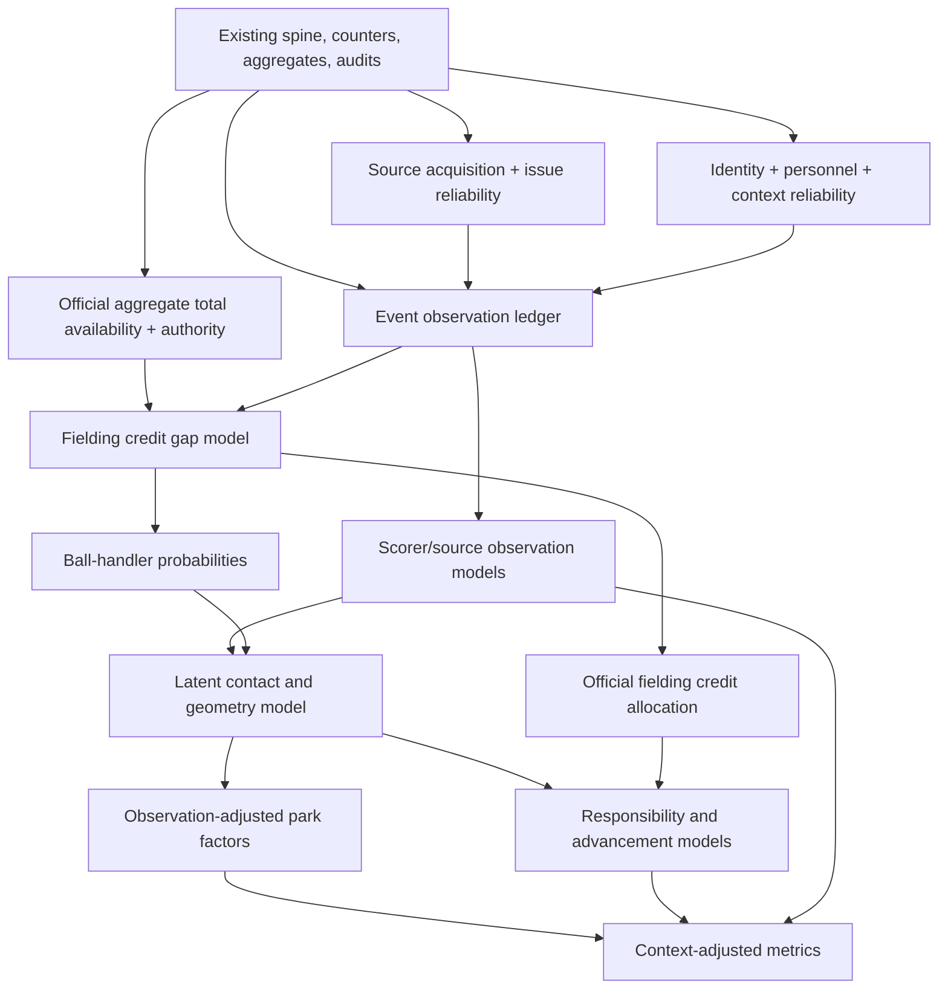

# Statistical Models For Coverage And Context Adjustment

## TL;DR

This document specifies the statistical models needed to represent incomplete and biased baseball data for the 1910-2025 seasons. The database already contains a large event-level historical record, but the detail is uneven: fielders can be unknown, batted-ball descriptions can be sparse or scorer-dependent, pitch sequences can be absent by source, box scores can provide only aggregate totals, and park/run-value estimates can be confounded by era, roster, source, scorer, and schedule.

The goal is to replace implicit fallback rules with explicit, validated statistical models for observation, official fielding credit, batted-ball geometry, park effects, run values, runner advancement, fielder responsibility, and pitch summaries. Each model needs a named estimand, source/reliability inputs, baseball constraints, uncertainty outputs, and validation checks before it can publish estimates.

The first modeling dependency is not an imputer. It is a deterministic provenance layer that records which evidence exists, which source owns each fact, which official aggregate totals can constrain estimates, which personnel/context/exposure fields are reliable, and which observed values are known or suspected data errors. Park factors, responsibility, advancement, and pitch sequence models wait until upstream observation and geometry assumptions survive backtests.

The implementation plan for these models lives in `README.md` in this directory. This document owns the statistical design and model critique; the companion implementation docs own build order, SQLMesh contracts, EDA, code sketches, model-output storage, and rollout validation.

Invariant: raw source facts, deterministic derived facts, official aggregate totals, and probabilistic estimates remain separate. A box-score putout, a rule-derived batted-ball location, an estimated expected putout, and a scorer-normalized latent location are different quantities.

## Motivation

Historical baseball data has multiple missingness mechanisms. A value can be absent because the source never had event-level detail, because the event exists but a field was encoded as unknown, because the source recorded only an aggregate box-score total, because the scorer used a different vocabulary, because the parser or source has a known error, or because the target concept is an official scoring convention rather than a physical event.

Those mechanisms require different models. A missing batted-ball trajectory in a play-by-play event is not the same target as a missing trajectory in a box-score-only game. An unknown putout fielder is not the same target as defensive responsibility for a ground ball. A park home-run factor is not identified by raw home/away rates if park, team, batter handedness, scorer, weather, schedule, and era are inseparable.

The existing database already encodes domain knowledge through deterministic rules, source precedence rules, fixed fallback hierarchies, sample-size thresholds, and informal Bayesian reasoning. This design makes those assumptions explicit, tests whether the target estimands are identifiable, and publishes uncertainty instead of hiding it behind point estimates.

## Reader Assumptions

This document assumes the reader knows baseball scoring and statistical modeling:

- baseball grains such as game, team-game, player-game, plate appearance, event, half-inning, base/out state, box score, putout, assist, error, official scoring credit, park factor, and run expectancy;
- statistical concepts such as missingness mechanisms, measurement error, partial pooling, posterior draws, calibration, prior/posterior predictive checks, and holdout validation.

This document does not assume the reader knows `baseball.computer` internals. Project-specific table names appear as implementation references after the target concept is named.

## Terminology

| Term | Meaning |
| --- | --- |
| Direct source value | A value recorded by an authoritative source at the same grain as the target fact. |
| Deterministic derived value | A rule-based value computed from source facts, such as broad batted-ball class inferred from fielding evidence. |
| Official aggregate total | A box-score or season-level total used as a constraint at a coarser grain than an event. |
| Provenance table | A deterministic table that records source family, observed status, authority, known data-error risk, reliability, and allowed downstream use. |
| Modeling dataset | A frozen input table with source, missingness, reliability, split, and target columns for one model family. |
| Probabilistic estimate | A posterior probability, expected counter, draw, or interval from a fitted model. |
| Synthetic namespace | A separate output namespace for generated event-like distributions when source evidence exists only at an aggregate grain. |
| SQLMesh | The transformation system that builds the deterministic database tables and ingests approved statistical model outputs. Expensive model fitting runs outside SQLMesh. |

## Current Data Shape

The local DuckDB database file produced by this project, `bc.db`, was verified on 2026-05-12 with `205845` play-by-play games, `1953` box-score-only games, and `4` gamelog-only games in the 1910-2025 target span. The event table covers `18137758` events across the play-by-play games only. That source mix changes the model target:

| Source family | Model target |
| --- | --- |
| Play-by-play | Event-level estimation can operate after source and reliability checks classify field-level gaps. |
| Box score | Official aggregate totals can constrain aggregate outputs and estimated event distributions, but they do not create canonical event facts. |
| Gamelog | Coarse game evidence can support schedule/result coverage, but event and player-game details are structurally absent. |

Invariant: event-level estimation is scoped to games with event-level sources. Aggregate-only and gamelog-only rows need aggregate outputs or a clearly named synthetic namespace.

## Current Modeling Surfaces

The existing transformations are useful because they expose implicit data-generating hypotheses:

| Surface | Current approach | Statistical gap |
| --- | --- | --- |
| `event_completeness_*`, `game_data_completeness`, `player_game_data_completeness` | Boolean completeness flags by dimension. | No observation model, no uncertainty, and no distinction between missingness mechanisms beyond hand-coded flags. |
| `calc_batted_ball_type` | Deterministic trajectory/location inference from fielding, result, and location seeds. | Strong deterministic evidence is mixed with latent geometry; scorer/era label bias remains unmodeled. |
| `player_position_game_fielding_stats` | Source authority order: event if complete, otherwise box where available. | Good source rule, but no posterior allocation for event-level unknown credits or no-box games. |
| `unknown_fielding_play_shares` | Residual allocation using box surplus and unassisted-putout rates. | No uncertainty, weak event context, no explicit likelihood, and no no-box posterior. |
| `scorekeeper_tendencies_contact`, `scorekeeper_tendencies_location`, `scorekeeper_tendencies_batter` | Grouped scorer/decade rates. | No partial pooling, no label-confusion model, and no separation between true event mix and observation bias. |
| `ground_ball_blame` | Window ratios from selected high-coverage eras. | Selection-biased training slice, no uncertainty, no transport model across shift regimes. |
| `runner_advance_expectancy`, `fielder_advance_expectancy` | Cell averages with season residual adjustments. | Sparse cells, no shrinkage, no posterior, and unstable conditioning on proxy variables. |
| `linear_weights` | Exact season/league/play cells when sample size exceeds 100, otherwise generic imputation. | Hard threshold and point imputation hide uncertainty for sparse leagues and early seasons. |
| `park_factors` and `calc_park_factor_*` | Batter/pitcher matched self-join with fixed synthetic prior sample size. | Fixed pseudo-counts are not a model of park-season uncertainty; batted-ball park factors inherit observation bias. |
| `ml_features` and `predictions_*` | Keras prediction models with sample weights and versioned-output gating. | Predictive models are not measurement models; calibration and target leakage boundaries must be explicit before using predictions as priors. |

## Goals

- Define statistically sound replacements for deterministic fallback rules, hard sample thresholds, and point estimates where uncertainty matters.
- Preserve domain constraints: game outs, score transitions, box totals, personnel eligibility, official scoring conventions, and raw sentinel semantics.
- Model missingness and label bias directly instead of treating observed detailed data as representative.
- Carry uncertainty through chained models by passing posterior draws or probability tables, not posterior means as fixed facts.
- Include context-adjustment models that share the same statistical problems, especially park factors, linear weights, and runner/fielder advancement.
- Keep implementation compatible with SQLMesh by fitting expensive models offline and materializing stable model outputs back into SQL models.

## Non-goals

- Do not fabricate full event records for aggregate-only or gamelog-only games in the canonical event namespace.
- Do not replace existing raw, staged, or deterministic models with sampled values.
- Do not treat generic tabular imputers as the primary approach. MICE, MissForest, and neural imputers can be baselines, but the target here is domain-constrained inference.
- Do not build one giant joint model as the first implementation. The design should allow eventual joint models while shipping validated modules.
- Do not use ML predictions as facts. They can be calibrated priors, baselines, or posterior predictive checks.
- Do not let deep-learning argmax labels become published imputed facts. Deep models can propose distributions, embeddings, or baselines; the published layer must still enforce domain constraints, provenance, calibration, and uncertainty.

## Design Principles

### Estimands Before Imputation

Each model needs a named estimand:

| Estimand | Unit | Example output |
| --- | --- | --- |
| Observation propensity | Event-dimension | Probability that trajectory/location/credit was observable under the scorer/source process. |
| Official credit | Event-player-position-credit type | Expected putouts, assists, errors, double plays, and related official credits. |
| Ball handler | Event-player-position | Probability that a fielder handled or completed the play. |
| Latent geometry | Event-geometry class | Probability distribution over trajectory, side, depth, edge, and region. |
| Responsibility | Event-position or event-player | Defensive opportunity share for range-style metrics. |
| Park effect | Park-season-league-outcome | Counterfactual rate ratio or odds ratio with posterior uncertainty. |
| Run value | Season-league-play/state | Posterior run and win value distributions. |
| Advance value | Event-runner/fielder | Posterior distribution of bases advanced and outs above context expectation. |

Invariant: the grain of the estimand controls the table grain. Do not store a player-season estimate in an event table unless the event table stores a posterior draw or expected event contribution that aggregates to the player-season estimate.

### Observation Process Is Separate From Baseball Process

The observed database is generated by at least two coupled processes:

1. Baseball process: the event happened, a ball had a latent contact/geometry, fielders handled it, runners advanced, runs scored, and official scorers assigned credit.
2. Observation process: a source, scorer, inputter, translator, parser, and table model recorded or omitted parts of that event.

Most existing heuristics blur those processes. A sound model should usually contain both:

```text
latent baseball state -> official credit / outcome
latent baseball state + scorer/source process -> recorded label / missingness
```

This matters most for batted-ball detail. Known hit locations are selected by scorer habits, result salience, leverage, and era. Complete-case estimates from that subset are not neutral samples.

### Deterministic Rules Become Measurement Constraints

`calc_batted_ball_type` should not be discarded. Its rules are high-value domain constraints:

- Recorded trajectory/location are direct observations.
- Deduced broad trajectory/location are high-confidence measurements with known failure modes.
- Unknown fielder, unknown putout, and missing assist-chain risk are weak or ambiguous measurements.

The Bayesian layer should treat deterministic outputs as observed evidence with source-specific reliability, not as final truth for every downstream estimand.

### Posterior Draws Beat Point Fills

Coverage, park, and fielding models will feed each other. Passing posterior means as fixed inputs will understate uncertainty and can bias nonlinear rates. Preferred interfaces:

- Long probability tables for categorical event quantities.
- Additive expected counters for metric inputs.
- Posterior draw tables when downstream nonlinear summaries matter.
- Summary tables only for display and cheap SQL joins.

Invariant: when a downstream estimate materially depends on upstream uncertainty, pass draws or probability distributions.

### Validate Identifiability Before Fitting

Every model in this document is a hypothesis about how baseball events and observation processes generated the tables. Before implementation, validate that the data can distinguish the intended estimand from its confounders.

Required pre-model checks:

- Identify the target estimand, observed data, latent variables, and missingness indicator.
- Draw the missingness or causal DAG for the model family.
- List post-treatment covariates that must not be conditioned on for that estimand.
- Measure whether candidate grouping factors are connected enough for partial pooling.
- Run simple slice diagnostics before fitting a hierarchical model.
- Define at least one masking or holdout design that matches the suspected missingness mechanism.

Invariant: a hierarchical model cannot rescue an unidentified estimand. If scorer, park, team, source, and era are inseparable in a slice, the output should be tagged as weakly identified or withheld.

## Model Dependency DAG



The first production target is `A -> A1/A2/A3 -> B -> D`, plus narrow validation for `C`. Park factors wait until batted-ball observation bias is represented, but the park-factor design belongs here because it changes the shape of the geometry outputs.

## Build Readiness Ranking

| Readiness | Model family | Reason |
| --- | --- | --- |
| Build first | Source availability and data-error risk ledgers | Imputation needs to know whether a field is missing, structurally absent, absent because no source exists at that grain, or likely wrong before estimating a value. |
| Build first | Official aggregate total availability and authority ledgers | `game_data_completeness.has_box_score` identifies primary `BoxScore` source games, not whether every play-by-play game has usable player-game box-score totals. Fielding and official-credit models need explicit aggregate-total availability. |
| Build first | Identity, personnel, and context reliability ledgers | Fielding and park models depend on player/team/park identity, defensive personnel, handedness, weather, and rule context being trustworthy. |
| Build first | Event observation ledger and observation context | Deterministic contract, no statistical identification risk, required by every later model. |
| Build first | Fielding credit gap classification | Deterministic classification of unknown putouts, assist-chain risk, box residuals, no-box gaps, and source issues. |
| Validate then fit | Scorer/source missingness for batted-ball trajectory/location/contact | Plausible and directly useful, but MAR/MNAR assumptions need slice diagnostics and sensitivity bounds. |
| Validate then fit | Official-total-constrained fielding credit allocation | Strong aggregate totals exist in some slices, but residuals must be separated from box-score errors and parser/source data errors first. |
| Validate then fit | Broad handler and geometry probabilities | Useful after fielding gaps, but fielder-position-to-location transport must be validated by era and alignment regime. |
| Later | Scorer-normalized detailed contact labels | Detailed fly/line/pop truth may not be stable historically; broad ground/air is more defensible first. |
| Later | Fielding responsibility and advancement | Depends on geometry, alignment, and opportunity models; strong risk of conditioning on outcome labels. |
| Later | Observation-adjusted park factors | Park, roster construction, scorer, source, and schedule confounding are severe; needs connectivity checks. |
| Supplement only | Deep-learning proposal models and embeddings | Useful for high-dimensional interactions, but needs calibration, leakage checks, and downstream domain constraints. |
| Last | Full pitch sequence generation | Often absent by source era and less central to this modeling plan than fielding and batted-ball geometry. |
| Last | Synthetic event/personnel generation | Requires accepting a synthetic namespace and cannot be mixed into canonical event facts. |

## Pre-Imputation Gaps Not Yet Addressed In Code

The current database has deterministic coverage flags, issue ledgers, scorekeeping cleanup, personnel state tables, park IDs, weather fields, and synthetic lineup work. Those are necessary but not sufficient for statistical imputation because they treat several upstream facts as exact. The following reliability models should exist before event-field imputation begins.

| Gap | Current code surface | Why it matters before imputation | Proposed output |
| --- | --- | --- | --- |
| Source availability and inclusion | `season_team_coverage`, `game_data_completeness`, `source_type`, `stg_schedule`, `stg_gamelog` | The imputation target changes if a missing value reflects absent source coverage rather than event-level missingness. | Game/team/season source-family ledger and inclusion weights. |
| Source data-error risk | `box_score_data_issues`, `team_game_data_issues`, audits, discrepancy views | A value can be observed and wrong; imputation should not train on or reconcile against likely data errors as if they are truth. | Row/field data-error flags and training weights. |
| Official aggregate total availability | `stg_box_score_*`, `player_position_game_fielding_stats`, `team_game_fielding_stats`, `game_data_completeness.has_box_score` | Official-credit allocation needs to know whether a usable aggregate total exists for a player-game/position/stat, not just whether the game source is `BoxScore`. | Player-game/team-game aggregate-total ledger with field-level availability, authority rank, and data-error risk. |
| Personnel-state reliability | `personnel_*_states`, `event_personnel_lookup`, `game_starting_lineups`, `player_game_appearances` | Fielding allocation depends on the eligible fielder set; hidden substitution or dedupe errors corrupt hard zero constraints. | Event-position eligibility confidence and ambiguous-personnel ledger. |
| Entity linkage uncertainty | `people`, `stg_people`, `stg_rosters`, team/Databank crosswalks, `stg_parks` | Player, team, umpire, and park identity errors propagate into player effects, personnel, park factors, and scorer/source grouping. | Entity-link confidence, unresolved-id ledger, and park-identity episode table. |
| Context measurement reliability | `game_start_info` weather, start time, attendance, park, DH/rule flags, schedule fields | Park factors, run environment, and advancement models need weather/rule/context covariates with known missingness and reliability. | Context-observation ledger and context-imputation candidates. |
| Official scoring convention regimes | earned-run joins, decisions, scratched-starter issue ledger, fielding credit | Some quantities are official conventions rather than physical event facts; imputing them from event logic can be wrong. | Rule/convention-regime table and convention-specific authority order. |
| Exposure and game-completion process | `game_results`, `game_forfeits`, suspended/truncated flags, line scores | Rates and run values depend on whether a game is complete, shortened, suspended, forfeited, or ended by walk-off. | Exposure ledger for innings, half-innings, denominators, and game-completion status. |
| Handedness and biography reliability | `people`, `stg_rosters`, `event_states_batter_pitcher` | Park, geometry, and matchup models use batter/pitcher hand as causal context; missing or inferred hands should not be treated as exact. | Handedness source/confidence fields and posterior hand probabilities when needed. |

Invariant: imputation models should consume reliability outputs as masks, strata, weights, or uncertainty inputs. They should not rediscover source reliability from scratch inside each model.

## Proposed Model Families

### Source Acquisition And Inclusion

This model family decides the target population before any field imputation. It distinguishes a missing event field from a game or source family that was never observed at the required grain.

Estimands:

- `P(source family | season, league, team, game type, park, schedule/gamelog metadata)`
- `P(game included in target population | schedule/gamelog/source evidence)`
- `P(dimension observed as a source block | game/source metadata)`

Recommended first output is deterministic:

| Table | Grain | Purpose |
| --- | --- | --- |
| `source_acquisition_ledger` | `game_id, team_id, dimension` | Source family, acquisition status, structural absence, source-level absence, and usable target flag. |
| `season_team_source_families` | `season, team_id, dimension` | Counts and rates of play-by-play, box-score, gamelog, and absent source families by dimension. |
| `official_aggregate_availability` | `game_id, team_id, player_id, position, stat` | Whether an official aggregate total is available, usable, missing, contradicted, or too risky to use as a constraint. |

Statistical model comes only if the project needs inclusion weighting:

```text
S_g,d ~ Bernoulli(pi_g,d)

logit(pi_g,d) =
  alpha_d
  + alpha_season_league[d, season_g, league_g]
  + alpha_team[d, team_g]
  + beta_game_type[d, game_type_g]
  + beta_source_family[d, source_family_g]
```

Validation:

- Reconcile `stg_schedule`, `stg_gamelog`, `stg_games`, and forfeits/suspended games before estimating any inclusion weights.
- Verify whether missingness is by event, game, team-season, file family, or league-season.
- Treat `game_data_completeness.has_box_score` as a source-type indicator, not as sufficient evidence that a play-by-play game has every needed box-score total.
- Do not impute event fields for games classified as aggregate-only unless a synthetic namespace is explicitly accepted.

### Source Data-Error Risk

Known issue ledgers identify confirmed source or parser errors, but imputation also needs a broader training mask for suspicious rows and slices.

Estimands:

- `P(row/field is a source or parser error | source table, field, era, file family, scorer/inputter, invariant residuals)`
- Error-aware training weight for each field used by statistical models.

Recommended first output:

| Table | Grain | Purpose |
| --- | --- | --- |
| `source_data_error_risk_ledger` | `source_table, game_id, player_id, field` | Confirmed issue flags, anomaly class, error-risk score, and recommended training action. |

Model shape:

```text
A_j ~ Bernoulli(q_j)

logit(q_j) =
  alpha_field[j]
  + alpha_source[source_j]
  + alpha_era[era_j]
  + beta_residual * residual_size_j
  + beta_invariant * invariant_violation_j
```

Subject-matter boundary:

- Confirmed source or parser errors should be excluded or down-weighted for training, not imputed over silently.
- Data-error risk is not the same as missingness. A non-null wrong value is more dangerous than a null.

### Official Aggregate Total Availability And Authority

Fielding-credit allocation and official aggregate reconciliation need explicit information about which box-score or season totals are usable as constraints. A game-level source flag is too coarse because a play-by-play game can still have usable or unusable box-score evidence for a specific player, position, or fielding stat.

Estimands:

- `P(aggregate total usable | game, team, player, position, stat, source family, issue ledgers)`
- `authority_rank(aggregate total | target grain, stat, source family, data-error risk)`

Recommended first output:

| Table | Grain | Purpose |
| --- | --- | --- |
| `official_aggregate_availability` | `game_id, team_id, player_id, position, stat` | Records whether a box/team/player aggregate is present, applicable, usable, contradicted, missing, or too risky to use as a constraint. |
| `official_credit_authority` | `game_id, team_id, player_id, position, credit_type` | Chooses event, box, reconciled, estimated, or withheld authority for official-credit outputs. |

Modeling role:

- Most aggregate-total availability is deterministic after source reconciliation.
- Probabilistic treatment belongs in data-error risk, not in pretending every absent aggregate total is a random missing cell.
- Allocation models should condition on aggregate-total state: no aggregate total, clean positive residual, clean zero residual, negative residual, contradicted total, or issue-flagged total.

Validation:

- Compare box/event residuals only after multi-position player-games and innings/outs played are resolved.
- Treat negative and positive residuals as different evidence.
- Exclude or down-weight aggregate totals flagged by `box_score_data_issues`, `team_game_data_issues`, or discrepancy views.

### Personnel And Entity Reliability

Fielding allocation, handler probabilities, player effects, park factors, and handedness adjustments all assume correct IDs and eligible personnel. Current deterministic transformations mostly treat these inputs as exact.

Recommended first outputs:

| Table | Grain | Purpose |
| --- | --- | --- |
| `personnel_state_reliability` | `event_key, side, fielding_position` | Whether the eligible player is direct event evidence, box-derived, deduped, synthetic, missing, or ambiguous. |
| `entity_link_reliability` | `entity_type, source_id, canonical_id` | Player/team/umpire/park link confidence, source count, conflict flags, and unresolved IDs. |
| `park_episode_reliability` | `park_id, date range` | Park identity episodes, renovation/change notes, alias conflicts, and whether a single `park_id` is stable for modeling. |

Probabilistic linkage is needed only for unresolved or conflicting entities:

```text
canonical_entity_i ~ Categorical(theta_i)
observed_source_id_i | canonical_entity_i ~ linkage_likelihood
```

Validation:

- Audit `personnel_fielding_states` and `event_personnel_lookup` for missing or duplicated fielding positions before using personnel as hard constraints.
- Treat Ohtani-rule, DH, multi-position, courtesy runner, and deduped roster cases as explicit ambiguity classes.
- Check player/team/park IDs used in model training against unresolved or malformed IDs.

### Context, Rule, And Exposure Reliability

Weather, park, rule context, official scoring conventions, and game completion status should be modeled before context-adjusted imputation or park factors.

Recommended first outputs:

| Table | Grain | Purpose |
| --- | --- | --- |
| `game_context_observation_ledger` | `game_id, context_dimension` | Weather, start time, attendance, DH/rule, park, umpire, and schedule source/missingness metadata. |
| `official_convention_regimes` | `season, league, game_type, convention` | Rule or scoring convention regimes for earned runs, decisions, sacrifices, errors, DH, extra-inning runner, and official game rules. |
| `game_exposure_ledger` | `game_id, team_id` | Innings/outs exposed, suspension/forfeit/truncation/walk-off status, denominator policy, and source authority. |

Possible model shapes:

```text
context_observed_g,d ~ Bernoulli(pi_g,d)
context_value_g,d | context_observed_g,d = 1 ~ measurement_model_d
```

```text
exposure_g ~ deterministic_rules(game_results, line_scores, forfeits, suspended_flags)
```

Subject-matter boundary:

- Exposure should usually be deterministic after source reconciliation. Bayesian modeling belongs in missing context values, not in the official fact that a game was shortened or forfeited.
- Official convention regimes are metadata and authority rules first; only model convention behavior when the official source is unavailable.

### Event Observation Ledger

This is not a fitted model. It is the data contract every fitted model should consume.

Target table family:

| Table | Grain | Purpose |
| --- | --- | --- |
| `event_observation_ledger` | `event_key, dimension` | Raw recorded value, deduced value, sentinel type, source layer, observed flag, structural-applicability flag, scorer/source metadata, and deterministic confidence. |
| `event_observation_context` | `event_key` | Shared covariates: season, era, league, park, scorer, inputter, translator, team affiliation, game state, result, leverage, personnel, hands, and source type. |

The ledger should preserve separate meanings for null, `Unknown`, `Default`, `0`, aggregate-only, not applicable, and known source issue. Flattening these into one missing marker destroys the missingness model.

Outputs from the ledger should be deterministic and auditable. The statistical layer starts after the ledger exists.

### Scorer And Source Observation Models

Current grouped rates in `scorekeeper_tendencies_*` should become hierarchical observation models.

Estimands:

- `P(R_dimension = 1 | event context, scorer/source context)`: whether a field is observed.
- `P(recorded label | latent label, scorer, decade, source context)`: label-confusion or scorer vocabulary.
- Observation-adjusted aggregate counters for trajectory, location, and detailed contact labels.

Model shape:

```text
R_i,d ~ Bernoulli(logit^-1(eta_i,d))

eta_i,d =
  alpha_d
  + alpha_season_league[d, season_i, league_i]
  + alpha_scorer[d, scorer_i]
  + alpha_inputter[d, inputter_i]
  + alpha_translator[d, translator_i]
  + beta_result[d, result_i]
  + beta_hit_out[d] * hit_or_out_i
  + beta_leverage[d] * leverage_i
  + beta_affiliation[d] * scorer_affiliated_with_batting_team_i
```

Detailed contact labels need a second layer:

```text
Z_i = latent broad or detailed contact class
L_i | Z_i, scorer_i, decade_i ~ Categorical(confusion[Z_i, scorer_i, decade_i])
```

Priors:

- Scorer, inputter, translator, team, and park effects use partial pooling.
- Season/league effects should be dynamic or random-walk-like rather than independent by year.
- Label-confusion matrices should shrink toward identity for well-defined labels and toward era baselines for ambiguous fly/line/pop distinctions.

Missingness assumption:

- Treat many fields as MAR conditional on source, scorer, result, hit/out, leverage, era, and state.
- Treat hit location and detailed contact type as MNAR risk. Run pattern-mixture sensitivity by letting missing hits have location/contact distributions shifted from observed hits within plausible bounds.

Outputs:

- Observation propensities by event/dimension.
- Inverse-probability weights for aggregate metrics.
- Scorer-normalized contact and location probability tables.
- Bias diagnostics by scorer, inputter, translator, era, team affiliation, hit/out, and result type.

### Fielding Credit Allocation

`unknown_fielding_play_shares` should become a constrained hierarchical allocation model. It should estimate official credit, not range responsibility.

Estimands:

- `estimated_putouts[event_key, player_id, position]`
- `estimated_assists[event_key, player_id, position]`
- Optional posterior draws for putout/assist allocation.
- Source/method/confidence fields for direct event credits, estimates constrained by official aggregate totals, and estimates without aggregate constraints.

Observed data:

- Explicit `stg_event_fielding_plays`.
- `calc_fielding_play_agg.unknown_putouts` and `incomplete_events`.
- `player_position_game_fielding_stats.surplus_box_*`.
- Personnel eligibility from event fielding state and appearances.
- Event context: result, outs, base state, broad contact, batted-to-fielder, park, season, league, scorer/source.

Model shape for each credit type:

```text
C_e,credit ~ Multinomial(U_e, pi_e,credit)

softmax(pi_e,credit[k]) =
  alpha_position[credit, position_k]
  + beta_result[credit, result_e, position_k]
  + beta_state[credit, base_out_state_e, position_k]
  + beta_contact[credit, broad_contact_e, position_k]
  + beta_handler[credit] * handler_e,k
  + alpha_team_season[credit, team_e, season_e, position_k]
  + alpha_scorer[credit, scorer_e, position_k]
```

Box-score residuals are official aggregate constraints:

```text
box_residual_game_player_position_credit
  ~= sum over unknown events in the same game/team/player/position
```

Games without usable aggregate totals use the same event likelihood without aggregate constraints and must carry lower confidence.

Constraints:

- Expected putouts by event sum to known unknown putouts plus explicit known putouts.
- Expected assists are modeled separately from putouts.
- No probability mass goes to players not in the fielding personnel state.
- Catcher, pitcher, strikeout, pickoff, bunt, passed-ball, and steal-related credits use separate submodels or explicit strata.
- Official credit estimates never overwrite event geometry or responsibility estimates.

Implementation note:

- A first implementation can fit multinomial/logistic components on known plays and then condition allocations through constrained post-processing.
- A fuller implementation can fit the aggregate residual likelihood directly so box-score residuals update event allocation probabilities.

Diagnostics:

- Hide known fielding credit in complete games.
- Hide box-score aggregate constraints and test drift in games without usable aggregate totals.
- Check player-game box residual conservation.
- Report calibration by position, team, scorer, era, credit type, and event result.

### Ball Handler, Geometry, And Contact

This family should replace the implicit assumption that fielder position is always location. It should combine recorded locations, deduced locations, handler probabilities, and scorer/source observation.

Estimands:

- `P(handler = player/position | event evidence)`
- `P(trajectory = class | event evidence)`
- `P(location_side/depth/edge = class | event evidence)`
- `P(normalized detailed contact = class | event evidence, scorer-normalized standard)`

Generative story:

```text
latent geometry G_i
latent broad contact Z_i
latent handler H_i

H_i | G_i, batter_hand_i, base_state_i, outs_i, alignment_regime_i
recorded_location_i | G_i, observation_process_i
recorded_trajectory_i | Z_i, scorer_label_process_i
deduced_geometry_i | G_i, deterministic_rule_reliability_i
```

Key hierarchy:

- Era and alignment regime: pre-shift, shift-growth, full shift era, post-2023 restrictions.
- Batter hand and base/out state.
- Park and surface where enough data exists.
- Scorer/inputter/translator effects for labels and knownness.
- Fielder position as handler evidence, not as universal location truth.

Outputs:

| Output | Grain | Notes |
| --- | --- | --- |
| `ball_handler_probabilities` | `event_key, player_id, fielding_position` | Feeds geometry, not official credit. |
| `imputed_batted_ball_geometry` | `event_key, dimension, class` | Long probability table, with recorded/deduced/estimated source layers. |
| `normalized_contact_probabilities` | `event_key, contact_class` | Scorer/era-adjusted contact labels. |
| `geometry_expected_counters` | metric grain | Additive expected values for downstream rates. |

Validation:

- Hold out known locations separately for hits and outs.
- Hold out scorers and scorer-team affiliations.
- Train and test within alignment regimes before cross-regime transfer.
- Stress-test the 2000-2002 shallow outfield fly/grounder issue as a known source-pattern slice.
- Compare raw, deduced, and normalized rates before publishing adjusted metrics.

### Park Factors

The current park-factor layer has a strong idea: compare the same batter/pitcher pairs across parks. The weak part is the fixed synthetic prior and the lack of posterior uncertainty. Park factors should become hierarchical counterfactual models.

Estimands:

- For each `park_id, season, league, outcome`, estimate the counterfactual rate or odds ratio for the same batter/pitcher/context mix in that park versus a neutral or league-average park.
- For batted-ball geometry factors, estimate factors from observation-adjusted expected counters, not only raw known-location rows.

Model shape for binary or rate outcomes:

```text
y_i,o ~ Bernoulli(logit^-1(mu_i,o))

mu_i,o =
  alpha_o[season_i, league_i]
  + batter_o[batter_i]
  + pitcher_o[pitcher_i]
  + beta_hand_o[batter_hand_i, pitcher_hand_i]
  + beta_context_o[base_out_state_i, inning_i, score_state_i]
  + park_effect_o[park_i, season_i, league_i]
```

For runs or team-game scoring:

```text
runs_g ~ NegativeBinomial(mean = innings_g * exp(mu_g), overdispersion)
mu_g = league_season + team_offense + opponent_pitching_defense + park_effect[park, season, league]
```

Park effects should use dynamic partial pooling:

```text
park_effect[park, season] ~ Normal(
  rho * park_effect[park, season - 1],
  sigma_park_season
)

park_identity[park] ~ Normal(0, sigma_park_identity)
league_sparse_adjustment[league] ~ Normal(0, sigma_sparse_league)
```

Multivariate extension:

- Singles, doubles, triples, home runs, walks, strikeouts, outs, and batted-ball geometry can be modeled separately at first.
- A later multivariate model can share a correlated park-season effect vector so, for example, triples and outfield depth factors inform each other without forcing one fixed prior sample size.

Generated quantities:

- Posterior park-factor draws by outcome.
- Posterior summaries: median, mean, 50/80/95 percent intervals, effective sample diagnostics.
- A compatibility view with existing rounded factor columns.

Sparse leagues:

- Replace `prior_sample_size = 1000` with hierarchical shrinkage. NN1/NN2 and other sparse leagues should shrink according to estimated league and park-season variance, not a hand-tuned pseudo-count.

Diagnostics:

- Hold out park-seasons.
- Compare against current `calc_park_factors_basic` and `calc_park_factors_advanced`.
- Check posterior predictive rates by park, season, league, batter hand, and outcome.
- For batted-ball park factors, check sensitivity to observation model draws.

### Run Expectancy And Linear Weights

`linear_weights` currently uses exact cells above a sample threshold and generic imputation below it. A hierarchical value model should remove the hard threshold.

Estimands:

- `V(state, season, league)`: expected runs or wins from a base/out/score/inning state.
- `run_value(play, season, league)`: expected run change for each play type.
- `win_value(play, season, league)`: expected win change where game-end information is complete.

Model shape:

```text
runs_to_end_i ~ likelihood(V[state_i, season_i, league_i])

V[state, season, league] =
  global_state_value[state]
  + season_league_adjustment[season, league, state]
```

Play values are generated quantities:

```text
delta_run_i =
  runs_on_play_i + V[end_state_i] - V[start_state_i]
```

Priors:

- Adjacent seasons and same-league states partially pool.
- Rare states shrink toward structurally similar base/out states and the league-season baseline.
- Win values should respect game-state boundaries and use stronger pooling in sparse early seasons.

Outputs:

- Posterior summaries for run/win expectancy matrices.
- Posterior play-value summaries.
- `is_imputed` should be replaced or supplemented with `posterior_source`, `sample_size`, and uncertainty intervals.

### Runner And Fielder Advancement

Current advancement views are valuable exploratory analyses, but the cell-average residuals should become hierarchical outcome models.

Estimands:

- Runner ability: bases and outs above context expectation.
- Fielder advancement prevention: bases and outs prevented above context expectation.
- Event-level posterior expected advancement under observed or imputed geometry.

Model shape:

```text
advance_outcome_i ~ Categorical(pi_i)

softmax(pi_i) =
  alpha_context[base_state, outs, baserunner, result_family]
  + beta_geometry[trajectory, location, handler]
  + beta_park[park]
  + runner_effect[runner_id]
  + fielder_effect[fielder_id, position]
  + season_league_effect[season, league]
```

The model should not condition on labels that are downstream consequences of runner advancement, such as sacrifice fly as a result category. It should condition on pre-advancement context, broad result family, and geometry.

Outputs:

- Runner and fielder posterior ability summaries with shrinkage.
- Event-level expected bases and outs.
- Uncertainty intervals for leaderboards.
- Diagnostics by baserunner, out state, location, park, and era.

### Fielding Responsibility

`ground_ball_blame` should become a responsibility model, not an official credit model.

Estimand:

- `P(responsible position/player | latent geometry, alignment regime, batter hand, base/out, result, personnel)`.

Recommended model:

- Use latent geometry draws from the geometry model.
- Use era-specific alignment priors so 2020+ shifted defense does not define 1930s position responsibility.
- Separate infield range, outfield range, pitcher/catcher plays, bunts, and unusual deflections.
- Publish responsibility probabilities separately from official putout/assist estimates.

Validation:

- Compare responsibility estimates against known high-coverage location slices.
- Hold out alignment regimes.
- Audit the difference between official credit and responsibility by position so downstream users do not confuse the two.

### Pitch Sequence Models

Pitch data is downstream of coverage and less urgent for fielding/geometry, but the same pattern applies.

Estimands:

- Count coverage propensity.
- Pitch sequence coverage propensity.
- Pitch result/type posterior distribution where sequence data is missing.

Approach:

- Start with observation models for count and pitch sequence availability.
- Fit sequence-stat models before attempting full sequence generation.
- Use full sequence posterior generation only for analyses that need pitch order.

### Synthetic Lineup And Personnel Allocation

The synthetic lineup work is mostly outside the 1910-2025 event-coverage task, but it shares the same statistical shape: constrained latent assignments with strong official aggregate constraints.

Recommended direction:

- Keep the MILP as a deterministic optimizer for hard season totals and game constraints.
- Add probabilistic priors for date allocation, catcher/rest patterns, starting-pitcher pairings, and transaction-window uncertainty.
- Evaluate with posterior samples of lineup assignments, not only one optimized lineup.

This should remain separate from event imputation unless the database explicitly accepts synthetic event generation in a separate namespace.

### Machine Learning Predictions

The existing Keras prediction layer should be treated as a predictive baseline and feature generator, not as the statistical replacement for coverage models.

Recommended use:

- Calibrate predictions by target, era, scorer/source slice, and missingness pattern.
- Use ML predictions as proposal distributions or flexible components inside a Bayesian workflow only after leakage and calibration checks pass.
- Preserve the current versioned-output gating pattern.
- Do not use ML argmax classes as imputed facts.

### Deep Learning Supplement Layer

Deep learning can improve several imputation stages, but only as a supplement to constrained statistical models. The useful output is a calibrated probability distribution, embedding, residual, or proposal draw, not a replacement fact.

Recommended uses:

| Use | Candidate targets | Why useful | Required guardrail |
| --- | --- | --- | --- |
| Proposal distributions | Trajectory, location, handler, broad contact, pitch summary, baserunning category | Captures high-dimensional interactions that are awkward in a hand-written GLM. | Calibrate by era, scorer/source, hit/out, and missingness pattern before downstream use. |
| Entity embeddings | Batter, pitcher, runner, fielder, park, scorer, team, era | Gives Bayesian models compact features for latent skill/style/source effects. | Freeze training splits by game/source era and audit embeddings for source or scorer leakage. |
| Residual discovery | Park-factor residuals, advancement residuals, fielding responsibility residuals | Surfaces interactions missing from the explicit model. | Treat as diagnostic until a domain explanation or validated predictive gain exists. |
| Flexible baseline | Geometry, contact, advancement, pitch summaries | Provides an adversarial benchmark for hierarchical models. | Compare against simple baselines and report calibration, not just accuracy. |
| Sequence generation | Pitch strings or other ordered event fragments | Sequence models match the data shape better than tabular models. | Start with sequence summaries; only generate ordered sequences for analyses that truly need order. |

Recommended architecture:

```text
deep model probability or embedding
  -> calibration and leakage checks
  -> domain constraints and source masks
  -> Bayesian uncertainty or sensitivity layer
  -> published expected counters or probability tables
```

Rejected architecture:

```text
deep model argmax
  -> published imputed fact
```

Where deep learning should not lead:

- Official fielding credit allocation.
- Box-score residual reconciliation.
- Entity linkage and personnel eligibility.
- Source data-error risk decisions.
- Exposure and denominator policy.
- Official scoring convention regimes.

These surfaces need explicit authority order, hard constraints, and provenance more than flexible prediction. A deep model can flag suspicious cases or propose probabilities, but it should not decide official facts.

Validation requirements:

- Split by game and stress-test era/source/scorer holdouts.
- Calibrate predicted probabilities with reliability diagrams and slice-level expected calibration error.
- Compare against majority, simple logistic/tree, deterministic-rule, and current heuristic baselines.
- Audit whether predictions reproduce scorer/source data-collection patterns.
- Preserve probability vectors or samples; do not discard uncertainty with argmax.
- Check that downstream conservation constraints still pass after using deep proposals.

Deep model outputs should be stored like other statistical model outputs: versioned model metadata, training schema, split policy, calibration summaries, probability tables, and feature/embedding maps.

## Model Scrutiny

### Source, Identity, Personnel, Context, And Exposure Reliability

Core assumption to challenge: the upstream row set, identities, personnel states, context fields, and denominators are trustworthy enough to be treated as fixed inputs.

Subject-matter risks:

- Source acquisition can be blockwise by file family, team-season, league-season, or source provider. Treating it as event-level missingness creates fake precision.
- Player, umpire, team, and park IDs can be malformed, unresolved, aliased, or temporally unstable.
- Defensive personnel states can contain hidden substitutions, dedupe choices, or box-derived approximations that should not become hard eligibility constraints without confidence flags.
- Weather, park, DH/rule, and game-completion fields can be missing, source-derived, or convention-dependent.
- Shortened, suspended, forfeited, walk-off, and extra-inning-rule games change exposure denominators and value-model targets.

Validate before fitting:

- Reconcile schedule, gamelog, box, event, forfeit, suspended, and line-score surfaces into one source/acquisition ledger.
- Audit unresolved, malformed, and conflicting people/team/park/umpire IDs before using them in random effects.
- Audit personnel states for missing positions, duplicate positions, synthetic/box-derived starters, Ohtani-rule cases, and deduped roster rows.
- Measure missingness and disagreement for weather, start time, attendance, park, DH/rule, and umpire fields.
- Define denominator policy for shortened, suspended, forfeited, walk-off, and synthetic games.

Missing causes and interactions:

| Interaction | Why it matters |
| --- | --- |
| source family x season/team/league | Entire blocks can be missing or lower fidelity. |
| park ID x date range | A single park ID may hide renovations, aliases, or multi-park seasons. |
| personnel source x fielding position | Box-derived and event-derived personnel have different certainty. |
| player ID x roster/team/stint | Crosswalk and stint uncertainty affects eligibility. |
| weather/context x source type | Weather and park context can be present in box/gamelog but absent from event files. |
| game completion x denominator | Rate and value denominators differ for shortened or suspended games. |

Decision rule:

- Build deterministic reliability ledgers first.
- Fit probabilistic reliability models only for unresolved linkage, context missingness, or inclusion weighting that materially affects downstream estimates.
- Do not let imputation models train on rows marked high data-error risk unless the model explicitly treats data-error risk as an observation process.

### Observation And Missingness

Core assumption to challenge: after conditioning on scorer/source/result/context, missingness is close enough to MAR for the target output.

Subject-matter risks:

- Missing detail can depend on the unobserved value itself. Unusual hit locations, hard-hit balls, wall balls, and high-salience plays may be more likely to be described.
- Scorer identity can proxy for park, team, newspaper source, Retrosheet file lineage, inputter, translator, and era.
- Conditioning on hit/out or result type can be useful for prediction, but it can also condition on a consequence of latent contact or location.
- Game-level and source-level block missingness may dominate event-level missingness in some eras.

Validate before fitting:

- Plot missingness rates by scorer, inputter, translator, park, team, decade, hit/out, leverage, result, source type, and game type.
- Check whether scorer effects remain after park, team, source, and era controls.
- Hold out scorers, parks, and source families separately.
- Compare an MAR model against MNAR sensitivity variants for hit location and detailed contact labels.
- Classify whether each dimension is missing at the cell, event, game, source-family block, or era block level.

Missing causes and interactions:

| Interaction | Why it matters |
| --- | --- |
| scorer x result type | Some scorers describe extra-base hits and run-scoring plays differently. |
| scorer x affiliated team | Home-team or affiliated-team detail may be more complete. |
| era x source type | Coverage changes may be file/source driven rather than baseball driven. |
| park x scorer | Park and scorer are often nearly collinear. |
| hit/out x leverage | Salient plays may be over-described. |

Decision rule:

- Build broad observation propensity models first.
- Treat event-level fill for MNAR-prone fields as sensitivity output until holdouts show calibration.

### Contact Label Confusion

Core assumption to challenge: there is a latent true contact class stable enough for scorer labels to be noisy observations of it.

Subject-matter risks:

- Fly ball, line drive, and pop-up distinctions are not historically standardized.
- Broad ground ball versus air ball is more defensible than detailed fly/line/pop in many eras.
- Home runs and hits are over-described and can distort label-confusion estimates.
- Recorded contact labels can mix physical trajectory, scorer vocabulary, and parser taxonomy.

Validate before fitting:

- Compare scorer variation for broad ground/air labels versus detailed fly/line/pop labels.
- Estimate whether scorer label rates shift after controlling for batter, pitcher, park, era, result, and hit/out.
- Check whether model-implied confusion matrices reproduce scorer-specific line-drive and pop-up rates.
- Backtest broad contact separately from detailed contact.

Missing causes and interactions:

| Interaction | Why it matters |
| --- | --- |
| contact label x hit/out | Hit balls may have richer descriptions than outs. |
| contact label x home run | Home-run labels may reflect narrative convention more than trajectory. |
| contact label x batted-to-fielder | Fielder evidence helps broad class but not necessarily detailed class. |
| scorer x decade | A scorer's vocabulary can drift with source conventions. |
| park geometry x trajectory vocabulary | Short porches and wall balls can change label interpretation. |

Decision rule:

- Publish broad ground/air normalization before detailed fly/line/pop normalization.
- Treat detailed contact as a scorer-adjusted label distribution, not a claim about measured launch angle.

### Fielding Credit Allocation

Core assumption to challenge: known fielding-credit patterns are representative of unknown-credit plays after conditioning.

Subject-matter risks:

- Unknown putouts often imply an unobserved assist chain, not just a missing putout fielder.
- Rundowns, force plays, double plays, strikeouts, catcher putouts, pickoffs, bunts, passed balls, steals, and errors are distinct mechanisms.
- Official assists are scoring conventions, not just a record of who touched the ball.
- Unknown-credit games may come from different scorer/source families than complete games.

Validate before fitting:

- Classify unknowns by play type, credit type, source, scorer, era, base/out state, and personnel confidence.
- Hide known fielding credit in complete games and test recovery by credit type, position, era, result, and scorer/source.
- Verify that the personnel state is reliable before assigning any probability mass.
- Compare complete and incomplete games for scorer/source/era profiles.
- Estimate how often unknown putouts coincide with plausible hidden assists.

Missing causes and interactions:

| Interaction | Why it matters |
| --- | --- |
| credit type x play type | Putouts, assists, errors, DPs, and FCs have different scoring mechanisms. |
| position x base/out state | Force and double-play opportunities depend on state. |
| position x trajectory | Infield and outfield credit mechanisms differ. |
| catcher/pitcher special cases | Battery credits are dominated by strikeouts, steals, pickoffs, and passed balls. |
| scorer/source x assist recording | Assist chains may be source-specific. |

Decision rule:

- Fit putouts and assists separately.
- Model battery and baserunning-related credits separately or exclude them from the first allocation model.

### Official Aggregate Total Constraints

Core assumption to challenge: box-score residuals are accurate aggregate constraints and residual disagreement is mostly event incompleteness.

Subject-matter risks:

- Box scores can contain their own errors, scorer convention differences, and missing fields.
- Residuals may reflect parser defects, position aggregation, substitution errors, or multi-position handling rather than unknown event credit.
- A game-level residual does not identify which event caused the surplus.
- Negative residuals and positive residuals have different meanings.

Validate before fitting:

- Separate positive and negative residuals by putout, assist, error, double play, and position.
- Audit residuals in games with no unknown putouts; those are not allocation targets.
- Compare residual patterns against `box_score_data_issues`, `team_game_data_issues`, and fielding discrepancy views.
- Hide box-score aggregate constraints and evaluate whether the prior for games without usable aggregate totals drifts by era, scorer, and position.
- Check multi-position player games before treating residuals as simple player-position constraints.

Missing causes and interactions:

| Interaction | Why it matters |
| --- | --- |
| residual type x source type | Event and box sources have different failure modes. |
| residual type x position | Some positions have systematically noisier official credit. |
| residual type x innings/outs played | Substitution and partial-game fielding can create apparent residuals. |
| event unknowns x aggregate-total missingness | An official aggregate total is not always available or complete. |
| multi-position player x fielding position | Player-level totals can hide position-level allocation. |

Decision rule:

- Use box-score residuals as soft aggregate constraints only after source-issue filtering.
- Do not force residual reconciliation when residuals appear to be box-score errors or parser errors.

### Handler, Geometry, And Contact

Core assumption to challenge: handler, location, and trajectory can be jointly inferred from observed fielder/location evidence across eras.

Subject-matter risks:

- Fielder position is not location in shift-heavy eras.
- For hits, the player who retrieves the ball may not be the player with fielding responsibility.
- Recorded location is selected and scorer-dependent.
- Fielder proxy is more complete but can be less physically meaningful than recorded location.
- Modern high-coverage data may not transport to historical alignment regimes.

Validate before fitting:

- Train and test within pre-shift, shift-growth, full shift-era, and post-2023 restriction slices.
- Hold out known locations for hits and outs separately.
- Check whether `batted_to_fielder` predicts recorded side/depth differently by era, batter hand, base state, and result.
- Quantify disagreement between recorded location and fielder proxy.
- Evaluate 2000-2002 shallow outfield fly/grounder issues as a known source-pattern slice.

Missing causes and interactions:

| Interaction | Why it matters |
| --- | --- |
| batter hand x alignment era x fielder | Fielder-to-zone mapping changes with shifts and batter handedness. |
| base state x positioning | Double-play depth, corners in, and holding runners change handler probabilities. |
| park x outfield geometry | Ballpark dimensions affect side/depth and retrieved-by fielder. |
| result type x retrieved-by fielder | Hits can identify retrievers rather than responsible fielders. |
| scorer x location precision | Location granularity is a scorer/source behavior. |

Decision rule:

- Build broad geometry probabilities before detailed side/depth/edge estimates.
- Use handler as evidence for geometry, not as a direct substitute for location in shifted eras.

### Park Factors

Core assumption to challenge: batter/pitcher/context adjustment identifies park effects rather than team construction, scorer, source, schedule, or league effects.

Subject-matter risks:

- Home teams are not random samples. Rosters, pitching staffs, and defensive personnel can be built for home parks.
- Park IDs can hide dimension changes, altitude effects, surfaces, fences, renovations, and multi-park seasons.
- Sparse leagues may not have enough cross-park connectedness for matched-pair inference.
- Batted-ball park factors inherit observation bias from trajectory and location models.
- Scorer and park are often entangled for batted-ball outcomes.

Validate before fitting:

- Build batter/pitcher/team connectivity graphs by league-season and park-season.
- Check whether enough same batter/pitcher or sufficiently adjusted comparable matchups link parks.
- Compare against existing `calc_park_factors_basic` and `calc_park_factors_advanced` in high-sample MLB seasons.
- Test sensitivity to team-season effects, home-team exclusions, and roster construction controls.
- For batted-ball factors, compare raw known-only factors to observation-adjusted expected-counter factors.
- Check posterior predictive rates by home/away, team, park, season, league, batter hand, and outcome.

Missing causes and interactions:

| Interaction | Why it matters |
| --- | --- |
| park x handedness | Park dimensions often affect left/right batters differently. |
| park x weather/day-night/altitude | Run environment may not be stable within park-season. |
| park x team roster construction | Teams can select players suited to home parks. |
| park x scorer/source | Batted-ball factors can learn observation behavior. |
| season x ball/rule changes | League run environments change abruptly. |
| league x schedule imbalance | Sparse or segregated schedules weaken connectedness. |

Decision rule:

- Fit basic run-scoring park models before batted-ball geometry park factors.
- Withhold or heavily shrink park-seasons with weak connectivity.

### Run Expectancy And Linear Weights

Core assumption to challenge: sparse state values can be partially pooled without distorting rare but real run environments.

Subject-matter risks:

- Run environments change dramatically by era, league, ball, rule regime, and DH status.
- Base/out state is not enough for win values; inning, score, home/away, walk-off state, and game length matter.
- Some play values depend on classification conventions that changed over time.
- Sacrifice, error, and fielders-choice conventions can affect apparent values.

Validate before fitting:

- Check state-transition conservation and sample size by season, league, state, and game type.
- Run posterior predictive checks for runs per inning by era, league, and park.
- Compare generated linear weights to stable high-coverage MLB periods.
- Audit rare states such as bases loaded, two outs, extra innings, and walk-offs.
- Confirm whether postseason, all-star, exhibition, and special game types are excluded or modeled separately.

Missing causes and interactions:

| Interaction | Why it matters |
| --- | --- |
| state x era run environment | Same base/out state has different value in dead-ball and modern eras. |
| inning/score x strategy | Sacrifice, steals, and pitching choices are state-dependent. |
| league x DH/rule regime | Run values differ under rule regimes. |
| park x run expectancy | Park context can affect state values. |
| classification convention x play type | Official scoring changes affect play labels. |

Decision rule:

- Start with run expectancy, not win expectancy.
- Keep sparse-state uncertainty visible instead of emitting one imputed value.

### Runner And Fielder Advancement

Core assumption to challenge: advancement outcomes can identify runner and fielder ability after conditioning on geometry and context.

Subject-matter risks:

- Conditioning on result labels like sacrifice fly selects on successful advancement.
- Fielder identity is confounded with opportunity, positioning, and ball distribution.
- Runner advancement depends on coaches, score, outs, ball depth, park geometry, arm strength, and era aggressiveness.
- Missing geometry may dominate the uncertainty.
- Team strategy and coaching can look like runner ability.

Validate before fitting:

- Define the advancement outcome before adding result labels.
- Compare models with and without player random effects; player ability may be weakly identified.
- Backtest on high-coverage slices with known location/depth.
- Check calibration by base/out state, runner starting base, score state, park, and era.
- Quantify sensitivity to geometry posterior uncertainty.

Missing causes and interactions:

| Interaction | Why it matters |
| --- | --- |
| runner x outs x score | Aggressiveness depends on game situation. |
| fielder position x location/depth | Opportunity depends on ball geometry. |
| park x outfield size | Extra-base and tagging decisions depend on dimensions. |
| team/coaching x runner | Strategy can be mistaken for individual ability. |
| era x aggressiveness | Running environment changes across eras. |
| geometry uncertainty x fielder effect | Weak geometry can inflate or attenuate fielder estimates. |

Decision rule:

- Fit context-only advancement first.
- Add runner and fielder effects only if holdouts show they improve calibrated predictions without absorbing opportunity bias.

### Fielding Responsibility

Core assumption to challenge: responsibility can be separated from official credit and handler evidence using available geometry.

Subject-matter risks:

- For many historical events, responsibility is weakly identified because precise location and alignment are missing.
- Shift-era examples cannot define historical normal-position responsibility.
- Hits fielded by outfielders can reflect balls past infielders, balls intentionally positioned differently, or retrieved balls with no clear missed opportunity.
- Pitcher/catcher, bunts, deflections, and unusual plays are separate mechanisms.

Validate before fitting:

- Compare responsibility estimates against high-coverage location slices only after excluding known unsuitable play types.
- Hold out alignment regimes.
- Audit differences between official credit, handler, and responsibility by position.
- Quantify how much responsibility posterior variance comes from geometry uncertainty.

Missing causes and interactions:

| Interaction | Why it matters |
| --- | --- |
| alignment regime x batter hand | Normal zones and shifted zones differ. |
| base/out state x infield depth | Opportunity changes with double-play depth and corners in. |
| result x retrieved-by fielder | Hits can misidentify opportunity. |
| park x surface/outfield | Ball speed and dimensions alter responsibility. |
| scorer/source x location detail | Responsibility inherits location observation bias. |

Decision rule:

- Publish responsibility only after broad geometry and alignment-regime validation.
- Never use responsibility probabilities to rewrite official fielding credits.

### Pitch Coverage And Sequence

Core assumption to challenge: pitch coverage missingness is explainable from observed game/source context at the event level.

Subject-matter risks:

- Pitch sequences may be absent by source family or source file family, not event-level missingness.
- Count fields and pitch-by-pitch sequences have different observation processes.
- Sequence generation is much harder than pitch-count summary imputation.
- Pitch sequence outcomes are tightly constrained by plate appearance result, count, and baserunning events.

Validate before fitting:

- Separate count coverage from pitch-sequence coverage and strike-type coverage.
- Measure coverage by season, park, source, scorer/inputter, game type, and file family.
- Determine whether missingness is blockwise at game/source level or eventwise.
- Check whether pitch summaries preserve balls, strikes, count, result, and pitch-event constraints.

Missing causes and interactions:

| Interaction | Why it matters |
| --- | --- |
| source x season | Pitch coverage often arrives in source blocks. |
| pitcher/batter era effects | Modern pitch patterns do not transport cleanly to early eras. |
| count x plate appearance result | Sequence summaries must be outcome-consistent. |
| pitch sequence x baserunning events | Pickoffs, pitchouts, steals, and wild pitches couple sequence and running. |
| game-level absence x event-level absence | These require different likelihoods. |

Decision rule:

- Model coverage and sequence summaries before full sequence generation.
- Do not synthesize ordered pitch sequences unless a downstream analysis truly needs order.

### Synthetic Lineup And Personnel Allocation

Core assumption to challenge: aggregate seasonal appearances plus game metadata identify date-level assignments well enough for downstream use.

Subject-matter risks:

- Existing backtests show date allocation dominates remaining error.
- Catcher choice, rest patterns, platoons, injuries, travel, transactions, and pitcher pairing are weakly observed or unobserved.
- A deterministic optimized lineup can hide multiple plausible assignments.

Validate before fitting:

- Separate player-set, position-set, and date-axis errors.
- Check whether candidate priors improve date allocation rather than merely reshuffling ties.
- Validate pitcher-catcher pairing and rest-day signals where data exists.
- Preserve synthetic rows in a separate namespace.

Decision rule:

- Keep the MILP for hard constraints.
- Use probabilistic date-allocation priors only as uncertainty over synthetic lineups, not as canonical historical fact.

### Machine Learning Prediction Layer

Core assumption to challenge: predictive performance on observed labels implies useful imputation or measurement correction.

Subject-matter risks:

- ML models can learn scorer/source data-collection patterns as if they were baseball facts.
- Argmax predictions erase uncertainty.
- Training on deduced labels can reinforce deterministic assumptions.
- Season-based sample weights do not by themselves solve target leakage or missingness bias.

Validate before fitting or using as priors:

- Calibrate by target, era, scorer/source slice, hit/out, and missingness pattern.
- Compare against simple baselines, including majority class, logistic regression, and tree-native missing handling when applicable.
- Audit whether predictions reproduce known scorer/source biases.
- Keep train/test splits grouped by game and stress-test era/source holdouts.

Decision rule:

- Use ML predictions as baselines, proposal distributions, or posterior predictive comparisons.
- Do not publish ML classes as imputed facts without calibration and uncertainty.

### Deep Learning Supplementation

Core assumption to challenge: flexible representation learning can improve imputation without learning source-specific data-collection patterns or violating baseball constraints.

Subject-matter risks:

- Deep models can learn scorer, source, era, or file-family fingerprints and present them as baseball signal.
- Player and park embeddings can absorb unmodeled schedule, roster construction, or observation-bias effects.
- Sequence models can generate plausible pitch strings that violate count, result, or baserunning constraints.
- High reconstruction accuracy on observed cells can still fail the actual estimand if missingness is MNAR.

Validate before using in imputation:

- Run era, scorer/source, park, and game-level grouped holdouts, not only random event splits.
- Compare probability calibration across well-observed, partially observed, and source-family-block missing slices.
- Test whether embeddings predict source/scorer identity more strongly than baseball outcomes.
- Check downstream conservation after applying probabilities or samples as inputs.
- Evaluate deep outputs against the explicit hierarchical model, deterministic rules, and simple tabular baselines.

Missing causes and interactions:

| Interaction | Why it matters |
| --- | --- |
| embedding x source family | Latent features may encode source availability instead of baseball ability. |
| player embedding x era | Career and league context can be confounded with era coverage. |
| park embedding x scorer | Park effects and scorer/source effects can collapse into one latent vector. |
| sequence model x plate appearance result | Generated pitch order must respect observed count/result constraints. |
| deep proposal x downstream constraint | High-probability proposals can still violate personnel or box constraints. |

Decision rule:

- Use deep learning where it improves calibrated probability distributions or discovers missing interactions.
- Keep final authority in constrained statistical outputs with provenance and uncertainty.

## Implementation Shape

### Storage And Model Outputs

Add a separate statistical model-output layer:

| Stored output | Format | Purpose |
| --- | --- | --- |
| Prepared modeling datasets | Parquet | Reproducible model inputs with data snapshot hashes. |
| Posterior draws | NetCDF or Zarr via ArviZ | Full uncertainty for fitted Bayesian models. |
| Model metadata | JSON or YAML | Priors, formulas, dimensions, category maps, seeds, package versions, diagnostics. |
| SQL-consumable summaries | Parquet | Posterior means, intervals, probabilities, expected counters, and validation summaries. |

PyMC and ArviZ are not currently project dependencies. If PyMC becomes the backend, add a separate dependency group such as `stats` rather than mixing Bayesian inference into the existing build or ML group.

### Modeling Dataset Contracts

Every fitted model should start from a frozen modeling dataset with provenance columns, not from ad hoc joins inside model code.

Required columns by dataset:

| Column family | Examples | Purpose |
| --- | --- | --- |
| Entity keys | `game_id`, `event_key`, `team_id`, `player_id`, `park_id`, `scorer` | Stable join and grouping keys. |
| Source availability | `source_type`, `source_family`, `source_availability_status`, `target_population_flag` | Separates event-level missingness from aggregate-only or gamelog-only rows. |
| Observation status | `observed_status`, `raw_value`, `deduced_value`, `sentinel_type`, `structural_applicability` | Preserves null, `Unknown`, `Default`, `0`, derived, not-applicable, and contradicted states. |
| Reliability inputs | `data_error_risk`, `personnel_confidence`, `entity_link_confidence`, `context_confidence`, `exposure_status` | Lets models mask, weight, or stratify uncertain inputs. |
| Official aggregate constraint state | `official_aggregate_status`, `box_residual_sign`, `authority_rank` | Keeps official aggregate constraints separate from event observations. |
| Split metadata | `validation_fold`, `holdout_regime`, `source_snapshot_id` | Prevents leakage and makes grouped holdouts reproducible. |

Invariant: a modeling dataset without source availability, observation status, reliability inputs, and split metadata is not publishable. It can be a notebook scratchpad, but it cannot define production imputation outputs.

### Runtime Boundary

SQLMesh models should not run full Bayesian inference. They should:

1. Build deterministic ledgers and compact training extracts.
2. Load versioned posterior summaries or draw tables from model outputs.
3. Join estimates into production model families.
4. Fail loudly when required model outputs are missing, unless the model is explicitly gated like the current ML prediction tables.

Fitting should happen in scripts or notebooks with:

- Prior predictive simulation.
- Tiny smoke runs.
- Full sampling runs.
- Diagnostics gates.
- Posterior predictive generation.
- Model-output publishing.

### PyMC Program Shape

Use a reusable builder pattern:

| Function | Responsibility |
| --- | --- |
| `prepare_data` | Query DuckDB, encode categories, preserve masks, define coordinates, write schema metadata. |
| `build_model` | Construct a PyMC graph with named `coords` and `dims`. |
| `fit_model` | Run prior predictive, sampling, diagnostics, and posterior predictive. |
| `export_outputs` | Write `InferenceData`, metadata, posterior summaries, and validation outputs. |

Model code should keep data cleaning outside the `pm.Model()` block, use integer indexes for groups, store category maps, and make generated quantities explicit.

### Scale Strategy

The event table is large. Avoid naive event-level MCMC for every model.

Preferred strategies:

- Use sufficient-stat aggregated likelihoods for grouped binomial, multinomial, and count models.
- Use event-level likelihood only when event-level covariates materially affect the estimand.
- Start with narrower target slices, such as batted-ball observation and unknown fielding credit, before fitting all dimensions.
- Use posterior predictive draws to expand aggregate model outputs back to event-level probabilities when needed.
- Keep variational inference or minibatching as performance experiments, not default evidence.

## Validation Plan

### Provenance Gates

Every statistical model should inherit these deterministic checks:

| Gate | Requirement |
| --- | --- |
| Source availability | Training rows classify as event-level, aggregate-only, gamelog-only, source-family-block missing, or structural absence. |
| Data-error risk | Known issue ledgers and contradiction views produce masks or weights before fitting. |
| Official aggregate totals | Aggregate constraints are present and usable at the same grain as the constraint. |
| Personnel eligibility | Hard zero masks are applied only where personnel reliability is high. |
| Context and exposure | Park, weather, rule, scorer, handedness, and denominator fields have observed status and authority metadata. |
| Split integrity | Holdouts are grouped by game/source/era/scorer where the validation question requires it. |

### Bayesian Workflow Gates

Every fitted model should pass:

| Gate | Requirement |
| --- | --- |
| Prior predictive | Simulated data must look plausible and respect baseball constraints. |
| Simulated-data recovery | Known parameters or generated quantities are recoverable on synthetic data. |
| Sampler diagnostics | R-hat, ESS, divergences, BFMI, and trace behavior pass documented thresholds. |
| Posterior predictive | Replicated data matches observed rates and residual patterns by key slices. |
| Sensitivity | Important conclusions survive reasonable prior and missingness-mechanism changes. |
| Model-output reproducibility | Inputs, versions, seeds, schema, and category maps are stored. |

### Imputation And Missingness Backtests

Use multiple masking designs:

| Backtest | Purpose |
| --- | --- |
| MCAR masking of observed fields | Basic reconstruction sanity check. |
| Hit/out-specific masking | Tests result-dependent missingness correction. |
| Scorer holdout | Tests scorer/source generalization. |
| Era holdout | Tests cross-era transport. |
| Shift-regime holdout | Tests handler-to-location assumptions. |
| Aggregate-total holdout | Tests fielding credit without aggregate residuals. |
| No-box slice validation | Tests low-confidence priors on the hardest games. |

Artificial masking only proves performance under the simulated mechanism. MNAR-sensitive outputs must also include sensitivity intervals.

### Conservation Audits

Probabilistic outputs still need deterministic conservation checks:

- Event expected putouts reconcile to event outs.
- Player-game expected official credits reconcile to box-score residuals where usable official aggregate totals exist.
- No fielder gets credit while not in the personnel state.
- Expected counters aggregate to known team totals where those totals are used as constraints.
- Rates are recomputed from counters or expected counters, not aggregated from stored rates.
- Source issue ledgers are excluded or down-weighted according to documented policy.

### Calibration Audits

Report:

- Coverage calibration by scorer, source, era, result, hit/out, and team affiliation.
- Fielding-credit calibration by position, credit type, event result, and official aggregate-total availability.
- Geometry calibration by era, alignment regime, batter hand, hit/out, and scorer.
- Park-factor posterior predictive rates by park, season, league, and outcome.
- Runner/fielder advancement calibration by base/out state, runner, fielder position, and geometry.

## Rollout

### Phase 1: Deterministic Contracts

Build source, official aggregate-total, identity, personnel, context, and exposure reliability ledgers before `event_observation_ledger`, `event_observation_context`, and `fielding_credit_gaps`.

Gates:

- Source acquisition classes reconcile across schedule, gamelog, box, event, forfeit, suspended, and line-score surfaces.
- Official aggregate-total availability distinguishes primary `BoxScore` source games from usable aggregate constraints for `PlayByPlay` games.
- Entity, personnel, context, and exposure reliability tables identify ambiguous or weak inputs before they can become hard model constraints.
- Ledger reproduces existing completeness models.
- Sentinel semantics are preserved.
- Fielding gap classes reconcile to `calc_fielding_play_agg`, `player_position_game_fielding_stats`, `unknown_plays`, `unknown_play_no_box`, and `box_event_fielding_discrepancies`.

Rollback:

- The new tables are additive and can be excluded from downstream models.

### Phase 2: Observation Readiness And Broad Models

Validate scorer/source missingness mechanisms, then fit broad observation models for batted-ball trajectory and location.

Gates:

- Prior and posterior predictive checks pass by scorer/era/result/hit-out slices.
- Existing coverage-weighted metrics can be reproduced as a simpler baseline.
- Sensitivity reports exist for hit-location MNAR assumptions.
- Detailed fly/line/pop contact is withheld until broad ground/air and location models calibrate.

Rollback:

- Keep publishing raw and current coverage-weighted metrics.

### Phase 3: Fielding Credit Allocation

Replace `unknown_fielding_play_shares` with posterior expected official credit tables.

Gates:

- Conservation audits pass.
- Held-out known credit and held-out box residual backtests beat current residual allocation.
- No-box outputs are clearly tagged with lower confidence.

Rollback:

- Keep `unknown_fielding_play_shares` as the legacy source while the new outputs live in an estimated namespace.

### Phase 4: Handler And Broad Geometry

Fit handler and broad geometry probability models from recorded, deduced, fielding, and observation-model evidence.

Gates:

- Cross-era and shift-regime validation is documented.
- Handler, official credit, and geometry remain separate outputs.
- Downstream metrics consume probability tables or expected counters.

Rollback:

- Keep deterministic `calc_batted_ball_type` as the default geometry source.

### Phase 5: Responsibility And Advancement Readiness

Fit context-only advancement baselines and responsibility-readiness diagnostics. Add player, fielder, and responsibility effects only after geometry and opportunity bias checks pass.

Gates:

- Advancement calibration passes by base/out state, runner starting base, score state, park, and era.
- Responsibility estimates are tested against high-coverage location slices and alignment-regime holdouts.
- Official credit, handler, and responsibility are documented as separate estimands.

Rollback:

- Keep `ground_ball_blame`, `runner_advance_expectancy`, and `fielder_advance_expectancy` as exploratory views.

### Phase 6: Park Factors

Fit hierarchical park-factor models for basic scoring, event outcomes, and observation-adjusted batted-ball factors.

Gates:

- Posterior factors reproduce stable current factors where data is abundant.
- Sparse leagues shrink sensibly without hand-tuned pseudo-counts.
- Batted-ball factors document sensitivity to observation-model draws.
- Weakly connected park-seasons are withheld or explicitly tagged as weakly identified.

Rollback:

- Existing `park_factors` remains the compatibility view.

### Phase 7: Run Values

Fit hierarchical run expectancy and linear-weights models. Add win expectancy only after inning, score, home/away, walk-off, and game-length handling are validated.

Gates:

- Rare state uncertainty is visible.
- Generated play values include posterior intervals.
- Downstream metrics do not aggregate stored rates.

Rollback:

- Keep current `linear_weights` as the compatibility baseline.

## Alternatives Considered

| Option | Pros | Cons | Why rejected |
| --- | --- | --- | --- |
| Keep the existing SQL heuristics | Cheap, transparent, already integrated. | No uncertainty, weak sparse-bucket behavior, hard to validate missingness bias. | Useful as baseline, not sufficient for statistically defensible 1910-2025 coverage. |
| Generic tabular imputation | Fast to prototype and easy to benchmark. | Ignores event constraints, official scoring, personnel eligibility, and MNAR scorer/source mechanisms. | Good baseline only; not the primary model. |
| Deep generative imputation as primary authority | Flexible for large mixed-type tables and high-dimensional interactions. | Hard to constrain, hard to audit, and likely to learn scorer/source data-collection patterns. | Use deep models as proposal, embedding, sequence, residual, and benchmark layers instead. |
| One joint Bayesian model for everything | Coherent uncertainty propagation. | Too large to debug and too slow to ship first. | Use modular models with draw propagation first; revisit joint pieces where feedback is scientifically valid. |
| Point posterior fills in SQL | Easy for downstream consumers. | Discards uncertainty and creates fake facts. | Use expected counters and probability tables; expose chosen classes only as convenience views. |

## Risks And Mitigations

| Risk | Likelihood | Impact | Mitigation |
| --- | --- | --- | --- |
| MNAR missingness is not identifiable from observed data alone. | High | High | Publish sensitivity analyses and do not overclaim event-level reconstruction. |
| MCMC is too slow at event scale. | Medium | High | Use aggregated likelihoods, smoke runs, staged models, and model-output boundaries. |
| Model outputs get mistaken for official facts. | Medium | High | Separate namespaces, source/method/confidence fields, and docs in every output table. |
| Park effects confound with batter/pitcher/team quality. | Medium | High | Use matched-pair structure plus hierarchical player/team/context effects and posterior predictive checks. |
| Shift-era data is overused for earlier eras. | Medium | High | Fit alignment-regime effects and require cross-regime validation before transport. |
| Source or parser errors contaminate training. | Medium | Medium | Use issue ledgers and down-weight or exclude flagged slices. |
| PyMC dependency destabilizes the build environment. | Low | Medium | Add a separate optional dependency group and keep inference out of SQLMesh execution. |

## Open Questions

1. Should official-credit estimates ever flow into public fielding stat lines, or only into an estimated namespace?
2. What shift/alignment regimes should be canonical for 1910-2025 modeling?
3. Which scorer/source dimensions are stable enough for partial pooling: scorer, inputter, translator, filename family, or likely affiliated team?
4. Should park factors expose posterior intervals in the public database, or keep intervals in an analysis namespace with rounded compatibility columns?
5. What confidence cap should apply to no-box fielding credit estimates?
6. Should PyMC/ArviZ become a new `stats` dependency group, or should first prototypes live outside the project environment?
7. Which downstream user-facing metrics should be first to consume expected counters rather than current deterministic counters?

## References

- `data-coverage-taxonomy-1910-2025.md`
- `bc/models/intermediate/meta/season_team_coverage.sql`
- `bc/models/intermediate/game_level/game_start_info.sql`
- `bc/models/analyses/game_data_completeness.sql`
- `bc/models/intermediate/event_level/calc_batted_ball_type.sql`
- `bc/models/intermediate/event_level/calc_fielding_play_agg.sql`
- `bc/models/intermediate/expectancy/unknown_fielding_play_shares.sql`
- `bc/models/intermediate/player_game_level/player_position_game_fielding_stats.sql`
- `bc/models/analyses/event_completeness_batted_balls.sql`
- `bc/models/analyses/event_completeness_fielding_credit.sql`
- `bc/models/analyses/scorekeeper_tendencies_contact.sql`
- `bc/models/analyses/scorekeeper_tendencies_location.sql`
- `bc/models/analyses/ground_ball_blame.sql`
- `bc/models/analyses/runner_advance_expectancy.sql`
- `bc/models/analyses/fielder_advance_expectancy.sql`
- `bc/python_models/park_factors/builder.py`
- `bc/python_models/park_factors/advanced.py`
- `bc/python_models/park_factors/basic.py`
- `bc/models/intermediate/park_factors/park_factors.sql`
- `bc/models/intermediate/expectancy/linear_weights.sql`
- `bc/models/intermediate/machine_learning/ml_features.sql`
